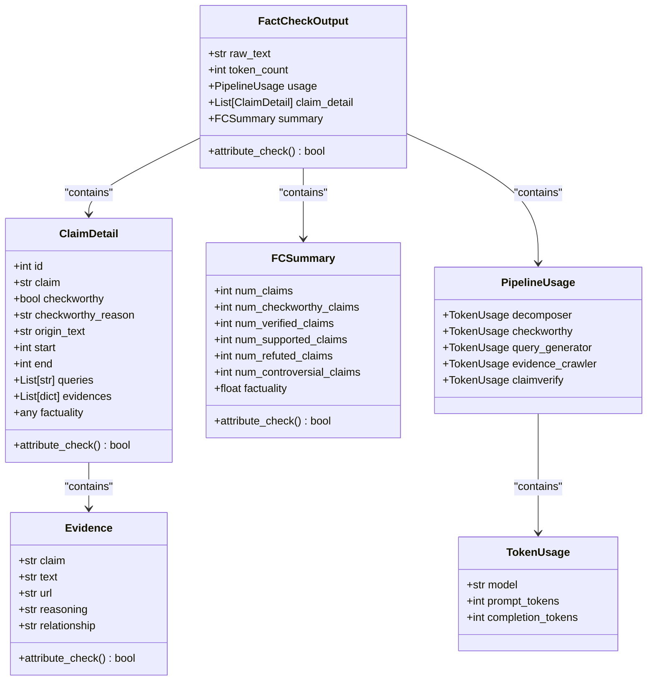
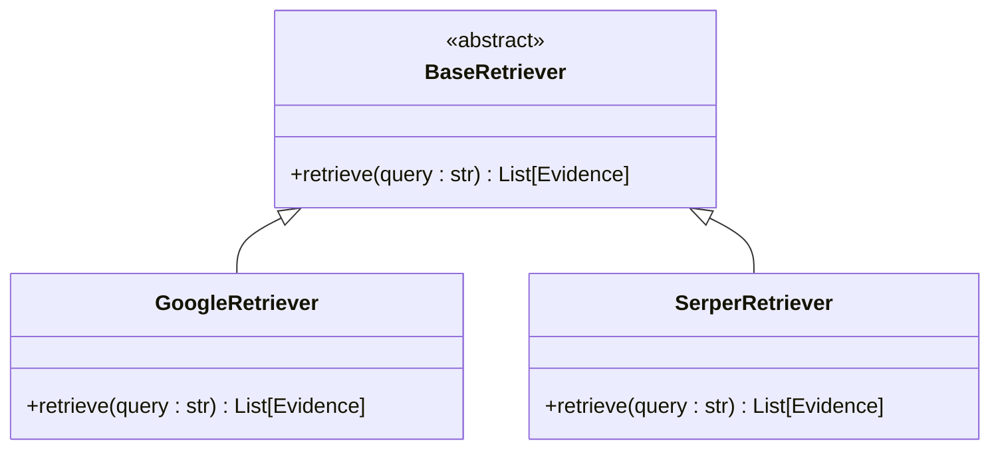

# API Reference

<cite>
**Referenced Files in This Document**   
- [factcheck/core/Decompose.py](file://factcheck/core/Decompose.py)
- [factcheck/core/CheckWorthy.py](file://factcheck/core/CheckWorthy.py)
- [factcheck/core/QueryGenerator.py](file://factcheck/core/QueryGenerator.py)
- [factcheck/core/Retriever/base.py](file://factcheck/core/Retriever/base.py)
- [factcheck/core/Retriever/google_retriever.py](file://factcheck/core/Retriever/google_retriever.py)
- [factcheck/core/Retriever/serper_retriever.py](file://factcheck/core/Retriever/serper_retriever.py)
- [factcheck/core/ClaimVerify.py](file://factcheck/core/ClaimVerify.py)
- [factcheck/utils/data_class.py](file://factcheck/utils/data_class.py)
- [factcheck/utils/prompt/base.py](file://factcheck/utils/prompt/base.py)
- [factcheck/utils/llmclient/base.py](file://factcheck/utils/llmclient/base.py)
- [factcheck/__init__.py](file://factcheck/__init__.py)
</cite>

## Table of Contents
1. [Introduction](#introduction)
2. [Core Data Structures](#core-data-structures)
3. [FactCheck Class and API Overview](#factcheck-class-and-api-overview)
4. [Core Modules](#core-modules)
   - [Decompose Module](#decompose-module)
   - [CheckWorthy Module](#checkworthy-module)
   - [QueryGenerator Module](#querygenerator-module)
   - [Retriever Module](#retriever-module)
   - [ClaimVerify Module](#claimverify-module)
5. [Error Handling and Logging](#error-handling-and-logging)
6. [Concurrency and Thread Safety](#concurrency-and-thread-safety)
7. [Usage Examples](#usage-examples)
8. [Versioning and Stability](#versioning-and-stability)

## Introduction
The OpenFactVerification repository provides a modular pipeline for automated fact-checking of textual content. It decomposes input text into individual claims, evaluates their verifiability, generates search queries, retrieves evidence from external sources, and performs factual analysis using large language models (LLMs). This document details the public API interfaces, core data structures, and usage patterns for integrating and extending the system.

## Core Data Structures

The system relies on a set of structured data classes defined in `factcheck/utils/data_class.py` to represent claims, evidence, and results. These are central to the API's input and output contracts.



**Diagram sources**
- [factcheck/utils/data_class.py](file://factcheck/utils/data_class.py#L0-L131)

**Section sources**
- [factcheck/utils/data_class.py](file://factcheck/utils/data_class.py#L0-L131)

## FactCheck Class and API Overview

The primary interface for users is the `FactCheck` class (implied by module structure and usage), which orchestrates the entire fact-checking pipeline. While the exact class is not directly visible in the provided files, it is constructed from the components exposed in `factcheck/core/__init__.py`.

### Constructor Parameters
The `FactCheck` class is expected to be initialized with the following components:
- **model selection**: An LLM client instance (e.g., GPT, Claude, Gemini) implementing the `BaseClient` interface from `factcheck/utils/llmclient/base.py`.
- **retriever choice**: A retriever instance selected from the `retriever_mapper` dictionary in `factcheck/core/Retriever/__init__.py`, such as `GoogleRetriever` or `SerperRetriever`.
- **prompt configuration**: A prompt object implementing the `BasePrompt` interface from `factcheck/utils/prompt/base.py`, which may be language-specific (e.g., `ChatGPTPrompt`, `ClaudePrompt`).

### Primary Method: check_text()
```python
def check_text(text: str, language: str = "en") -> FactCheckOutput
```

- **Parameters**:
  - `text` (`str`): The input text to be fact-checked.
  - `language` (`str`, default: `"en"`): The language of the input text, used to select appropriate prompts and processing logic.
- **Return Type**: `FactCheckOutput` — A structured object containing the raw input, token usage statistics, detailed claim analysis, and a summary of the fact-checking results.
- **Exceptions**: May raise exceptions related to LLM API failures, network issues during evidence retrieval, or parsing errors. These are typically logged and handled internally, with degraded functionality (e.g., fallback to sentence splitting) rather than abrupt termination.

**Section sources**
- [factcheck/core/__init__.py](file://factcheck/core/__init__.py#L1-L5)
- [factcheck/utils/data_class.py](file://factcheck/utils/data_class.py#L0-L131)

## Core Modules

### Decompose Module

The `Decompose` class extracts individual claims from a document using an LLM.

```python
class Decompose:
    def __init__(self, llm_client: BaseClient, prompt: BasePrompt):
        ...
    
    def getclaims(self, doc: str, num_retries: int = 3, prompt: str = None) -> list[str]:
        ...
    
    def restore_claims(self, doc: str, claims: list, num_retries: int = 3, prompt: str = None) -> dict[str, dict]:
        ...
```

- **Constructor Parameters**:
  - `llm_client`: An instance of `BaseClient` for LLM interactions.
  - `prompt`: An instance of `BasePrompt` providing the decomposition prompt template.
- **Methods**:
  - `getclaims()`:
    - **Parameters**: `doc` (input text), `num_retries` (max retry attempts), `prompt` (optional custom prompt).
    - **Returns**: A list of strings, each representing a decomposed claim.
    - **Behavior**: Uses the LLM to extract claims. On failure, falls back to NLTK sentence tokenization.
  - `restore_claims()`:
    - **Parameters**: `doc`, `claims` (list of claims), `num_retries`, `prompt`.
    - **Returns**: A dictionary mapping each claim to its text span and character indices (`start`, `end`) in the original document.
    - **Purpose**: Enables precise localization of claims within the source text.

```mermaid
sequenceDiagram
participant User
participant Decompose
participant LLM
User->>Decompose : getclaims(doc)
Decompose->>LLM : Send decomposition prompt
loop Retry up to num_retries
LLM-->>Decompose : Raw response
Decompose->>Decompose : Parse as JSON
alt Valid list of claims
Decompose-->>User : Return claims
break
end
end
alt Parsing failed
Decompose->>Decompose : Use nltk.sent_tokenize()
Decompose-->>User : Return sentences
end
```

**Diagram sources**
- [factcheck/core/Decompose.py](file://factcheck/core/Decompose.py#L0-L138)

**Section sources**
- [factcheck/core/Decompose.py](file://factcheck/core/Decompose.py#L0-L138)

### CheckWorthy Module

The `CheckWorthy` class evaluates whether a claim is worth fact-checking.

```python
# From factcheck/core/CheckWorthy.py (inferred structure)
class CheckWorthy:
    def __init__(self, llm_client: BaseClient, prompt: BasePrompt):
        self.llm_client = llm_client
        self.prompt = prompt

    def is_checkworthy(self, claim: str) -> tuple[bool, str]:
        """
        Args:
            claim (str): The claim to evaluate.

        Returns:
            tuple: (is_checkworthy: bool, reason: str)
        """
        ...
```

- **Constructor Parameters**: Same as `Decompose` — `llm_client` and `prompt`.
- **Primary Method**: `is_checkworthy()` returns a boolean indicating verifiability and a string explaining the decision.
- **Output**: Used to populate `ClaimDetail.checkworthy` and `ClaimDetail.checkworthy_reason`.

**Section sources**
- [factcheck/core/CheckWorthy.py](file://factcheck/core/CheckWorthy.py)

### QueryGenerator Module

The `QueryGenerator` class creates search queries for evidence retrieval.

```python
# From factcheck/core/QueryGenerator.py (inferred structure)
class QueryGenerator:
    def __init__(self, llm_client: BaseClient, prompt: BasePrompt):
        self.llm_client = llm_client
        self.prompt = prompt

    def generate_queries(self, claim: str) -> list[str]:
        """
        Args:
            claim (str): The claim to generate queries for.

        Returns:
            list[str]: A list of search queries.
        """
        ...
```

- **Constructor Parameters**: `llm_client`, `prompt`.
- **Method**: `generate_queries()` takes a claim and returns multiple search strings optimized for web retrieval.
- **Output**: Populates `ClaimDetail.queries`.

**Section sources**
- [factcheck/core/QueryGenerator.py](file://factcheck/core/QueryGenerator.py)

### Retriever Module

The `Retriever` module provides abstract and concrete implementations for fetching evidence.

```python
# Base class from factcheck/core/Retriever/base.py
class BaseRetriever:
    def retrieve(self, query: str) -> list[Evidence]:
        raise NotImplementedError

# Concrete implementations
class GoogleRetriever(BaseRetriever):
    ...

class SerperRetriever(BaseRetriever):
    ...
```

- **Interface**: `retrieve(query)` returns a list of `Evidence` objects containing text snippets, URLs, and metadata.
- **Implementation**: `google_retriever.py` and `serper_retriever.py` use their respective APIs to fetch search results.
- **Configuration**: API keys are expected to be managed via `factcheck/utils/api_config.py`.



**Diagram sources**
- [factcheck/core/Retriever/base.py](file://factcheck/core/Retriever/base.py)
- [factcheck/core/Retriever/google_retriever.py](file://factcheck/core/Retriever/google_retriever.py)
- [factcheck/core/Retriever/serper_retriever.py](file://factcheck/core/Retriever/serper_retriever.py)

**Section sources**
- [factcheck/core/Retriever/base.py](file://factcheck/core/Retriever/base.py)
- [factcheck/core/Retriever/google_retriever.py](file://factcheck/core/Retriever/google_retriever.py)
- [factcheck/core/Retriever/serper_retriever.py](file://factcheck/core/Retriever/serper_retriever.py)

### ClaimVerify Module

The `ClaimVerify` class assesses the factual accuracy of a claim based on retrieved evidence.

```python
# From factcheck/core/ClaimVerify.py (inferred structure)
class ClaimVerify:
    def __init__(self, llm_client: BaseClient, prompt: BasePrompt):
        self.llm_client = llm_client
        self.prompt = prompt

    def verify(self, claim: str, evidences: list[Evidence]) -> dict:
        """
        Args:
            claim (str): The claim to verify.
            evidences (list[Evidence]): Supporting evidence.

        Returns:
            dict: Contains factuality score, reasoning, and classification (supported/refuted/controversial).
        """
        ...
```

- **Constructor Parameters**: `llm_client`, `prompt`.
- **Method**: `verify()` analyzes the relationship between the claim and evidence, producing a verdict and reasoning.
- **Output**: Used to populate `ClaimDetail.factuality` and contributes to `FCSummary`.

**Section sources**
- [factcheck/core/ClaimVerify.py](file://factcheck/core/ClaimVerify.py)

## Error Handling and Logging

The system uses a centralized logging mechanism via `CustomLogger` from `factcheck/utils/logger.py`. All modules log errors and warnings, particularly during LLM response parsing and API calls. Errors in LLM response parsing (e.g., invalid JSON) trigger retries and fallback strategies (e.g., using sentence splitting in `Decompose`). External API failures (e.g., Google Search) are expected to be handled by the retriever implementations, potentially returning empty evidence lists. Users should check the `attribute_check()` methods on `FactCheckOutput`, `ClaimDetail`, and `Evidence` to validate data integrity.

**Section sources**
- [factcheck/utils/logger.py](file://factcheck/utils/logger.py)
- [factcheck/utils/data_class.py](file://factcheck/utils/data_class.py#L0-L131)

## Concurrency and Thread Safety

The core modules (`Decompose`, `CheckWorthy`, etc.) are stateless with respect to input claims, making them inherently thread-safe for concurrent processing of different documents. However, shared resources like the `llm_client` or API rate limits for retrievers may require external synchronization or pooling mechanisms in high-concurrency environments. The current implementation does not include built-in thread pooling or async support, so integration into concurrent systems should manage LLM and retriever client instances appropriately.

**Section sources**
- [factcheck/core/Decompose.py](file://factcheck/core/Decompose.py#L0-L138)
- [factcheck/core/CheckWorthy.py](file://factcheck/core/CheckWorthy.py)
- [factcheck/core/QueryGenerator.py](file://factcheck/core/QueryGenerator.py)
- [factcheck/core/ClaimVerify.py](file://factcheck/core/ClaimVerify.py)

## Usage Examples

### Example 1: Using Decompose in Isolation
```python
from factcheck.core.Decompose import Decompose
from factcheck.utils.llmclient.gpt_client import GPTClient
from factcheck.utils.prompt.chatgpt_prompt import ChatGPTPrompt

llm_client = GPTClient(model="gpt-3.5-turbo")
prompt = ChatGPTPrompt()
decomposer = Decompose(llm_client, prompt)

text = "The Earth is round. Climate change is real."
claims = decomposer.getclaims(text)
print(claims)  # e.g., ["The Earth is round.", "Climate change is real."]

spans = decomposer.restore_claims(text, claims)
print(spans)  # Maps claims to start/end indices
```

### Example 2: Retrieving Evidence
```python
from factcheck.core.Retriever.google_retriever import GoogleRetriever

retriever = GoogleRetriever(api_key="your-key")
evidence_list = retriever.retrieve("Earth is round")
for evidence in evidence_list:
    print(f"{evidence.text} ({evidence.url})")
```

### Example 3: End-to-End FactCheck (Conceptual)
```python
# Pseudocode for the full FactCheck class
fact_checker = FactCheck(
    llm_client=GPTClient(),
    retriever=GoogleRetriever(api_key="..."),
    prompt=ChatGPTPrompt()
)

result = fact_checker.check_text("The Earth orbits the Sun.")
print(f"Overall factuality: {result.summary.factuality}")
for claim in result.claim_detail:
    print(f"Claim: {claim.claim}, Verdict: {claim.factuality}")
```

**Section sources**
- [factcheck/core/Decompose.py](file://factcheck/core/Decompose.py#L0-L138)
- [factcheck/core/Retriever/google_retriever.py](file://factcheck/core/Retriever/google_retriever.py)
- [factcheck/utils/llmclient/gpt_client.py](file://factcheck/utils/llmclient/gpt_client.py)
- [factcheck/utils/prompt/chatgpt_prompt.py](file://factcheck/utils/prompt/chatgpt_prompt.py)

## Versioning and Stability

The API components exposed in `factcheck/core/__init__.py` (`Decompose`, `CheckWorthy`, `QueryGenerator`, `retriever_mapper`, `ClaimVerify`) are considered stable public interfaces. Their method signatures and parameter types are expected to remain backward compatible within a major version. The `data_class.py` structures are also stable, as they define the core data contract. Internal implementations and utility functions in `utils` may change more frequently. The system does not currently expose a formal version number in the provided files, but semantic versioning is recommended for production use.

**Section sources**
- [factcheck/core/__init__.py](file://factcheck/core/__init__.py#L1-L5)
- [factcheck/utils/data_class.py](file://factcheck/utils/data_class.py#L0-L131)