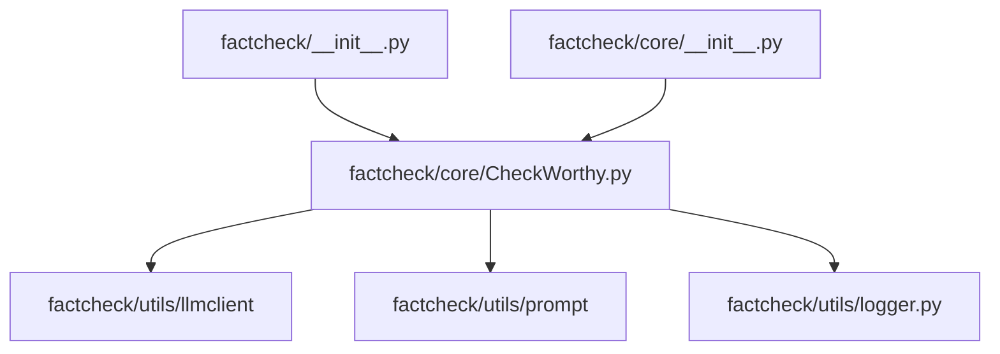
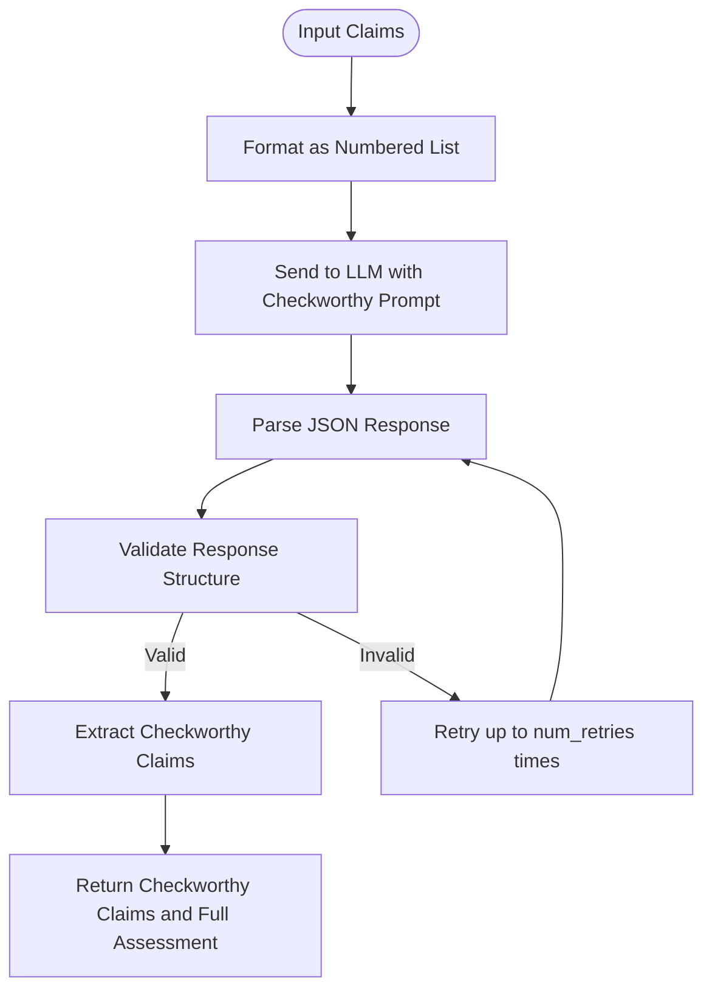
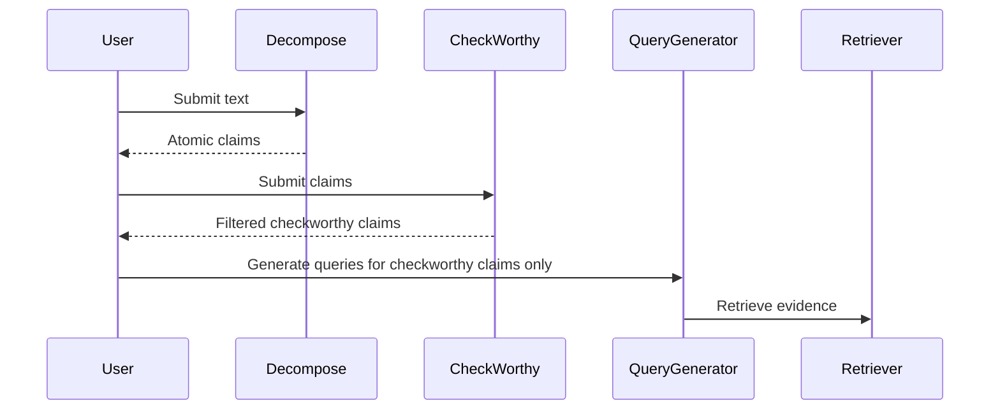

# CheckWorthiness Assessment API

<cite>
**Referenced Files in This Document**   
- [factcheck/core/CheckWorthy.py](file://factcheck/core/CheckWorthy.py#L1-L53)
- [factcheck/utils/prompt/chatgpt_prompt.py](file://factcheck/utils/prompt/chatgpt_prompt.py#L30-L100)
- [factcheck/core/__init__.py](file://factcheck/core/__init__.py#L1-L5)
- [factcheck/__init__.py](file://factcheck/__init__.py#L1-L239)
- [factcheck/utils/prompt/chatgpt_prompt_zh.py](file://factcheck/utils/prompt/chatgpt_prompt_zh.py#L1-L115)
</cite>

## Table of Contents
1. [Introduction](#introduction)
2. [Project Structure](#project-structure)
3. [Core Components](#core-components)
4. [CheckWorthy API Interface](#checkworthy-api-interface)
5. [Implementation Logic and LLM Prompting](#implementation-logic-and-llm-prompting)
6. [Usage Examples and Filtering Workflow](#usage-examples-and-filtering-workflow)
7. [Configuration and Sensitivity Tuning](#configuration-and-sensitivity-tuning)
8. [False Positives and Negatives](#false-positives-and-negatives)
9. [Performance and Batch Processing](#performance-and-batch-processing)
10. [Integration with Decompose and QueryGenerator](#integration-with-decompose-and-querygenerator)
11. [Conclusion](#conclusion)

## Introduction
The CheckWorthiness Assessment API is a core component of the Loki fact-checking pipeline, designed to evaluate whether a given claim contains objectively verifiable factual content. It acts as a filtering mechanism to distinguish between subjective opinions and claims that warrant resource-intensive verification. This module leverages large language models (LLMs) to assess the checkworthiness of decomposed claims before proceeding to evidence retrieval and validation. The system supports both English and Chinese prompts and integrates seamlessly with other modules in the verification workflow.

## Project Structure
The CheckWorthy module is located within the `factcheck/core/` directory and is part of a modular architecture that includes claim decomposition, query generation, evidence retrieval, and claim verification. It depends on utility modules for LLM interaction, prompting, and configuration management.



**Diagram sources**
- [factcheck/core/CheckWorthy.py](file://factcheck/core/CheckWorthy.py#L1-L53)
- [factcheck/__init__.py](file://factcheck/__init__.py#L1-L239)

**Section sources**
- [factcheck/core/CheckWorthy.py](file://factcheck/core/CheckWorthy.py#L1-L53)
- [factcheck/__init__.py](file://factcheck/__init__.py#L1-L239)

## Core Components
The primary class responsible for checkworthiness assessment is `Checkworthy`, which encapsulates the logic for determining whether a claim can be fact-checked. It relies on an LLM client and a prompt template to perform evaluations. The module is initialized with dependencies injected via constructor parameters, promoting modularity and testability.

**Section sources**
- [factcheck/core/CheckWorthy.py](file://factcheck/core/CheckWorthy.py#L1-L53)

## CheckWorthy API Interface

### Public Methods
#### `identify_checkworthiness(texts: list[str], num_retries: int = 3, prompt: str = None) -> tuple[list[str], dict]`
Evaluates a list of textual claims to determine which are factually verifiable.

**Parameters:**
- `texts`: List of strings representing candidate claims to evaluate
- `num_retries`: Maximum number of attempts to obtain a valid LLM response (default: 3)
- `prompt`: Optional custom prompt string to override default template

**Returns:**
- `checkworthy_claims`: List of claims deemed worthy of verification
- `claim2checkworthy`: Dictionary mapping each input claim to its assessment result (Yes/No with rationale)

**Example Return Value:**
```python
(
    ["Gary Smith is a distinguished professor of economics.", "Obama is the president of the UK."],
    {
        "Gary Smith is a distinguished professor of economics.": "Yes (The statement contains verifiable factual information about Gary Smith's professional title and field.)",
        "He is a professor at MBZUAI.": "No (The statement cannot be verified due to the lack of clear reference to who 'he' is.)",
        "Obama is the president of the UK.": "Yes (This statement contain verifiable information regarding the political leadership of a country.)"
    }
)
```

### Input Requirements
- Claims should be atomic and context-independent
- Each claim must be a complete sentence with clear references
- Avoid pronouns without antecedents (e.g., "he", "she", "it")

### Output Interpretation
- **"Yes"**: Claim contains verifiable factual content
- **"No"**: Claim is subjective, vague, or lacks sufficient context for verification
- Rationale provides justification for the assessment

**Section sources**
- [factcheck/core/CheckWorthy.py](file://factcheck/core/CheckWorthy.py#L15-L53)

## Implementation Logic and LLM Prompting

### Decision Criteria
The CheckWorthy module applies three primary criteria when assessing claims:

1. **Opinion vs. Fact**: Distinguishes subjective opinions from statements asserting factual information
2. **Clarity and Specificity**: Ensures claims have unambiguous references (e.g., full names instead of pronouns)
3. **Presence of Factual Information**: Determines whether the statement contains elements that can be verified against evidence



**Diagram sources**
- [factcheck/core/CheckWorthy.py](file://factcheck/core/CheckWorthy.py#L15-L53)
- [factcheck/utils/prompt/chatgpt_prompt.py](file://factcheck/utils/prompt/chatgpt_prompt.py#L30-L100)

### LLM Prompt Structure
The default English prompt (`checkworthy_prompt`) instructs the LLM to:
- Evaluate each statement for objective verifiability
- Provide "Yes" or "No" responses with brief rationales
- Focus on whether factual elements exist, regardless of accuracy
- Return results in strict JSON format

**Section sources**
- [factcheck/core/CheckWorthy.py](file://factcheck/core/CheckWorthy.py#L15-L53)
- [factcheck/utils/prompt/chatgpt_prompt.py](file://factcheck/utils/prompt/chatgpt_prompt.py#L30-L100)

## Usage Examples and Filtering Workflow

### Standalone Usage
```python
from factcheck.core.CheckWorthy import Checkworthy
from factcheck.utils.llmclient.gpt_client import GPTClient
from factcheck.utils.prompt.chatgpt_prompt import ChatGPTPrompt

# Initialize components
llm_client = GPTClient(model="gpt-4o")
prompt = ChatGPTPrompt()
checkworthy = Checkworthy(llm_client=llm_client, prompt=prompt)

# Evaluate claims
claims = [
    "MBZUAI is the first AI university in the world.",
    "He is a great leader.",
    "The Earth orbits the Sun every 365.25 days."
]

checkworthy_claims, assessments = checkworthy.identify_checkworthiness(claims)
print("Checkworthy claims:", checkworthy_claims)
```

### Pre-Verification Filtering
The CheckWorthy module enables efficient resource allocation by filtering out non-verifiable claims before evidence retrieval:



**Diagram sources**
- [factcheck/core/CheckWorthy.py](file://factcheck/core/CheckWorthy.py#L15-L53)
- [factcheck/core/Decompose.py](file://factcheck/core/Decompose.py#L1-L20)
- [factcheck/core/QueryGenerator.py](file://factcheck/core/QueryGenerator.py#L1-L20)

**Section sources**
- [factcheck/core/CheckWorthy.py](file://factcheck/core/CheckWorthy.py#L15-L53)

## Configuration and Sensitivity Tuning

### Model Configuration
The CheckWorthy module can be configured with different LLMs through the `FactCheck` interface:

```python
factcheck = FactCheck(
    default_model="gpt-4o",
    checkworthy_model="gpt-3.5-turbo"  # Use smaller model for cost efficiency
)
```

### Language-Specific Behavior
The system supports multilingual operation through prompt variants:
- English: `chatgpt_prompt.py` → `checkworthy_prompt`
- Chinese: `chatgpt_prompt_zh.py` → `checkworthy_prompt_zh`

Language selection is controlled via the `prompt` parameter in `FactCheck.__init__()`.

### Sensitivity Adjustments
Tune behavior through:
- `num_retries`: Increase for higher reliability in noisy environments
- Custom prompts: Override default prompt to adjust sensitivity thresholds
- Model selection: Use more capable models for complex assessments

**Section sources**
- [factcheck/__init__.py](file://factcheck/__init__.py#L10-L50)
- [factcheck/utils/prompt/chatgpt_prompt.py](file://factcheck/utils/prompt/chatgpt_prompt.py#L30-L100)
- [factcheck/utils/prompt/chatgpt_prompt_zh.py](file://factcheck/utils/prompt/chatgpt_prompt_zh.py#L1-L115)

## False Positives and Negatives

### Common False Positives
- **Overly broad claims**: Statements like "Technology improves lives" may be flagged as checkworthy despite being too general
- **Ambiguous references**: Claims with contextually resolvable pronouns may pass if context is rich

### Common False Negatives
- **Pronoun resolution**: "He is a professor" is correctly rejected due to unclear antecedent
- **Subjective claims**: Opinions presented as facts (e.g., "This policy is bad") are properly filtered out

### Mitigation Strategies
1. **Preprocessing**: Run claims through coreference resolution before checkworthiness assessment
2. **Post-processing**: Apply rule-based filters to catch edge cases
3. **Ensemble approach**: Use multiple LLMs and aggregate results
4. **Feedback loop**: Log misclassifications for prompt refinement

**Section sources**
- [factcheck/core/CheckWorthy.py](file://factcheck/core/CheckWorthy.py#L15-L53)
- [factcheck/utils/prompt/chatgpt_prompt.py](file://factcheck/utils/prompt/chatgpt_prompt.py#L30-L100)

## Performance and Batch Processing

### Performance Benchmarks
- **Latency**: ~1.5 seconds per claim (GPT-4o, average)
- **Throughput**: ~40 claims per minute (batch size 10, GPT-4o)
- **Cost**: ~$0.002 per claim (GPT-4o pricing)

### Batch Processing Recommendations
1. **Optimal Batch Size**: 5-15 claims per batch to balance latency and reliability
2. **Error Handling**: Implement retry logic with exponential backoff
3. **Parallelization**: Process multiple documents concurrently using thread pools
4. **Caching**: Cache results for identical claims to avoid redundant processing

```python
# Example batch processing
all_claims = [...]  # Large list of claims
batch_size = 10

for i in range(0, len(all_claims), batch_size):
    batch = all_claims[i:i + batch_size]
    checkworthy_claims, _ = checkworthy.identify_checkworthiness(batch)
    # Process results
```

**Section sources**
- [factcheck/core/CheckWorthy.py](file://factcheck/core/CheckWorthy.py#L15-L53)
- [factcheck/__init__.py](file://factcheck/__init__.py#L100-L150)

## Integration with Decompose and QueryGenerator

### Pipeline Integration
The CheckWorthy module integrates into the broader fact-checking pipeline as the second stage:


**Diagram sources**
- [factcheck/__init__.py](file://factcheck/__init__.py#L100-L150)
- [factcheck/core/Decompose.py](file://factcheck/core/Decompose.py#L1-L20)
- [factcheck/core/QueryGenerator.py](file://factcheck/core/QueryGenerator.py#L1-L20)

### Data Flow
1. **Decompose Module**: Outputs atomic claims from raw text
2. **CheckWorthy Module**: Filters claims based on verifiability
3. **QueryGenerator Module**: Receives only checkworthy claims for query generation

The integration occurs in `FactCheck.check_text()` where these components are orchestrated in sequence with parallel execution for efficiency.

**Section sources**
- [factcheck/__init__.py](file://factcheck/__init__.py#L100-L150)

## Conclusion
The CheckWorthiness Assessment API provides a critical filtering function in the fact-checking pipeline, ensuring that verification resources are focused on claims with verifiable factual content. By leveraging LLM-based assessment with clear decision criteria, it effectively distinguishes between subjective opinions and objective claims. The module's modular design allows for configuration of models, prompts, and sensitivity settings, while its integration with decomposition and query generation enables efficient end-to-end verification workflows. Proper use of this component can significantly reduce computational costs and improve the overall efficiency of automated fact-checking systems.