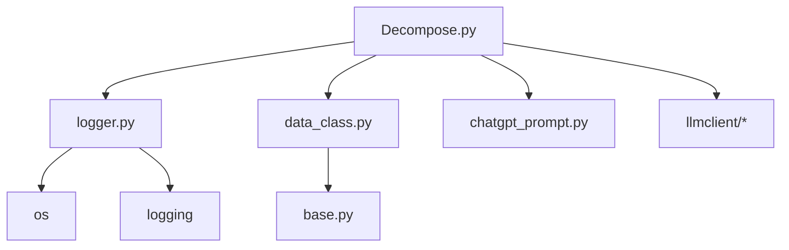
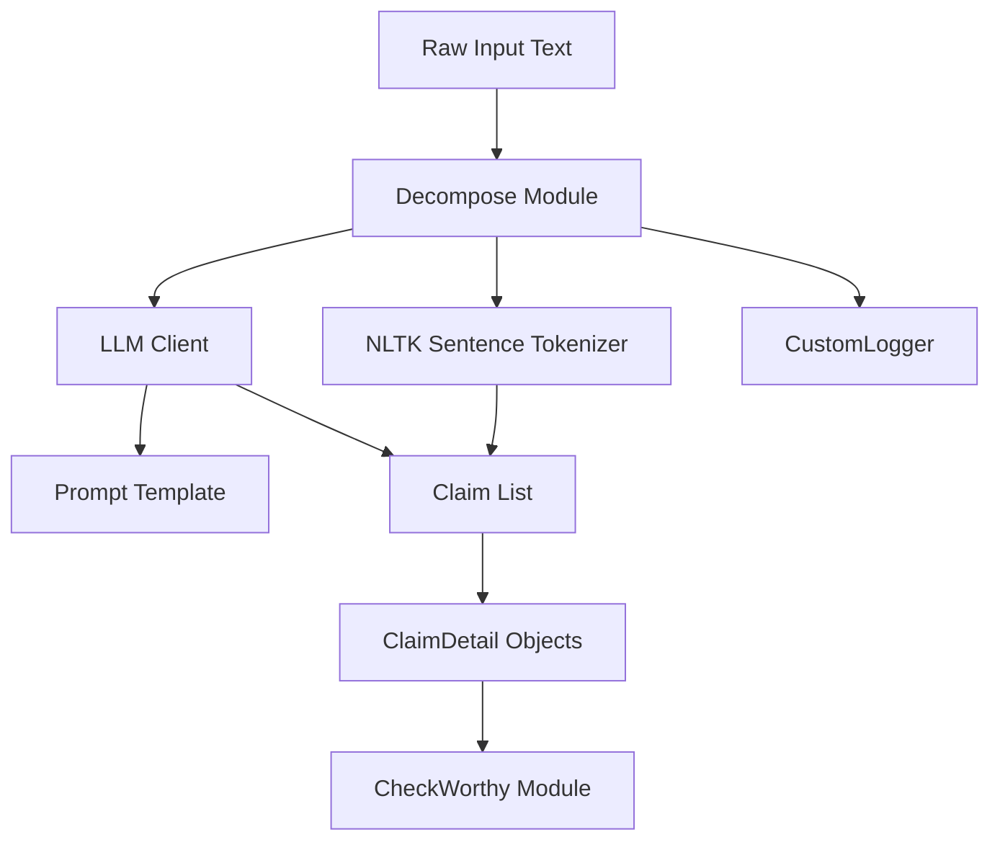
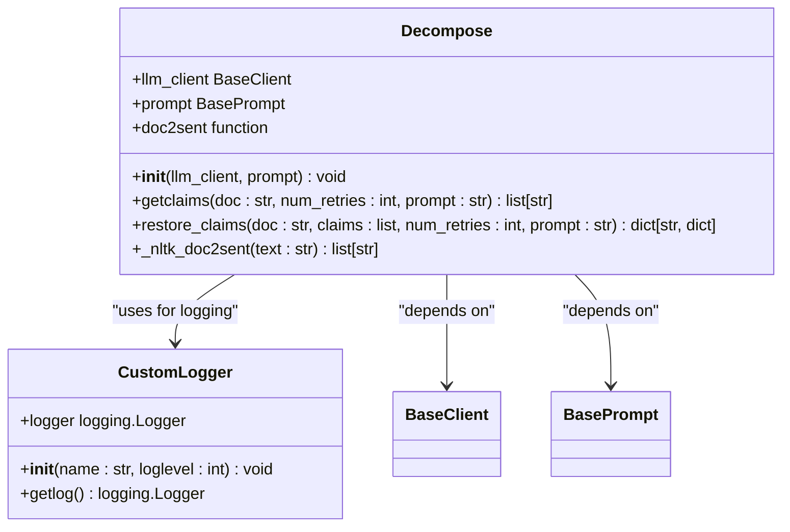
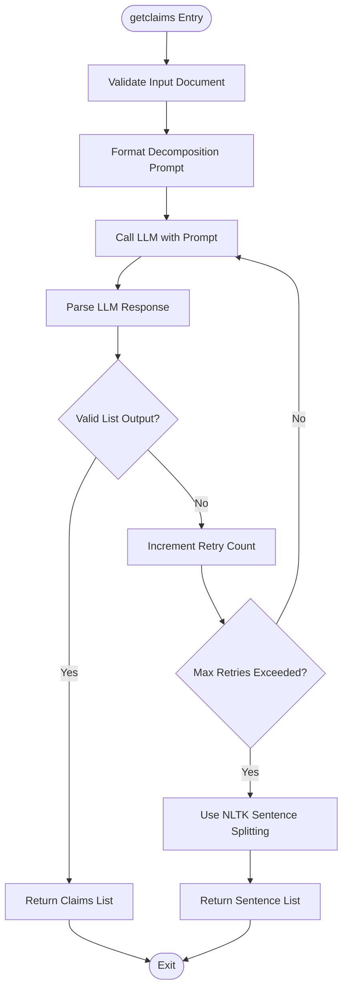
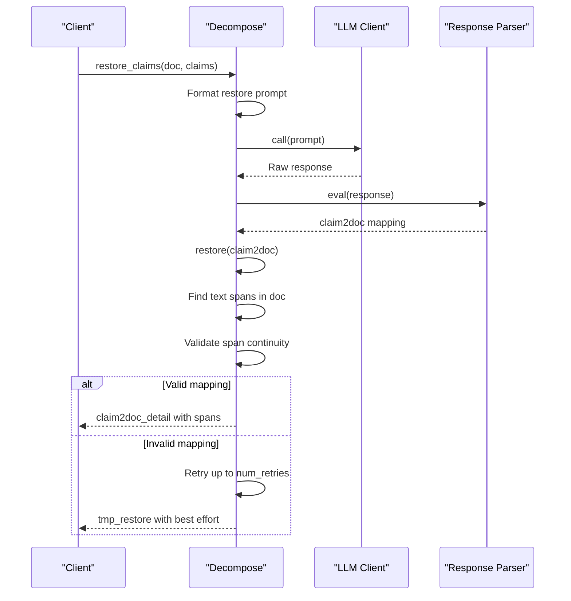
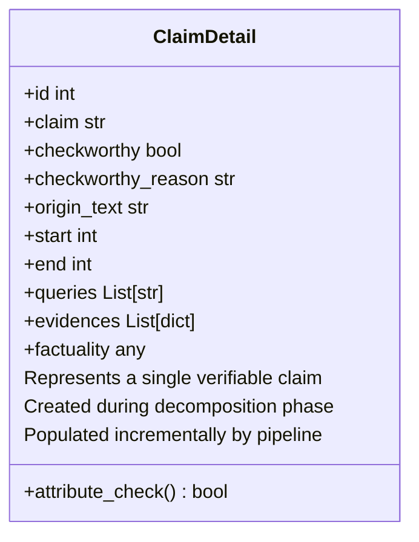
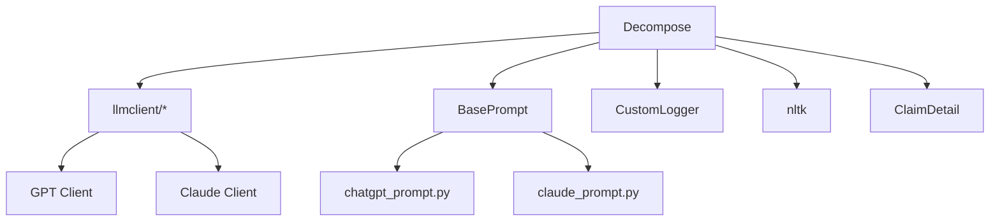

# Claim Decomposition API

<cite>
**Referenced Files in This Document**   
- [factcheck/core/Decompose.py](file://factcheck/core/Decompose.py#L1-L138)
- [factcheck/utils/data_class.py](file://factcheck/utils/data_class.py#L39-L76)
- [factcheck/utils/logger.py](file://factcheck/utils/logger.py#L1-L38)
- [factcheck/utils/prompt/base.py](file://factcheck/utils/prompt/base.py#L5)
- [factcheck/utils/prompt/chatgpt_prompt.py](file://factcheck/utils/prompt/chatgpt_prompt.py#L138-L139)
</cite>

## Table of Contents
1. [Introduction](#introduction)
2. [Project Structure](#project-structure)
3. [Core Components](#core-components)
4. [Architecture Overview](#architecture-overview)
5. [Detailed Component Analysis](#detailed-component-analysis)
6. [Dependency Analysis](#dependency-analysis)
7. [Performance Considerations](#performance-considerations)
8. [Troubleshooting Guide](#troubleshooting-guide)
9. [Conclusion](#conclusion)

## Introduction
The Claim Decomposition API is a critical module within the OpenFactVerification system, responsible for breaking down unstructured input text into atomic, verifiable claims. This module leverages both rule-based natural language processing (NLP) techniques and large language model (LLM) inference to extract semantically independent statements from documents. The output is structured to support downstream fact-checking processes such as check-worthiness evaluation, query generation, and evidence retrieval. This documentation provides a comprehensive overview of the API's functionality, implementation, and integration points.

## Project Structure
The project follows a modular architecture with clear separation of concerns. The claim decomposition functionality resides in the `factcheck/core/Decompose.py` module, which depends on utility components for logging, prompting, and data modeling. The overall structure is organized by functional domains:
- `core/`: Contains primary modules including decomposition, check-worthiness, and verification logic
- `utils/`: Provides shared utilities for logging, prompting, data classes, and API configuration
- `config/`: Stores configuration files, particularly prompt templates
- `demo_data/`: Includes sample input files for testing

The decomposition module specifically interacts with LLM clients and prompt managers to perform intelligent claim extraction.

**Diagram sources**
- [factcheck/core/Decompose.py](file://factcheck/core/Decompose.py#L1-L138)
- [factcheck/utils/logger.py](file://factcheck/utils/logger.py#L1-L38)
- [factcheck/utils/data_class.py](file://factcheck/utils/data_class.py#L39-L76)

**Section sources**
- [factcheck/core/Decompose.py](file://factcheck/core/Decompose.py#L1-L138)

## Core Components
The core functionality of the claim decomposition module centers around the `Decompose` class, which orchestrates the splitting of input documents into discrete claims. It utilizes both deterministic NLP methods (via NLTK) and probabilistic LLM-based decomposition. The module outputs structured claim representations that include text spans with positional indices, enabling traceability back to the original document.

Key components include:
- **Decompose class**: Main interface for claim extraction
- **NLTK sentence tokenizer**: Rule-based fallback for claim segmentation
- **LLM-backed claim decomposition**: Primary method using prompt engineering
- **Claim restoration logic**: Maps generated claims back to original text spans

**Section sources**
- [factcheck/core/Decompose.py](file://factcheck/core/Decompose.py#L1-L138)
- [factcheck/utils/data_class.py](file://factcheck/utils/data_class.py#L39-L76)

## Architecture Overview
The claim decomposition module operates as a middleware component in the fact-checking pipeline, transforming raw text into structured claims for downstream processing. It integrates with LLM clients to perform semantic decomposition and uses NLTK as a reliable fallback mechanism.

**Diagram sources**
- [factcheck/core/Decompose.py](file://factcheck/core/Decompose.py#L1-L138)
- [factcheck/utils/data_class.py](file://factcheck/utils/data_class.py#L39-L76)

## Detailed Component Analysis

### Decompose Class Analysis
The `Decompose` class is the central component responsible for claim extraction. It accepts an LLM client and a prompt configuration during initialization and provides methods for claim decomposition and span restoration.

#### Class Structure

**Diagram sources**
- [factcheck/core/Decompose.py](file://factcheck/core/Decompose.py#L1-L138)
- [factcheck/utils/logger.py](file://factcheck/utils/logger.py#L1-L38)

**Section sources**
- [factcheck/core/Decompose.py](file://factcheck/core/Decompose.py#L1-L138)

### getclaims Method Analysis
The `getclaims` method is the primary interface for decomposing documents into atomic claims. It uses LLM inference with structured prompting to identify semantically independent statements.

#### Processing Flow

**Diagram sources**
- [factcheck/core/Decompose.py](file://factcheck/core/Decompose.py#L25-L55)

**Section sources**
- [factcheck/core/Decompose.py](file://factcheck/core/Decompose.py#L25-L55)

### restore_claims Method Analysis
The `restore_claims` method maps decomposed claims back to their original text spans, providing positional metadata essential for traceability.

#### Sequence Diagram

**Diagram sources**
- [factcheck/core/Decompose.py](file://factcheck/core/Decompose.py#L57-L138)

**Section sources**
- [factcheck/core/Decompose.py](file://factcheck/core/Decompose.py#L57-L138)

### ClaimDetail Data Structure
The output claims are ultimately structured as `ClaimDetail` objects, which serve as the canonical data representation throughout the fact-checking pipeline.

**Diagram sources**
- [factcheck/utils/data_class.py](file://factcheck/utils/data_class.py#L39-L76)

**Section sources**
- [factcheck/utils/data_class.py](file://factcheck/utils/data_class.py#L39-L76)

## Dependency Analysis
The decomposition module has well-defined dependencies on other components within the system, maintaining loose coupling while enabling extensibility.

**Diagram sources**
- [factcheck/core/Decompose.py](file://factcheck/core/Decompose.py#L1-L138)
- [factcheck/utils/prompt/base.py](file://factcheck/utils/prompt/base.py#L5)
- [factcheck/utils/prompt/chatgpt_prompt.py](file://factcheck/utils/prompt/chatgpt_prompt.py#L138-L139)

**Section sources**
- [factcheck/core/Decompose.py](file://factcheck/core/Decompose.py#L1-L138)

## Performance Considerations
The decomposition module exhibits different performance characteristics depending on the execution path:
- **LLM-based decomposition**: Higher accuracy but introduces latency (300ms-2s per call) and cost; retry mechanism increases worst-case time
- **NLTK fallback**: Near-instantaneous (<10ms) and free, but limited to sentence-level granularity
- **Memory usage**: Linear with input size; stores entire document and claim list in memory
- **Scalability**: Suitable for documents under 10,000 characters; longer texts may require chunking

For large-scale processing, consider:
- Caching LLM responses
- Implementing input chunking
- Using asynchronous processing
- Setting appropriate retry limits

The module is optimized for accuracy over speed, prioritizing correct claim isolation for reliable fact-checking.

## Troubleshooting Guide
Common issues and their resolutions:

**LLM Response Parsing Errors**
- **Symptom**: "Parse LLM response error" logs appear
- **Cause**: LLM output doesn't match expected JSON format
- **Solution**: Verify prompt template integrity; check LLM stability

**Incomplete Claim Restoration**
- **Symptom**: `restore_claims` returns incomplete span mappings
- **Cause**: Text modifications between decomposition and restoration
- **Solution**: Ensure document consistency; verify text encoding

**Empty Claim Lists**
- **Symptom**: `getclaims` returns empty list
- **Cause**: LLM fails to identify claims or NLTK returns no sentences
- **Solution**: Validate input text has sufficient length and proper punctuation

**Performance Degradation**
- **Symptom**: Slow decomposition times
- **Cause**: Excessive retry attempts or network latency
- **Solution**: Reduce `num_retries`; implement timeout controls

**Section sources**
- [factcheck/core/Decompose.py](file://factcheck/core/Decompose.py#L25-L138)
- [factcheck/utils/logger.py](file://factcheck/utils/logger.py#L1-L38)

## Conclusion
The Claim Decomposition API provides a robust foundation for extracting verifiable claims from natural language text. By combining LLM intelligence with rule-based fallbacks, it achieves high accuracy while maintaining reliability. The module's integration with the `ClaimDetail` data structure ensures seamless handoff to downstream fact-checking components. Its design prioritizes traceability through text span preservation and supports both English and multilingual processing via configurable prompts. For optimal results, users should ensure stable LLM connectivity and maintain consistent document preprocessing across the pipeline.