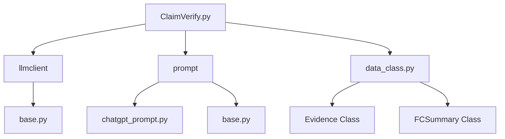
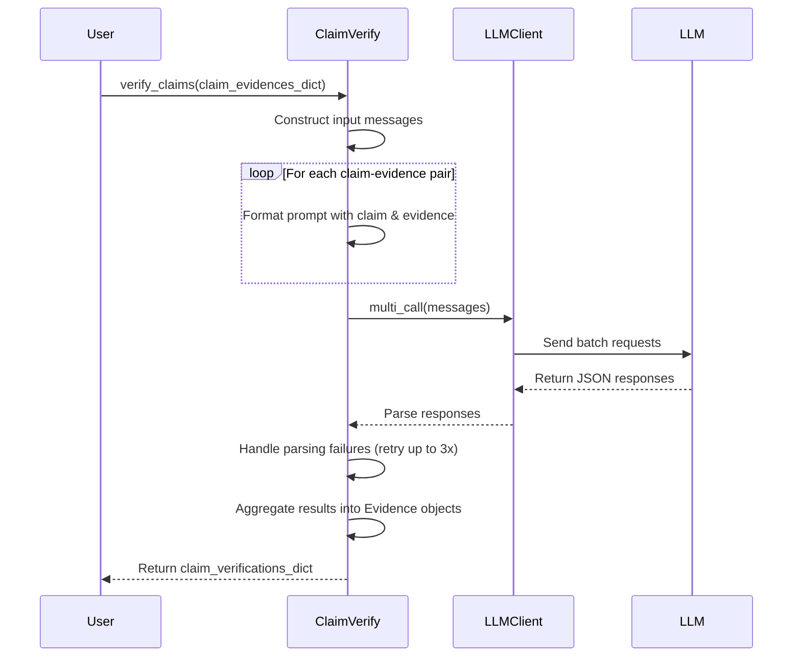
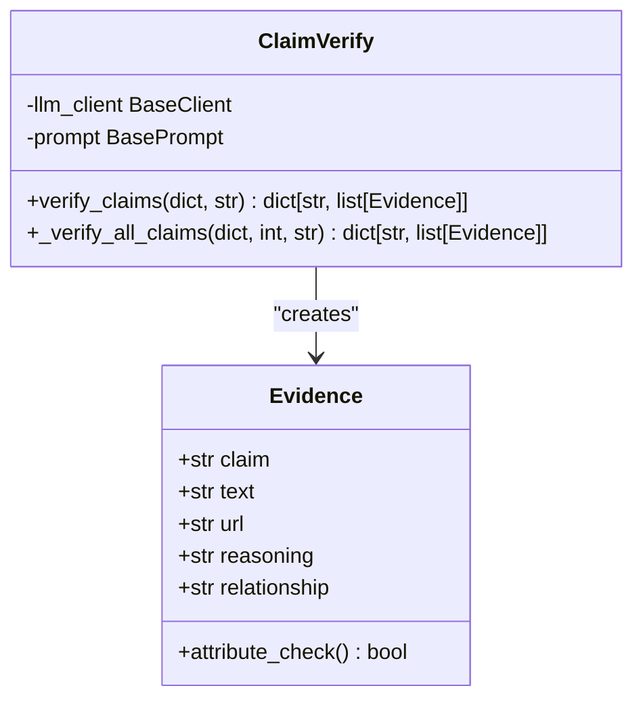
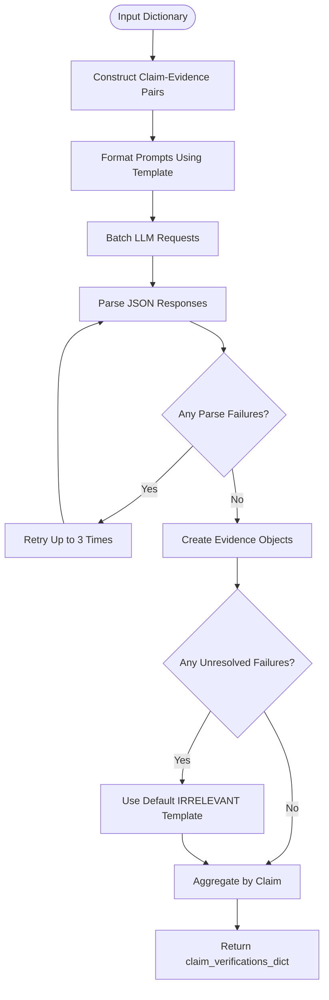
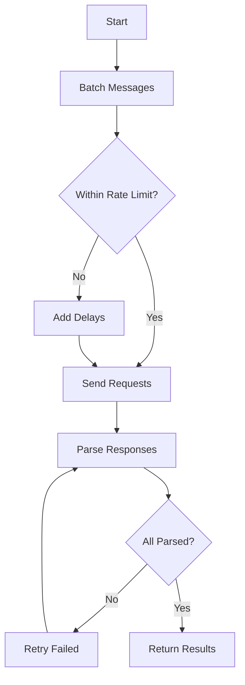
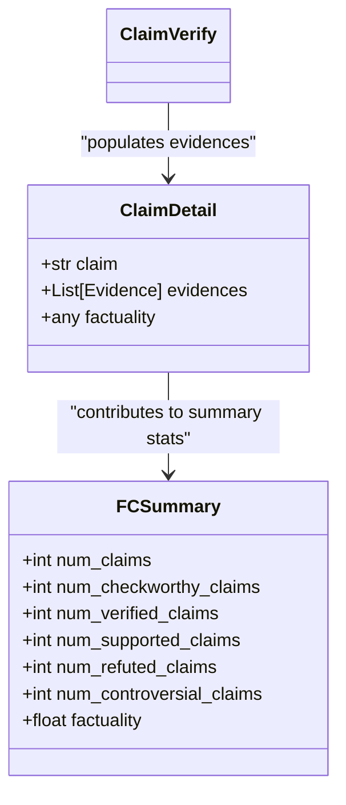

# Claim Verification API

<cite>
**Referenced Files in This Document**   
- [factcheck/core/ClaimVerify.py](file://factcheck/core/ClaimVerify.py)
- [factcheck/utils/data_class.py](file://factcheck/utils/data_class.py)
- [factcheck/utils/prompt/chatgpt_prompt.py](file://factcheck/utils/prompt/chatgpt_prompt.py)
- [factcheck/utils/prompt/base.py](file://factcheck/utils/prompt/base.py)
</cite>

## Table of Contents
1. [Introduction](#introduction)
2. [Project Structure](#project-structure)
3. [Core Components](#core-components)
4. [Claim Verification Process](#claim-verification-process)
5. [Input Parameters and Data Structures](#input-parameters-and-data-structures)
6. [LLM Prompting Strategy](#llm-prompting-strategy)
7. [Evidence Aggregation and Output Structure](#evidence-aggregation-and-output-structure)
8. [Usage Examples](#usage-examples)
9. [Limitations and Edge Cases](#limitations-and-edge-cases)
10. [Performance Considerations](#performance-considerations)
11. [Integration with FCSummary](#integration-with-fcsummary)
12. [Conclusion](#conclusion)

## Introduction
The ClaimVerify module is a core component of the Loki fact-checking system, responsible for assessing the relationship between claims and retrieved evidence. It leverages large language models (LLMs) to determine whether evidence supports, refutes, or is irrelevant to a given claim, generating detailed reasoning and factual scores. This document provides comprehensive documentation for the ClaimVerify API, detailing its functionality, usage patterns, internal logic, and integration points within the broader fact-checking pipeline.

## Project Structure
The ClaimVerify module resides within the `factcheck/core/` directory and interacts with utility modules for prompting, data structures, and LLM communication. The system follows a modular architecture where each component handles a specific stage of the fact-checking process.



**Diagram sources**
- [factcheck/core/ClaimVerify.py](file://factcheck/core/ClaimVerify.py#L1-L97)
- [factcheck/utils/prompt/chatgpt_prompt.py](file://factcheck/utils/prompt/chatgpt_prompt.py#L1-L143)
- [factcheck/utils/data_class.py](file://factcheck/utils/data_class.py#L1-L131)

## Core Components
The ClaimVerify class serves as the primary interface for claim-evidence relationship analysis. It takes as input a dictionary mapping claims to evidence snippets and uses an LLM to evaluate each claim-evidence pair. The module handles parsing, retry logic, error recovery, and result aggregation.

Key components:
- **ClaimVerify**: Main class orchestrating verification
- **Evidence**: Data structure storing verification results
- **BasePrompt**: Interface for prompt templates
- **LLM Client**: Handles communication with language models

**Section sources**
- [factcheck/core/ClaimVerify.py](file://factcheck/core/ClaimVerify.py#L1-L97)
- [factcheck/utils/data_class.py](file://factcheck/utils/data_class.py#L1-L131)

## Claim Verification Process
The verification process evaluates the relationship between a claim and supporting evidence by submitting structured prompts to an LLM. For each claim-evidence pair, the system determines one of three relationships: SUPPORTS, REFUTES, or IRRELEVANT.



**Diagram sources**
- [factcheck/core/ClaimVerify.py](file://factcheck/core/ClaimVerify.py#L40-L97)

## Input Parameters and Data Structures
The API accepts structured inputs and returns richly annotated outputs containing reasoning and relationship metadata.

### Input: claim_evidences_dict
A dictionary mapping claims to lists of evidence strings:
```python
{
    "MBZUAI is in Abu Dhabi": [
        "Masdar City - Abu Dhabi - United Arab Emirates",
        "MBZUAI is located in the UAE capital"
    ]
}
```

### Output: dict[str, list[Evidence]]
Returns a dictionary where each claim maps to a list of Evidence objects containing:
- **claim**: Original claim text
- **text**: Evidence snippet
- **reasoning**: LLM-generated explanation
- **relationship**: One of "SUPPORTS", "REFUTES", "IRRELEVANT"



**Diagram sources**
- [factcheck/utils/data_class.py](file://factcheck/utils/data_class.py#L50-L65)
- [factcheck/core/ClaimVerify.py](file://factcheck/core/ClaimVerify.py#L10-L40)

## LLM Prompting Strategy
The system uses a standardized prompt template to guide the LLM in evaluating claim-evidence relationships. The prompt instructs the model to analyze whether evidence supports, refutes, or is irrelevant to the claim and requires structured JSON output.

### Prompt Template (verify_prompt)
```
Your task is to decide whether the evidence supports, refutes, or is irrelevant to the claim...
Please structure your response in JSON format, including:
- "reasoning": explain the thought process
- "relationship": "SUPPORTS", "REFUTES", or "IRRELEVANT"
```

The prompt includes multiple examples demonstrating correct behavior for various scenarios, enabling few-shot learning. The template uses `{claim}` and `{evidence}` placeholders that are dynamically replaced during execution.

**Section sources**
- [factcheck/utils/prompt/chatgpt_prompt.py](file://factcheck/utils/prompt/chatgpt_prompt.py#L120-L143)
- [factcheck/core/ClaimVerify.py](file://factcheck/core/ClaimVerify.py#L70-L75)

## Evidence Aggregation and Output Structure
After processing all claim-evidence pairs, the system aggregates individual verification results into a structured dictionary format. Each Evidence object contains both the original data and the LLM's assessment.

### Result Aggregation Flow


Failed verifications default to:
```json
{
    "reasoning": "[System Warning] Can not identify the factuality of the claim.",
    "relationship": "IRRELEVANT"
}
```

**Diagram sources**
- [factcheck/core/ClaimVerify.py](file://factcheck/core/ClaimVerify.py#L50-L97)

## Usage Examples
### Basic Usage
```python
from factcheck.core.ClaimVerify import ClaimVerify
from factcheck.utils.llmclient.gpt_client import GPTClient
from factcheck.utils.prompt.chatgpt_prompt import ChatGPTPrompt

# Initialize components
llm_client = GPTClient(model="gpt-3.5-turbo")
prompt = ChatGPTPrompt()
verifier = ClaimVerify(llm_client=llm_client, prompt=prompt)

# Define claims and evidence
claim_evidences = {
    "MBZUAI is in Abu Dhabi": [
        "Masdar City - Abu Dhabi - United Arab Emirates"
    ],
    "Copper reacts with ferrous sulfate": [
        "Copper is less reactive metal... cannot displace iron from ferrous sulphate"
    ]
}

# Verify claims
results = verifier.verify_claims(claim_evidences)
print(results["MBZUAI is in Abu Dhabi"][0].relationship)  # SUPPORTS
print(results["Copper reacts with ferrous sulfate"][0].relationship)  # REFUTES
```

### Custom Prompt Usage
```python
custom_prompt = """
Analyze if the evidence confirms or contradicts the claim...
Output format: {{"analysis": "...", "verdict": "CONFIRMED|CONTRADICTED|UNRELATED"}}
"""

results = verifier.verify_claims(claim_evidences, prompt=custom_prompt)
```

**Section sources**
- [factcheck/core/ClaimVerify.py](file://factcheck/core/ClaimVerify.py#L30-L40)
- [factcheck/utils/prompt/chatgpt_prompt.py](file://factcheck/utils/prompt/chatgpt_prompt.py#L120-L143)

## Limitations and Edge Cases
### Contradictory Evidence Handling
When multiple evidence snippets provide conflicting information about the same claim, the system processes each independently but does not perform cross-evidence reconciliation. This may result in mixed verdicts (both SUPPORTS and REFUTES) for a single claim.

### Confidence Calibration
The system does not provide calibrated confidence scores. The binary relationship labels (SUPPORTS/REFUTES/IRRELEVANT) represent categorical judgments without probabilistic weighting.

### Error Conditions
- **Parsing failures**: Handled via up to 3 retries; defaults to IRRELEVANT
- **Empty evidence**: Treated as IRRELEVANT due to lack of supporting information
- **Ambiguous claims**: May produce inconsistent results depending on evidence specificity

### Known Constraints
- No explicit handling of partial support/refutation
- Limited context window may truncate long evidence
- Relies on LLM's ability to follow JSON formatting instructions

**Section sources**
- [factcheck/core/ClaimVerify.py](file://factcheck/core/ClaimVerify.py#L80-L97)
- [factcheck/utils/data_class.py](file://factcheck/utils/data_class.py#L50-L65)

## Performance Considerations
### Batch Processing
The system batches LLM requests using `multi_call()` to improve efficiency when processing multiple claim-evidence pairs. This reduces API overhead and latency.

### Retry Mechanism
Configurable retry attempts (default: 3) balance reliability against processing time. Each retry increases total execution duration proportionally.

### Scalability Factors
- **Time Complexity**: O(n×r) where n = number of claim-evidence pairs, r = average retries
- **Memory Usage**: Linear with number of evidence items
- **Rate Limiting**: Dependent on underlying LLM provider constraints

### Optimization Recommendations
1. Pre-filter low-quality evidence to reduce processing load
2. Implement caching for frequently verified claim-evidence pairs
3. Use asynchronous processing for large batches
4. Monitor token usage via PipelineUsage metrics



**Diagram sources**
- [factcheck/core/ClaimVerify.py](file://factcheck/core/ClaimVerify.py#L50-L97)

## Integration with FCSummary
The ClaimVerify module directly influences the final factuality assessment reported in the FCSummary. Verification results are aggregated to compute key metrics:

### Summary Metrics Calculation
- **num_verified_claims**: Count of claims with at least one non-IRRELEVANT evidence
- **num_supported_claims**: Claims where majority evidence SUPPORTS
- **num_refuted_claims**: Claims where majority evidence REFUTES
- **num_controversial_claims**: Claims with mixed SUPPORTS/REFUTES evidence
- **factuality**: Weighted score based on relationship distribution

The ClaimDetail objects store individual verification results (`evidences` field), which are later summarized to determine the overall `factuality` score for each claim and the entire document.



**Diagram sources**
- [factcheck/utils/data_class.py](file://factcheck/utils/data_class.py#L67-L111)
- [factcheck/core/ClaimVerify.py](file://factcheck/core/ClaimVerify.py#L1-L97)

## Conclusion
The ClaimVerify API provides a robust mechanism for assessing claim-evidence relationships using large language models. By systematically evaluating each evidence snippet against target claims, it generates detailed verdicts with explanatory reasoning. The modular design allows integration with various LLM backends and prompt strategies, while the structured output facilitates downstream aggregation and summary generation. Despite limitations in handling contradictory evidence and confidence calibration, the system forms a critical component of the automated fact-checking pipeline, enabling scalable verification of information claims against web-sourced evidence.