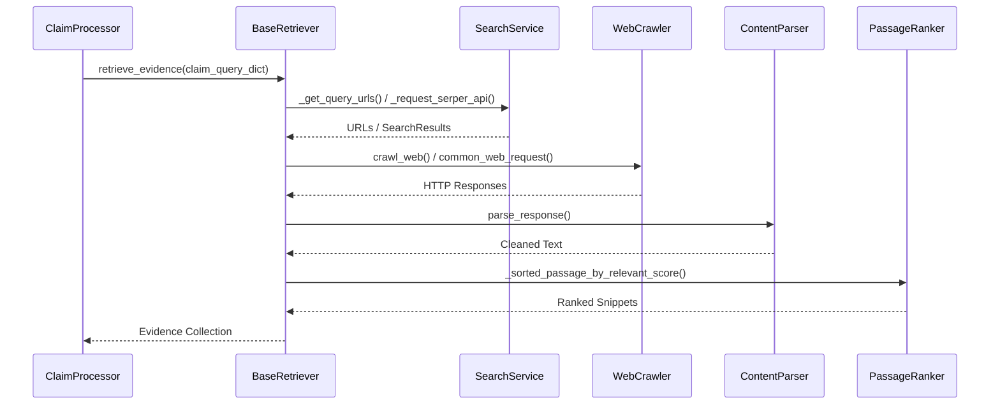
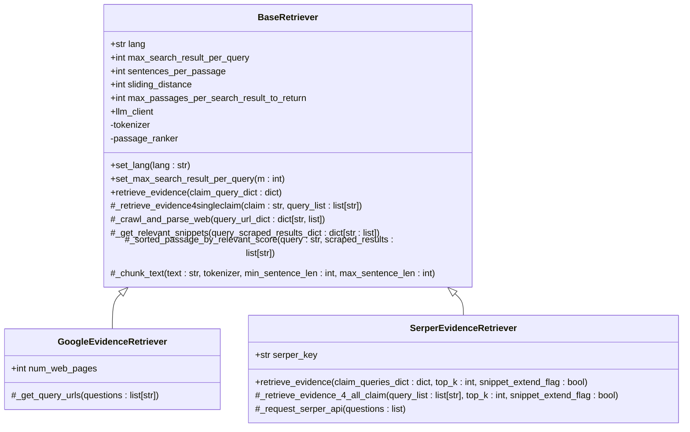
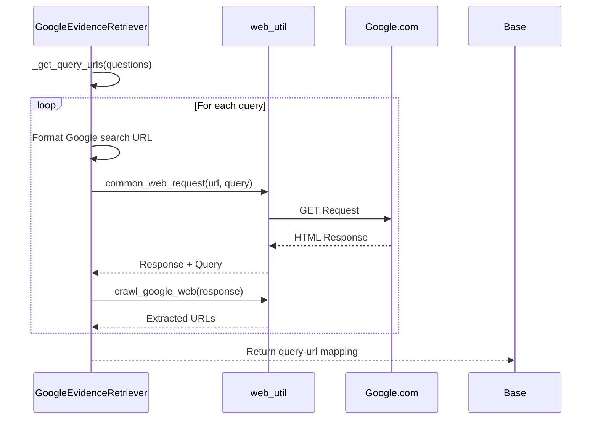
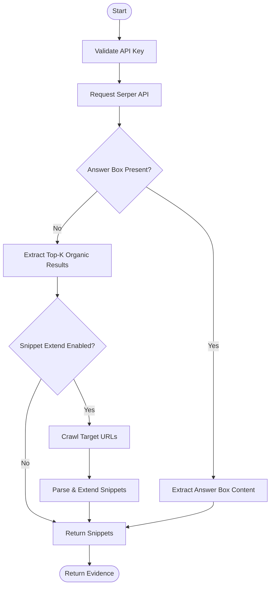
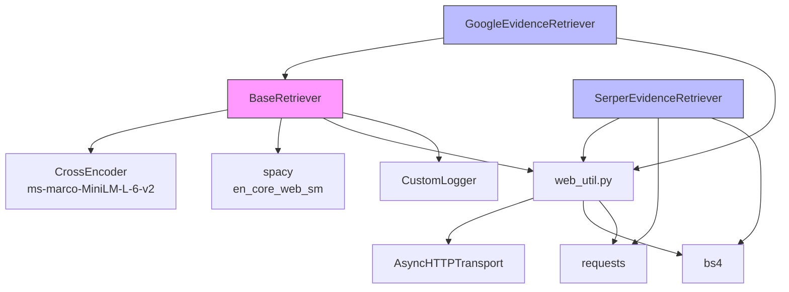

# Evidence Retrieval API

<cite>
**Referenced Files in This Document**   
- [factcheck/core/Retriever/base.py](file://factcheck/core/Retriever/base.py#L1-L236)
- [factcheck/core/Retriever/google_retriever.py](file://factcheck/core/Retriever/google_retriever.py#L1-L42)
- [factcheck/core/Retriever/serper_retriever.py](file://factcheck/core/Retriever/serper_retriever.py#L1-L222)
- [factcheck/utils/web_util.py](file://factcheck/utils/web_util.py#L1-L142)
- [factcheck/utils/logger.py](file://factcheck/utils/logger.py)
</cite>

## Table of Contents
1. [Introduction](#introduction)
2. [Project Structure](#project-structure)
3. [Core Components](#core-components)
4. [Architecture Overview](#architecture-overview)
5. [Detailed Component Analysis](#detailed-component-analysis)
6. [Dependency Analysis](#dependency-analysis)
7. [Performance Considerations](#performance-considerations)
8. [Troubleshooting Guide](#troubleshooting-guide)
9. [Conclusion](#conclusion)

## Introduction
The Evidence Retrieval API is a modular system within the Loki fact-checking framework designed to collect and process web-based evidence for claim verification. It supports multiple search backends, including Google Search via web crawling and Serper API integration. The system retrieves, parses, and ranks relevant text snippets from web pages to support downstream fact-checking tasks. This document provides comprehensive documentation on the retriever architecture, implementation details, configuration, and usage patterns.

## Project Structure
The evidence retrieval functionality is organized under the `factcheck/core/Retriever/` directory, which contains an abstract base class and concrete implementations for different search services. The design follows a modular, extensible pattern that allows for easy integration of new retrieval backends.

```mermaid
graph TD
subgraph "Retriever Module"
Base[base.py<br/>BaseRetriever]
Google[google_retriever.py<br/>GoogleEvidenceRetriever]
Serper[serper_retriever.py<br/>SerperEvidenceRetriever]
end
subgraph "Utilities"
WebUtil[web_util.py<br/>Web crawling & parsing]
Logger[logger.py<br/>CustomLogger]
end
Base --> Google : "inherits"
Base --> Serper : "implements interface"
Google --> WebUtil : "uses crawl_google_web"
Serper --> WebUtil : "uses crawl_web"
Google --> Logger : "logs events"
Serper --> Logger : "logs events"
```

**Diagram sources**
- [factcheck/core/Retriever/base.py](file://factcheck/core/Retriever/base.py#L1-L236)
- [factcheck/core/Retriever/google_retriever.py](file://factcheck/core/Retriever/google_retriever.py#L1-L42)
- [factcheck/core/Retriever/serper_retriever.py](file://factcheck/core/Retriever/serper_retriever.py#L1-L222)
- [factcheck/utils/web_util.py](file://factcheck/utils/web_util.py#L1-L142)

**Section sources**
- [factcheck/core/Retriever/base.py](file://factcheck/core/Retriever/base.py#L1-L236)
- [factcheck/core/Retriever/google_retriever.py](file://factcheck/core/Retriever/google_retriever.py#L1-L42)
- [factcheck/core/Retriever/serper_retriever.py](file://factcheck/core/Retriever/serper_retriever.py#L1-L222)

## Core Components
The evidence retrieval system consists of three primary components: the abstract base class (`BaseRetriever`), two concrete implementations (`GoogleEvidenceRetriever`, `SerperEvidenceRetriever`), and supporting utility functions for web interaction and content parsing. These components work together to transform search queries into structured evidence snippets with source attribution.

**Section sources**
- [factcheck/core/Retriever/base.py](file://factcheck/core/Retriever/base.py#L1-L236)
- [factcheck/core/Retriever/google_retriever.py](file://factcheck/core/Retriever/google_retriever.py#L1-L42)
- [factcheck/core/Retriever/serper_retriever.py](file://factcheck/core/Retriever/serper_retriever.py#L1-L222)

## Architecture Overview
The evidence retrieval system follows a layered architecture with clear separation between query generation, web interaction, content extraction, and relevance ranking. The system supports both direct API-based retrieval (Serper) and web crawling (Google), with shared post-processing logic for snippet extraction and ranking.



**Diagram sources**
- [factcheck/core/Retriever/base.py](file://factcheck/core/Retriever/base.py#L1-L236)
- [factcheck/core/Retriever/serper_retriever.py](file://factcheck/core/Retriever/serper_retriever.py#L1-L222)
- [factcheck/utils/web_util.py](file://factcheck/utils/web_util.py#L1-L142)

## Detailed Component Analysis

### BaseRetriever Analysis
The `BaseRetriever` class defines the abstract interface and shared functionality for all evidence retrieval implementations. It handles text preprocessing, passage chunking, and relevance scoring using a cross-encoder model.

#### Class Diagram


**Diagram sources**
- [factcheck/core/Retriever/base.py](file://factcheck/core/Retriever/base.py#L1-L236)
- [factcheck/core/Retriever/google_retriever.py](file://factcheck/core/Retriever/google_retriever.py#L1-L42)
- [factcheck/core/Retriever/serper_retriever.py](file://factcheck/core/Retriever/serper_retriever.py#L1-L222)

**Section sources**
- [factcheck/core/Retriever/base.py](file://factcheck/core/Retriever/base.py#L1-L236)

### GoogleEvidenceRetriever Analysis
The `GoogleEvidenceRetriever` implementation uses web crawling to simulate Google search results. It constructs search URLs, extracts result links from HTML responses, and delegates content retrieval to the base class.

#### Sequence Diagram


**Diagram sources**
- [factcheck/core/Retriever/google_retriever.py](file://factcheck/core/Retriever/google_retriever.py#L1-L42)
- [factcheck/utils/web_util.py](file://factcheck/utils/web_util.py#L1-L142)

**Section sources**
- [factcheck/core/Retriever/google_retriever.py](file://factcheck/core/Retriever/google_retriever.py#L1-L42)

### SerperEvidenceRetriever Analysis
The `SerperEvidenceRetriever` class uses the Serper API to retrieve search results programmatically. It processes both organic results and answer boxes, with optional snippet extension through web crawling.

#### Flowchart


**Diagram sources**
- [factcheck/core/Retriever/serper_retriever.py](file://factcheck/core/Retriever/serper_retriever.py#L1-L222)

**Section sources**
- [factcheck/core/Retriever/serper_retriever.py](file://factcheck/core/Retriever/serper_retriever.py#L1-L222)

## Dependency Analysis
The evidence retrieval system has well-defined dependencies between components, with clear separation of concerns. The architecture minimizes coupling while maximizing code reuse through inheritance and utility modules.



**Diagram sources**
- [factcheck/core/Retriever/base.py](file://factcheck/core/Retriever/base.py#L1-L236)
- [factcheck/core/Retriever/google_retriever.py](file://factcheck/core/Retriever/google_retriever.py#L1-L42)
- [factcheck/core/Retriever/serper_retriever.py](file://factcheck/core/Retriever/serper_retriever.py#L1-L222)
- [factcheck/utils/web_util.py](file://factcheck/utils/web_util.py#L1-L142)

**Section sources**
- [factcheck/core/Retriever/base.py](file://factcheck/core/Retriever/base.py#L1-L236)
- [factcheck/utils/web_util.py](file://factcheck/utils/web_util.py#L1-L142)

## Performance Considerations
The evidence retrieval system implements several performance optimizations:

- **Concurrent Processing**: Uses `ThreadPoolExecutor` and `ProcessPoolExecutor` for parallel web requests and content parsing
- **Caching Strategy**: Limited by `max_search_result_per_query` and early termination in passage ranking
- **Resource Management**: Limits text processing to 500k characters and uses sliding window chunking
- **Error Resilience**: Implements retry logic through `backoff` and exception handling in web requests
- **Memory Efficiency**: Streams content processing and avoids storing intermediate results unnecessarily

The system automatically adjusts worker count based on CPU availability (`os.cpu_count()`), ensuring optimal resource utilization across different deployment environments.

## Troubleshooting Guide
Common issues and their solutions when using the evidence retrieval system:

**Section sources**
- [factcheck/core/Retriever/base.py](file://factcheck/core/Retriever/base.py#L1-L236)
- [factcheck/core/Retriever/serper_retriever.py](file://factcheck/core/Retriever/serper_retriever.py#L1-L222)
- [factcheck/utils/web_util.py](file://factcheck/utils/web_util.py#L1-L142)

### API Authentication Errors
**Symptom**: `Failed to authenticate. Check your API key.` when using Serper  
**Solution**: Ensure `SERPER_API_KEY` is correctly set in `api_config` dictionary or environment variables

### Empty Results
**Symptom**: No evidence returned despite valid queries  
**Solution**: Check network connectivity, verify that `snippet_extend_flag=True` for Serper, and ensure Google search URLs are being generated correctly

### Unicode Errors
**Symptom**: `UnicodeEncodeError` during text processing  
**Solution**: The system catches these errors and skips problematic text; ensure input text is properly encoded

### Rate Limiting
**Symptom**: HTTP 429 errors or timeouts  
**Solution**: Implement request throttling, reduce `num_web_pages` for Google retriever, or upgrade Serper API plan

### PDF Content
**Symptom**: PDF URLs being skipped in results  
**Solution**: The system intentionally filters out PDFs; modify the `.pdf` check in `_crawl_and_parse_web` if PDF processing is needed

## Conclusion
The Evidence Retrieval API provides a robust, extensible framework for collecting web-based evidence in support of fact-checking workflows. Its modular design separates concerns between search backend implementations and shared processing logic, enabling easy integration of new retrieval services. The system combines efficient web crawling, intelligent content extraction, and semantic relevance ranking to deliver high-quality evidence snippets. By supporting both API-based (Serper) and crawler-based (Google) approaches, it offers flexibility in deployment scenarios while maintaining consistent output formats for downstream processing.