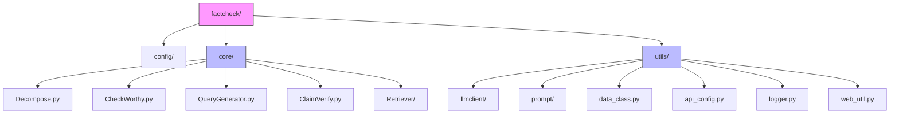
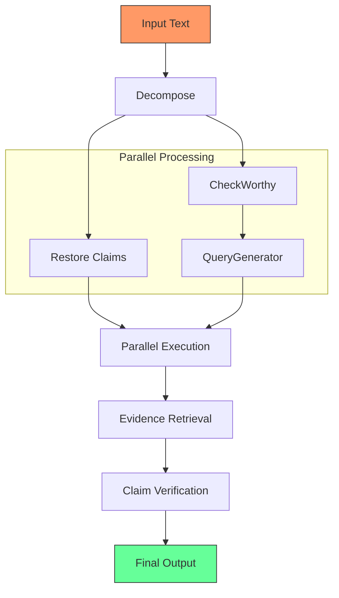
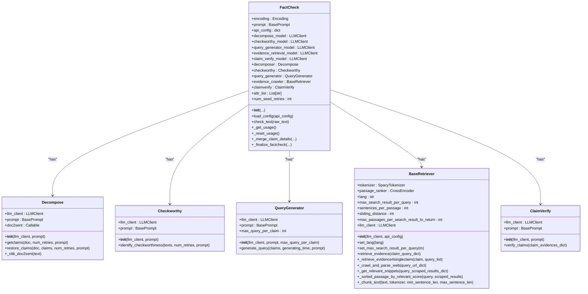
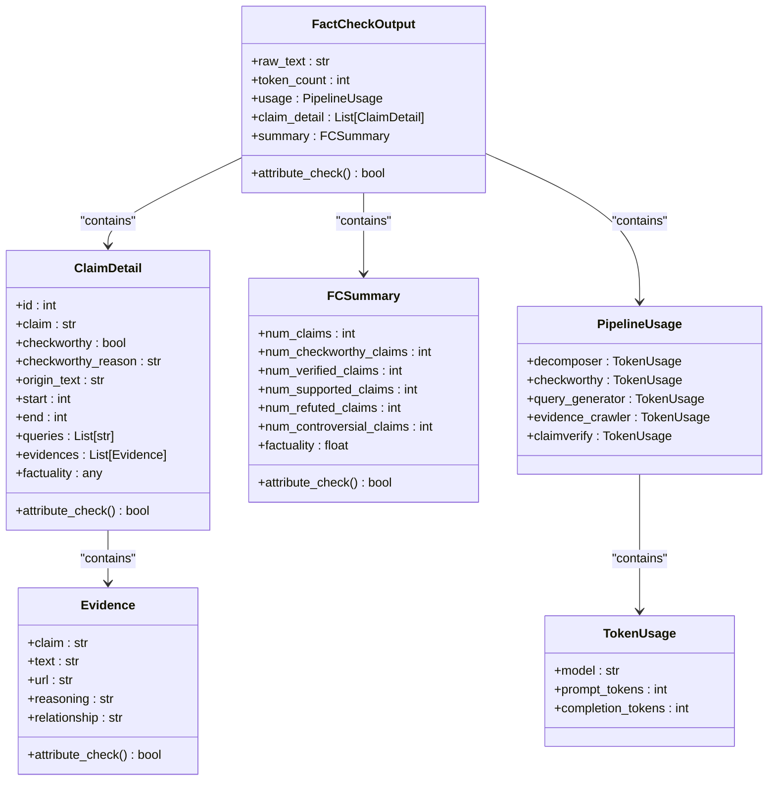
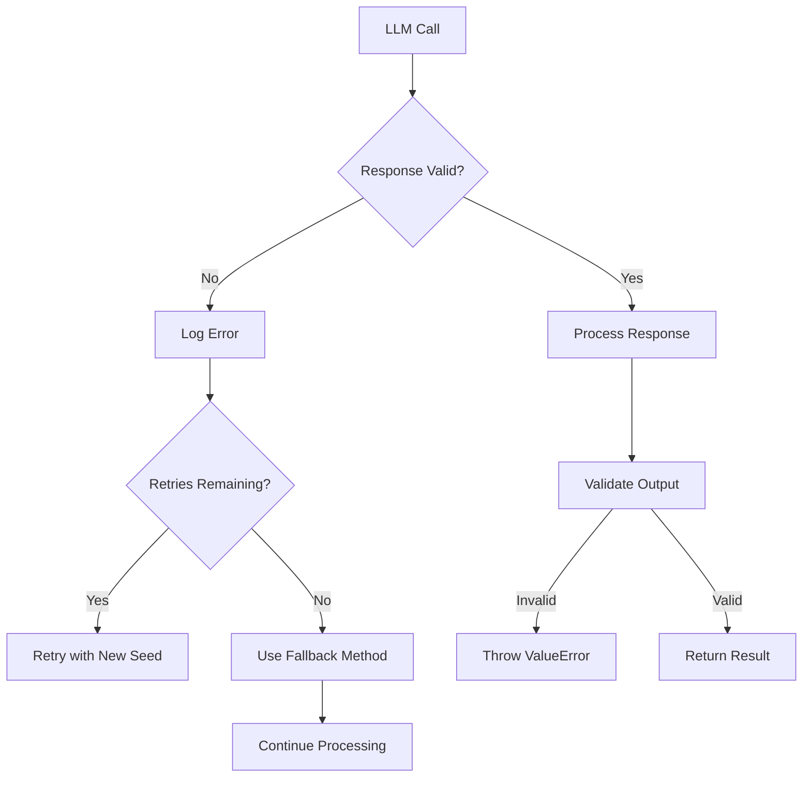

# FactCheck Class API

<cite>
**Referenced Files in This Document**   
- [factcheck/__init__.py](file://factcheck/__init__.py#L0-L238)
- [factcheck/utils/data_class.py](file://factcheck/utils/data_class.py#L0-L131)
- [factcheck/utils/api_config.py](file://factcheck/utils/api_config.py#L0-L30)
- [factcheck/core/Decompose.py](file://factcheck/core/Decompose.py#L0-L138)
- [factcheck/core/CheckWorthy.py](file://factcheck/core/CheckWorthy.py#L0-L53)
- [factcheck/core/QueryGenerator.py](file://factcheck/core/QueryGenerator.py#L0-L60)
- [factcheck/core/Retriever/base.py](file://factcheck/core/Retriever/base.py#L0-L235)
- [factcheck/core/ClaimVerify.py](file://factcheck/core/ClaimVerify.py)
- [factcheck/utils/llmclient/__init__.py](file://factcheck/utils/llmclient/__init__.py)
- [factcheck/utils/prompt/__init__.py](file://factcheck/utils/prompt/__init__.py)
</cite>

## Table of Contents
1. [Introduction](#introduction)
2. [Project Structure](#project-structure)
3. [Core Components](#core-components)
4. [Architecture Overview](#architecture-overview)
5. [FactCheck Class API Documentation](#factcheck-class-api-documentation)
6. [Initialization and Dependency Injection](#initialization-and-dependency-injection)
7. [check_text Method](#check_text-method)
8. [Data Structures and Output Format](#data-structures-and-output-format)
9. [Error Handling and Robustness](#error-handling-and-robustness)
10. [Performance and Thread Safety](#performance-and-thread-safety)
11. [Configuration and Customization](#configuration-and-customization)
12. [Usage Examples](#usage-examples)
13. [Conclusion](#conclusion)

## Introduction

The `FactCheck` class is the primary interface of the OpenFactVerification system, designed to perform comprehensive fact-checking on input text. It orchestrates a multi-stage pipeline that decomposes text into claims, evaluates their checkworthiness, generates search queries, retrieves evidence from the web, and verifies the factual accuracy of claims using large language models (LLMs). This document provides comprehensive API documentation for the `FactCheck` class, detailing its constructor parameters, method signatures, return types, error handling, and performance characteristics.

**Section sources**
- [factcheck/__init__.py](file://factcheck/__init__.py#L0-L238)

## Project Structure

The OpenFactVerification project follows a modular architecture with clearly separated concerns. The core functionality resides in the `factcheck` package, which is organized into submodules for configuration, core processing logic, and utility functions.



**Diagram sources**
- [factcheck/__init__.py](file://factcheck/__init__.py#L0-L238)
- [factcheck/core/Decompose.py](file://factcheck/core/Decompose.py#L0-L138)

## Core Components

The `FactCheck` class integrates several core components that perform specific tasks in the fact-checking pipeline:

- **Decompose**: Extracts individual claims from input text
- **CheckWorthy**: Determines which claims are worth fact-checking
- **QueryGenerator**: Creates search queries for evidence retrieval
- **Retriever**: Fetches relevant web content using search APIs
- **ClaimVerify**: Assesses the factual accuracy of claims against retrieved evidence

Each component is implemented as a separate class with well-defined interfaces, enabling modular development and testing.

**Section sources**
- [factcheck/__init__.py](file://factcheck/__init__.py#L0-L238)
- [factcheck/core/Decompose.py](file://factcheck/core/Decompose.py#L0-L138)
- [factcheck/core/CheckWorthy.py](file://factcheck/core/CheckWorthy.py#L0-L53)
- [factcheck/core/QueryGenerator.py](file://factcheck/core/QueryGenerator.py#L0-L60)
- [factcheck/core/ClaimVerify.py](file://factcheck/core/ClaimVerify.py)

## Architecture Overview

The fact-checking process follows a sequential pipeline with parallel execution where possible. The architecture is designed to be modular, with each stage receiving input from the previous stage and passing results to the next.



**Diagram sources**
- [factcheck/__init__.py](file://factcheck/__init__.py#L0-L238)
- [factcheck/core/Decompose.py](file://factcheck/core/Decompose.py#L0-L138)

## FactCheck Class API Documentation

### Constructor: __init__

Initializes the `FactCheck` class with configurable parameters for the fact-checking pipeline.

```python
def __init__(
    self,
    default_model: str = "gpt-4o",
    client: str = None,
    prompt: str = "chatgpt_prompt",
    retriever: str = "serper",
    decompose_model: str = None,
    checkworthy_model: str = None,
    query_generator_model: str = None,
    evidence_retrieval_model: str = None,
    claim_verify_model: str = None,
    api_config: dict = None,
    num_seed_retries: int = 3,
)
```

**Parameters:**
- `default_model`: Default LLM to use across all stages if specific models are not provided
- `client`: Specific LLM client to use (e.g., "gpt", "claude", "gemini")
- `prompt`: Prompt template to use for LLM interactions
- `retriever`: Web search retriever to use ("serper" or "google")
- `decompose_model`: LLM for claim decomposition
- `checkworthy_model`: LLM for checkworthiness evaluation
- `query_generator_model`: LLM for query generation
- `evidence_retrieval_model`: LLM for evidence processing
- `claim_verify_model`: LLM for final claim verification
- `api_config`: Dictionary containing API keys and configuration
- `num_seed_retries`: Number of retry attempts for LLM calls

**Section sources**
- [factcheck/__init__.py](file://factcheck/__init__.py#L20-L80)

## Initialization and Dependency Injection

The `FactCheck` class uses dependency injection to instantiate and configure its core components. During initialization, it creates LLM clients for each processing stage and initializes the pipeline modules.



**Diagram sources**
- [factcheck/__init__.py](file://factcheck/__init__.py#L20-L80)
- [factcheck/core/Decompose.py](file://factcheck/core/Decompose.py#L0-L138)
- [factcheck/core/CheckWorthy.py](file://factcheck/core/CheckWorthy.py#L0-L53)
- [factcheck/core/QueryGenerator.py](file://factcheck/core/QueryGenerator.py#L0-L60)
- [factcheck/core/Retriever/base.py](file://factcheck/core/Retriever/base.py#L0-L235)

## check_text Method

The primary method for performing fact-checking on input text.

```python
def check_text(self, raw_text: str):
    """
    Perform fact-checking on the input text.
    
    Args:
        raw_text (str): The text to be fact-checked
        
    Returns:
        FactCheckOutput: Structured output containing detailed fact-checking results
        
    Raises:
        ValueError: If output validation fails
        Exception: If LLM API calls fail after retries
    """
```

**Processing Steps:**
1. Reset usage tracking
2. Decompose text into claims
3. Parallel execution of claim restoration, checkworthiness evaluation, and query generation
4. Evidence retrieval from web sources
5. Claim verification against retrieved evidence
6. Result aggregation and formatting

**Section sources**
- [factcheck/__init__.py](file://factcheck/__init__.py#L82-L238)

## Data Structures and Output Format

### FactCheckOutput

The main output data structure returned by the `check_text` method.



**Diagram sources**
- [factcheck/utils/data_class.py](file://factcheck/utils/data_class.py#L0-L131)

## Error Handling and Robustness

The `FactCheck` class implements comprehensive error handling to ensure robust operation:

- **LLM Response Parsing**: Attempts to parse LLM responses with multiple retry attempts
- **Fallback Mechanisms**: Uses NLTK sentence tokenization if LLM decomposition fails
- **Input Validation**: Validates output attributes before returning results
- **Exception Handling**: Catches and logs parsing errors without crashing



**Section sources**
- [factcheck/__init__.py](file://factcheck/__init__.py#L82-L238)
- [factcheck/core/Decompose.py](file://factcheck/core/Decompose.py#L0-L138)

## Performance and Thread Safety

### Performance Characteristics

The `FactCheck` class is designed with performance in mind:

- **Parallel Execution**: Claim restoration, checkworthiness evaluation, and query generation run in parallel
- **Caching**: LLM clients may implement caching to avoid redundant calls
- **Rate Limiting**: Respects API rate limits through retry mechanisms
- **Resource Management**: Uses ThreadPoolExecutor for efficient resource utilization

### Thread Safety

The `FactCheck` class is **not thread-safe** for concurrent calls to `check_text()` from multiple threads. Each instance maintains internal state that could be corrupted by concurrent access. For multi-threaded applications, use one instance per thread or implement proper synchronization.

**Performance Implications of Configuration:**
- Using larger LLMs increases accuracy but also cost and latency
- Increasing `num_seed_retries` improves robustness but increases execution time
- Different retrievers (Serper vs. Google) have varying performance and cost characteristics

**Section sources**
- [factcheck/__init__.py](file://factcheck/__init__.py#L82-L238)
- [factcheck/core/Retriever/base.py](file://factcheck/core/Retriever/base.py#L0-L235)

## Configuration and Customization

### API Configuration

API keys are managed through the `api_config.py` module, which loads credentials from environment variables or a provided dictionary:

```python
def load_api_config(api_config: dict = None):
    """Load API keys from environment variables or config file, config file take precedence"""
    keys = ["SERPER_API_KEY", "GEMINI_API_KEY"]
    # Implementation details...
```

**Section sources**
- [factcheck/utils/api_config.py](file://factcheck/utils/api_config.py#L0-L30)

### Prompt Customization

The system supports multiple prompt templates that can be selected via the `prompt` parameter:

- `chatgpt_prompt`: Default prompt for ChatGPT
- `chatgpt_prompt_zh`: Chinese language prompt
- `claude_prompt`: Prompt optimized for Claude
- `customized_prompt`: User-defined prompt template

Prompt selection is handled by the `prompt_mapper` function imported from `factcheck.utils.prompt`.

### Model Selection

The system supports multiple LLM providers through the `CLIENTS` and `model2client` mappings:

- GPT models via `gpt_client`
- Claude models via `claude_client`
- Gemini models via `gemini_client`
- Local LLMs via `local_openai_client`

**Section sources**
- [factcheck/__init__.py](file://factcheck/__init__.py#L0-L238)
- [factcheck/utils/api_config.py](file://factcheck/utils/api_config.py#L0-L30)

## Usage Examples

### Basic Usage

```python
from factcheck import FactCheck

# Initialize the fact-checker
fc = FactCheck()

# Check a text
result = fc.check_text("The Earth is round and orbits the Sun.")
print(result["summary"]["factuality"])
```

### Custom Configuration

```python
# Custom configuration
api_config = {"SERPER_API_KEY": "your-key-here"}
fc = FactCheck(
    default_model="gpt-3.5-turbo",
    retriever="serper",
    prompt="chatgpt_prompt",
    api_config=api_config,
    num_seed_retries=3
)

result = fc.check_text("Climate change is caused by human activities.")
```

### Error Handling

```python
try:
    result = fc.check_text("A claim that might be problematic")
    # Process result
except ValueError as e:
    print(f"Output validation failed: {e}")
except Exception as e:
    print(f"Fact-checking failed: {e}")
```

**Section sources**
- [factcheck/__init__.py](file://factcheck/__init__.py#L0-L238)

## Conclusion

The `FactCheck` class provides a comprehensive, modular interface for automated fact-checking. It orchestrates a sophisticated pipeline that decomposes text, evaluates claim checkworthiness, retrieves evidence, and verifies factual accuracy using state-of-the-art LLMs and web search capabilities. The design emphasizes configurability, with support for multiple LLM providers, prompt templates, and retrieval backends. The API is designed to be accessible while exposing advanced configuration options for power users. With proper API key configuration and appropriate model selection, the system can provide reliable fact-checking results for a wide range of applications.

The architecture balances performance and robustness through parallel execution and comprehensive error handling. While the current implementation is not thread-safe for concurrent calls, it provides detailed usage tracking and structured output that enables integration into larger systems. The extensible design allows for future enhancements to the fact-checking pipeline while maintaining backward compatibility.

**Section sources**
- [factcheck/__init__.py](file://factcheck/__init__.py#L0-L238)
- [factcheck/utils/data_class.py](file://factcheck/utils/data_class.py#L0-L131)