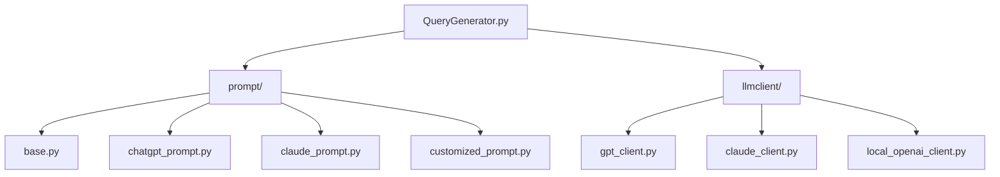
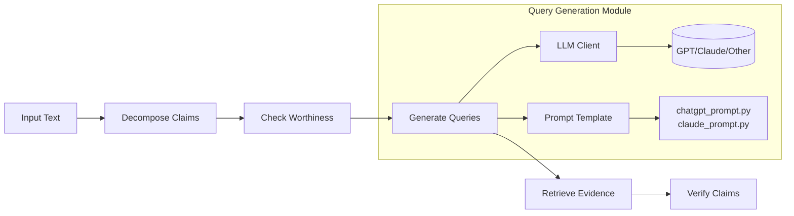
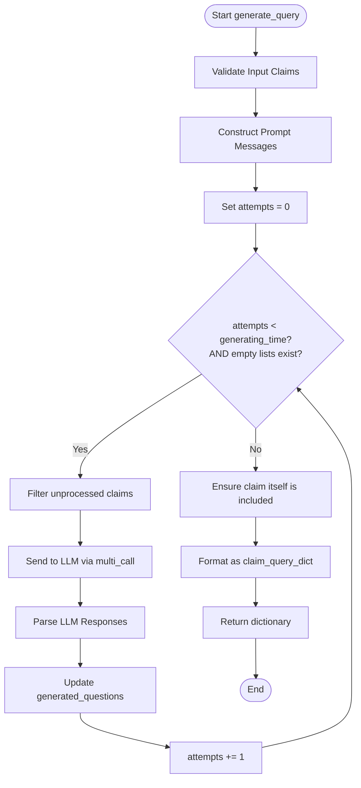
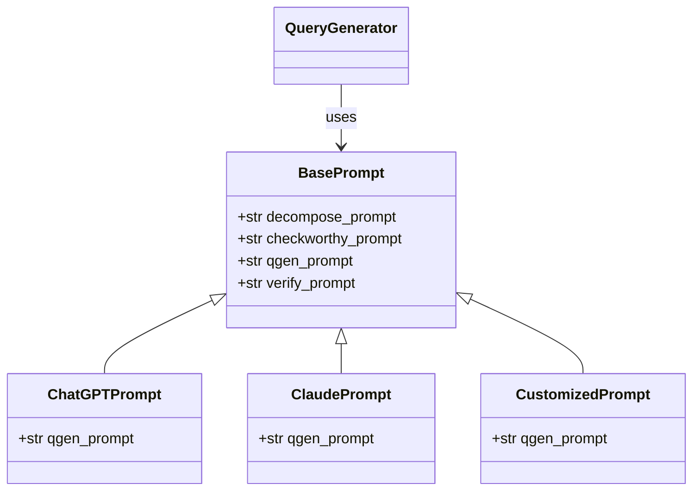
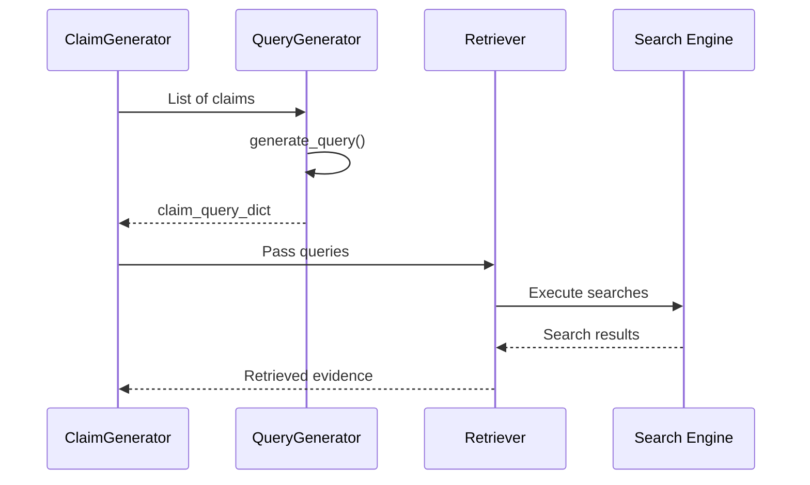

# Query Generation API

<cite>
**Referenced Files in This Document**   
- [factcheck/core/QueryGenerator.py](file://factcheck/core/QueryGenerator.py#L1-L60)
- [factcheck/utils/prompt/base.py](file://factcheck/utils/prompt/base.py#L1-L9)
- [factcheck/utils/prompt/chatgpt_prompt.py](file://factcheck/utils/prompt/chatgpt_prompt.py#L1-L143)
- [factcheck/utils/prompt/claude_prompt.py](file://factcheck/utils/prompt/claude_prompt.py)
- [factcheck/utils/prompt/customized_prompt.py](file://factcheck/utils/prompt/customized_prompt.py)
</cite>

## Table of Contents
1. [Introduction](#introduction)
2. [Project Structure](#project-structure)
3. [Core Components](#core-components)
4. [Architecture Overview](#architecture-overview)
5. [Detailed Component Analysis](#detailed-component-analysis)
6. [Query Diversification and Ambiguity Handling](#query-diversification-and-ambiguity-handling)
7. [Prompt Engineering Strategies](#prompt-engineering-strategies)
8. [Rate Limiting and Scalability](#rate-limiting-and-scalability)
9. [Evaluation Metrics for Query Quality](#evaluation-metrics-for-query-quality)
10. [Integration with Retriever Components](#integration-with-retriever-components)
11. [Usage Examples](#usage-examples)
12. [Conclusion](#conclusion)

## Introduction
The QueryGenerator module is a core component of the Loki fact-checking system, responsible for transforming natural language claims into effective search queries. This API enables automated generation of multiple targeted questions per claim to support comprehensive evidence retrieval. The module leverages large language models (LLMs) such as GPT and Claude through configurable prompts to produce semantically rich and diverse queries that maximize the likelihood of retrieving relevant evidence from external sources.

This documentation provides a complete overview of the QueryGenerator's functionality, architecture, customization options, and integration points within the broader fact-checking pipeline.

## Project Structure
The QueryGenerator resides within the `factcheck/core/` directory and interacts closely with prompt templates defined in `factcheck/utils/prompt/`. It uses LLM clients from `factcheck/utils/llmclient/` to communicate with various language model providers.



**Diagram sources**
- [factcheck/core/QueryGenerator.py](file://factcheck/core/QueryGenerator.py)
- [factcheck/utils/prompt/](file://factcheck/utils/prompt/)
- [factcheck/utils/llmclient/](file://factcheck/utils/llmclient/)

**Section sources**
- [factcheck/core/QueryGenerator.py](file://factcheck/core/QueryGenerator.py#L1-L60)
- [factcheck/utils/prompt/](file://factcheck/utils/prompt/)

## Core Components
The primary class in this module is `QueryGenerator`, which encapsulates logic for generating search queries from input claims using LLMs. It depends on two key abstractions: an LLM client for model interaction and a prompt object for templating inputs.

Key responsibilities include:
- Constructing structured prompts from claims
- Managing LLM interactions with retry logic
- Parsing and validating model outputs
- Ensuring each claim has at least one fallback query (the claim itself)

```python
class QueryGenerator:
    def __init__(self, llm_client, prompt, max_query_per_claim: int = 5):
        self.llm_client = llm_client
        self.prompt = prompt
        self.max_query_per_claim = max_query_per_claim

    def generate_query(self, claims: list[str], generating_time: int = 3, prompt: str = None) -> dict[str, list[str]]:
        ...
```

**Section sources**
- [factcheck/core/QueryGenerator.py](file://factcheck/core/QueryGenerator.py#L1-L60)

## Architecture Overview
The QueryGenerator operates as part of a multi-stage fact verification pipeline. It receives decomposed claims from earlier stages and produces search queries that are passed to retriever components for evidence gathering.



**Diagram sources**
- [factcheck/core/QueryGenerator.py](file://factcheck/core/QueryGenerator.py#L1-L60)
- [factcheck/utils/prompt/chatgpt_prompt.py](file://factcheck/utils/prompt/chatgpt_prompt.py#L1-L143)

## Detailed Component Analysis

### QueryGenerator Class Analysis
The `QueryGenerator` class is designed to be modular and extensible, allowing different LLM backends and prompt strategies to be plugged in dynamically.

#### Initialization Parameters
- **llm_client**: Instance of a client implementing the `BaseClient` interface for communicating with LLMs
- **prompt**: An object implementing the `BasePrompt` interface containing the `qgen_prompt` template
- **max_query_per_claim**: Maximum number of queries to generate per claim (default: 5)

#### Method: generate_query
Generates search queries for a batch of claims with built-in retry logic.

**Parameters:**
- `claims`: List of strings representing individual factual claims
- `generating_time`: Maximum number of retry attempts (default: 3)
- `prompt`: Optional custom prompt string to override default template

**Return Value:**
- Dictionary mapping each claim to a list of generated queries (including the original claim as fallback)

**Processing Logic:**
1. Constructs user input messages using the configured prompt template
2. Filters out already processed claims during retries
3. Sends batched requests to the LLM
4. Parses JSON responses containing "Questions" key
5. Applies fallback mechanism ensuring every claim has at least one query



**Diagram sources**
- [factcheck/core/QueryGenerator.py](file://factcheck/core/QueryGenerator.py#L15-L60)

**Section sources**
- [factcheck/core/QueryGenerator.py](file://factcheck/core/QueryGenerator.py#L1-L60)

## Query Diversification and Ambiguity Handling
The QueryGenerator employs several techniques to handle ambiguous or complex claims:

- **Multi-perspective questioning**: For claims with multiple verifiable aspects (e.g., "The Havel-Hakimi algorithm does X and is named after Y"), it generates separate questions targeting each aspect.
- **Fallback inclusion**: The original claim is always included as a query to ensure at least one search is performed even if LLM generation fails.
- **Retry mechanism**: Up to three attempts are made to generate valid queries, improving robustness against transient LLM errors.
- **Error tolerance**: Failed response parsing triggers retries rather than immediate failure.

This approach ensures comprehensive coverage of claim semantics while maintaining reliability in production environments.

**Section sources**
- [factcheck/core/QueryGenerator.py](file://factcheck/core/QueryGenerator.py#L30-L60)

## Prompt Engineering Strategies
The system uses specialized prompt templates optimized for different LLMs to maximize query effectiveness.

### Default Prompt Template (chatgpt_prompt.py)
The `qgen_prompt` template follows a few-shot learning pattern with multiple examples demonstrating desired output format:

```json
{{
  "Questions": ["What does Havel-Hakimi algorithm do?", "Who are Havel-Hakimi algorithm named after?"]
}}
```

Key characteristics:
- Clear instruction: "create minimum number of questions need to be check to verify the correctness"
- JSON output requirement
- Multiple illustrative examples
- Focus on verification-oriented questioning

### Model-Specific Customization
While the current implementation shows a ChatGPT-specific prompt, the architecture supports model-specific variations:
- `claude_prompt.py`: Contains prompts tailored for Anthropic's Claude models
- `customized_prompt.py`: Allows user-defined prompt configurations

This modular design enables optimization of prompting strategies based on LLM behavior and performance characteristics.



**Diagram sources**
- [factcheck/utils/prompt/base.py](file://factcheck/utils/prompt/base.py#L1-L9)
- [factcheck/utils/prompt/chatgpt_prompt.py](file://factcheck/utils/prompt/chatgpt_prompt.py#L1-L143)
- [factcheck/utils/prompt/claude_prompt.py](file://factcheck/utils/prompt/claude_prompt.py)
- [factcheck/utils/prompt/customized_prompt.py](file://factcheck/utils/prompt/customized_prompt.py)

**Section sources**
- [factcheck/utils/prompt/base.py](file://factcheck/utils/prompt/base.py#L1-L9)
- [factcheck/utils/prompt/chatgpt_prompt.py](file://factcheck/utils/prompt/chatgpt_prompt.py#L1-L143)

## Rate Limiting and Scalability
When used at scale, the QueryGenerator must account for LLM API rate limits and latency:

- **Batch processing**: Processes multiple claims in parallel using `multi_call` method
- **Retry management**: Configurable retry attempts (`generating_time`) prevent cascading failures
- **Asynchronous potential**: Architecture allows for async LLM clients to improve throughput
- **Caching opportunity**: Generated queries could be cached for identical or similar claims

Best practices for scaling:
- Implement external caching layer
- Use queue-based processing for high-volume scenarios
- Monitor LLM response times and adjust `generating_time` accordingly
- Consider claim deduplication before query generation

**Section sources**
- [factcheck/core/QueryGenerator.py](file://factcheck/core/QueryGenerator.py#L30-L50)

## Evaluation Metrics for Query Quality
Effective query generation can be assessed using several metrics:

- **Coverage**: Percentage of verifiable aspects addressed by generated questions
- **Precision**: Proportion of retrieved results that are relevant to the claim
- **Diversity**: Number of distinct semantic angles covered by generated queries
- **Success rate**: Percentage of claims for which valid queries were generated
- **Retrieval efficacy**: Downstream verification accuracy using evidence from generated queries

These metrics should be measured in conjunction with retriever performance to evaluate end-to-end effectiveness.

## Integration with Retriever Components
The QueryGenerator integrates seamlessly with retriever modules in the fact-checking pipeline:



The output format `{claim: [query1, query2...]}` is specifically designed for consumption by retrievers like `google_retriever.py` and `serper_retriever.py`, enabling multiple search attempts per claim to increase evidence coverage.

**Diagram sources**
- [factcheck/core/QueryGenerator.py](file://factcheck/core/QueryGenerator.py#L1-L60)
- [factcheck/core/Retriever/google_retriever.py](file://factcheck/core/Retriever/google_retriever.py)
- [factcheck/core/Retriever/serper_retriever.py](file://factcheck/core/Retriever/serper_retriever.py)

## Usage Examples
### Basic Usage
```python
from factcheck import FactCheck
factchecker = FactCheck()
results = factchecker.check_response("MBZUAI is the first AI university in the world")
```

### Standalone Query Generation
```python
from factcheck.utils.llmclient.gpt_client import GPTClient
from factcheck.utils.prompt.chatgpt_prompt import ChatGPTPrompt
from factcheck.core.QueryGenerator import QueryGenerator

client = GPTClient(model="gpt-3.5-turbo")
prompt = ChatGPTPrompt()
qgen = QueryGenerator(llm_client=client, prompt=prompt)

claims = ["Social work has roots in the 1800s."]
queries = qgen.generate_query(claims)
print(queries)
# Output: {"Social work has roots in the 1800s.": ["Social work has roots in the 1800s.", "What year does social work have its root in?"]}
```

### Custom Prompt Usage
```python
custom_prompt = "Given a claim, generate search queries to verify: {claim}"
queries = qgen.generate_query(claims, prompt=custom_prompt)
```

**Section sources**
- [factcheck/core/QueryGenerator.py](file://factcheck/core/QueryGenerator.py#L1-L60)
- [factcheck/utils/prompt/chatgpt_prompt.py](file://factcheck/utils/prompt/chatgpt_prompt.py#L1-L143)

## Conclusion
The QueryGenerator module provides a robust, extensible solution for transforming factual claims into effective search queries. By leveraging LLMs with carefully engineered prompts, it enables comprehensive evidence retrieval for automated fact verification. Its modular design supports multiple LLM backends and prompt strategies, while built-in retry logic and fallback mechanisms ensure reliability in production use. Integrated within the larger Loki pipeline, it plays a critical role in bridging natural language claims with verifiable evidence from the web.