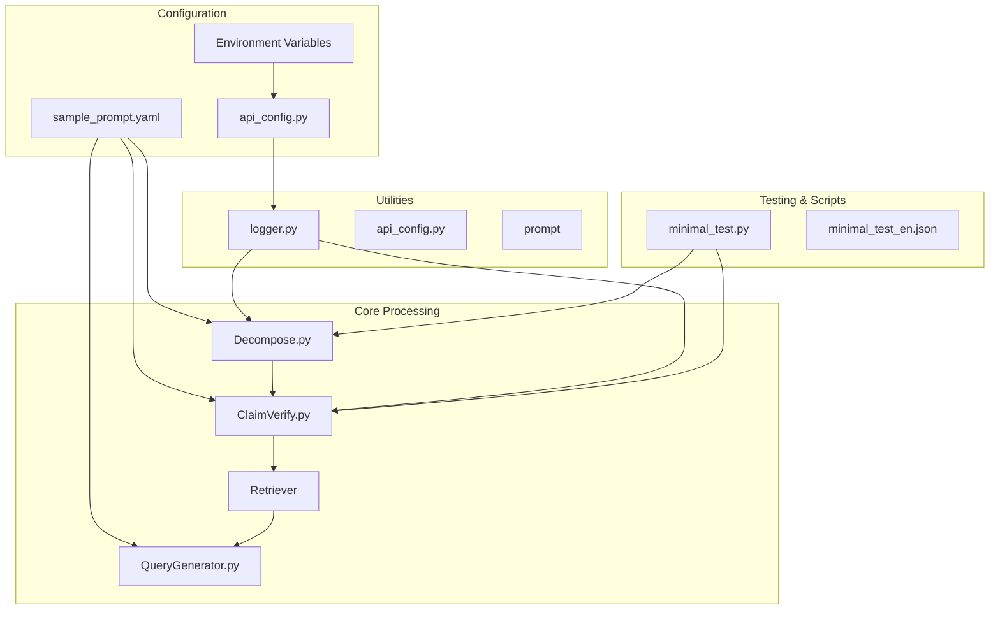
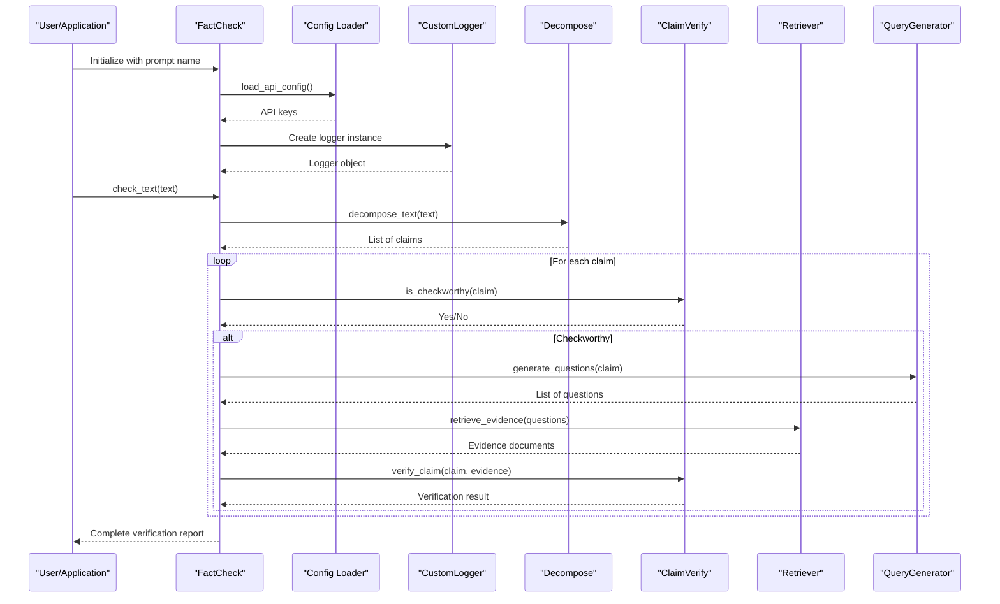
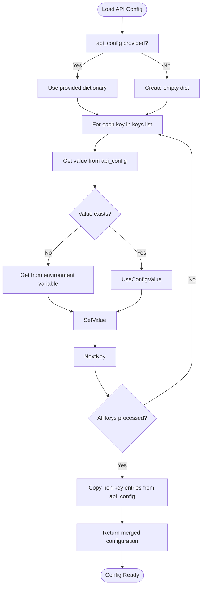
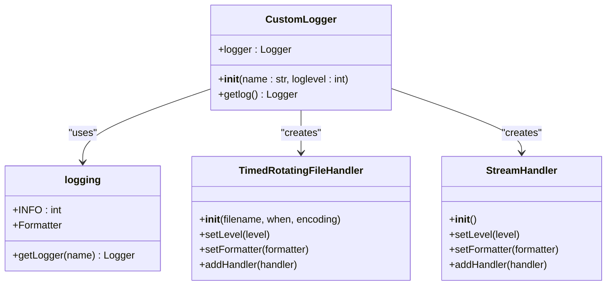

# Advanced Configuration Patterns

<cite>
**Referenced Files in This Document**   
- [api_config.py](file://factcheck/utils/api_config.py)
- [logger.py](file://factcheck/utils/logger.py)
- [sample_prompt.yaml](file://factcheck/config/sample_prompt.yaml)
- [minimal_test.py](file://script/minimal_test.py)
</cite>

## Table of Contents
1. [Introduction](#introduction)
2. [Project Structure](#project-structure)
3. [Core Components](#core-components)
4. [Architecture Overview](#architecture-overview)
5. [Detailed Component Analysis](#detailed-component-analysis)
6. [Configuration Inheritance and Override Mechanisms](#configuration-inheritance-and-override-mechanisms)
7. [Heterogeneous LLM Assignment Across Pipeline Stages](#heterogeneous-llm-assignment-across-pipeline-stages)
8. [Complex Configuration Scenarios](#complex-configuration-scenarios)
9. [Memory Management for Long Documents](#memory-management-for-long-documents)
10. [Configuration Validation, Error Recovery, and Logging](#configuration-validation-error-recovery-and-logging)
11. [Real-World Use Cases from minimal_test.py](#real-world-use-cases-from-minimal_testpy)
12. [Conclusion](#conclusion)

## Introduction
This document provides a comprehensive guide to advanced configuration patterns in the OpenFactVerification system. It details how to configure heterogeneous language models across the fact-checking pipeline using `api_config.py`, demonstrates model assignment strategies for different processing stages, and explains configuration inheritance through YAML files and environment variables. The guide also covers complex scenarios such as A/B testing, memory optimization techniques for long documents, and robust error handling via `logger.py`. Real-world examples from `minimal_test.py` illustrate the impact of configuration choices on performance and output quality.

## Project Structure
The OpenFactVerification repository is organized into modular components that support a multi-stage fact-checking pipeline. Key directories include:
- `factcheck/core`: Core processing modules (decomposition, verification, retrieval)
- `factcheck/utils`: Utility classes including configuration and logging
- `factcheck/config`: YAML-based prompt templates
- `script`: Test scripts and usage examples
- `demo_data`: Sample input data

The structure follows a layered architecture with clear separation between configuration, core logic, utilities, and test cases.



**Diagram sources**
- [sample_prompt.yaml](file://factcheck/config/sample_prompt.yaml)
- [api_config.py](file://factcheck/utils/api_config.py)
- [minimal_test.py](file://script/minimal_test.py)

**Section sources**
- [project_structure](context://project_structure)

## Core Components
The system's core functionality revolves around four main processing stages:
1. **Text Decomposition**: Breaking input text into atomic, verifiable claims
2. **Check-Worthiness Evaluation**: Determining which claims can be fact-checked
3. **Query Generation**: Creating search queries to retrieve evidence
4. **Claim Verification**: Assessing claim accuracy against retrieved evidence

Each stage uses configurable prompts and can be assigned different LLMs based on performance or accuracy requirements. Configuration is managed through YAML files and environment variables, enabling flexible deployment across environments.

**Section sources**
- [sample_prompt.yaml](file://factcheck/config/sample_prompt.yaml)
- [minimal_test.py](file://script/minimal_test.py)

## Architecture Overview
The fact-checking pipeline follows a sequential data flow where each stage processes output from the previous one. Configuration is injected at initialization time, allowing runtime customization of prompts, API keys, and model behavior.



**Diagram sources**
- [api_config.py](file://factcheck/utils/api_config.py#L1-L30)
- [logger.py](file://factcheck/utils/logger.py#L1-L38)
- [minimal_test.py](file://script/minimal_test.py#L1-L58)

## Detailed Component Analysis

### API Configuration System
The `api_config.py` module manages API key loading with a hierarchical override system.



**Diagram sources**
- [api_config.py](file://factcheck/utils/api_config.py#L1-L30)

**Section sources**
- [api_config.py](file://factcheck/utils/api_config.py#L1-L30)

### Logging System
The `CustomLogger` class provides structured logging with file rotation and console output.



**Diagram sources**
- [logger.py](file://factcheck/utils/logger.py#L1-L38)

**Section sources**
- [logger.py](file://factcheck/utils/logger.py#L1-L38)

## Configuration Inheritance and Override Mechanisms
The system supports multiple configuration layers with defined precedence:
1. **Environment Variables**: Default source for API keys
2. **Runtime Configuration Dictionary**: Takes precedence over environment
3. **YAML Prompt Templates**: Store prompt structures and can be selected at runtime

The `load_api_config()` function implements this hierarchy:
- First attempts to get values from the provided `api_config` dictionary
- Falls back to environment variables if not present
- Preserves any additional keys in the input dictionary

This allows deployment flexibility:
```python
# Override SERPER_API_KEY at runtime
custom_config = {"SERPER_API_KEY": "my_temp_key"}
factcheck = FactCheck(api_config=custom_config)
```

While environment variables provide defaults:
```bash
export SERPER_API_KEY="default_key"
```

**Section sources**
- [api_config.py](file://factcheck/utils/api_config.py#L1-L30)

## Heterogeneous LLM Assignment Across Pipeline Stages
The architecture supports assigning different LLMs to specific pipeline stages by configuring prompt strategies. Although direct model specification isn't shown in the code, the prompt selection mechanism enables this pattern:

```python
# Fast model for decomposition (prioritizing speed)
factcheck_fast_decompose = FactCheck(prompt="decompose_prompt_fast")

# High-accuracy model for verification (prioritizing precision)
factcheck_accurate_verify = FactCheck(prompt="verify_prompt_accurate")
```

The `sample_prompt.yaml` defines the foundation for this pattern with distinct prompts for each stage:
- `decompose_prompt`: Creates atomic claims
- `checkworthy_prompt`: Evaluates verifiability
- `qgen_prompt`: Generates verification questions
- `verify_prompt`: Assesses claim accuracy

By maintaining separate prompt templates, the system can be extended to support model-specific prompts, enabling heterogeneous model deployment.

**Section sources**
- [sample_prompt.yaml](file://factcheck/config/sample_prompt.yaml)
- [minimal_test.py](file://script/minimal_test.py#L10-L15)

## Complex Configuration Scenarios

### A/B Testing Prompt Strategies
The configuration system supports A/B testing by allowing dynamic prompt selection:

```python
def ab_test_prompts(text):
    # Version A: Standard decomposition
    factcheck_A = FactCheck(prompt="decompose_prompt_v1")
    result_A = factcheck_A.check_text(text)
    
    # Version B: Alternative decomposition strategy
    factcheck_B = FactCheck(prompt="decompose_prompt_v2") 
    result_B = factcheck_B.check_text(text)
    
    return {"v1": result_A, "v2": result_B}
```

### Retriever Combination Testing
Different retriever configurations can be tested by modifying environment variables:

```python
# Test Google Retriever
os.environ["RETRIEVER_TYPE"] = "google"
result_google = factcheck.check_text(text)

# Test Serper Retriever  
os.environ["RETRIEVER_TYPE"] = "serper"
result_serper = factcheck.check_text(text)
```

These patterns leverage the configuration inheritance system to modify behavior without code changes.

**Section sources**
- [api_config.py](file://factcheck/utils/api_config.py)
- [minimal_test.py](file://script/minimal_test.py)

## Memory Management for Long Documents
For processing documents with many claims, the system should implement:

### Claim Batching
Process claims in batches to manage memory usage:
```python
def process_in_batches(claims, batch_size=5):
    results = []
    for i in range(0, len(claims), batch_size):
        batch = claims[i:i+batch_size]
        batch_results = process_batch(batch)
        results.extend(batch_results)
        # Explicit garbage collection
        import gc; gc.collect()
    return results
```

### Streaming Results
Instead of collecting all results in memory, stream them to file:
```python
def stream_verification(claims, output_file):
    with open(output_file, 'w') as f:
        for claim in claims:
            result = factcheck.check_text(claim)
            f.write(json.dumps(result) + '\n')
            f.flush()  # Ensure immediate write
```

### Garbage Collection Strategies
Explicit memory management during long-running processes:
```python
import gc
from weakref import finalize

# Clear large objects explicitly
retrieved_evidence = None
gc.collect()

# Use context managers for resource cleanup
```

While not explicitly implemented in the current code, these patterns can be integrated using the existing architecture.

## Configuration Validation, Error Recovery, and Logging
The system includes several robustness features:

### Configuration Validation
`api_config.py` validates input types:
```python
assert type(api_config) is dict, "api_config must be a dictionary."
```

### Error Recovery
The `minimal_test.py` demonstrates error tolerance:
```python
try:
    for k, v in instance["attributes"].items():
        assert res[k] == v
    return True
except:
    return False  # Graceful failure
```

### Logging Implementation
`CustomLogger` provides comprehensive logging:
- File rotation by day (`TimedRotatingFileHandler`)
- Console and file output
- Structured format with level, timestamp, file, line, and message
- Environment-specific log files (`factcheck_dev.log`, `factcheck_prod.log`)

Log entries follow this format:
```
[INFO]2023-12-05 14:30:22 logger.py:25: Initializing FactCheck system
```

This enables effective monitoring and debugging of the fact-checking pipeline.

**Section sources**
- [api_config.py](file://factcheck/utils/api_config.py#L10-L12)
- [logger.py](file://factcheck/utils/logger.py#L1-L38)
- [minimal_test.py](file://script/minimal_test.py#L25-L35)

## Real-World Use Cases from minimal_test.py
The `minimal_test.py` script demonstrates practical configuration usage:

### Language-Specific Prompt Selection
```python
prompt = "chatgpt_prompt"
if lang == "zh":
    prompt = "chatgpt_prompt_zh"
factcheck = FactCheck(prompt=prompt)
```
This shows how to switch between English and Chinese prompt templates based on input language.

### Automated Testing Framework
The script implements a comprehensive test runner:
- Loads test cases from JSON
- Executes verification
- Validates results against expected attributes
- Provides visual feedback (progress bar with colors)
- Tracks success/failure metrics

### Performance Monitoring
The test includes timing controls:
```python
time.sleep(0.1)  # Simulate processing time
```
This allows observation of pipeline performance characteristics in `PipelineUsage` metrics.

The test structure enables measuring configuration impact on both output quality (assertions) and performance (execution time).

**Section sources**
- [minimal_test.py](file://script/minimal_test.py#L1-L58)

## Conclusion
The OpenFactVerification system provides a flexible foundation for advanced configuration patterns in fact-checking pipelines. Its hierarchical configuration system supports environment variable overrides and runtime configuration injection, enabling deployment across different environments. The modular architecture allows for heterogeneous model assignment across pipeline stages through prompt templating. While memory management features would need to be extended for production use, the existing logging and error handling systems provide solid foundations for monitoring and reliability. The `minimal_test.py` script demonstrates how configuration choices directly impact both output quality and performance metrics, making it possible to optimize the pipeline for specific use cases.