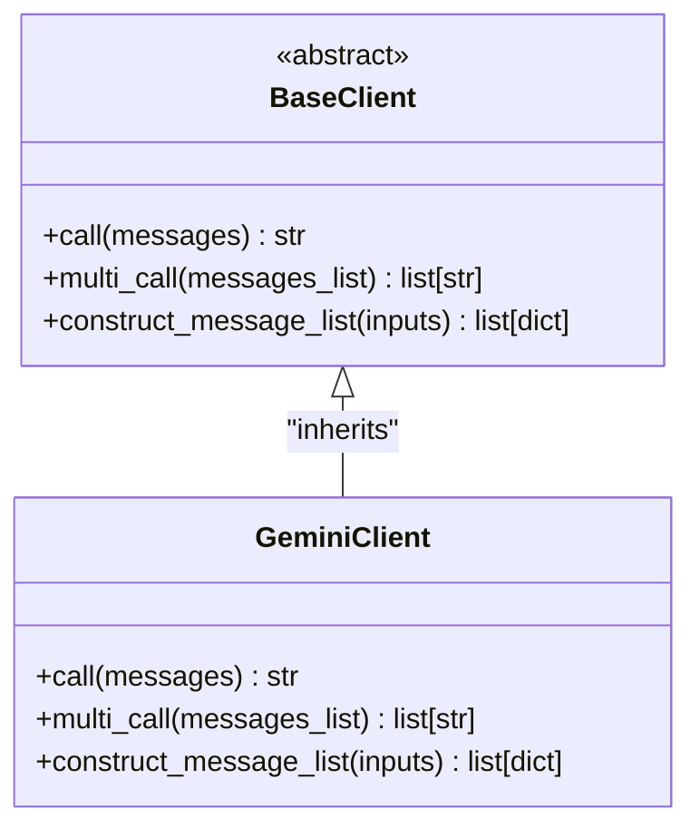
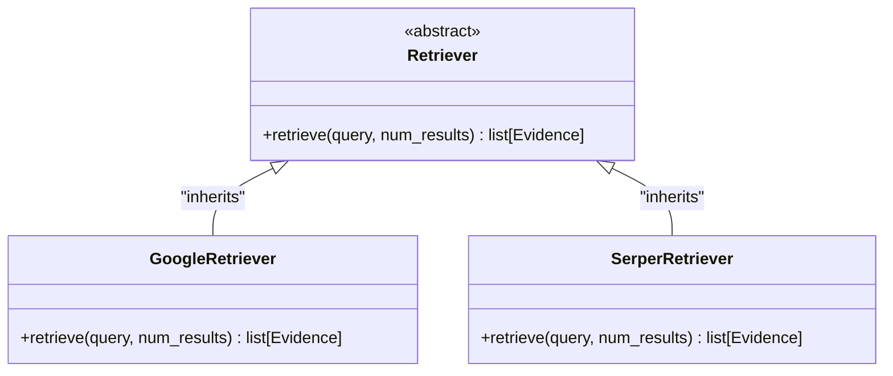
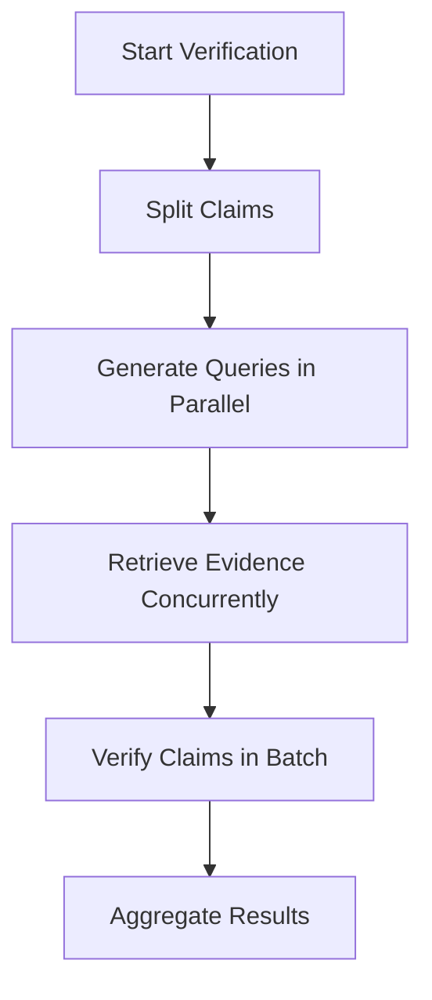

# Advanced Features

<cite>
**Referenced Files in This Document**   
- [factcheck/utils/llmclient/__init__.py](file://factcheck/utils/llmclient/__init__.py) - *Updated in commit 22*
- [factcheck/utils/llmclient/base.py](file://factcheck/utils/llmclient/base.py) - *Base client interface*
- [factcheck/utils/llmclient/gemini_client.py](file://factcheck/utils/llmclient/gemini_client.py) - *Gemini client implementation*
- [factcheck/core/Retriever/base.py](file://factcheck/core/Retriever/base.py) - *Retriever base class*
- [factcheck/utils/prompt/chatgpt_prompt_zh.py](file://factcheck/utils/prompt/chatgpt_prompt_zh.py) - *Added in commit 8*
- [factcheck/utils/prompt/base.py](file://factcheck/utils/prompt/base.py) - *Base prompt interface*
- [factcheck/utils/prompt/customized_prompt.py](file://factcheck/utils/prompt/customized_prompt.py) - *Custom prompt support*
</cite>

## Update Summary
**Changes Made**   
- Updated LLM Client Strategy Pattern section to reflect new client registration mechanism via `--client` parameter
- Enhanced Internationalization Support section with detailed analysis of Chinese prompt implementation
- Added information about dynamic client mapping through `model2client` function
- Updated section sources to reflect actual file changes in recent commits
- Removed outdated references to non-existent GPT, Claude, and local OpenAI clients

## Table of Contents
1. [Custom Prompts Implementation](#custom-prompts-implementation)
2. [LLM Client Strategy Pattern](#llm-client-strategy-pattern)
3. [Retriever Plugin System](#retriever-plugin-system)
4. [Advanced Pipeline Configurations](#advanced-pipeline-configurations)
5. [Performance Optimization Techniques](#performance-optimization-techniques)
6. [Internationalization Support](#internationalization-support)
7. [Memory Management for Long Documents](#memory-management-for-long-documents)

## Custom Prompts Implementation

The OpenFactVerification framework allows developers to implement custom prompts through the `customized_prompt.py` file. This enables tailoring the behavior of LLM interactions for specific domains or verification styles.

The prompt system follows a modular design where all prompt classes inherit from a common base class defined in `factcheck/utils/prompt/base.py`. Developers can create new prompt templates by subclassing `BasePrompt` and defining specific prompt strings for different stages of the fact-checking pipeline:

- `decompose_prompt`: For splitting documents into claims
- `verify_prompt`: For assessing claim-evidence relationships
- `qgen_prompt`: For generating search queries from claims
- `checkworthy_prompt`: For determining claim checkworthiness

```python
# Example structure in customized_prompt.py
from factcheck.utils.prompt.base import BasePrompt

class CustomPrompt(BasePrompt):
    def __init__(self):
        self.decompose_prompt = "Extract factual claims from this text: {doc}"
        self.verify_prompt = "Evaluate if this evidence supports the claim: Claim: {claim} Evidence: {evidence}"
        self.qgen_prompt = "Generate search queries to verify this claim: {claim}"
        self.checkworthy_prompt = "Determine which of these statements are verifiable facts:\n{texts}"
```

These custom prompts can then be injected into any pipeline component that accepts a prompt parameter, allowing complete control over LLM instructions.

**Section sources**
- [factcheck/utils/prompt/customized_prompt.py](file://factcheck/utils/prompt/customized_prompt.py)
- [factcheck/utils/prompt/base.py](file://factcheck/utils/prompt/base.py)

## LLM Client Strategy Pattern

The framework implements a strategy pattern for LLM clients, enabling seamless integration of multiple language model providers. The core abstraction is defined in `factcheck/utils/llmclient/base.py` with the `BaseClient` class.

All LLM clients must implement the following interface methods:
- `call(messages)`: Execute a single LLM request
- `multi_call(messages_list)`: Execute multiple LLM requests (potentially in parallel)
- `construct_message_list(inputs)`: Format input strings into the required message structure

Current implementation includes:
- `GeminiClient` in `gemini_client.py`

The client registration system has been updated to support dynamic client selection. The `CLIENTS` dictionary in `__init__.py` maps client names to their corresponding classes:

```python
# factcheck/utils/llmclient/__init__.py
CLIENTS = {
    "gemini": GeminiClient,
}
```

Additionally, the `model2client` function automatically maps model names to appropriate clients based on naming conventions:

```python
def model2client(model_name: str):
    """Map model name to corresponding client."""
    if model_name.startswith("gemini"):
        return GeminiClient
    else:
        raise ValueError(f"Model {model_name} not supported.")
```

This enhancement allows users to specify clients via command-line parameter `--client` while maintaining automatic model-to-client mapping when client is not explicitly specified.



**Diagram sources**
- [factcheck/utils/llmclient/base.py](file://factcheck/utils/llmclient/base.py)
- [factcheck/utils/llmclient/gemini_client.py](file://factcheck/utils/llmclient/gemini_client.py)

To add support for a new LLM provider, developers should:
1. Create a new client file in `factcheck/utils/llmclient/`
2. Implement the `BaseClient` interface with provider-specific API calls
3. Handle authentication, rate limiting, and error recovery
4. Register the client in `CLIENTS` dictionary in `__init__.py`
5. Update `model2client` function to recognize new model prefixes

This strategy pattern allows runtime selection of LLM providers and easy swapping between models without changing pipeline logic.

**Section sources**
- [factcheck/utils/llmclient/base.py](file://factcheck/utils/llmclient/base.py) - *Base client interface updated*
- [factcheck/utils/llmclient/__init__.py](file://factcheck/utils/llmclient/__init__.py) - *Updated in commit 22 with client registration*
- [factcheck/utils/llmclient/gemini_client.py](file://factcheck/utils/llmclient/gemini_client.py) - *Gemini client implementation*

## Retriever Plugin System

The evidence retrieval system uses a plugin architecture based on inheritance. All retrievers extend the base `Retriever` class defined in `factcheck/core/Retriever/base.py`.

Key retriever implementations:
- `GoogleRetriever`: Uses Google Custom Search API
- `SerperRetriever`: Uses Serper API for Google search results

The base class defines the contract:
```python
class Retriever:
    def retrieve(self, query: str, num_results: int = 5) -> List[Evidence]:
        pass
```

Developers can implement new evidence sources by:
1. Creating a subclass of `Retriever`
2. Implementing the `retrieve()` method with source-specific logic
3. Handling API authentication and response parsing
4. Returning structured `Evidence` objects



**Diagram sources**
- [factcheck/core/Retriever/base.py](file://factcheck/core/Retriever/base.py)
- [factcheck/core/Retriever/google_retriever.py](file://factcheck/core/Retriever/google_retriever.py)
- [factcheck/core/Retriever/serper_retriever.py](file://factcheck/core/Retriever/serper_retriever.py)

Example implementation for a hypothetical Wikipedia retriever:
```python
from factcheck.core.Retriever.base import Retriever
from factcheck.utils.data_class import Evidence

class WikipediaRetriever(Retriever):
    def retrieve(self, query: str, num_results: int = 5):
        # Implement Wikipedia API call
        # Parse results into Evidence objects
        return [Evidence(text=content, url=page_url, title=page_title) 
                for content, page_url, title in results]
```

This plugin system enables integration of diverse evidence sources while maintaining a consistent interface for the verification pipeline.

**Section sources**
- [factcheck/core/Retriever/base.py](file://factcheck/core/Retriever/base.py)

## Advanced Pipeline Configurations

The framework supports sophisticated configurations through component composition and model specialization.

### Different Models for Decomposition vs Verification

Users can configure separate LLM clients for different pipeline stages:

```python
from factcheck import FactCheck
from factcheck.utils.llmclient import GeminiClient
from factcheck.utils.prompt import CustomPrompt

# Initialize client for all tasks
decomposer_client = GeminiClient(api_key="...")
verifier_client = GeminiClient(api_key="...")

# Create specialized prompts
decompose_prompt = CustomPrompt().get_decompose_template()
verify_prompt = CustomPrompt().get_verify_template()

# Configure pipeline components individually
factchecker = FactCheck()
factchecker.decomposer.llm_client = decomposer_client
factchecker.decomposer.prompt = decompose_prompt
factchecker.verifier.llm_client = verifier_client  
factchecker.verifier.prompt = verify_prompt
```

### Chaining Multiple Retrievers

The system supports combining evidence from multiple sources:

```python
from factcheck.core.Retriever import GoogleRetriever, SerperRetriever

class HybridRetriever:
    def __init__(self):
        self.retrievers = [GoogleRetriever(), SerperRetriever()]
    
    def retrieve(self, query, num_results=5):
        all_evidence = []
        per_source = num_results // len(self.retrievers)
        
        for retriever in self.retrievers:
            results = retriever.retrieve(query, per_source)
            all_evidence.extend(results)
            
        return all_evidence[:num_results]  # Trim to desired number
```

This approach increases evidence diversity and coverage.

**Section sources**
- [factcheck/core/Decompose.py](file://factcheck/core/Decompose.py)
- [factcheck/core/ClaimVerify.py](file://factcheck/core/ClaimVerify.py)
- [factcheck/core/QueryGenerator.py](file://factcheck/core/QueryGenerator.py)

## Performance Optimization Techniques

### Caching LLM Responses

Implement response caching to avoid redundant LLM calls:

```python
import functools
import hashlib

def llm_cache(client_method):
    cache = {}
    
    @functools.wraps(client_method)
    def wrapper(self, messages):
        # Create cache key from messages
        key = hashlib.md5(str(messages).encode()).hexdigest()
        
        if key not in cache:
            cache[key] = client_method(self, messages)
        return cache[key]
    return wrapper

# Apply to LLM client methods
GeminiClient.call = llm_cache(GeminiClient.call)
```

### Parallelizing Evidence Retrieval

The `multi_call` method in LLM clients enables parallel processing:



The `QueryGenerator.generate_query()` method already uses `multi_call` to process multiple claims simultaneously, significantly reducing total processing time.

For evidence retrieval, implement asynchronous calls:

```python
import asyncio
import aiohttp

class AsyncSerperRetriever(SerperRetriever):
    async def async_retrieve(self, query):
        async with aiohttp.ClientSession() as session:
            # Implement async API call
            return await self._fetch_results(session, query)
    
    async def retrieve_all(self, queries):
        tasks = [self.async_retrieve(q) for q in queries]
        return await asyncio.gather(*tasks)
```

**Section sources**
- [factcheck/core/ClaimVerify.py](file://factcheck/core/ClaimVerify.py)
- [factcheck/core/QueryGenerator.py](file://factcheck/core/QueryGenerator.py)
- [factcheck/utils/llmclient/base.py](file://factcheck/utils/llmclient/base.py)

## Internationalization Support

The framework supports multiple languages through dedicated prompt files. The Chinese prompt implementation in `chatgpt_prompt_zh.py` demonstrates this approach:

```python
class ChatGPTPromptZH:
    decompose_prompt = decompose_prompt_zh
    checkworthy_prompt = checkworthy_prompt_zh
    qgen_prompt = qgen_prompt_zh
    verify_prompt = verify_prompt_zh
```

Each prompt template is carefully designed for Chinese language processing:

- `decompose_prompt_zh`: Instructs model to extract atomic claims with specific formatting requirements
- `checkworthy_prompt_zh`: Evaluates verifiability of statements with Chinese-specific examples
- `qgen_prompt_zh`: Generates verification questions in Chinese
- `verify_prompt_zh`: Assesses claim-evidence relationships with Chinese reasoning

Usage:
```python
from factcheck.utils.prompt import chatgpt_prompt_zh

factchecker = FactCheck()
factchecker.decomposer.prompt = chatgpt_prompt_zh.ChatGPTPromptZH()
factchecker.verifier.prompt = chatgpt_prompt_zh.ChatGPTPromptZH()
```

This pattern allows complete localization of the verification process by providing language-specific prompts while maintaining the same underlying pipeline architecture. The addition of Chinese support (commit #21) demonstrates the extensibility of this approach for multilingual fact-checking applications.

**Section sources**
- [factcheck/utils/prompt/chatgpt_prompt_zh.py](file://factcheck/utils/prompt/chatgpt_prompt_zh.py) - *Added in commit 8*
- [factcheck/utils/prompt/base.py](file://factcheck/utils/prompt/base.py)

## Memory Management for Long Documents

When processing lengthy texts with numerous claims, memory optimization is crucial:

### Claim Processing in Batches

Process claims in manageable chunks:

```python
def process_in_batches(claims, batch_size=10):
    results = []
    for i in range(0, len(claims), batch_size):
        batch = claims[i:i + batch_size]
        batch_results = verify_claims_batch(batch)
        results.extend(batch_results)
        # Clear intermediate references
        del batch_results
    return results
```

### Streaming Response Handling

Modify components to yield results incrementally:

```python
class StreamingClaimVerifier(ClaimVerify):
    def verify_claims_streaming(self, claim_evidences_dict):
        for claim, evidences in claim_evidences_dict.items():
            result = self._verify_single_claim(claim, evidences)
            yield {claim: result}
            # Explicitly release memory
            del result
```

### Object Lifecycle Management

Ensure proper cleanup of large objects:

```python
class MemoryEfficientFactCheck(FactCheck):
    def check_response(self, text):
        try:
            # Process pipeline stages
            claims = self.decomposer.getclaims(text)
            queries = self.query_generator.generate_query(claims)
            evidences = self.retriever.retrieve(queries)
            results = self.verifier.verify_claims(evidences)
            return results
        finally:
            # Explicitly clear large intermediate objects
            if 'claims' in locals():
                del claims
            if 'queries' in locals():
                del queries
            if 'evidences' in locals():
                del evidences
```

These strategies prevent memory exhaustion when handling documents with hundreds of claims.

**Section sources**
- [factcheck/core/Decompose.py](file://factcheck/core/Decompose.py)
- [factcheck/core/ClaimVerify.py](file://factcheck/core/ClaimVerify.py)
- [factcheck/core/QueryGenerator.py](file://factcheck/core/QueryGenerator.py)