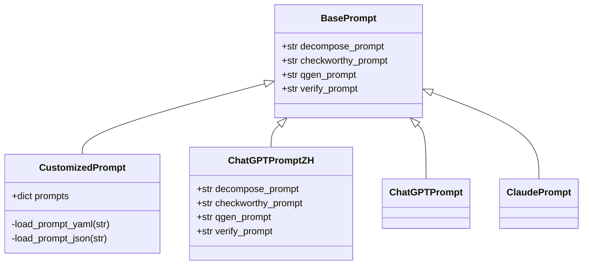
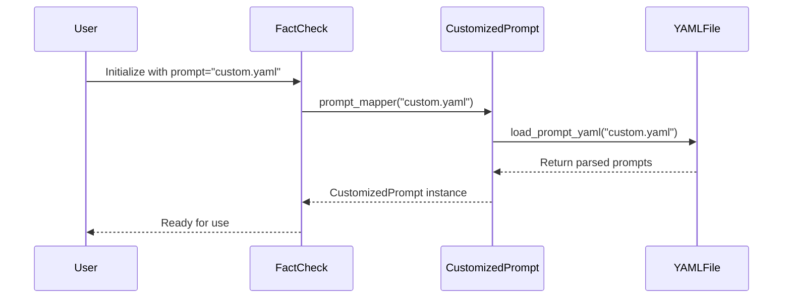
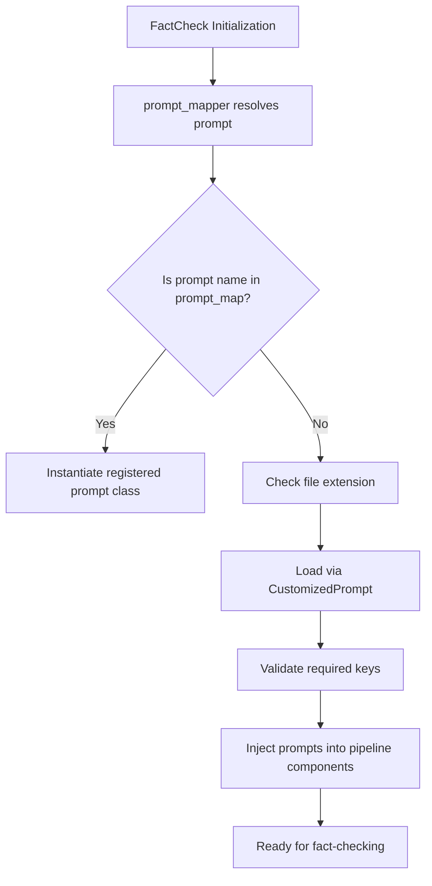

# Custom Prompt Engineering

<cite>
**Referenced Files in This Document**   
- [sample_prompt.yaml](file://factcheck/config/sample_prompt.yaml)
- [base.py](file://factcheck/utils/prompt/base.py)
- [customized_prompt.py](file://factcheck/utils/prompt/customized_prompt.py)
- [chatgpt_prompt_zh.py](file://factcheck/utils/prompt/chatgpt_prompt_zh.py)
- [api_config.py](file://factcheck/utils/api_config.py)
- [__init__.py](file://factcheck/utils/prompt/__init__.py)
</cite>

## Table of Contents
1. [Introduction](#introduction)
2. [Prompt System Architecture](#prompt-system-architecture)
3. [YAML-Based Prompt Templates](#yaml-based-prompt-templates)
4. [Creating Custom Prompts](#creating-custom-prompts)
5. [Multi-Language Prompt Support](#multi-language-prompt-support)
6. [Integration with FactCheck Pipeline](#integration-with-factcheck-pipeline)
7. [Security and Performance Considerations](#security-and-performance-considerations)

## Introduction
The OpenFactVerification system enables full customization of Large Language Model (LLM) interactions through its modular prompt engineering framework. This document details how users can customize prompts across all stages of the fact-checking pipeline: claim decomposition, checkworthiness assessment, query generation, and claim verification. The system supports both built-in prompt templates and user-defined configurations via YAML or JSON files, allowing for flexible adaptation to different use cases, languages, and LLM requirements.

**Section sources**
- [sample_prompt.yaml](file://factcheck/config/sample_prompt.yaml#L1-L107)
- [base.py](file://factcheck/utils/prompt/base.py#L1-L10)

## Prompt System Architecture
The prompt system is designed around a pluggable architecture that allows dynamic selection and loading of prompt templates. At the core is the `BasePrompt` class, which defines the standard interface for all prompt configurations. Different implementations extend this base to provide specialized prompt sets for various models and languages.

The `prompt_mapper` function in `__init__.py` serves as the factory for prompt instances, routing requests based on the provided prompt name. It supports both predefined prompt classes (like `ChatGPTPrompt`) and dynamically loaded configurations from YAML/JSON files.



**Diagram sources**
- [base.py](file://factcheck/utils/prompt/base.py#L1-L10)
- [customized_prompt.py](file://factcheck/utils/prompt/customized_prompt.py#L1-L33)
- [chatgpt_prompt_zh.py](file://factcheck/utils/prompt/chatgpt_prompt_zh.py#L1-L115)

**Section sources**
- [base.py](file://factcheck/utils/prompt/base.py#L1-L10)
- [__init__.py](file://factcheck/utils/prompt/__init__.py#L1-L18)

## YAML-Based Prompt Templates
The system uses YAML files to define structured prompt templates for each processing phase. The `sample_prompt.yaml` file provides a comprehensive example of this structure, containing four key prompts:

- **decompose_prompt**: Instructs the LLM to break down text into atomic, context-independent claims
- **checkworthy_prompt**: Guides evaluation of whether a statement contains verifiable factual content
- **qgen_prompt**: Specifies how to generate targeted questions for evidence retrieval
- **verify_prompt**: Defines the format for assessing claim accuracy against evidence

Each prompt includes detailed instructions, output formatting requirements, and examples to ensure consistent LLM behavior. The template system uses `{variable}` syntax for dynamic content insertion during runtime.

```yaml
decompose_prompt: |
  Your task is to decompose the text into atomic claims.
  The answer should be a JSON with a single key "claims", with the value of a list of strings...
  Text: {doc}
  Output:
```

The structured format ensures that prompts are both human-readable and machine-processable, facilitating easy modification and version control.

**Section sources**
- [sample_prompt.yaml](file://factcheck/config/sample_prompt.yaml#L1-L107)

## Creating Custom Prompts
Users can create fully customized prompts by extending the `CustomizedPrompt` class or by providing external configuration files. The recommended approach is to create a YAML or JSON file that follows the expected schema.

To create a custom prompt via `customized_prompt.py`, follow these steps:

1. Create a YAML file with the required prompt keys:
```yaml
decompose_prompt: "Custom instruction for claim decomposition..."
checkworthy_prompt: "Custom instruction for checkworthiness assessment..."
qgen_prompt: "Custom instruction for query generation..."
verify_prompt: "Custom instruction for claim verification..."
```

2. Register and use the custom prompt:
```python
from factcheck import FactCheck

# Initialize with custom prompt file
factcheck_instance = FactCheck(prompt="path/to/custom_prompt.yaml")

# Execute fact-checking pipeline
results = factcheck_instance.check_text("Your text here")
```

The `CustomizedPrompt` class validates that all required keys are present and loads the content appropriately based on file type. This approach allows for complete control over LLM instructions without modifying source code.



**Diagram sources**
- [customized_prompt.py](file://factcheck/utils/prompt/customized_prompt.py#L1-L33)
- [__init__.py](file://factcheck/utils/prompt/__init__.py#L1-L18)

**Section sources**
- [customized_prompt.py](file://factcheck/utils/prompt/customized_prompt.py#L1-L33)

## Multi-Language Prompt Support
The system supports internationalization through language-specific prompt implementations. The `chatgpt_prompt_zh.py` file demonstrates this capability by providing Chinese-language prompts for all processing stages.

The multi-language approach follows a consistent pattern:
- Language-specific prompt strings are defined as module-level variables
- A dedicated class (e.g., `ChatGPTPromptZH`) inherits from `BasePrompt`
- The class assigns language-specific strings to the standard prompt attributes
- The prompt mapper registers the class under a language-specific name

This design enables seamless switching between languages while maintaining the same interface and functionality. Users can select the appropriate prompt by specifying the language code in the configuration:

```python
# Use Chinese prompts
factcheck_zh = FactCheck(prompt="chatgpt_prompt_zh")
```

The system can be extended to support additional languages by creating new modules following the same pattern, ensuring consistent behavior across all supported languages.

**Section sources**
- [chatgpt_prompt_zh.py](file://factcheck/utils/prompt/chatgpt_prompt_zh.py#L1-L115)

## Integration with FactCheck Pipeline
Custom prompts integrate seamlessly with the main FactCheck pipeline through the `prompt` parameter in the `FactCheck` constructor. The `api_config.py` file demonstrates how configuration management supports this integration by handling API keys and other settings that may affect prompt behavior.

When a `FactCheck` instance is created, the system:
1. Resolves the prompt specification using `prompt_mapper`
2. Loads the appropriate prompt configuration
3. Injects the prompt object into all pipeline components
4. Ensures consistent prompt usage across decomposition, checkworthiness, query generation, and verification stages

The integration ensures that all LLM interactions throughout the pipeline use the same prompt configuration, maintaining consistency and enabling end-to-end customization.



**Diagram sources**
- [api_config.py](file://factcheck/utils/api_config.py#L1-L31)
- [__init__.py](file://factcheck/__init__.py#L1-L238)

**Section sources**
- [api_config.py](file://factcheck/utils/api_config.py#L1-L31)
- [__init__.py](file://factcheck/__init__.py#L1-L238)

## Security and Performance Considerations
When working with custom prompts, several important considerations ensure system reliability and security:

### Prompt Injection Risks
Custom prompts must be carefully validated to prevent injection attacks. The system mitigates this risk by:
- Using structured data formats (YAML/JSON) with schema validation
- Isolating user-provided content from code execution
- Validating all required prompt keys before use

### Token Overflow Mitigation
To prevent excessive token usage:
- Keep prompts concise while maintaining clarity
- Use the `less than 15 words` guideline for claim decomposition
- Monitor token counts through the `encoding` attribute in `FactCheck`
- Implement retries with `num_seed_retries` parameter for failed generations

### Consistency Across Chained Calls
Maintain consistency by:
- Using the same prompt configuration across all pipeline stages
- Preserving context through structured JSON output formats
- Validating output formats before passing between stages

### Performance Optimization
For optimal performance:
- Pre-compile frequently used prompt templates
- Cache resolved prompt instances
- Use parallel execution for independent pipeline stages (as shown in `check_text` method)
- Monitor usage metrics through the `PipelineUsage` dataclass

These practices ensure that custom prompts enhance functionality without compromising system stability, security, or performance.

**Section sources**
- [base.py](file://factcheck/utils/prompt/base.py#L1-L10)
- [customized_prompt.py](file://factcheck/utils/prompt/customized_prompt.py#L1-L33)
- [__init__.py](file://factcheck/__init__.py#L1-L238)