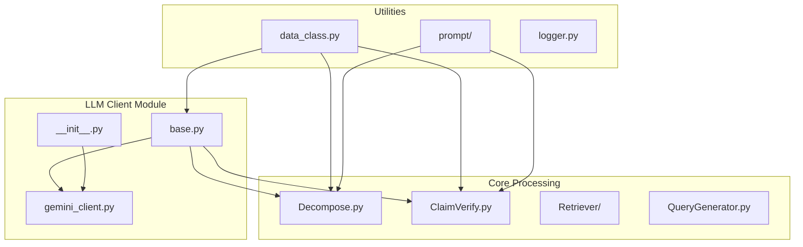
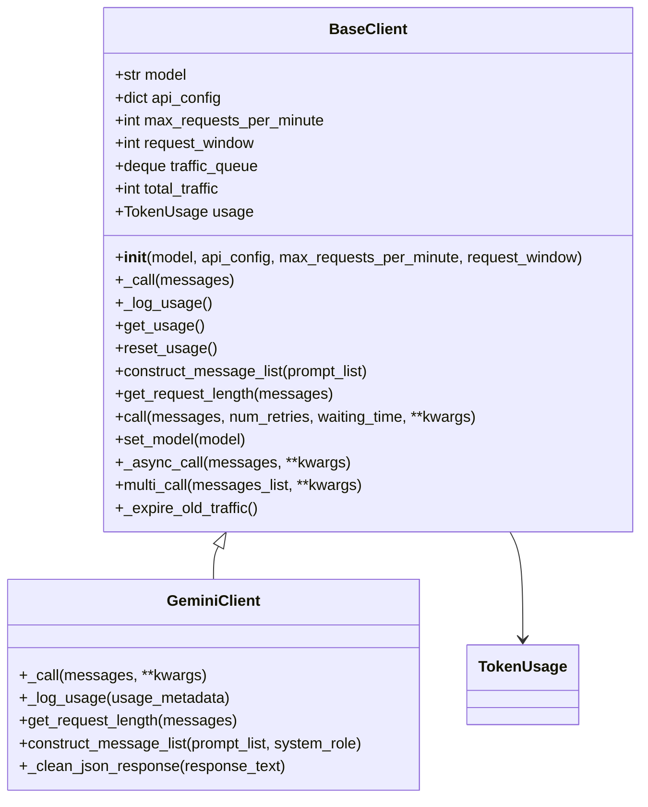
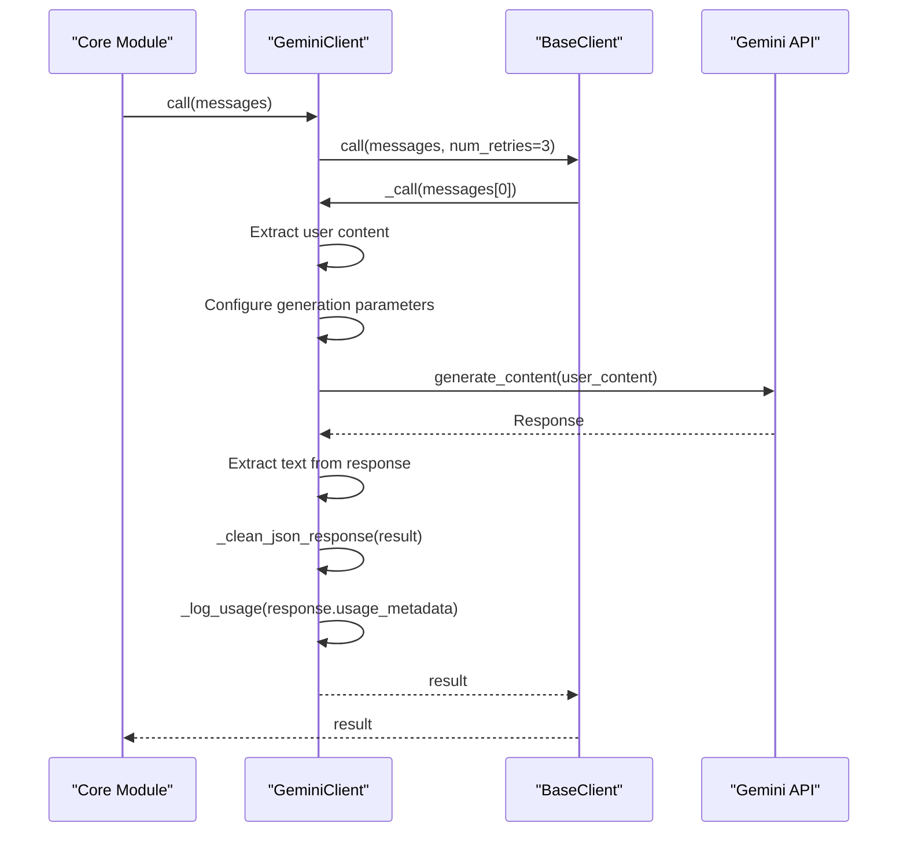
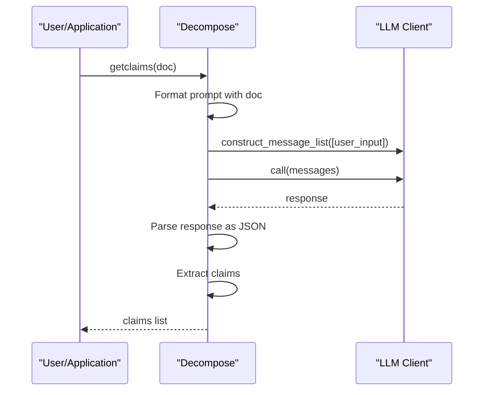
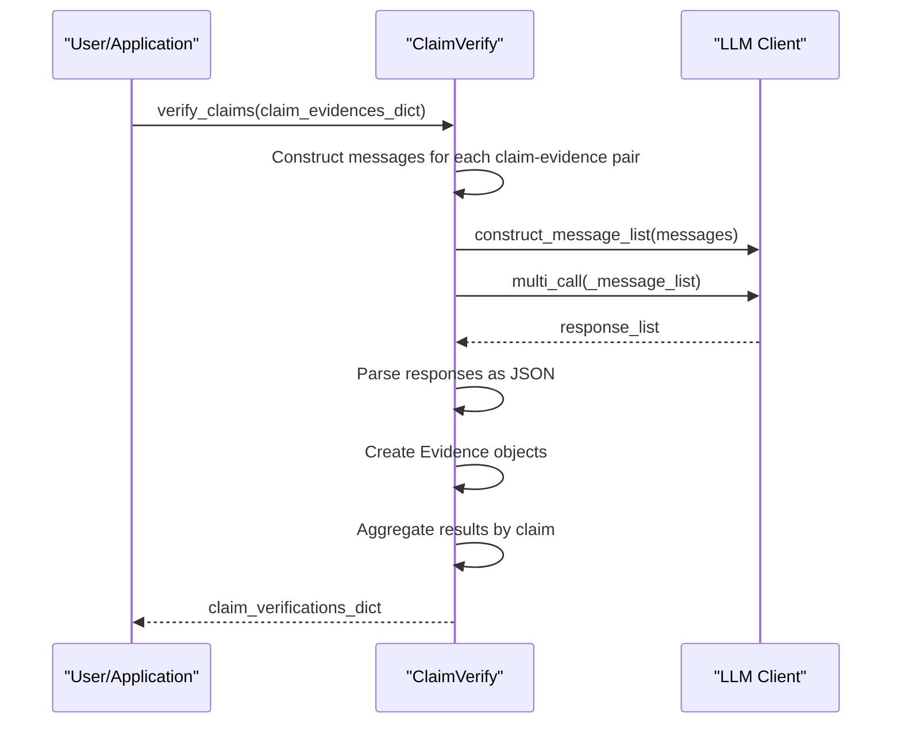
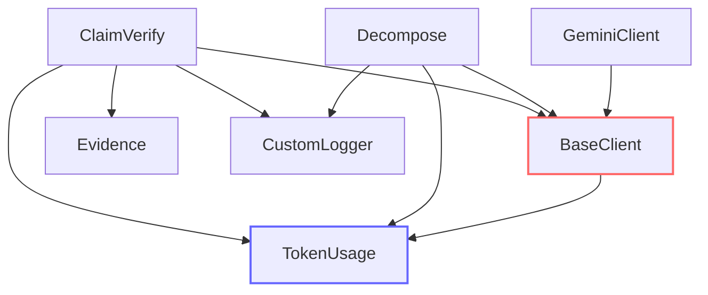
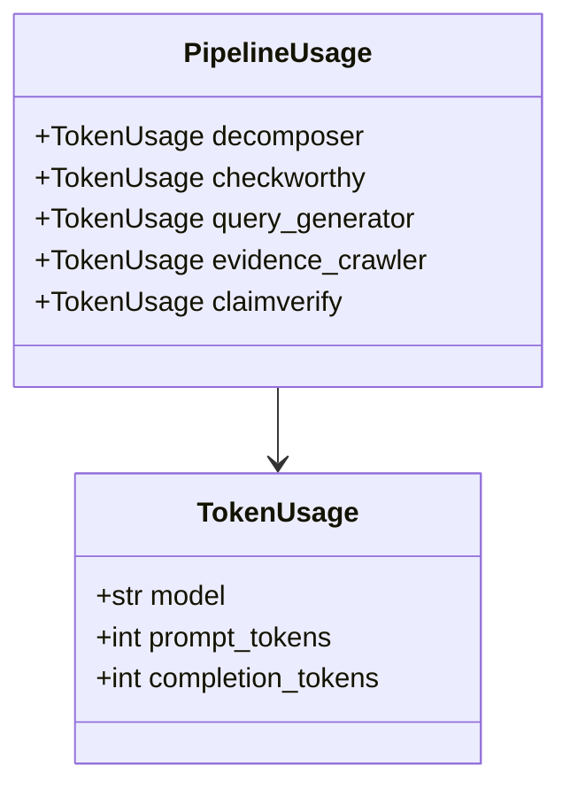

# LLM Client Integration

<cite>
**Referenced Files in This Document**   
- [factcheck/utils/llmclient/base.py](file://factcheck/utils/llmclient/base.py) - *Updated in commit 22: Refactored client system to support multiple client types with unified interface*
- [factcheck/utils/llmclient/gemini_client.py](file://factcheck/utils/llmclient/gemini_client.py) - *Updated in commit 2: Added Gemini client with rate limiting, response parsing, and markdown cleaning*
- [factcheck/utils/llmclient/__init__.py](file://factcheck/utils/llmclient/__init__.py) - *Updated in commits 2 and 22: Client registration and model-to-client mapping*
- [factcheck/core/Decompose.py](file://factcheck/core/Decompose.py) - *Core module using LLM client for claim extraction*
- [factcheck/core/ClaimVerify.py](file://factcheck/core/ClaimVerify.py) - *Core module using LLM client for claim verification*
- [factcheck/utils/data_class.py](file://factcheck/utils/data_class.py) - *TokenUsage and PipelineUsage dataclasses for tracking*
</cite>

## Update Summary
**Changes Made**   
- Updated documentation to reflect refactored client system supporting multiple LLM providers
- Added details on Gemini client's response cleaning and markdown handling
- Enhanced error handling and response parsing documentation based on code changes
- Updated client registration mechanism via `__init__.py` and `model2client` function
- Revised architecture overview to reflect current client extensibility model
- Added new section on response cleaning functionality in Gemini client

## Table of Contents
1. [Introduction](#introduction)
2. [Project Structure](#project-structure)
3. [Core Components](#core-components)
4. [Architecture Overview](#architecture-overview)
5. [Detailed Component Analysis](#detailed-component-analysis)
6. [Dependency Analysis](#dependency-analysis)
7. [Performance Considerations](#performance-considerations)
8. [Troubleshooting Guide](#troubleshooting-guide)
9. [Conclusion](#conclusion)

## Introduction
This document provides a comprehensive analysis of the LLM Client Integration sub-feature in the OpenFactVerification system. It details the strategy pattern implementation that enables pluggable LLM providers, the abstract BaseLLMClient interface, and how clients integrate with core modules. The documentation covers extension mechanisms, error handling, authentication, and performance considerations when using different LLM backends.

## Project Structure
The LLM client integration is organized within the `factcheck/utils/llmclient` directory, which contains the base interface and concrete implementations for different LLM providers. The core functionality is distributed across several key modules:

- `llmclient/`: Contains the pluggable LLM client architecture
  - `base.py`: Defines the abstract `BaseClient` interface
  - `gemini_client.py`: Reference implementation for Google's Gemini
  - `__init__.py`: Client registration and model-to-client mapping
- `core/`: Core processing modules that use LLM clients
  - `Decompose.py`: Uses LLM to break documents into claims
  - `ClaimVerify.py`: Uses LLM to verify claims against evidence
- `utils/data_class.py`: Defines data structures for tracking usage and results



**Diagram sources**
- [factcheck/utils/llmclient/base.py](file://factcheck/utils/llmclient/base.py)
- [factcheck/utils/llmclient/gemini_client.py](file://factcheck/utils/llmclient/gemini_client.py)
- [factcheck/core/Decompose.py](file://factcheck/core/Decompose.py)
- [factcheck/core/ClaimVerify.py](file://factcheck/core/ClaimVerify.py)

## Core Components
The LLM client integration system is built around a strategy pattern that allows pluggable LLM providers. The core components include the abstract `BaseClient` interface, concrete client implementations, and core processing modules that utilize these clients.

The `BaseClient` class in `base.py` defines the contract that all LLM clients must implement, including methods for making API calls, constructing message lists, and tracking usage. Concrete implementations like `GeminiClient` provide provider-specific logic while adhering to this interface.

Core modules such as `Decompose` and `ClaimVerify` depend on the `BaseClient` interface rather than concrete implementations, enabling dependency injection and easy swapping of LLM providers without modifying the core logic.

**Section sources**
- [factcheck/utils/llmclient/base.py](file://factcheck/utils/llmclient/base.py)
- [factcheck/core/Decompose.py](file://factcheck/core/Decompose.py)
- [factcheck/core/ClaimVerify.py](file://factcheck/core/ClaimVerify.py)

## Architecture Overview
The LLM client integration follows a clean separation of concerns with a well-defined interface between the LLM abstraction layer and the core fact-checking pipeline. The architecture enables multiple LLM providers to be used interchangeably while maintaining consistent behavior across the system.

```mermaid
graph TB
subgraph "LLM Providers"
Gemini[Gemini API]
GPT[GPT API]
Claude[Claude API]
Local[Local LLM]
end
subgraph "LLM Client Layer"
Base[BaseClient]
GeminiClient[GeminiClient]
GPTClient[GPTClient]
ClaudeClient[ClaudeClient]
LocalClient[LocalOpenAIClient]
end
subgraph "Core Pipeline"
Decompose[Decompose]
ClaimVerify[ClaimVerify]
QueryGenerator[QueryGenerator]
Retriever[Retriever]
end
subgraph "Data & Utilities"
Usage[PipelineUsage]
Token[TokenUsage]
Evidence[Evidence]
Logger[CustomLogger]
end
Gemini --> GeminiClient
GPT --> GPTClient
Claude --> ClaudeClient
Local --> LocalClient
Base <|-- GeminiClient
Base <|-- GPTClient
Base <|-- ClaudeClient
Base <|-- LocalClient
Base --> Decompose
Base --> ClaimVerify
Usage --> Decompose
Usage --> ClaimVerify
Token --> Usage
Evidence --> ClaimVerify
Logger --> Decompose
Logger --> ClaimVerify
style Base stroke:#f66,stroke-width:2px
style Usage stroke:#66f,stroke-width:2px
```

**Diagram sources**
- [factcheck/utils/llmclient/base.py](file://factcheck/utils/llmclient/base.py)
- [factcheck/utils/llmclient/gemini_client.py](file://factcheck/utils/llmclient/gemini_client.py)
- [factcheck/core/Decompose.py](file://factcheck/core/Decompose.py)
- [factcheck/core/ClaimVerify.py](file://factcheck/core/ClaimVerify.py)
- [factcheck/utils/data_class.py](file://factcheck/utils/data_class.py)

## Detailed Component Analysis

### Base Client Interface Analysis
The `BaseClient` class implements the strategy pattern by defining an abstract interface that all LLM providers must implement. This enables the system to support multiple LLM backends while maintaining a consistent API for the rest of the application.



**Diagram sources**
- [factcheck/utils/llmclient/base.py](file://factcheck/utils/llmclient/base.py)

**Section sources**
- [factcheck/utils/llmclient/base.py](file://factcheck/utils/llmclient/base.py)

#### Key Methods in BaseClient
- **`_call(messages)`**: Abstract method that must be implemented by subclasses to make the actual API call to the LLM provider
- **`_log_usage()`**: Abstract method for logging token usage specific to each provider's response format
- **`construct_message_list(prompt_list)`**: Abstract method for formatting messages according to provider requirements
- **`get_request_length(messages)`**: Abstract method for determining the size of a request for rate limiting purposes
- **`call(messages, num_retries=3, waiting_time=1, **kwargs)`**: Synchronous method with built-in retry logic that wraps the abstract `_call` method
- **`_async_call(messages, **kwargs)`**: Asynchronous method that enforces rate limits using a sliding window algorithm
- **`multi_call(messages_list, **kwargs)`**: Method for making multiple concurrent calls using asyncio

The base class also implements rate limiting through a sliding window algorithm using the `traffic_queue` deque to track recent requests and enforce the `max_requests_per_minute` limit.

### Gemini Client Implementation Analysis
The `GeminiClient` provides a concrete implementation of the `BaseClient` interface for Google's Gemini API. It demonstrates how to extend the system with a new LLM provider.



**Diagram sources**
- [factcheck/utils/llmclient/gemini_client.py](file://factcheck/utils/llmclient/gemini_client.py)

**Section sources**
- [factcheck/utils/llmclient/gemini_client.py](file://factcheck/utils/llmclient/gemini_client.py)

#### Required Overrides in GeminiClient
When extending the system with a new LLM provider, the following methods must be implemented:

- **`__init__(self, model, api_config, max_requests_per_minute, request_window)`**: Initialize the client with provider-specific configuration. The Gemini implementation sets up the Google Generative AI client with the API key from `api_config`.
- **`_call(self, messages, **kwargs)`**: Implement the actual API call to the LLM provider. The Gemini implementation extracts the user message, configures generation parameters, and handles the API response.
- **`_log_usage(self, usage_metadata)`**: Parse and log token usage from the provider's response format. The Gemini implementation extracts `prompt_token_count` and `candidates_token_count` from the usage metadata.
- **`get_request_length(self, messages)`**: Return a value representing the size of the request for rate limiting. The Gemini implementation returns 1 for simplicity.
- **`construct_message_list(self, prompt_list, system_role)`**: Format messages according to the provider's requirements. The Gemini implementation combines the system role with each prompt since Gemini doesn't use separate system messages.

#### Error Handling Patterns
The `GeminiClient` implements robust error handling:
- Input validation with assertions (e.g., seed must be an integer)
- Try-catch blocks around API calls with descriptive error messages
- Response validation to ensure valid content is returned
- Fallback mechanisms for malformed responses (e.g., `_clean_json_response`)

#### Authentication Mechanism
The Gemini client uses API key authentication:
```python
genai.configure(api_key=self.api_config["GEMINI_API_KEY"])
```
The API key is passed through the `api_config` dictionary, which is loaded from a configuration file, keeping credentials out of the codebase.

#### Response Cleaning Functionality
The Gemini client includes a new `_clean_json_response` method to handle common response formatting issues:
```python
def _clean_json_response(self, response_text):
    """Clean up Gemini response by removing markdown code blocks"""
    import re
    cleaned = re.sub(r'```(?:json)?\s*([\s\S]*?)\s*```', r'\1', response_text.strip())
    cleaned = cleaned.strip()
    return cleaned
```
This method removes markdown code block wrappers (```json ... ``` or ``` ... ```) that Gemini sometimes includes in its responses, ensuring clean JSON output for parsing.

### Core Module Integration Analysis
The LLM clients integrate with the main pipeline through dependency injection in core modules like `Decompose` and `ClaimVerify`.

#### Decompose Module Integration


**Diagram sources**
- [factcheck/core/Decompose.py](file://factcheck/core/Decompose.py)

**Section sources**
- [factcheck/core/Decompose.py](file://factcheck/core/Decompose.py)

The `Decompose` class uses dependency injection to accept any `BaseClient` implementation:
```python
def __init__(self, llm_client, prompt):
    self.llm_client = llm_client
    self.prompt = prompt
```

It uses the client to:
1. Construct message lists using `construct_message_list`
2. Make synchronous calls with retry logic using `call`
3. Handle responses and parse claims from JSON output
4. Clean responses using client-specific cleaning methods when needed

#### ClaimVerify Module Integration


**Diagram sources**
- [factcheck/core/ClaimVerify.py](file://factcheck/core/ClaimVerify.py)

**Section sources**
- [factcheck/core/ClaimVerify.py](file://factcheck/core/ClaimVerify.py)

The `ClaimVerify` class similarly uses dependency injection:
```python
def __init__(self, llm_client, prompt):
    self.llm_client = llm_client
    self.prompt = prompt
```

It demonstrates advanced usage patterns:
- Batch processing with `multi_call` for efficiency
- Concurrent asynchronous requests
- Complex response parsing with validation
- Fallback mechanisms when parsing fails

### Configuration and Model Selection
The system supports configuring different models for different stages of processing:

```python
# Example configuration
decomposer_client = GPTClient(model="gpt-4-turbo")
verifier_client = ClaudeClient(model="claude-3-opus-20240229")

decomposer = Decompose(llm_client=decomposer_client, prompt=decompose_prompt)
claim_verifier = ClaimVerify(llm_client=verifier_client, prompt=verify_prompt)
```

This enables optimization of cost and performance by using:
- High-accuracy models (e.g., GPT-4) for decomposition where precision is critical
- Cost-effective models (e.g., Claude) for verification where multiple calls are made
- Specialized models for specific tasks

The client system is extensible through the `__init__.py` file which registers available clients:
```python
CLIENTS = {
    "gemini": GeminiClient,
}

def model2client(model_name: str):
    """Map model name to corresponding client."""
    if model_name.startswith("gemini"):
        return GeminiClient
    else:
        raise ValueError(f"Model {model_name} not supported.")
```

## Dependency Analysis
The LLM client integration system has a well-defined dependency structure that enables loose coupling and high cohesion.



**Diagram sources**
- [factcheck/utils/llmclient/base.py](file://factcheck/utils/llmclient/base.py)
- [factcheck/utils/llmclient/gemini_client.py](file://factcheck/utils/llmclient/gemini_client.py)
- [factcheck/core/Decompose.py](file://factcheck/core/Decompose.py)
- [factcheck/core/ClaimVerify.py](file://factcheck/core/ClaimVerify.py)
- [factcheck/utils/data_class.py](file://factcheck/utils/data_class.py)

Key dependency relationships:
- All concrete LLM clients depend on `BaseClient` (inheritance)
- Core modules depend on `BaseClient` interface (dependency injection)
- Both clients and core modules depend on `TokenUsage` for tracking
- `ClaimVerify` depends on `Evidence` dataclass for structured output
- All modules use `CustomLogger` for consistent logging

The system avoids circular dependencies and maintains a clear direction of dependencies from concrete implementations to abstractions.

## Performance Considerations
When switching between LLM backends, several performance considerations must be addressed:

### Rate Limiting and Retry Logic
The `BaseClient` implements a sliding window rate limiter:
- Configurable `max_requests_per_minute` and `request_window`
- Traffic queue that expires old requests
- Automatic retry logic with exponential backoff potential

```python
def _expire_old_traffic(self):
    current_time = time.time()
    while self.traffic_queue and self.traffic_queue[0][0] + self.request_window < current_time:
        self.total_traffic -= self.traffic_queue.popleft()[1]
```

Different providers have different rate limits (e.g., Gemini defaults to 15 RPM), which can be configured per client instance.

### Token Usage Tracking
The system tracks token usage through the `PipelineUsage` dataclass:



**Diagram sources**
- [factcheck/utils/data_class.py](file://factcheck/utils/data_class.py)

This enables:
- Cost monitoring and optimization
- Performance benchmarking across providers
- Quota management
- Detailed usage reporting

### Memory and Latency Considerations
When switching between LLM backends, consider:

| Provider | Latency | Memory | Cost | Best Use Case |
|---------|--------|--------|------|---------------|
| GPT-4 | High | High | High | Complex decomposition |
| Claude | Medium | Medium | Medium | Balanced verification |
| Gemini | Low-Medium | Low | Low | High-volume tasks |
| Local | Variable | High | Low | Privacy-sensitive tasks |

Key trade-offs:
- **Latency**: Cloud APIs add network overhead but benefit from optimized infrastructure
- **Memory**: Larger models require more memory, especially for long contexts
- **Cost**: Premium models cost more per token but may reduce total cost through higher accuracy
- **Reliability**: Cloud providers offer SLAs but depend on internet connectivity

The asynchronous `multi_call` method helps mitigate latency by processing multiple requests concurrently, making it particularly valuable for the `ClaimVerify` stage which processes many claim-evidence pairs.

## Troubleshooting Guide
Common issues and solutions when working with the LLM client integration:

### Authentication Errors
**Symptoms**: "API key not found", "Authentication failed"
**Solutions**:
- Verify API keys are present in `api_config.yaml`
- Check environment variables if used
- Ensure correct key names (e.g., "GEMINI_API_KEY")
- Validate key format and permissions

### Rate Limiting Issues
**Symptoms**: "Too many requests", "Rate limit exceeded"
**Solutions**:
- Adjust `max_requests_per_minute` in client configuration
- Implement longer retry delays
- Add jitter to retry intervals
- Monitor `traffic_queue` size

### Response Parsing Errors
**Symptoms**: "Parse LLM response error", "Invalid JSON"
**Solutions**:
- Add robust error handling in `_call` methods
- Implement response cleaning (like `_clean_json_response`)
- Use multiple retry attempts with different seeds
- Provide fallback mechanisms (e.g., regex extraction)

### Token Usage Tracking Problems
**Symptoms**: "Usage not logged", "Incorrect token counts"
**Solutions**:
- Verify `_log_usage` is called in `_call` implementation
- Check provider-specific usage metadata format
- Validate field names in usage metadata
- Implement defensive programming with hasattr checks

### Performance Bottlenecks
**Symptoms**: Slow processing, timeouts
**Solutions**:
- Use `multi_call` for batch operations
- Optimize prompt length
- Choose appropriate models for task complexity
- Monitor and tune rate limiting parameters

**Section sources**
- [factcheck/utils/llmclient/base.py](file://factcheck/utils/llmclient/base.py)
- [factcheck/utils/llmclient/gemini_client.py](file://factcheck/utils/llmclient/gemini_client.py)
- [factcheck/core/Decompose.py](file://factcheck/core/Decompose.py)
- [factcheck/core/ClaimVerify.py](file://factcheck/core/ClaimVerify.py)

## Conclusion
The LLM client integration system in OpenFactVerification provides a robust, extensible architecture for pluggable LLM providers. By implementing the strategy pattern with the `BaseClient` abstract class, the system enables seamless integration of multiple LLM backends while maintaining a consistent interface for the core fact-checking pipeline.

Key strengths of the design include:
- Clear separation of concerns between interface and implementation
- Built-in rate limiting and retry logic
- Comprehensive token usage tracking
- Dependency injection for flexible composition
- Asynchronous processing for improved performance

The reference implementation with `GeminiClient` demonstrates how to extend the system with new providers, handling authentication, error management, and provider-specific formatting requirements. Integration with core modules like `Decompose` and `ClaimVerify` shows how the abstraction enables sophisticated workflows with batch processing and concurrent execution.

When deploying the system, careful consideration should be given to model selection, rate limiting configuration, and performance optimization based on specific use cases and requirements.