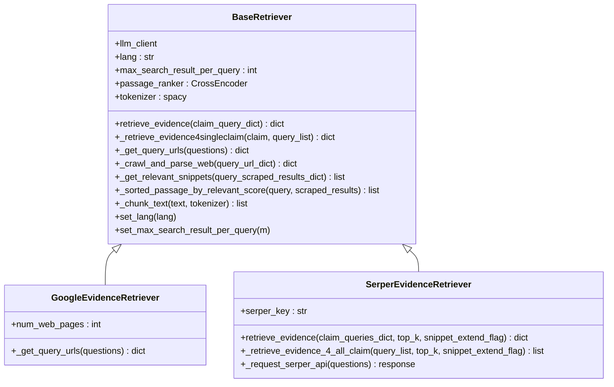
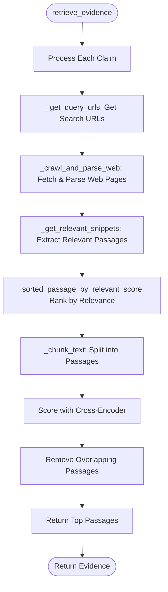
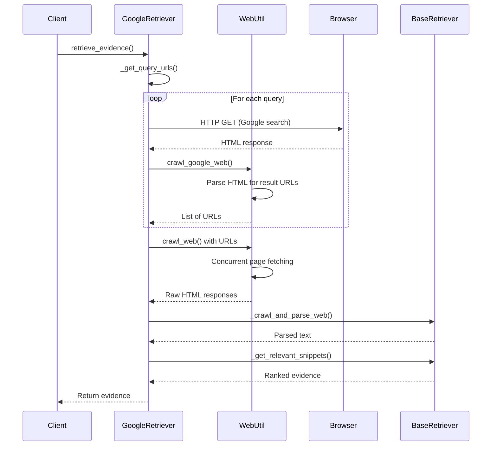
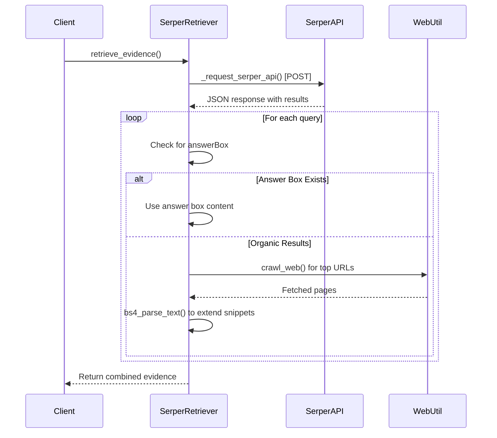
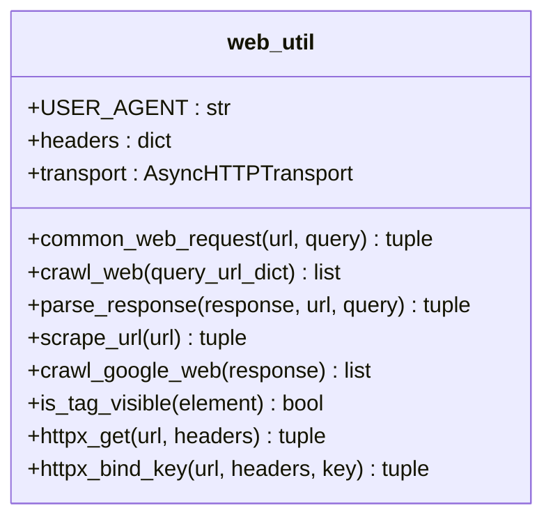
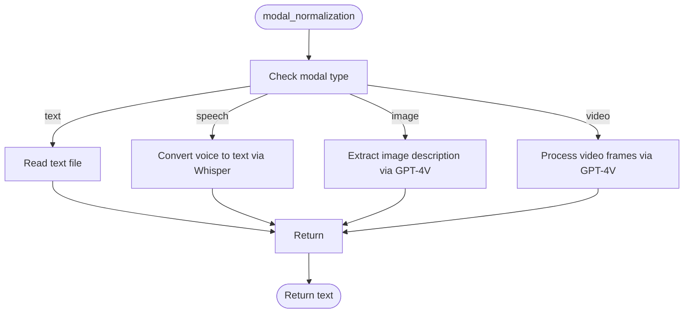

# Retriever Plugin System

<cite>
**Referenced Files in This Document**   
- [factcheck/core/Retriever/base.py](file://factcheck/core/Retriever/base.py)
- [factcheck/core/Retriever/google_retriever.py](file://factcheck/core/Retriever/google_retriever.py)
- [factcheck/core/Retriever/serper_retriever.py](file://factcheck/core/Retriever/serper_retriever.py)
- [factcheck/core/Retriever/__init__.py](file://factcheck/core/Retriever/__init__.py)
- [factcheck/utils/web_util.py](file://factcheck/utils/web_util.py)
- [factcheck/utils/multimodal.py](file://factcheck/utils/multimodal.py)
</cite>

## Table of Contents
1. [Introduction](#introduction)
2. [Project Structure](#project-structure)
3. [Core Components](#core-components)
4. [Architecture Overview](#architecture-overview)
5. [Detailed Component Analysis](#detailed-component-analysis)
6. [Dependency Analysis](#dependency-analysis)
7. [Performance Considerations](#performance-considerations)
8. [Troubleshooting Guide](#troubleshooting-guide)
9. [Conclusion](#conclusion)

## Introduction
The Retriever Plugin System is a modular architecture within the OpenFactVerification framework that enables pluggable evidence sources for fact-checking claims. It allows integration with external search APIs such as Google and Serper to retrieve, parse, and rank relevant web content as evidence. The system is built around an abstract base class, `BaseRetriever`, which defines a contract for evidence retrieval and processing. Subclasses implement specific search engine integrations, enabling flexible and extensible retrieval strategies. This document provides a comprehensive analysis of the retriever system, including implementation details, integration patterns, and performance optimizations.

## Project Structure
The Retriever module is organized under `factcheck/core/Retriever/` and follows a modular design pattern that separates core logic from implementation-specific details. The structure supports multiple retriever backends through a plugin-based registration system.

```mermaid
graph TD
subgraph "Retriever Module"
base[base.py]
google[google_retriever.py]
serper[serper_retriever.py]
init[__init__.py]
end
base --> BaseRetriever[BaseRetriever Class]
google --> GoogleEvidenceRetriever[GoogleEvidenceRetriever]
serper --> SerperEvidenceRetriever[SerperEvidenceRetriever]
init --> retriever_map[retriever_map]
init --> retriever_mapper[retriever_mapper]
GoogleEvidenceRetriever --> BaseRetriever : "inherits"
SerperEvidenceRetriever -.-> BaseRetriever : "implements similar interface"
retriever_map --> GoogleEvidenceRetriever
retriever_map --> SerperEvidenceRetriever
```

**Diagram sources**
- [factcheck/core/Retriever/__init__.py](file://factcheck/core/Retriever/__init__.py#L1-L13)
- [factcheck/core/Retriever/base.py](file://factcheck/core/Retriever/base.py#L1-L235)
- [factcheck/core/Retriever/google_retriever.py](file://factcheck/core/Retriever/google_retriever.py#L1-L41)
- [factcheck/core/Retriever/serper_retriever.py](file://factcheck/core/Retriever/serper_retriever.py#L1-L221)

**Section sources**
- [factcheck/core/Retriever/__init__.py](file://factcheck/core/Retriever/__init__.py#L1-L13)

## Core Components
The Retriever Plugin System consists of several key components:
- **BaseRetriever**: Abstract base class defining the retrieval contract
- **GoogleEvidenceRetriever**: Implementation using Google search scraping
- **SerperEvidenceRetriever**: Implementation using Serper API
- **retriever_map**: Registry mapping names to retriever classes
- **retriever_mapper**: Factory function to instantiate retrievers by name

These components work together to provide a unified interface for evidence retrieval while supporting multiple backend implementations.

**Section sources**
- [factcheck/core/Retriever/base.py](file://factcheck/core/Retriever/base.py#L1-L235)
- [factcheck/core/Retriever/__init__.py](file://factcheck/core/Retriever/__init__.py#L1-L13)

## Architecture Overview
The retriever system follows a plugin architecture where different evidence sources can be registered and selected at runtime. The core abstraction is the `BaseRetriever` class, which defines the contract for evidence retrieval through the `retrieve_evidence` method.



**Diagram sources**
- [factcheck/core/Retriever/base.py](file://factcheck/core/Retriever/base.py#L1-L235)
- [factcheck/core/Retriever/google_retriever.py](file://factcheck/core/Retriever/google_retriever.py#L1-L41)
- [factcheck/core/Retriever/serper_retriever.py](file://factcheck/core/Retriever/serper_retriever.py#L1-L221)

## Detailed Component Analysis

### BaseRetriever Analysis
The `BaseRetriever` class serves as the foundation for all retriever implementations. It provides a complete pipeline for evidence retrieval, parsing, and ranking.

#### Retrieval Pipeline


**Diagram sources**
- [factcheck/core/Retriever/base.py](file://factcheck/core/Retriever/base.py#L1-L235)

**Section sources**
- [factcheck/core/Retriever/base.py](file://factcheck/core/Retriever/base.py#L1-L235)

#### Key Methods and Fields
- **passage_ranker**: Uses `cross-encoder/ms-marco-MiniLM-L-6-v2` for relevance scoring
- **tokenizer**: spaCy model for sentence segmentation
- **retrieve_evidence()**: Main entry point that orchestrates the retrieval process
- **_chunk_text()**: Implements sliding window text chunking with configurable parameters
- **_sorted_passage_by_relevant_score()**: Uses cross-encoder to score and rank passages

The class handles concurrency through `ProcessPoolExecutor` for parsing responses and includes overlap detection to avoid redundant evidence.

### GoogleEvidenceRetriever Analysis
This implementation uses direct Google search scraping to retrieve URLs and then crawls the resulting pages.

#### Implementation Details


**Diagram sources**
- [factcheck/core/Retriever/google_retriever.py](file://factcheck/core/Retriever/google_retriever.py#L1-L41)
- [factcheck/utils/web_util.py](file://factcheck/utils/web_util.py#L1-L141)

**Section sources**
- [factcheck/core/Retriever/google_retriever.py](file://factcheck/core/Retriever/google_retriever.py#L1-L41)

#### Key Features
- Uses `ThreadPoolExecutor` for concurrent search requests
- Constructs Google search URLs with language parameters
- Limits results to `max_search_result_per_query`
- Inherits parsing and ranking logic from `BaseRetriever`

### SerperEvidenceRetriever Analysis
This implementation uses the Serper API to retrieve search results and optionally extends snippets by crawling the actual pages.

#### API Integration Flow


**Diagram sources**
- [factcheck/core/Retriever/serper_retriever.py](file://factcheck/core/Retriever/serper_retriever.py#L1-L221)
- [factcheck/utils/web_util.py](file://factcheck/utils/web_util.py#L1-L141)

**Section sources**
- [factcheck/core/Retriever/serper_retriever.py](file://factcheck/core/Retriever/serper_retriever.py#L1-L221)

#### Key Features
- Uses Serper API key from configuration
- Handles batch requests (up to 100 queries)
- Supports answer box extraction
- Implements snippet extension by crawling target pages
- Uses `ThreadPoolExecutor` for concurrent web crawling

### Web Utilities Analysis
The `web_util.py` module provides essential web scraping and parsing functionality used by all retrievers.

#### Web Scraping Components


**Diagram sources**
- [factcheck/utils/web_util.py](file://factcheck/utils/web_util.py#L1-L141)

**Section sources**
- [factcheck/utils/web_util.py](file://factcheck/utils/web_util.py#L1-L141)

#### Key Functions
- **crawl_web()**: Asynchronous web crawler using `AsyncClient`
- **parse_response()**: Extracts visible text using BeautifulSoup
- **is_tag_visible()**: Filters out non-visible HTML elements
- **crawl_google_web()**: Parses Google search results for URLs
- **common_web_request()**: Synchronous HTTP request wrapper

The module handles both synchronous and asynchronous requests and includes robust error handling.

### Multimodal Processing
The `multimodal.py` module supports processing of non-text inputs through OpenAI's APIs.

#### Modal Normalization Flow


**Diagram sources**
- [factcheck/utils/multimodal.py](file://factcheck/utils/multimodal.py#L1-L104)

**Section sources**
- [factcheck/utils/multimodal.py](file://factcheck/utils/multimodal.py#L1-L104)

## Dependency Analysis
The retriever system has a well-defined dependency structure that promotes modularity and separation of concerns.

```mermaid
graph TD
BaseRetriever --> web_util : "uses crawl_web, parse_response"
BaseRetriever --> logger : "uses CustomLogger"
GoogleRetriever --> BaseRetriever : "inherits"
GoogleRetriever --> web_util : "uses common_web_request, crawl_google_web"
SerperRetriever --> web_util : "uses crawl_web"
SerperRetriever --> logger : "uses CustomLogger"
multimodal --> logger : "uses CustomLogger"
multimodal --> OpenAI : "API calls"
__init__ --> GoogleRetriever
__init__ --> SerperRetriever
```

**Diagram sources**
- [factcheck/core/Retriever/base.py](file://factcheck/core/Retriever/base.py#L1-L235)
- [factcheck/core/Retriever/google_retriever.py](file://factcheck/core/Retriever/google_retriever.py#L1-L41)
- [factcheck/core/Retriever/serper_retriever.py](file://factcheck/core/Retriever/serper_retriever.py#L1-L221)
- [factcheck/utils/web_util.py](file://factcheck/utils/web_util.py#L1-L141)
- [factcheck/utils/multimodal.py](file://factcheck/utils/multimodal.py#L1-L104)

**Section sources**
- [factcheck/core/Retriever/base.py](file://factcheck/core/Retriever/base.py#L1-L235)
- [factcheck/core/Retriever/google_retriever.py](file://factcheck/core/Retriever/google_retriever.py#L1-L41)
- [factcheck/core/Retriever/serper_retriever.py](file://factcheck/core/Retriever/serper_retriever.py#L1-L221)

## Performance Considerations
The retriever system incorporates several performance optimization techniques:

### Concurrency and Parallelism
- Uses `ProcessPoolExecutor` for CPU-intensive text parsing
- Uses `ThreadPoolExecutor` for I/O-bound web requests
- Asynchronous crawling with `AsyncHTTPTransport`
- Batch processing of Serper API requests

### Caching and Rate Limiting
- No explicit caching mechanism observed
- Built-in retry logic in `AsyncHTTPTransport` (3 retries)
- Timeouts set for all HTTP requests (3 seconds)
- Mobile user agent rotation not currently implemented

### Resource Management
- Text length limited to 500,000 characters for tokenization
- Configurable sliding window for text chunking
- Memory-efficient streaming of web content
- GPU acceleration for cross-encoder when available

### Optimization Recommendations
1. Implement response caching to avoid redundant web requests
2. Add rate limiting for API calls to prevent throttling
3. Introduce connection pooling for improved network efficiency
4. Consider implementing a circuit breaker pattern for failed requests
5. Add configurable retry policies with exponential backoff

## Troubleshooting Guide
Common issues and their solutions when working with the retriever system:

### Configuration Issues
- **Missing API Keys**: Ensure `SERPER_API_KEY` is provided in `api_config`
- **Language Settings**: Verify `lang` parameter is correctly set
- **LLM Client**: Confirm `llm_client` is properly initialized

### Network and Connectivity
- **Timeout Errors**: Increase timeout values or check network connectivity
- **Blocked Requests**: Rotate user agents or use proxy servers
- **SSL Errors**: Update certificates or disable SSL verification (not recommended)

### Parsing Problems
- **Unicode Errors**: Handle encoding issues in `spacy` tokenization
- **Empty Results**: Verify URL extraction logic in `crawl_google_web`
- **Overlapping Content**: Adjust `sliding_distance` and `sentences_per_passage`

### Performance Bottlenecks
- **High Memory Usage**: Reduce text processing batch sizes
- **Slow Response Times**: Optimize cross-encoder usage or use CPU fallback
- **Rate Limiting**: Implement request throttling and queuing

**Section sources**
- [factcheck/core/Retriever/base.py](file://factcheck/core/Retriever/base.py#L1-L235)
- [factcheck/core/Retriever/serper_retriever.py](file://factcheck/core/Retriever/serper_retriever.py#L1-L221)
- [factcheck/utils/web_util.py](file://factcheck/utils/web_util.py#L1-L141)

## Conclusion
The Retriever Plugin System provides a robust, extensible framework for evidence retrieval in fact-checking applications. Its modular design allows for easy integration of new search sources through the `BaseRetriever` contract. The system effectively combines web scraping, API integration, and machine learning-based relevance scoring to retrieve high-quality evidence. Key strengths include its concurrent processing capabilities, sophisticated text chunking and ranking algorithms, and clean separation of concerns. Future improvements could focus on enhanced caching, better error recovery, and expanded multimodal support. The architecture serves as a solid foundation for building reliable fact-verification systems.