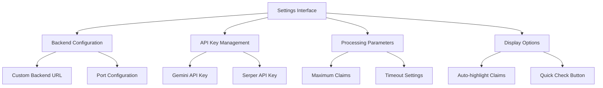
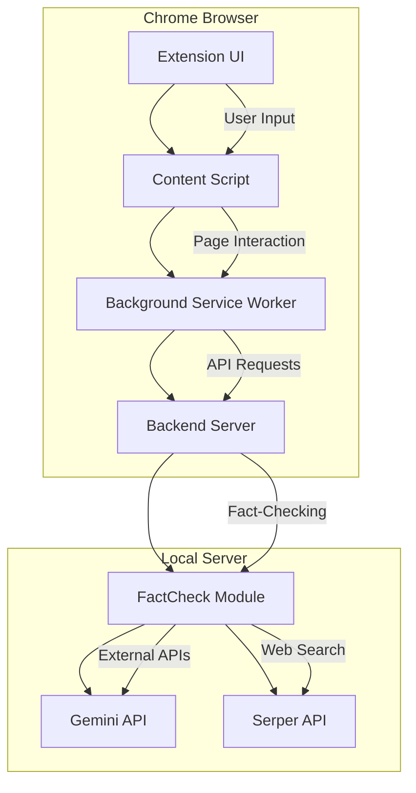

# Chrome Extension Configuration

<cite>
**Referenced Files in This Document**   
- [CHROME_EXTENSION_README.md](file://CHROME_EXTENSION_README.md)
- [manifest.json](file://chrome-extension/manifest.json)
- [options.js](file://chrome-extension/options.js)
- [popup.js](file://chrome-extension/popup.js)
- [background.js](file://chrome-extension/background.js)
- [content.js](file://chrome-extension/content.js)
- [extension_backend.py](file://extension_backend.py)
- [api_config.py](file://factcheck/utils/api_config.py)
</cite>

## Table of Contents
1. [Introduction](#introduction)
2. [Installation Process](#installation-process)
3. [Loading Instructions](#loading-instructions)
4. [API Key Setup](#api-key-setup)
5. [Connection Troubleshooting](#connection-troubleshooting)
6. [Usage Guide](#usage-guide)
7. [Configuration Options](#configuration-options)
8. [Architecture Overview](#architecture-overview)

## Introduction
The OpenFactVerification Chrome Extension transforms the OpenFactVerification project into a real-time fact-checking tool for web content. This extension enables users to verify claims on any webpage instantly through multiple input methods including text selection, file uploads, and full page analysis. The system operates through a local backend server that processes requests using AI models and returns factuality scores with supporting evidence. This documentation provides comprehensive guidance on installation, configuration, and troubleshooting to ensure seamless operation.

## Installation Process

### Prerequisites
Before installing the extension, ensure your system meets these requirements:
- Python 3.9 or higher installed
- OpenFactVerification project properly set up
- Gemini API Key (required)
- Serper API Key (optional)

Install the necessary Python dependencies:
```bash
pip install -r extension_requirements.txt
pip install -r requirements.txt
```

### Extension Installation Steps
1. Open Chrome and navigate to `chrome://extensions/`
2. Enable Developer Mode using the toggle switch in the top-right corner
3. Click the "Load unpacked" button
4. Select the `chrome-extension` folder from the OpenFactVerification directory
5. The extension will be installed and appear in your Chrome toolbar

The extension icon will display in the browser toolbar, ready for use. The backend server must be running for the extension to function properly.

**Section sources**
- [CHROME_EXTENSION_README.md](file://CHROME_EXTENSION_README.md#L1-L238)
- [manifest.json](file://chrome-extension/manifest.json#L1-L49)

## Loading Instructions

### Starting the Backend Server
The Chrome extension requires a local backend server to process fact-checking requests. Start the server using the following command:

```bash
python extension_backend.py
```

By default, the server runs on `http://localhost:2024`. Keep this server running while using the extension. The server can be configured with custom host, port, and configuration file:

```bash
python extension_backend.py --host 0.0.0.0 --port 3000 --config my_config.yaml --debug
```

### Automatic Extension Initialization
When the extension is installed or Chrome starts, the background service worker automatically initializes and attempts to connect to the backend server. The extension status dot in the popup interface will turn green when successfully connected to the backend service.

**Section sources**
- [CHROME_EXTENSION_README.md](file://CHROME_EXTENSION_README.md#L1-L238)
- [extension_backend.py](file://extension_backend.py#L1-L372)
- [background.js](file://chrome-extension/background.js#L1-L288)

## API Key Setup

### Configuration Methods
API keys can be configured through multiple methods:

#### Method 1: Configuration File
Create or update the `api_config.yaml` file in the project root directory:
```yaml
GEMINI_API_KEY: "your_gemini_api_key_here"
SERPER_API_KEY: "your_serper_api_key_here"  # Optional
```

#### Method 2: Environment Variables
Set environment variables in your system:
```bash
export GEMINI_API_KEY="your_gemini_api_key_here"
export SERPER_API_KEY="your_serper_api_key_here"  # Optional
```

#### Method 3: Extension Settings Interface
1. Click the extension icon in Chrome's toolbar
2. Click "Settings" in the popup footer
3. Enter your API keys in the designated fields
4. Click "Save Settings"

The Gemini API key is required for the extension to function, while the Serper API key is optional and enhances web search capabilities.

### API Key Management
The extension provides a secure interface for API key management with the following features:
- Encrypted storage of API keys
- Password visibility toggle for secure entry
- Connection testing to verify key validity
- Auto-save functionality with form validation

**Section sources**
- [CHROME_EXTENSION_README.md](file://CHROME_EXTENSION_README.md#L1-L238)
- [options.js](file://chrome-extension/options.js#L1-L339)
- [api_config.py](file://factcheck/utils/api_config.py#L1-L34)

## Connection Troubleshooting

### Common Connection Issues
The following table outlines common connection problems and their solutions:

| Issue | Possible Cause | Solution |
|-------|----------------|----------|
| "Backend service not available" | Backend server not running | Start the backend server with `python extension_backend.py` |
| "API key required" | Missing or invalid Gemini API key | Configure a valid Gemini API key in settings |
| "No claims found" | Text too long or not factual | Use shorter text snippets under 5000 characters with factual claims |
| "Connection failed" | Incorrect backend URL | Verify the backend URL is set to `http://localhost:2024` |

### Diagnostic Steps
1. **Verify Backend Server**: Ensure `python extension_backend.py` is running and accessible
2. **Check Port Availability**: Confirm port 2024 is not blocked or used by another application
3. **Test Connection**: Use the "Test Connection" button in extension settings
4. **Inspect Console**: Check Chrome's developer console (F12 → Console) for error messages
5. **Validate API Keys**: Ensure API keys are correctly formatted and have sufficient quota

### Connection Testing
The extension includes a built-in connection test feature that verifies communication between the frontend and backend components. When the "Test Connection" button is clicked, the extension sends a health check request to the backend server and displays the connection status with appropriate indicators.

**Section sources**
- [CHROME_EXTENSION_README.md](file://CHROME_EXTENSION_README.md#L1-L238)
- [background.js](file://chrome-extension/background.js#L1-L288)
- [options.js](file://chrome-extension/options.js#L1-L339)

## Usage Guide

### Text Fact-Checking
1. Select any text on a webpage
2. Double-click to show the quick fact-check button
3. Click the button or right-click and select "Fact-check selected text"
4. View results in the modal that appears

### Extension Popup Interface
1. Click the extension icon in Chrome's toolbar
2. Choose your input method:
   - **Text**: Paste or type text to fact-check
   - **File**: Upload images or videos for analysis
   - **Page**: Analyze the current webpage content
3. Click "Fact Check" and wait for results
4. Use "Highlight Claims" to mark verified content on the page

### Understanding Results
The extension displays factuality scores with color coding:
- **🟢 80-100%**: Highly supported claims with strong evidence
- **🟡 50-79%**: Controversial claims with mixed evidence
- **🔴 0-49%**: Refuted claims with contradictory evidence
- **⚪ No Score**: Claims that couldn't be verified

**Section sources**
- [CHROME_EXTENSION_README.md](file://CHROME_EXTENSION_README.md#L1-L238)
- [popup.js](file://chrome-extension/popup.js#L1-L549)
- [content.js](file://chrome-extension/content.js#L1-L896)

## Configuration Options

### Settings Interface
The extension settings page provides comprehensive configuration options:



**Diagram sources**
- [options.js](file://chrome-extension/options.js#L1-L339)

### Available Configuration Parameters
- **Backend URL**: Custom server address (default: `http://localhost:2024`)
- **Maximum Claims**: Limit on number of claims to process (1-50)
- **Timeout Seconds**: Request timeout duration (30-300 seconds)
- **Enable Analytics**: Toggle for usage statistics
- **Auto-highlight**: Automatically highlight claims on pages
- **Show Quick Check Button**: Display button on text selection
- **Custom Prompt**: Override default analysis prompt
- **Debug Mode**: Enable detailed logging

**Section sources**
- [options.js](file://chrome-extension/options.js#L1-L339)

## Architecture Overview

### System Architecture
The Chrome extension operates as a client-server application with the following components:



**Diagram sources**
- [manifest.json](file://chrome-extension/manifest.json#L1-L49)
- [background.js](file://chrome-extension/background.js#L1-L288)
- [extension_backend.py](file://extension_backend.py#L1-L372)

### Component Interactions
The extension follows a message-passing architecture where components communicate through defined channels:
- Content scripts handle page interactions and text selection
- Background service workers manage API communication
- The backend server processes requests and coordinates fact-checking
- The FactCheck module interfaces with external AI services

This architecture ensures secure, efficient communication between the browser extension and processing backend while maintaining user privacy.

**Section sources**
- [manifest.json](file://chrome-extension/manifest.json#L1-L49)
- [background.js](file://chrome-extension/background.js#L1-L288)
- [content.js](file://chrome-extension/content.js#L1-L896)
- [extension_backend.py](file://extension_backend.py#L1-L372)