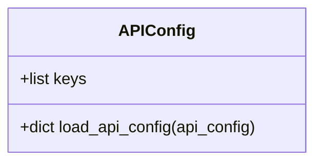

# API Key Management

<cite>
**Referenced Files in This Document**   
- [api_config.py](file://factcheck\utils\api_config.py) - *Updated in commit d2c980a8c72830f1e0874e7f8f782e9dd3be1267*
- [render_app.py](file://render_app.py) - *Updated in commits b63397889241d7df571821f05719a4e8e25342c2 and 736c277ac98e8da836d4404de9aa4ec53ecc44a7*
- [webapp.py](file://webapp.py) - *Updated in commit b63397889241d7df571821f05719a4e8e25342c2*
- [api_config_production.yaml](file://api_config_production.yaml) - *Production configuration template*
- [RENDER_DEPLOYMENT.md](file://RENDER_DEPLOYMENT.md) - *Deployment guide with security and setup instructions*
</cite>

## Update Summary
**Changes Made**   
- Replaced outdated prompt customization content with comprehensive API key management documentation
- Added detailed explanation of environment-based configuration loading via `api_config.py`
- Documented required API keys (SERPER_API_KEY, GEMINI_API_KEY) and optional GCS credentials
- Described fallback mechanisms and configuration precedence in `load_api_config`
- Added secure setup instructions for development and production environments
- Included code examples for proper key loading and error handling
- Integrated production validation logic from `render_app.py`
- Updated security best practices based on Render deployment patterns
- Added debugging strategies for authentication failures

## Table of Contents
1. [Introduction](#introduction)
2. [API Key Configuration System](#api-key-configuration-system)
3. [Environment Variable Mapping](#environment-variable-mapping)
4. [Configuration Loading and Fallback Mechanisms](#configuration-loading-and-fallback-mechanisms)
5. [Secure Setup Instructions](#secure-setup-instructions)
6. [Code Examples for Key Management](#code-examples-for-key-management)
7. [Security Best Practices](#security-best-practices)
8. [Error Handling and Debugging](#error-handling-and-debugging)
9. [Production Validation and Deployment](#production-validation-and-deployment)

## Introduction
The OpenFactVerification system securely manages sensitive API credentials for LLM providers and search services through a robust configuration system implemented in `api_config.py`. This document details how the application handles API keys for services like Google Gemini and Serper Search API, with emphasis on secure practices for both development and production environments. The system prioritizes environment variables for credential storage, supports configuration file fallbacks, and implements validation mechanisms to ensure required keys are present before initialization.

**Section sources**
- [RENDER_DEPLOYMENT.md](file://RENDER_DEPLOYMENT.md#L0-L129)

## API Key Configuration System
The API key management framework is centered around the `load_api_config` function in `factcheck/utils/api_config.py`. This system securely handles credentials for external services including LLM providers (Gemini) and search APIs (Serper). The configuration system is designed with security and flexibility in mind, allowing multiple methods for credential injection while preventing accidental exposure.

The core principle is that sensitive credentials should never be hardcoded in source code. Instead, the system relies on environment-based configuration with well-defined precedence rules. This approach enables secure deployment across different environments (development, staging, production) without modifying application code.



**Diagram sources**
- [api_config.py](file://factcheck\utils\api_config.py#L1-L33)

**Section sources**
- [api_config.py](file://factcheck\utils\api_config.py#L1-L33)

## Environment Variable Mapping
The system recognizes specific environment variables for API credentials, which are mapped to internal configuration keys:

- **SERPER_API_KEY**: Authentication key for Serper Search API (required)
- **GEMINI_API_KEY**: Authentication key for Google Gemini API (required)
- **GCS_BUCKET_NAME**: Google Cloud Storage bucket name (optional)
- **GCS_BASE_URL**: Base URL for GCS access (optional)
- **GOOGLE_APPLICATION_CREDENTIALS**: Service account credentials for GCS (optional)

These environment variables correspond directly to the keys defined in the `keys` list within `api_config.py`. The naming convention follows uppercase format with descriptive prefixes, making it clear which service each key belongs to. Required keys (SERPER_API_KEY, GEMINI_API_KEY) must be present for the application to function, while GCS-related keys are optional and only needed if cloud storage integration is enabled.

**Section sources**
- [api_config.py](file://factcheck\utils\api_config.py#L4-L8)
- [render_app.py](file://render_app.py#L25-L29)

## Configuration Loading and Fallback Mechanisms
The `load_api_config` function implements a hierarchical configuration loading system with clear precedence rules. When loading API configuration, the system follows this order of priority:

1. **Configuration file values** (highest precedence)
2. **Environment variables**
3. **None/default values** (lowest precedence)

```python
def load_api_config(api_config: dict = None):
    """Load API keys from environment variables or config file, config file take precedence"""
    if api_config is None:
        api_config = dict()
    
    merged_config = {}
    
    for key in keys:
        merged_config[key] = api_config.get(key, None)
        if merged_config[key] is None:
            merged_config[key] = os.environ.get(key, None)
    
    # Include any additional keys from config file
    for key in api_config.keys():
        if key not in keys:
            merged_config[key] = api_config[key]
    
    return merged_config
```

This design ensures that explicit configuration in a file overrides environment variables, providing flexibility for deployment scenarios. The function also validates that the input `api_config` is a dictionary, raising an assertion error otherwise. For keys not defined in the known `keys` list, any additional configuration values from the file are preserved in the merged result.

**Section sources**
- [api_config.py](file://factcheck\utils\api_config.py#L10-L33)

## Secure Setup Instructions
To securely configure API keys for OpenFactVerification, follow these recommended practices:

### Development Environment (.env file)
Create a `.env` file in your project root:
```bash
SERPER_API_KEY=your_serper_api_key_here
GEMINI_API_KEY=your_gemini_api_key_here
GCS_BUCKET_NAME=your-bucket-name
GCS_BASE_URL=https://storage.googleapis.com/your-bucket-name
GOOGLE_APPLICATION_CREDENTIALS={"type": "service_account", ...}
```

Ensure `.env` is added to `.gitignore` to prevent accidental commits:
```
.env
*.env
```

### Production Environment (Render)
When deploying to Render or similar platforms:
1. Set environment variables in the platform's dashboard
2. Never include API keys in version control
3. Use the production configuration template `api_config_production.yaml`

Example production configuration:
```yaml
# Required API Keys (will be overridden by environment variables)
SERPER_API_KEY: ""
GEMINI_API_KEY: ""

# GCS Configuration (DISABLED for local processing)
# GCS_BUCKET_NAME: ""
# GCS_BASE_URL: ""
# GOOGLE_APPLICATION_CREDENTIALS: ""
```

The empty values in the production config serve as placeholders while relying on environment variables for actual credential values.

**Section sources**
- [api_config_production.yaml](file://api_config_production.yaml)
- [RENDER_DEPLOYMENT.md](file://RENDER_DEPLOYMENT.md#L0-L129)

## Code Examples for Key Management
The following examples demonstrate proper API key management patterns in OpenFactVerification.

### Loading Configuration in Application Code
```python
from factcheck.utils.api_config import load_api_config
from factcheck.utils.utils import load_yaml

# Load configuration from file
try:
    config_file = "api_config.yaml"
    api_config_data = load_yaml(config_file)
except Exception as e:
    print(f"Error loading config file: {e}")
    api_config_data = {}

# Process through secure loading function
api_config = load_api_config(api_config_data)

# Use in FactCheck initialization
factcheck = FactCheck(
    default_model="gemini-1.5-pro",
    api_config=api_config,
    prompt="chatgpt_prompt",
    retriever="serper",
)
```

### Direct Environment Variable Access
```python
import os

# Access keys directly from environment (fallback pattern)
serper_key = os.environ.get("SERPER_API_KEY")
gemini_key = os.environ.get("GEMINI_API_KEY")

if not serper_key or not gemini_key:
    raise ValueError("Required API keys not found in environment")
```

### Production Validation Check
```python
# From render_app.py - production validation
required_keys = ['SERPER_API_KEY', 'GEMINI_API_KEY']
missing_keys = [key for key in required_keys if not api_config.get(key)]

if missing_keys:
    print(f"❌ Missing required API keys: {missing_keys}")
    # Handle configuration error gracefully
else:
    print("✅ All required API keys are configured")
    # Proceed with application initialization
```

**Section sources**
- [render_app.py](file://render_app.py#L20-L70)
- [webapp.py](file://webapp.py#L140-L180)
- [api_config.py](file://factcheck\utils\api_config.py#L10-L33)

## Security Best Practices
To maintain the highest level of security when managing API credentials:

- **Never hardcode keys**: Avoid embedding API keys directly in source code
- **Use environment variables**: Store credentials in environment variables, especially in production
- **Employ .env files**: Use `.env` files for development, but ensure they're excluded from version control
- **Apply least privilege**: Use API keys with minimal required permissions
- **Rotate credentials regularly**: Periodically regenerate API keys to limit exposure
- **Validate input sources**: Always validate that configuration inputs are dictionaries
- **Isolate credentials from logs**: Ensure API keys are never written to log files or error reports
- **Use separate keys for environments**: Maintain different API keys for development, staging, and production

The system automatically prevents credential exposure by not logging configuration values and by allowing empty placeholder values in configuration files. When using cloud services like Render, leverage their built-in environment variable management rather than configuration files for sensitive data.

**Section sources**
- [RENDER_DEPLOYMENT.md](file://RENDER_DEPLOYMENT.md#L59-L63)
- [api_config.py](file://factcheck\utils\api_config.py#L1-L33)

## Error Handling and Debugging
Effective error handling is crucial for diagnosing API key-related issues:

### Authentication Failure Debugging
When encountering authentication errors:
1. Verify environment variables are correctly set
2. Check for typos in variable names (case-sensitive)
3. Validate that API keys have not expired or been revoked
4. Test key validity using provider-specific test endpoints
5. Check application logs for specific error messages

### Key Validation Strategy
```python
# Test Serper API key
import requests
def test_serper_key(key):
    headers = {"X-API-KEY": key}
    response = requests.post(
        "https://google.serper.dev/search", 
        json={"q": "test"}, 
        headers=headers
    )
    return response.status_code == 200

# Test Gemini API key
import google.generativeai as genai
def test_gemini_key(key):
    try:
        genai.configure(api_key=key)
        model = genai.GenerativeModel('gemini-pro')
        response = model.generate_content("test")
        return True
    except:
        return False
```

The system isolates credentials from logging by only logging the presence or absence of keys, not their values. Error messages are designed to be informative without revealing sensitive information.

**Section sources**
- [render_app.py](file://render_app.py#L34-L45)
- [RENDER_DEPLOYMENT.md](file://RENDER_DEPLOYMENT.md#L100-L105)

## Production Validation and Deployment
For production deployments, particularly on platforms like Render, the system implements additional validation layers:

### Configuration Validation
The `render_app.py` script performs mandatory validation of required API keys:
```python
required_keys = ['SERPER_API_KEY', 'GEMINI_API_KEY']
missing_keys = [key for key in required_keys if not api_config.get(key)]

if missing_keys:
    print(f"❌ Missing required API keys: {missing_keys}")
    app.config['CONFIG_ERROR'] = f"Missing required API keys: {missing_keys}"
    app.config['FACTCHECK_INSTANCE'] = None
else:
    print("✅ All required API keys are configured")
    # Initialize FactCheck instance
```

### Deployment Workflow
1. Load configuration from `api_config_production.yaml`
2. Override with environment variables from deployment platform
3. Validate required keys are present
4. Initialize application components only if validation passes
5. Configure error state if keys are missing

This approach ensures that the application fails gracefully when credentials are missing, providing clear error messages without exposing sensitive information. The production configuration template uses empty string values as placeholders, relying on environment variables for actual credential injection.

**Section sources**
- [render_app.py](file://render_app.py#L20-L70)
- [api_config_production.yaml](file://api_config_production.yaml)
- [RENDER_DEPLOYMENT.md](file://RENDER_DEPLOYMENT.md#L0-L129)