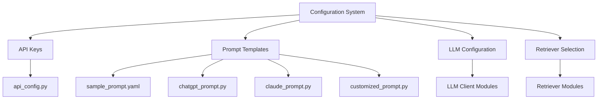
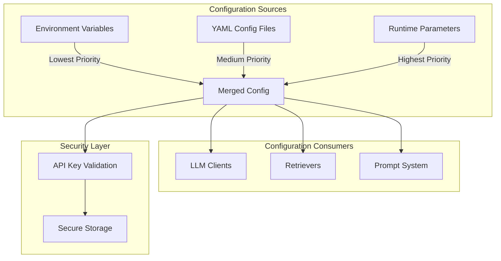
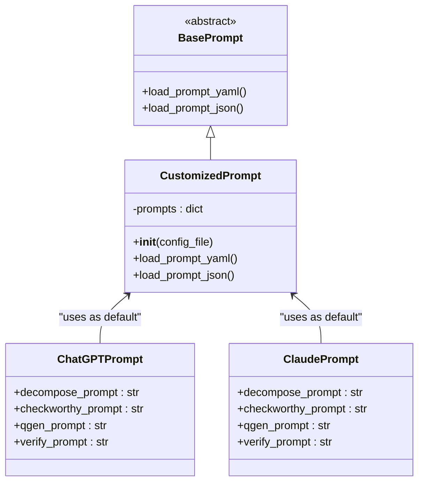
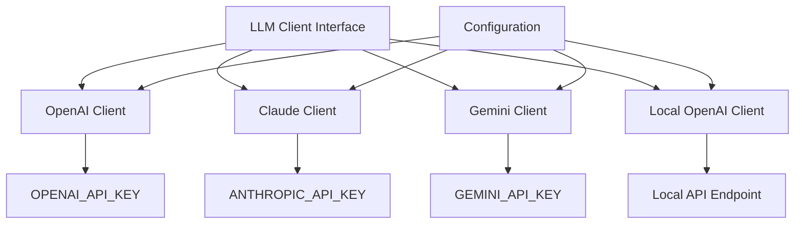
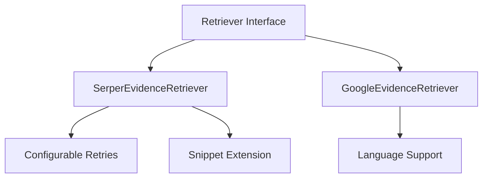
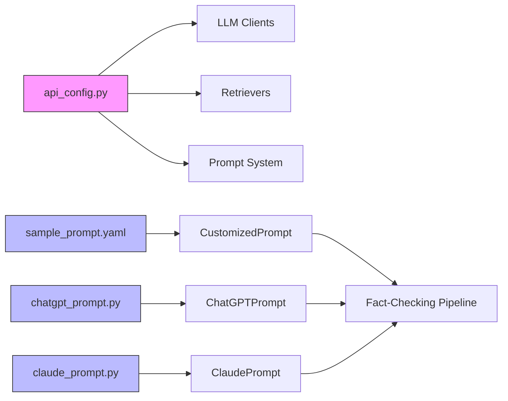

# Configuration System

<cite>
**Referenced Files in This Document**   
- [api_config.py](file://factcheck/utils/api_config.py) - *Updated in commit 8385c88*
- [api_config_production.yaml](file://api_config_production.yaml) - *Added in commit 8385c88*
- [sample_prompt.yaml](file://factcheck/config/sample_prompt.yaml) - *Template for prompt customization with enhanced context preservation*
- [chatgpt_prompt.py](file://factcheck/utils/prompt/chatgpt_prompt.py) - *Updated with context-preserving decomposition rules in commit d2c980a*
- [claude_prompt.py](file://factcheck/utils/prompt/claude_prompt.py) - *Updated with context-preserving decomposition rules in commit d2c980a*
- [customized_prompt.py](file://factcheck/utils/prompt/customized_prompt.py) - *Support for user-defined prompts*
- [api_config.yaml](file://api_config.yaml) - *Sample configuration with placeholder keys*
</cite>

## Update Summary
**Changes Made**  
- Updated documentation for enhanced claim decomposition with context preservation in `sample_prompt.yaml`, `chatgpt_prompt.py`, and `claude_prompt.py` (commit d2c980a)
- Added detailed explanation of context preservation rules and examples in prompt templates
- Enhanced prompt customization section with new decomposition guidelines
- Updated code examples to reflect current prompt structures
- Added comparison of verify_prompt behavior between ChatGPT and Claude implementations
- Clarified the role of restore_prompt in the ChatGPT template
- Removed outdated prompt examples that did not reflect current context preservation requirements

## Table of Contents
1. [Introduction](#introduction)
2. [Project Structure](#project-structure)
3. [Core Components](#core-components)
4. [Architecture Overview](#architecture-overview)
5. [Detailed Component Analysis](#detailed-component-analysis)
6. [Dependency Analysis](#dependency-analysis)
7. [Performance Considerations](#performance-considerations)
8. [Troubleshooting Guide](#troubleshooting-guide)
9. [Conclusion](#conclusion)

## Introduction
The Configuration System in OpenFactVerification provides a flexible and modular infrastructure for managing LLM providers, retrievers, prompts, and API keys. This document details how users can customize the fact-checking pipeline through YAML templates, configure multiple LLMs, manage credentials securely, and extend functionality via user-defined prompts. The system supports OpenAI, Claude, Gemini, and local LLMs, with pluggable retrievers (Serper, Google), and robust fallback mechanisms. Recent updates have transitioned the system from individual key files to a unified YAML configuration approach, enhancing maintainability and deployment flexibility. The addition of `api_config_production.yaml` (commit 8385c88) emphasizes security by promoting environment variable-based credential management for production deployments. The latest enhancement (commit d2c980a) introduces comprehensive context preservation rules in prompt templates to improve claim decomposition accuracy.

## Project Structure
The configuration system is organized across several key directories:
- `factcheck/config/`: Contains `sample_prompt.yaml` for prompt customization
- `factcheck/utils/prompt/`: Houses prompt templates for different LLMs
- `factcheck/utils/api_config.py`: Manages API key loading and environment variables with unified configuration dictionary
- `factcheck/core/`: Core pipeline components that use configuration



**Diagram sources**
- [api_config.py](file://factcheck/utils/api_config.py#L1-L30)
- [sample_prompt.yaml](file://factcheck/config/sample_prompt.yaml#L1-L107)

**Section sources**
- [api_config.py](file://factcheck/utils/api_config.py#L1-L30)
- [sample_prompt.yaml](file://factcheck/config/sample_prompt.yaml#L1-L107)

## Core Components
The configuration system consists of three main components:
1. **API Key Management** via `api_config.py` with unified configuration dictionary
2. **Prompt Customization System** using YAML and Python modules
3. **LLM Client Configuration** for different providers

These components work together to provide a flexible, secure, and extensible configuration framework that supports both simple and complex deployment scenarios. The recent addition of `api_config_production.yaml` (commit 8385c88) provides a template for secure production deployments that relies on environment variables for sensitive credentials, aligning with security best practices. The enhancement in commit d2c980a introduces standardized context preservation rules across all prompt templates to ensure accurate claim decomposition.

**Section sources**
- [api_config.py](file://factcheck/utils/api_config.py#L1-L30)
- [customized_prompt.py](file://factcheck/utils/prompt/customized_prompt.py#L1-L34)

## Architecture Overview
The configuration architecture follows a layered approach where higher-level components can override lower-level defaults. Configuration flows from environment variables → config files → runtime parameters, with the most specific source taking precedence. The system prioritizes security by allowing sensitive credentials to be managed through environment variables rather than stored in configuration files.



**Diagram sources**
- [api_config.py](file://factcheck/utils/api_config.py#L1-L30)
- [customized_prompt.py](file://factcheck/utils/prompt/customized_prompt.py#L1-L34)

## Detailed Component Analysis

### API Configuration System
The `api_config.py` module provides a centralized system for managing API keys and configuration values with a unified configuration dictionary. It supports multiple sources with a clear precedence hierarchy.

```python
def load_api_config(api_config: dict = None):
    """Load API keys from environment variables or config file, config file take precedence"""
    if api_config is None:
        api_config = dict()
    assert type(api_config) is dict, "api_config must be a dictionary."

    merged_config = {}

    for key in keys:
        merged_config[key] = api_config.get(key, None)
        if merged_config[key] is None:
            merged_config[key] = os.environ.get(key, None)

    for key in api_config.keys():
        if key not in keys:
            merged_config[key] = api_config[key]
    return merged_config
```

The system first checks the provided `api_config` dictionary, then falls back to environment variables. This allows users to:
- Set keys via environment variables for secure production deployments
- Use config files (YAML/JSON) for development and testing
- Override settings programmatically at runtime

The recent addition of `api_config_production.yaml` (commit 8385c88) provides a template for production deployments that uses empty string placeholders for API keys, emphasizing that credentials should be provided via environment variables rather than stored in version-controlled files.

Supported keys include:
- `SERPER_API_KEY`: For evidence retrieval via Serper
- `GEMINI_API_KEY`: For Google's Gemini LLM
- `GCS_BUCKET_NAME`: For Google Cloud Storage integration
- `GCS_BASE_URL`: Base URL for GCS assets
- `GOOGLE_APPLICATION_CREDENTIALS`: Path to service account JSON file

**Section sources**
- [api_config.py](file://factcheck/utils/api_config.py#L1-L30)
- [api_config_production.yaml](file://api_config_production.yaml#L1-L12)

### Prompt Customization System
The prompt system supports three approaches: built-in templates, YAML configuration, and custom Python classes.

#### Built-in Prompt Templates
The system provides optimized prompts for different LLMs:
- `chatgpt_prompt.py`: Tailored for OpenAI's ChatGPT
- `claude_prompt.py`: Optimized for Anthropic's Claude
- `chatgpt_prompt_zh.py`: Chinese language variant

Each file defines a class with static prompt templates for the four main processing stages:
- `decompose_prompt`: Text decomposition into atomic claims
- `checkworthy_prompt`: Claim verifiability assessment
- `qgen_prompt`: Question generation for evidence retrieval
- `verify_prompt`: Final factuality verification



**Diagram sources**
- [customized_prompt.py](file://factcheck/utils/prompt/customized_prompt.py#L1-L34)
- [chatgpt_prompt.py](file://factcheck/utils/prompt/chatgpt_prompt.py#L1-L144)
- [claude_prompt.py](file://factcheck/utils/prompt/claude_prompt.py#L1-L115)

#### YAML Prompt Configuration
The `sample_prompt.yaml` file provides a template for customizing prompts without modifying code:

```yaml
decompose_prompt: |
  Your task is to decompose the text into atomic claims while preserving crucial context.
  The answer should be a JSON with a single key "claims", with the value of a list of strings, where each string should be a context-independent claim, representing one fact.
  
  CRITICAL CONTEXT PRESERVATION RULES:
  1. Each claim should be concise (less than 15 words) and self-contained.
  2. Avoid vague references like 'he', 'she', 'it', 'this', 'the company', 'the man' and use complete names.
  3. PRESERVE geographical locations, time periods, organizations, proper nouns, and causal relationships.
  4. When breaking down complex statements, maintain location/time/entity context in each relevant claim.
  5. Generate at least one claim for each single sentence in the texts.

  EXAMPLES WITH CONTEXT PRESERVATION:
  
  Text: Mary is a five-year old girl, she likes playing piano and she doesn't like cookies.
  Output:
  {{"claims": ["Mary is a five-year old girl.", "Mary likes playing piano.", "Mary doesn't like cookies."]}}

  Text: Protests in Nepal occurred due to social media bans.
  Output:
  {{"claims": ["Protests occurred in Nepal.", "Protests in Nepal were due to social media bans.", "Social media bans were imposed in Nepal."]}}

  Text: Did Elon Musk buy X in 2023?
  Output:
  {{"claims": ["Elon Musk bought X.", "Elon Musk bought X in 2023."]}}

  Text: Was Narendra Modi involved in Godhra riots?
  Output:
  {{"claims": ["Narendra Modi was involved in Godhra riots.", "Godhra riots occurred."]}}

  Text: Apple announced iPhone 15 launch in California during September 2023.
  Output:
  {{"claims": ["Apple announced iPhone 15 launch.", "Apple announced iPhone 15 launch in California.", "Apple announced iPhone 15 launch in September 2023.", "iPhone 15 launch occurred in California during September 2023."]}}

  Text: {doc}
  Output:

checkworthy_prompt: |
  Your task is to evaluate each provided statement to determine if it presents information whose factuality can be objectively verified by humans, irrespective of the statement's current accuracy. Consider the following guidelines:
  1. Opinions versus Facts: Distinguish between opinions, which are subjective and not verifiable, and statements that assert factual information, even if broad or general. Focus on whether there's a factual claim that can be investigated.
  2. Clarity and Specificity: Statements must have clear and specific references to be verifiable (e.g., "he is a professor" is not verifiable without knowing who "he" is).
  3. Presence of Factual Information: Consider a statement verifiable if it includes factual elements that can be checked against evidence or reliable sources, even if the overall statement might be broad or incorrect.
  Your response should be in JSON format, with each statement as a key and either "Yes" or "No" as the value, along with a brief rationale for your decision.

  For example, given these statements:
  1. Gary Smith is a distinguished professor of economics.
  2. He is a professor at MBZUAI.
  3. Obama is the president of the UK.

  The expected output is:
  {{
      "Gary Smith is a distinguished professor of economics.": "Yes (The statement contains verifiable factual information about Gary Smith's professional title and field.)",
      "He is a professor at MBZUAI.": "No (The statement cannot be verified due to the lack of clear reference to who 'he' is.)",
      "Obama is the president of the UK.": "Yes (This statement contain verifiable information regarding the political leadership of a country.)"
  }}

  For these statements:
  {texts}

  The output should be: 


qgen_prompt: |
  Given a claim, your task is to create minimum number of questions need to be check to verify the correctness of the claim. Output in JSON format with a single key "Questions", the value is a list of questions. For example:

  Claim: Your nose switches back and forth between nostrils. When you sleep, you switch about every 45 minutes. This is to prevent a buildup of mucus. It’s called the nasal cycle.
  Output: {{"Questions": ["Does your nose switch between nostrils?", "How often does your nostrils switch?", "Why does your nostril switch?", "What is nasal cycle?"]}}


  Claim: The Stanford Prison Experiment was conducted in the basement of Encina Hall, Stanford’s psychology building.
  Output:
  {{"Question":["Where was Stanford Prison Experiment was conducted?"]}}


  Claim: The Havel-Hakimi algorithm is an algorithm for converting the adjacency matrix of a graph into its adjacency list. It is named after Vaclav Havel and Samih Hakimi.
  Output:
  {{"Questions":["What does Havel-Hakimi algorithm do?", "Who are Havel-Hakimi algorithm named after?"]}}


  Claim: Social work is a profession that is based in the philosophical tradition of humanism. It is an intellectual discipline that has its roots in the 1800s.
  Output:
  {{"Questions":["What philosophical tradition is social work based on?", "What year does social work have its root in?"]}}


  Claim: {claim}
  Output:


verify_prompt: |
  Your task is to evaluate the accuracy of a provided statement using the accompanying evidence. Carefully review the evidence, noting that it may vary in detail and sometimes present conflicting information. Your judgment should be informed by this evidence, taking into account its relevance and reliability.

  Keep in mind that a lack of detail in the evidence does not necessarily indicate that the statement is inaccurate. When assessing the statement's factuality, distinguish between errors and areas where the evidence supports the statement.

  Please structure your response in JSON format, including the following four keys:
  - "reasoning": explain the thought process behind your judgment.
  - "error": none if the text is factual; otherwise, identify any specific inaccuracies in the statement.
  - "correction": none if the text is factual; otherwise, provide corrections to any identified inaccuracies, using the evidence to support your corrections.
  - "factuality": true if the given text is factual, false otherwise, indicating whether the statement is factual, or non-factual based on the evidence.

  For example:
  Input:
  [text]: MBZUAI is located in Abu Dhabi, United Arab Emirates.
  [evidence]: Where is MBZUAI located?\nAnswer: Masdar City - Abu Dhabi - United Arab Emirates

  Output:
  {{
      "reasoning": "The evidence confirms that MBZUAI is located in Masdar City, Abu Dhabi, United Arab Emirates, so the statement is factually correct",
      "error": none,
      "correction": none,
      "factuality": true
  }}


  Input:
  [text]: Copper reacts with ferrous sulfate (FeSO4).
  [evidence]: Copper is less reactive metal. It has positive value of standard reduction potential. Metal with high standard reduction potential can not displace other metal with low standard reduction potential values. Hence copper can not displace iron from ferrous sulphate solution. So no change will take place.

  Output:
  {{
      "reasoning": "The evidence provided confirms that copper cannot displace iron from ferrous sulphate solution, and no change will take place.",
      "error": "Copper does not react with ferrous sulfate as stated in the text.",
      "correction": "Copper does not react with ferrous sulfate as it cannot displace iron from ferrous sulfate solution.",
      "factuality": false
  }}


  Input
  [text]: {claim}
  [evidences]: {evidence}

  Output:
```

The system validates that all required keys are present and supports both YAML and JSON formats for custom prompt files. The enhanced `decompose_prompt` now includes explicit context preservation rules and comprehensive examples to ensure accurate claim extraction.

**Section sources**
- [sample_prompt.yaml](file://factcheck/config/sample_prompt.yaml#L1-L127)
- [customized_prompt.py](file://factcheck/utils/prompt/customized_prompt.py#L1-L34)

#### Custom Prompt Implementation
Users can create custom prompts by:
1. Creating a YAML/JSON file with the required prompt templates
2. Using the `CustomizedPrompt` class to load their configuration
3. Integrating it into the fact-checking pipeline

```python
from factcheck.utils.prompt import CustomizedPrompt

custom_prompt = CustomizedPrompt("path/to/custom_prompts.yaml")
# Now use custom_prompt.decompose_prompt, etc. in the pipeline
```

**Section sources**
- [sample_prompt.yaml](file://factcheck/config/sample_prompt.yaml#L1-L127)
- [customized_prompt.py](file://factcheck/utils/prompt/customized_prompt.py#L1-L34)

### LLM Provider Configuration
The system supports multiple LLM providers through a pluggable client architecture:



Each client uses the centralized `api_config.py` system to retrieve its required API keys. The configuration system allows different LLM models to be configured for different pipeline stages, enabling cost-performance optimization. Notably, the `verify_prompt` implementation differs between providers: ChatGPT uses a relationship-based approach ("SUPPORTS", "REFUTES", "IRRELEVANT"), while Claude uses a factuality-based approach (true/false with error correction).

**Diagram sources**
- [api_config.py](file://factcheck/utils/api_config.py#L1-L30)
- [chatgpt_prompt.py](file://factcheck/utils/prompt/chatgpt_prompt.py#L1-L164)
- [claude_prompt.py](file://factcheck/utils/prompt/claude_prompt.py#L1-L135)

### Retriever Configuration
The system supports multiple retrievers with configurable parameters:



The retriever configuration is managed through the same unified configuration system, with API keys and parameters loaded via `api_config.py`.

**Diagram sources**
- [serper_retriever.py](file://factcheck/core/Retriever/serper_retriever.py#L1-L222)

## Dependency Analysis
The configuration system has a clear dependency hierarchy with minimal coupling between components.



Key dependency relationships:
- `api_config.py` is a core dependency for all external service integrations
- Prompt modules are independent and can be used separately
- The `CustomizedPrompt` class depends on `BasePrompt` for file loading functionality
- All components ultimately integrate with the main fact-checking pipeline

**Diagram sources**
- [api_config.py](file://factcheck/utils/api_config.py#L1-L30)
- [customized_prompt.py](file://factcheck/utils/prompt/customized_prompt.py#L1-L34)

## Performance Considerations
The configuration system is designed for minimal overhead:
- Configuration loading occurs once at initialization
- Prompt templates are stored as static strings
- API key validation is simple existence checking
- File I/O for custom prompts is minimal (single read operation)

Best practices for optimal performance:
1. Use environment variables for production deployments to avoid file I/O
2. Cache loaded prompt configurations when running multiple fact-checking operations
3. Minimize the number of custom prompt reloads during batch processing
4. Use the built-in prompt templates when customization isn't required
5. Configure appropriate retry limits for retrievers to balance reliability and latency

The system's lightweight design ensures that configuration overhead does not impact the overall fact-checking latency significantly.

## Troubleshooting Guide
Common configuration issues and solutions:

### Missing API Keys
**Symptom**: `None` value returned for API keys, service authentication failures
**Solution**: 
- Ensure environment variables are properly exported
- Verify config file paths and permissions
- Check for typos in key names
- Confirm YAML file structure matches expected format
- For production deployments, ensure environment variables override config file values

```python
# Debug configuration loading
from factcheck.utils.api_config import load_api_config
config = load_api_config()
print("SERPER_API_KEY present:", config["SERPER_API_KEY"] is not None)
print("GEMINI_API_KEY present:", config["GEMINI_API_KEY"] is not None)
```

**Section sources**
- [api_config.py](file://factcheck/utils/api_config.py#L1-L30)

### Invalid Prompt Configuration
**Symptom**: `AssertionError` with "Key {key} not found in the prompt yaml file"
**Solution**:
- Verify that custom YAML/JSON files contain all required keys:
  - `decompose_prompt`
  - `checkworthy_prompt`
  - `qgen_prompt`
  - `verify_prompt`
- Check file extensions and loading method (YAML vs JSON)
- Validate file syntax with appropriate parsers

### LLM Provider Issues
**Symptom**: Client-specific errors despite valid API keys
**Solution**:
- Verify that the correct client is being instantiated
- Check network connectivity to the LLM provider
- Validate that the API key has the necessary permissions
- Confirm rate limits have not been exceeded

### Retriever Configuration Issues
**Symptom**: Serper API authentication failures or timeout issues
**Solution**:
- Verify SERPER_API_KEY is correctly configured
- Check if retry configuration is appropriate for your use case
- Ensure network connectivity to serper.dev
- Validate API key has sufficient quota

The system provides sensible defaults and clear error messages to facilitate debugging configuration issues.

## Conclusion
The Configuration System in OpenFactVerification offers a comprehensive, flexible, and secure approach to managing the fact-checking pipeline. By supporting multiple configuration sources, customizable prompts, and various LLM providers, it accommodates both simple and complex deployment scenarios. The recent addition of `api_config_production.yaml` (commit 8385c88) emphasizes security by promoting environment variable-based credential management for production deployments, eliminating the risk of accidental credential exposure in version-controlled files. The enhancement in commit d2c980a introduces standardized context preservation rules across all prompt templates, significantly improving claim decomposition accuracy by ensuring geographical locations, time periods, organizations, proper nouns, and causal relationships are maintained. The modular design allows users to customize specific components without affecting the entire system, while the centralized API key management ensures secure credential handling. With proper configuration, users can optimize the system for their specific use cases, balancing accuracy, cost, and performance requirements.