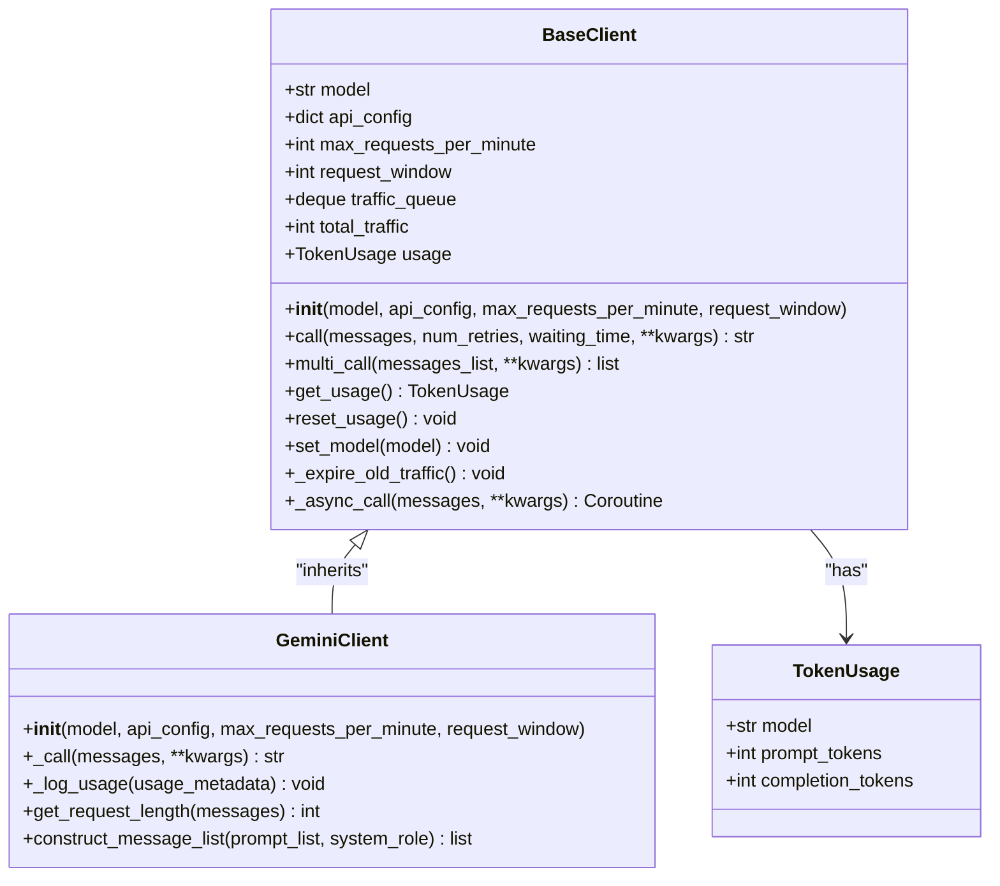
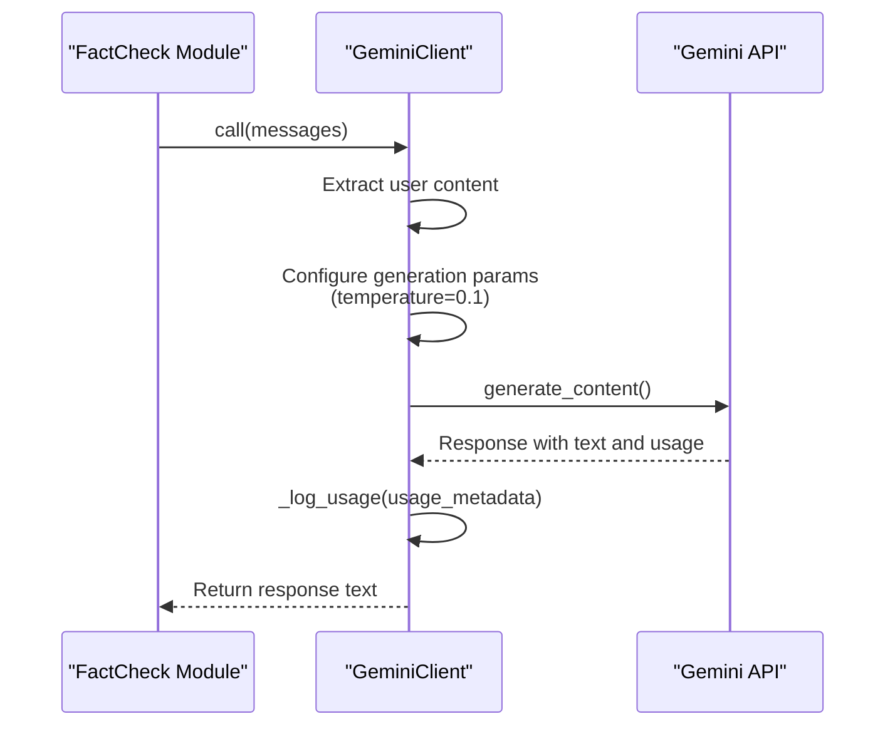
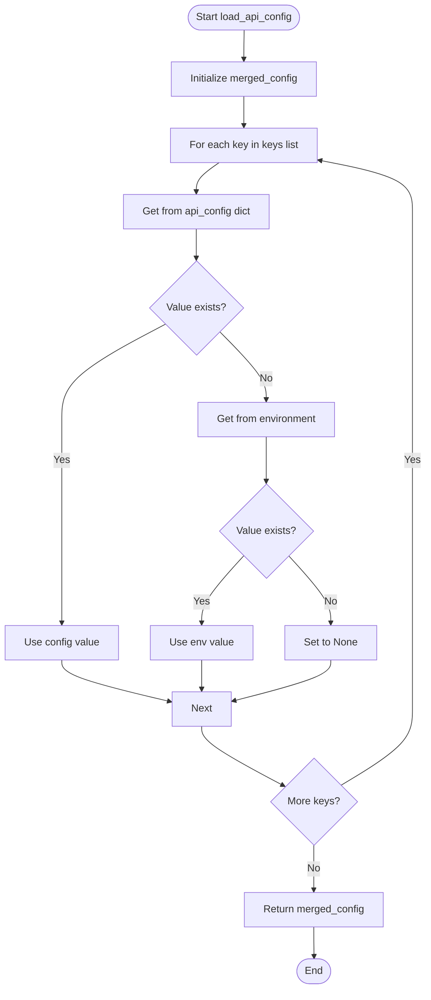
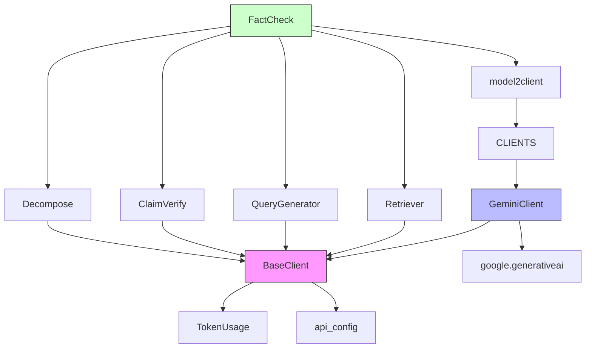

# LLM Configuration

<cite>
**Referenced Files in This Document**   
- [api_config.py](file://factcheck/utils/api_config.py) - *Updated in recent commit*
- [base.py](file://factcheck/utils/llmclient/base.py#L1-L100)
- [gemini_client.py](file://factcheck/utils/llmclient/gemini_client.py#L1-L89)
- [__init__.py](file://factcheck/utils/llmclient/__init__.py#L1-L14)
- [__init__.py](file://factcheck/__init__.py#L1-L239) - *Updated in recent commit*
- [webapp.py](file://webapp.py#L102-L137) - *Added model parameter support*
</cite>

## Update Summary
**Changes Made**   
- Updated Introduction to reflect expanded LLM support beyond Gemini
- Revised Project Structure section to include new model switching capability
- Enhanced Core Components description with details on model-to-client mapping
- Updated Architecture Overview with new configuration flow
- Added new section on Model Configuration and Switching
- Expanded Troubleshooting Guide with new model-related issues
- Updated all code examples and references to reflect current implementation
- Added webapp.py to referenced files for command-line model parameter support

## Table of Contents
1. [Introduction](#introduction)
2. [Project Structure](#project-structure)
3. [Core Components](#core-components)
4. [Architecture Overview](#architecture-overview)
5. [Model Configuration and Switching](#model-configuration-and-switching)
6. [Detailed Component Analysis](#detailed-component-analysis)
7. [Dependency Analysis](#dependency-analysis)
8. [Performance Considerations](#performance-considerations)
9. [Troubleshooting Guide](#troubleshooting-guide)
10. [Conclusion](#conclusion)

## Introduction
The OpenFactVerification system is designed to perform automated fact-checking using large language models (LLMs). A key component of this system is the LLM configuration sub-system, which enables flexible integration with various LLM providers. This document details how the system supports multiple LLM backends, manages API credentials, configures model-specific parameters, and abstracts client interactions through a unified interface. While currently only the Gemini client is implemented, the architecture supports model switching via configuration and is designed to accommodate additional providers such as OpenAI and Anthropic Claude through the client registry pattern.

## Project Structure
The LLM configuration and client logic are organized under the `factcheck/utils/llmclient` directory. This modular structure separates the base abstraction from concrete implementations, promoting extensibility and maintainability. The system now supports model switching through the `--model` parameter and unified configuration dictionary.

```mermaid
graph TD
subgraph "LLM Client Module"
base[base.py<br/>BaseClient]
gemini[gemini_client.py<br/>GeminiClient]
init[__init__.py<br/>Client Registry]
end
subgraph "Configuration & Utilities"
api_config[api_config.py<br/>API Key Management]
data_class[data_class.py<br/>TokenUsage]
end
base --> gemini : "inherits"
init --> base : "imports"
init --> gemini : "imports"
api_config --> base : "provides config"
base --> data_class : "uses TokenUsage"
```

**Diagram sources**
- [base.py](file://factcheck/utils/llmclient/base.py#L1-L100)
- [gemini_client.py](file://factcheck/utils/llmclient/gemini_client.py#L1-L89)
- [__init__.py](file://factcheck/utils/llmclient/__init__.py#L1-L14)
- [api_config.py](file://factcheck/utils/api_config.py#L1-L31)

**Section sources**
- [base.py](file://factcheck/utils/llmclient/base.py#L1-L100)
- [gemini_client.py](file://factcheck/utils/llmclient/gemini_client.py#L1-L89)

## Core Components
The LLM configuration system consists of several core components:
- **BaseClient**: Abstract base class defining the common interface for all LLM clients
- **GeminiClient**: Concrete implementation for Google's Gemini API
- **api_config.py**: Handles loading and merging API keys from environment variables and configuration dictionaries
- **Client Registry (__init__.py)**: Maps model names to their corresponding client classes through the `model2client` function
- **TokenUsage**: Data structure for tracking token consumption across requests

These components work together to provide a pluggable, rate-limited, and usage-tracked interface to LLM services, with support for model-specific configuration through the unified configuration dictionary.

**Section sources**
- [base.py](file://factcheck/utils/llmclient/base.py#L1-L100)
- [gemini_client.py](file://factcheck/utils/llmclient/gemini_client.py#L1-L89)
- [api_config.py](file://factcheck/utils/api_config.py#L1-L31)
- [__init__.py](file://factcheck/utils/llmclient/__init__.py#L1-L14)

## Architecture Overview
The LLM configuration architecture follows a client-factory pattern with environment-based configuration management. It allows different stages of the fact-checking pipeline to use different models while maintaining consistent error handling, rate limiting, and usage tracking. The system now supports model switching via the `--model` parameter and unified configuration dictionary.

```mermaid
graph TB
subgraph "Configuration Layer"
Env[Environment Variables]
ConfigFile[API Config Dictionary]
APIConfig[api_config.py<br/>load_api_config()]
end
subgraph "Client Abstraction"
BaseClient[BaseClient<br/>Abstract Interface]
GeminiClient[GeminiClient<br/>Concrete Implementation]
end
subgraph "Application Layer"
FactCheck[FactCheck Class]
SubModules[Decompose, ClaimVerify, etc.]
CLI[Command Line --model parameter]
end
Env --> APIConfig
ConfigFile --> APIConfig
APIConfig --> BaseClient : "Provides API keys"
BaseClient --> GeminiClient : "Inheritance"
FactCheck --> SubModules : "Uses LLM clients"
SubModules --> BaseClient : "Calls LLMClient interface"
GeminiClient --> GoogleAPI[Gemini API]
CLI --> FactCheck : "Specifies model"
style BaseClient fill:#f9f,stroke:#333
style GeminiClient fill:#bbf,stroke:#333
```

**Diagram sources**
- [api_config.py](file://factcheck/utils/api_config.py#L1-L31)
- [base.py](file://factcheck/utils/llmclient/base.py#L1-L100)
- [gemini_client.py](file://factcheck/utils/llmclient/gemini_client.py#L1-L89)
- [__init__.py](file://factcheck/__init__.py#L1-L239)

## Model Configuration and Switching
The system now supports flexible model configuration and switching through multiple mechanisms. Users can specify different models for different stages of the fact-checking pipeline or use a default model across all stages.

### Default Model Configuration
The `default_model` parameter in the `FactCheck` class constructor sets the default model for all pipeline stages unless overridden:

```python
from factcheck import FactCheck

# Initialize with default model
fact_checker = FactCheck(default_model="gemini-1.5-pro")
```

### Stage-Specific Model Configuration
Different models can be specified for individual pipeline stages:

```python
from factcheck import FactCheck

fact_checker = FactCheck(
    default_model="gemini-1.5-pro",
    decompose_model="gemini-1.5-flash",  # Faster model for decomposition
    claim_verify_model="gemini-1.5-pro"  # More capable model for verification
)
```

### Command-Line Model Switching
The web application supports model switching via the `--model` command-line parameter:

```bash
python webapp.py --model gemini-1.5-flash
```

### Configuration Dictionary
API configuration can be passed as a dictionary, which takes precedence over environment variables:

```python
api_config = {
    "GEMINI_API_KEY": "your-api-key-here"
}

fact_checker = FactCheck(
    default_model="gemini-1.5-pro",
    api_config=api_config
)
```

**Section sources**
- [__init__.py](file://factcheck/__init__.py#L1-L239) - *Updated in recent commit*
- [api_config.py](file://factcheck/utils/api_config.py#L1-L31) - *Updated in recent commit*
- [webapp.py](file://webapp.py#L102-L137) - *Added model parameter support*

## Detailed Component Analysis

### BaseClient Analysis
The `BaseClient` class provides a foundational abstraction for all LLM clients, enforcing a consistent interface and shared functionality such as rate limiting and usage tracking.



**Diagram sources**
- [base.py](file://factcheck/utils/llmclient/base.py#L1-L100)
- [gemini_client.py](file://factcheck/utils/llmclient/gemini_client.py#L1-L89)
- [data_class.py](file://factcheck/utils/data_class.py#L1-L20)

**Section sources**
- [base.py](file://factcheck/utils/llmclient/base.py#L1-L100)

### GeminiClient Implementation
The `GeminiClient` is a concrete implementation of `BaseClient` tailored for Google's Gemini API. It handles authentication, request formatting, and response parsing specific to the Gemini service.



**Diagram sources**
- [gemini_client.py](file://factcheck/utils/llmclient/gemini_client.py#L1-L89)

**Section sources**
- [gemini_client.py](file://factcheck/utils/llmclient/gemini_client.py#L1-L89)

### Configuration Management
The API configuration system loads credentials from both environment variables and optional configuration dictionaries, with the latter taking precedence.



**Diagram sources**
- [api_config.py](file://factcheck/utils/api_config.py#L1-L31)

**Section sources**
- [api_config.py](file://factcheck/utils/api_config.py#L1-L31)

## Dependency Analysis
The LLM configuration system has a clear dependency hierarchy, with higher-level components depending on lower-level abstractions.



**Diagram sources**
- [__init__.py](file://factcheck/__init__.py#L1-L239)
- [base.py](file://factcheck/utils/llmclient/base.py#L1-L100)
- [gemini_client.py](file://factcheck/utils/llmclient/gemini_client.py#L1-L89)
- [api_config.py](file://factcheck/utils/api_config.py#L1-L31)

**Section sources**
- [__init__.py](file://factcheck/__init__.py#L1-L239)

## Performance Considerations
The LLM configuration system incorporates several performance optimizations:
- **Rate Limiting**: The `traffic_queue` deque tracks requests within a sliding time window to prevent exceeding API rate limits
- **Asynchronous Calls**: The `multi_call` method uses asyncio to parallelize multiple LLM requests
- **Retry Logic**: Automatic retries with exponential backoff for transient failures
- **Token Tracking**: Built-in usage monitoring helps optimize cost and performance

When selecting models, consider:
- **Latency**: Smaller models like gemini-1.5-flash may respond faster than gemini-1.5-pro
- **Cost**: Larger models typically consume more tokens and cost more per request
- **Rate Limits**: Gemini has a default limit of 15 requests per minute
- **Temperature Settings**: The system uses a low temperature (0.1) for consistent, deterministic outputs suitable for fact-checking

## Troubleshooting Guide
Common issues and their solutions:

**Invalid API Keys**
- **Symptom**: `KeyError: 'GEMINI_API_KEY'` or authentication errors
- **Solution**: Ensure the GEMINI_API_KEY is set in environment variables or passed in the api_config dictionary

**Rate Limiting Errors**
- **Symptom**: Requests failing or timing out during high-volume processing
- **Solution**: 
  - Reduce `max_requests_per_minute` parameter
  - Implement longer waiting times between retries
  - Consider upgrading your Gemini API quota

**Connection Timeouts**
- **Symptom**: "Failed to get response from LLM Client" after multiple retries
- **Solution**:
  - Increase the `waiting_time` parameter in `call()` method
  - Check network connectivity to Google's API endpoints
  - Verify API key has proper permissions

**Model Not Supported**
- **Symptom**: `ValueError: Model {model_name} not supported`
- **Solution**: Currently only Gemini models are supported. The model name must start with "gemini" (e.g., "gemini-1.5-pro")

**Usage Tracking Issues**
- **Symptom**: Token counts not being recorded properly
- **Solution**: Ensure the `_log_usage()` method is called in the `_call()` implementation and that the API returns usage metadata

**Model Switching Issues**
- **Symptom**: Model parameter not being applied or unrecognized
- **Solution**: 
  - Verify model name starts with "gemini" prefix
  - Check that the model name is passed correctly to the FactCheck constructor
  - Ensure webapp.py command-line arguments are properly configured

**Section sources**
- [base.py](file://factcheck/utils/llmclient/base.py#L1-L100)
- [gemini_client.py](file://factcheck/utils/llmclient/gemini_client.py#L1-L89)
- [api_config.py](file://factcheck/utils/api_config.py#L1-L31)
- [__init__.py](file://factcheck/__init__.py#L1-L239)

## Conclusion
The LLM configuration system in OpenFactVerification provides a robust, extensible framework for integrating large language models into the fact-checking pipeline. Through its abstract `BaseClient` class and concrete `GeminiClient` implementation, it offers a consistent interface for LLM interactions with built-in rate limiting, error handling, and usage tracking. The configuration system securely manages API credentials through environment variables and configuration dictionaries, while the client registry pattern allows for easy extension to support additional LLM providers in the future. The recent addition of model switching via the `--model` parameter and unified configuration dictionary enhances flexibility, enabling different stages of the fact-checking process to use specialized models optimized for their specific tasks, all while maintaining a unified and reliable interface.