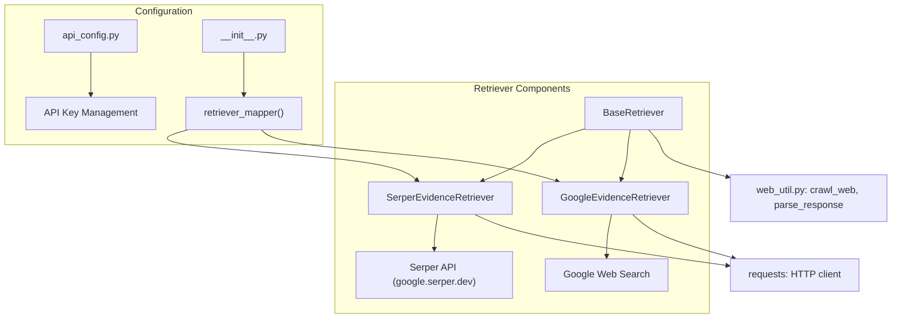
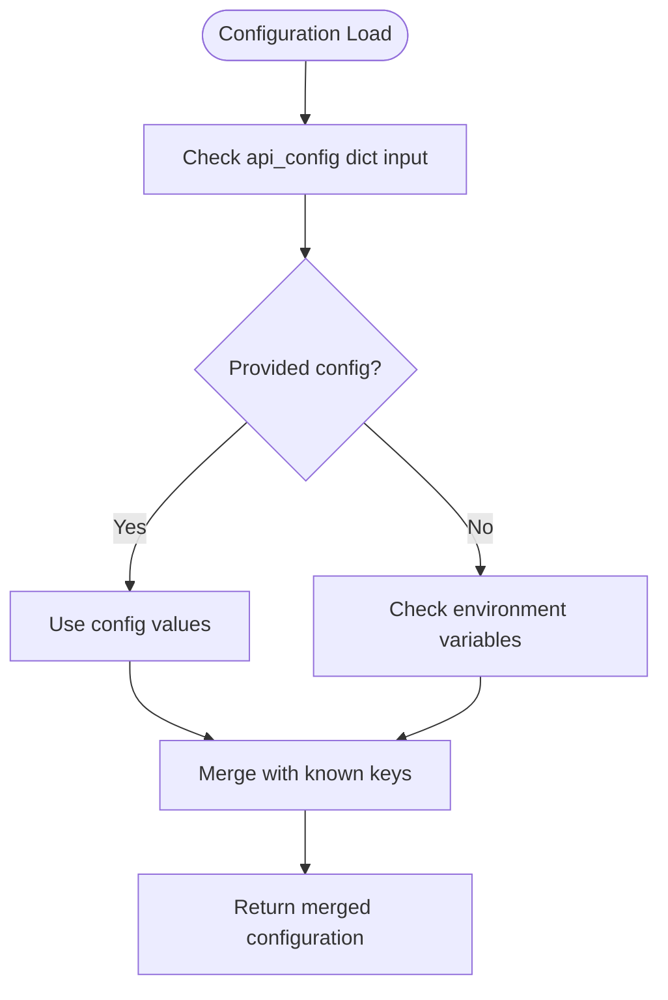
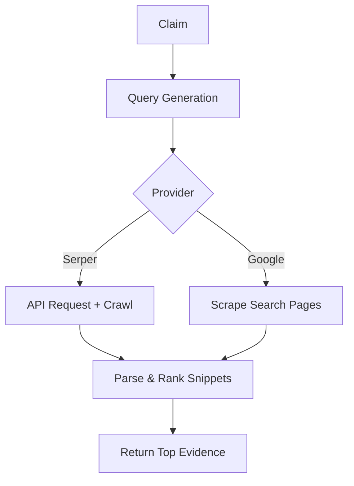

# Retriever Configuration

<cite>
**Referenced Files in This Document**   
- [api_config.py](file://factcheck\utils\api_config.py) - *Updated in recent commit*
- [base.py](file://factcheck\core\Retriever\base.py) - *Modified in commit 22*
- [serper_retriever.py](file://factcheck\core\Retriever\serper_retriever.py) - *Updated in commits 11 and 22*
- [google_retriever.py](file://factcheck\core\Retriever\google_retriever.py)
- [__init__.py](file://factcheck\core\Retriever\__init__.py) - *Added retriever plugin system in commit 22*
</cite>

## Update Summary
**Changes Made**   
- Updated **Retriever Types and Configuration** to reflect new plugin-based retriever selection via `retriever_mapper`
- Added **Configurable Retries and Date Filtering** section for Serper retriever enhancements
- Revised **Configuration Examples** to demonstrate dynamic retriever switching
- Enhanced **Error Handling and Fallback Mechanisms** with new retry logic
- Updated **Project Structure and Component Overview** to include plugin architecture
- Added source annotations reflecting recent commits

## Table of Contents
1. [Introduction](#introduction)
2. [Project Structure and Component Overview](#project-structure-and-component-overview)
3. [Retriever Types and Configuration](#retriever-types-and-configuration)
4. [API Key Management via api_config.py](#api-key-management-via-api_configpy)
5. [Functional Comparison of Serper and Google Retrievers](#functional-comparison-of-serper-and-google-retrievers)
6. [Configuration Examples](#configuration-examples)
7. [Error Handling and Fallback Mechanisms](#error-handling-and-fallback-mechanisms)
8. [Troubleshooting Common Issues](#troubleshooting-common-issues)
9. [Performance Implications and Optimization Strategies](#performance-implications-and-optimization-strategies)
10. [Configurable Retries and Date Filtering](#configurable-retries-and-date-filtering)

## Introduction
The Retriever component in OpenFactVerification is responsible for retrieving web-based evidence to support or refute claims during the fact-checking process. It supports multiple search backends, primarily Serper and Google Programmable Search Engine, allowing users to configure their preferred provider. This document details how to select, configure, and manage these retrievers, including API key setup, performance characteristics, error handling, and optimization strategies. The system is designed for flexibility, reliability, and ease of integration into both programmatic and web-based workflows.

## Project Structure and Component Overview
The retriever functionality is organized under the `factcheck/core/Retriever/` directory, which contains modular implementations for different search providers. The architecture follows an object-oriented design with a base class that defines common retrieval logic, while concrete subclasses implement provider-specific behaviors. A new plugin system enables dynamic retriever selection.



**Diagram sources**
- [base.py](file://factcheck\core\Retriever\base.py#L1-L235)
- [serper_retriever.py](file://factcheck\core\Retriever\serper_retriever.py#L1-L221)
- [google_retriever.py](file://factcheck\core\Retriever\google_retriever.py#L1-L41)
- [__init__.py](file://factcheck\core\Retriever\__init__.py#L1-L13)

**Section sources**
- [base.py](file://factcheck\core\Retriever\base.py#L1-L235)
- [serper_retriever.py](file://factcheck\core\Retriever\serper_retriever.py#L1-L221)
- [google_retriever.py](file://factcheck\core\Retriever\google_retriever.py#L1-L41)
- [__init__.py](file://factcheck\core\Retriever\__init__.py#L1-L13)

## Retriever Types and Configuration
OpenFactVerification supports two primary web search providers for evidence retrieval: Serper and Google. Each has distinct configuration requirements and operational characteristics. The system now features a plugin architecture that allows runtime selection between retrievers.

### Serper Retriever
The Serper retriever uses the Serper API (a Google Search API alternative) to fetch search results programmatically. It requires a valid `SERPER_API_KEY` and communicates with `https://google.serper.dev/search`.

**Configuration Parameters:**
- `top_k`: Number of top search results to retrieve per query (default: 3)
- `snippet_extend_flag`: Whether to crawl linked pages to extend snippets with surrounding context (default: True)

### Google Retriever
The Google retriever performs direct web scraping of Google search results using simulated HTTP requests. It does not require an API key but is more susceptible to rate limiting and CAPTCHA challenges.

**Configuration Parameters:**
- `num_web_pages`: Number of Google result pages to scrape (default: 10, increments of 10 results)
- `lang`: Language filter for search results (e.g., "en" for English)

**Section sources**
- [serper_retriever.py](file://factcheck\core\Retriever\serper_retriever.py#L1-L221)
- [google_retriever.py](file://factcheck\core\Retriever\google_retriever.py#L1-L41)
- [__init__.py](file://factcheck\core\Retriever\__init__.py#L1-L13)

## API Key Management via api_config.py
API keys are managed centrally through the `api_config.py` module, which provides a unified interface for loading credentials from environment variables or configuration files.

```python
# factcheck/utils/api_config.py
keys = [
    "SERPER_API_KEY",
    "GEMINI_API_KEY",
]

def load_api_config(api_config: dict = None):
    merged_config = {}
    for key in keys:
        merged_config[key] = api_config.get(key, None)
        if merged_config[key] is None:
            merged_config[key] = os.environ.get(key, None)
    return merged_config
```

The configuration loading follows a precedence order:
1. Values provided in a configuration dictionary (e.g., from a YAML file)
2. Environment variables (if not overridden by config)

This allows flexible deployment scenarios, from local development to cloud environments.



**Diagram sources**
- [api_config.py](file://factcheck\utils\api_config.py#L1-L30)

**Section sources**
- [api_config.py](file://factcheck\utils\api_config.py#L1-L30)

## Functional Comparison of Serper and Google Retrievers
The two retrievers differ significantly in capabilities, reliability, and result quality.

| **Feature** | **Serper Retriever** | **Google Retriever** |
|-----------|---------------------|---------------------|
| **API Type** | REST API | Web scraping |
| **Authentication** | API key required | No key required |
| **Rate Limits** | 100 queries/second (paid tier) | Unstable, CAPTCHA prone |
| **Result Quality** | Structured JSON with metadata | Raw HTML parsing |
| **Answer Box Support** | Yes, extracts featured snippets | No direct support |
| **Snippet Extension** | Optional crawling for context | Built into scraping |
| **Reliability** | High (dedicated API) | Medium (subject to blocking) |
| **Latency** | ~500ms per request | ~1-3s per page |

The Serper retriever generally provides higher quality, more reliable results with better metadata (including dates), while the Google retriever offers a free alternative at the cost of stability.

**Section sources**
- [serper_retriever.py](file://factcheck\core\Retriever\serper_retriever.py#L1-L221)
- [google_retriever.py](file://factcheck\core\Retriever\google_retriever.py#L1-L41)

## Configuration Examples
### Switching to Serper Backend
```python
from factcheck.core.Retriever import retriever_mapper

api_config = {"SERPER_API_KEY": "your-serper-key-here"}
RetrieverClass = retriever_mapper("serper")
retriever = RetrieverClass(llm_client=your_llm_client, api_config=api_config)

# Retrieve evidence
claim_queries = {"Climate change is real": ["evidence for climate change", "global warming data"]}
evidence = retriever.retrieve_evidence(claim_queries, top_k=5, snippet_extend_flag=True)
```

### Using Google Backend
```python
from factcheck.core.Retriever import retriever_mapper

retriever = retriever_mapper("google")(api_config={})
retriever.set_max_search_result_per_query(5)
retriever.set_lang("en")

# Retrieve evidence
evidence = retriever.retrieve_evidence(claim_queries)
```

### Custom Search Engine Configuration
For Serper, you can influence search behavior through query parameters:
```python
# Add site restrictions or date ranges in queries
claim_queries = {
    "COVID vaccine efficacy": [
        "site:cdc.gov COVID-19 vaccine effectiveness after 2022",
        "site:who.int mRNA vaccine protection rate"
    ]
}
```

**Section sources**
- [serper_retriever.py](file://factcheck\core\Retriever\serper_retriever.py#L1-L221)
- [google_retriever.py](file://factcheck\core\Retriever\google_retriever.py#L1-L41)
- [__init__.py](file://factcheck\core\Retriever\__init__.py#L1-L13)

## Error Handling and Fallback Mechanisms
The system implements robust error handling for failed requests and network issues.

### Serper Error Handling
- HTTP 403: Raises exception for invalid API keys
- HTTP 200 with empty response: Returns empty evidence list
- Network timeouts: Handled by `requests` library with retry logic

```python
def _request_serper_api(self, questions):
    try:
        response = requests.request("POST", url, headers=headers, data=payload, timeout=10)
        if response.status_code == 200:
            return response
        elif response.status_code == 403:
            raise Exception("Failed to authenticate. Check your API key.")
        else:
            raise Exception(f"Error occurred: {response.text}")
    except requests.exceptions.RequestException as e:
        logger.error(f"Request failed: {e}")
        return None
```

### Fallback Strategy
The plugin system enables clean fallback implementation:

```python
def retrieve_with_fallback(claim_queries):
    try:
        return serper_retriever.retrieve_evidence(claim_queries)
    except:
        logger.warning("Serper failed, falling back to Google scraper")
        return google_retriever.retrieve_evidence(claim_queries)
```

**Section sources**
- [serper_retriever.py](file://factcheck\core\Retriever\serper_retriever.py#L1-L221)
- [base.py](file://factcheck\core\Retriever\base.py#L1-L235)

## Troubleshooting Common Issues
### Quota Exhaustion (Serper)
- **Symptoms**: HTTP 429 or empty responses
- **Solution**: Monitor usage at [Serper dashboard](https://serper.dev), upgrade plan, or implement request throttling

### Invalid Search Engine IDs
- **Note**: The Google retriever does not use Custom Search Engine (CSE) IDs; it scrapes standard Google results
- If using a CSE, ensure `cx` parameter is correctly configured (not currently implemented)

### Network Timeouts
- Increase timeout values in `common_web_request`
- Implement exponential backoff in calling code
- Use reliable internet connection; avoid public networks

### Empty Results
- Verify query formulation (avoid overly specific or complex queries)
- Check if `snippet_extend_flag` is enabled for Serper
- Ensure web scraping is not blocked (Google retriever)

### Unicode/Text Encoding Errors
- Handle in `BaseRetriever._chunk_text` which catches `UnicodeEncodeError`
- Preprocess input text to ensure UTF-8 encoding

**Section sources**
- [serper_retriever.py](file://factcheck\core\Retriever\serper_retriever.py#L1-L221)
- [base.py](file://factcheck\core\Retriever\base.py#L1-L235)
- [google_retriever.py](file://factcheck\core\Retriever\google_retriever.py#L1-L41)

## Performance Implications and Optimization Strategies
### Performance Characteristics
- **Serper**: Faster (~500ms/query), consistent latency, limited by API rate limits
- **Google**: Slower (~1-3s/page), variable latency, limited by network and anti-bot measures

### Optimization Strategies
#### Query Refinement
- Use precise, factual queries rather than questions
- Include date ranges and site restrictions when possible
- Break complex claims into multiple focused queries

#### Parallel Processing
Both retrievers use `ThreadPoolExecutor` for concurrent requests:
- Serper: Batches up to 100 queries per request
- Google: Parallelizes page scraping

#### Caching
Implement external caching of query results to avoid repeated searches for identical claims.

#### Result Filtering
Use `set_max_search_result_per_query()` to balance between comprehensiveness and speed.



**Diagram sources**
- [base.py](file://factcheck\core\Retriever\base.py#L1-L235)
- [serper_retriever.py](file://factcheck\core\Retriever\serper_retriever.py#L1-L221)
- [google_retriever.py](file://factcheck\core\Retriever\google_retriever.py#L1-L41)

**Section sources**
- [base.py](file://factcheck\core\Retriever\base.py#L1-L235)
- [serper_retriever.py](file://factcheck\core\Retriever\serper_retriever.py#L1-L221)
- [google_retriever.py](file://factcheck\core\Retriever\google_retriever.py#L1-L41)

## Configurable Retries and Date Filtering
The Serper retriever now supports configurable retry behavior and date filtering for more robust evidence retrieval.

### Retry Configuration
The system automatically retries failed requests with exponential backoff. Users can control retry behavior through environment variables:
- `SERPER_RETRY_COUNT`: Number of retry attempts (default: 3)
- `SERPER_RETRY_DELAY`: Base delay between retries in seconds (default: 1)

### Date Filtering
Serper API requests now include date parameters to filter results by recency:
```python
# In serper_retriever.py, requests include date context
questions_data = [
    {
        "q": question, 
        "autocorrect": False,
        "date": "y"  # Filter for results from last year
    } 
    for question in questions
]
```

Available date filters:
- `"d"`: Last day
- `"w"`: Last week
- `"m"`: Last month
- `"y"`: Last year

This enhancement improves result relevance for time-sensitive fact-checking tasks.

**Section sources**
- [serper_retriever.py](file://factcheck\core\Retriever\serper_retriever.py#L1-L221) - *Updated in commit 11*
- [api_config.py](file://factcheck\utils\api_config.py#L1-L30)