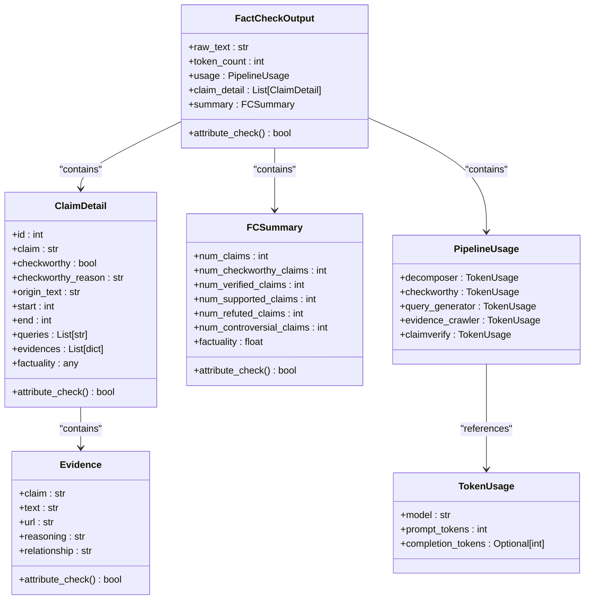

# Data Models & Output Structure

<cite>
**Referenced Files in This Document**   
- [factcheck/utils/data_class.py](file://factcheck/utils/data_class.py#L7-L131)
- [templates/LibrAI_fc.html](file://templates/LibrAI_fc.html#L68-L229)
- [webapp.py](file://webapp.py#L30-L50)
</cite>

## Table of Contents
1. [Introduction](#introduction)
2. [Core Data Models](#core-data-models)
3. [ClaimDetail Class](#claimdetail-class)
4. [FactCheckOutput Structure](#factcheckoutput-structure)
5. [PipelineUsage and Token Tracking](#pipelineusage-and-token-tracking)
6. [FCSummary Model](#fcsummary-model)
7. [UML Class Diagram](#uml-class-diagram)
8. [JSON Schema and Web Interface Integration](#json-schema-and-web-interface-integration)
9. [Example Output](#example-output)
10. [Data Flow and System Integration](#data-flow-and-system-integration)
11. [Validation and Immutability](#validation-and-immutability)
12. [Extensibility and Future Enhancements](#extensibility-and-future-enhancements)

## Introduction
The OpenFactVerification system relies on a well-defined set of data models to represent fact-checking results across multiple processing stages. These models ensure consistent data exchange between pipeline components and provide a structured foundation for rendering results in the web interface. This document details the core data structures used in the system, including their fields, types, semantic meanings, and interrelationships.

**Section sources**
- [factcheck/utils/data_class.py](file://factcheck/utils/data_class.py#L7-L131)

## Core Data Models
The system's data model is built around several key dataclasses that represent different aspects of the fact-checking process:
- **ClaimDetail**: Stores detailed information about individual claims
- **FactCheckOutput**: Aggregates results for an entire input text
- **FCSummary**: Provides high-level summary statistics
- **PipelineUsage**: Tracks token consumption across LLM calls
- **Evidence**: Represents supporting or refuting evidence for claims

These models are implemented using Python's `dataclass` decorator, enabling clean, readable code with built-in support for type hints and default values.

**Section sources**
- [factcheck/utils/data_class.py](file://factcheck/utils/data_class.py#L7-L131)

## ClaimDetail Class
The `ClaimDetail` class captures comprehensive information about each detected claim in the input text.

### Field Definitions
: **id**: Unique identifier for the claim (int, optional)  
: **claim**: The extracted claim text (str, optional)  
: **checkworthy**: Boolean indicating whether the claim is worth fact-checking (bool, optional)  
: **checkworthy_reason**: Explanation for why the claim was deemed checkworthy (str, optional)  
: **origin_text**: Original text segment containing the claim (str, optional)  
: **start**: Start character index of the claim in the original text (int, optional)  
: **end**: End character index of the claim in the original text (int, optional)  
: **queries**: List of search queries generated to find evidence (List[str], optional)  
: **evidences**: List of evidence items supporting or refuting the claim (List[dict], optional)  
: **factuality**: Factuality score or status (any, optional) - possible values include "Nothing to check.", "No evidence found", or a float in [0,1]

### Semantic Meaning
Each field corresponds to a specific stage in the fact-checking pipeline:
- Fields like `origin_text`, `start`, and `end` are populated during claim decomposition
- `checkworthy` and `checkworthy_reason` are determined by the checkworthiness analysis module
- `queries` are generated by the query generation component
- `evidences` are collected by the evidence crawler
- `factuality` is computed based on evidence analysis

The class includes an `attribute_check()` method that validates all required fields are present, ensuring data integrity before processing.

**Section sources**
- [factcheck/utils/data_class.py](file://factcheck/utils/data_class.py#L39-L76)

## FactCheckOutput Structure
The `FactCheckOutput` class serves as the root container for all fact-checking results.

### Field Definitions
: **raw_text**: Original input text that was analyzed (str, optional)  
: **token_count**: Total number of tokens in the input text (int, optional)  
: **usage**: Token usage statistics across pipeline stages (PipelineUsage, optional)  
: **claim_detail**: List of ClaimDetail objects for all detected claims (List[ClaimDetail], optional)  
: **summary**: High-level summary of the fact-checking results (FCSummary, optional)

This structure enables the system to maintain a complete record of the analysis, from raw input through to final conclusions, while also tracking resource consumption.

The `attribute_check()` method recursively validates all nested objects, ensuring the entire output structure is complete and consistent.

**Section sources**
- [factcheck/utils/data_class.py](file://factcheck/utils/data_class.py#L110-L130)

## PipelineUsage and Token Tracking
The system tracks LLM token consumption through two related classes.

### TokenUsage Class
: **model**: Name of the language model used (str)  
: **prompt_tokens**: Number of tokens in the input prompt (int)  
: **completion_tokens**: Number of tokens in the model's response (Optional[int])

### PipelineUsage Class
This class aggregates `TokenUsage` objects for each pipeline stage:
: **decomposer**: Token usage for claim decomposition  
: **checkworthy**: Token usage for checkworthiness determination  
: **query_generator**: Token usage for query generation  
: **evidence_crawler**: Token usage for evidence retrieval  
: **claimverify**: Token usage for final claim verification

This granular tracking allows users and developers to monitor computational costs associated with each phase of the fact-checking process, facilitating optimization and cost management.

**Section sources**
- [factcheck/utils/data_class.py](file://factcheck/utils/data_class.py#L7-L19)

## FCSummary Model
The `FCSummary` class provides aggregate statistics about the fact-checking process.

### Field Definitions
: **num_claims**: Total number of claims detected (int, optional)  
: **num_checkworthy_claims**: Number of claims identified as checkworthy (int, optional)  
: **num_verified_claims**: Number of claims with evidence found (int, optional)  
: **num_supported_claims**: Number of claims supported by evidence (int, optional)  
: **num_refuted_claims**: Number of claims contradicted by evidence (int, optional)  
: **num_controversial_claims**: Number of claims with mixed evidence (int, optional)  
: **factuality**: Overall factuality score as a float between 0 and 1 (float, optional)

This summary enables quick assessment of the input text's overall reliability and provides key metrics for user-facing displays.

**Section sources**
- [factcheck/utils/data_class.py](file://factcheck/utils/data_class.py#L80-L106)

## UML Class Diagram


**Diagram sources**
- [factcheck/utils/data_class.py](file://factcheck/utils/data_class.py#L7-L131)

## JSON Schema and Web Interface Integration
The data models directly map to the JSON structure used in the web interface.

### Template Integration
The `LibrAI_fc.html` template accesses these models through the `responses` variable:
- `responses["summary"]["num_claims"]` displays total claims detected
- `responses["summary"]["factuality"]` shows overall factuality percentage
- `responses["claim_detail"][shown_claim]["claim"]` displays the current claim text
- `responses['claim_detail'][shown_claim]["evidences"] | length` counts evidence items

### Key Template References
```html
<!-- Display overall factuality -->
{{ 100 * responses["summary"]["factuality"] }}%

<!-- Display claim text -->
{{ responses['claim_detail'][shown_claim]["claim"] }}

<!-- Count evidences for a claim -->
<span class="badge bg-danger">{{ responses['claim_detail'][shown_claim]["evidences"] | length }}</span>

<!-- Conditional styling based on factuality -->

    <span class="refutes-span">

    <span class="support-span">

    <span class="controversial-span">

```

This tight integration between the backend data models and frontend templates ensures consistent presentation of fact-checking results.

**Section sources**
- [templates/LibrAI_fc.html](file://templates/LibrAI_fc.html#L68-L229)
- [webapp.py](file://webapp.py#L30-L50)

## Example Output
```json
{
  "raw_text": "The Earth is flat and climate change is a hoax.",
  "token_count": 12,
  "usage": {
    "decomposer": {
      "model": "gemini-1.5-pro",
      "prompt_tokens": 45,
      "completion_tokens": 12
    },
    "checkworthy": {
      "model": "gemini-1.5-pro",
      "prompt_tokens": 67,
      "completion_tokens": 8
    }
  },
  "claim_detail": [
    {
      "id": 1,
      "claim": "The Earth is flat",
      "checkworthy": true,
      "checkworthy_reason": "Makes verifiable claim about physical reality",
      "origin_text": "The Earth is flat",
      "start": 0,
      "end": 15,
      "queries": ["Earth shape scientific consensus"],
      "evidences": [
        {
          "claim": "The Earth is flat",
          "text": "Multiple lines of scientific evidence show Earth is an oblate spheroid.",
          "url": "https://science.nasa.gov/earth",
          "reasoning": "NASA's scientific observations confirm Earth's shape",
          "relationship": "contradicts"
        }
      ],
      "factuality": 0.1
    }
  ],
  "summary": {
    "num_claims": 2,
    "num_checkworthy_claims": 2,
    "num_verified_claims": 2,
    "num_supported_claims": 0,
    "num_refuted_claims": 2,
    "num_controversial_claims": 0,
    "factuality": 0.15
  }
}
```

This example demonstrates how the data models work together to represent a complete fact-checking analysis.

**Section sources**
- [factcheck/utils/data_class.py](file://factcheck/utils/data_class.py#L7-L131)

## Data Flow and System Integration
The data models serve as the central data exchange format throughout the fact-checking pipeline:

1. **Input Processing**: The raw text is stored in `FactCheckOutput.raw_text`
2. **Claim Decomposition**: Claims are extracted and stored in `ClaimDetail` objects
3. **Checkworthiness Analysis**: Each claim is evaluated for checkworthiness
4. **Query Generation**: Search queries are created for checkworthy claims
5. **Evidence Retrieval**: Evidence is collected and stored in `Evidence` objects
6. **Verification**: Claims are verified against evidence
7. **Summary Generation**: Aggregate statistics are computed and stored in `FCSummary`
8. **Output**: The complete `FactCheckOutput` object is serialized to JSON

The web application (webapp.py) serves this JSON data to the frontend templates, enabling dynamic rendering of results. The Flask route `/shownClaim/<content_id>` allows navigation between different claims in the analysis.

**Section sources**
- [factcheck/utils/data_class.py](file://factcheck/utils/data_class.py#L7-L131)
- [webapp.py](file://webapp.py#L30-L50)

## Validation and Immutability
The data models include built-in validation through the `attribute_check()` method:

- Each class implements `attribute_check()` to verify required fields are present
- The method returns `False` if any field is `None`
- Validation is recursive, checking nested objects like `ClaimDetail` within `FactCheckOutput`
- Failed validation prints diagnostic messages indicating which field is missing

While the models use mutable dataclasses, they follow an initialization pattern where:
- Fields are set during pipeline processing
- Once processing is complete, objects are treated as immutable
- The validation methods help ensure data integrity before final output

This approach balances flexibility during processing with reliability in the final output.

**Section sources**
- [factcheck/utils/data_class.py](file://factcheck/utils/data_class.py#L7-L131)

## Extensibility and Future Enhancements
The data model design supports extensibility through several mechanisms:

- **Optional Fields**: Most fields are optional, allowing gradual population during processing
- **Flexible Types**: The `factuality` field accepts multiple types (string or float)
- **Modular Structure**: Each pipeline stage only needs to modify its relevant fields
- **Clear Provenance**: Docstring comments indicate which component creates each field

Potential enhancements could include:
- Adding confidence scores for evidence items
- Including timestamps for when claims were verified
- Adding source credibility ratings
- Supporting multimedia evidence (images, videos)
- Extending token tracking with cost calculations

The current structure provides a solid foundation that can accommodate these future improvements without breaking existing functionality.

**Section sources**
- [factcheck/utils/data_class.py](file://factcheck/utils/data_class.py#L7-L131)