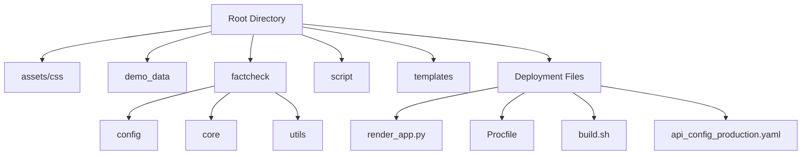
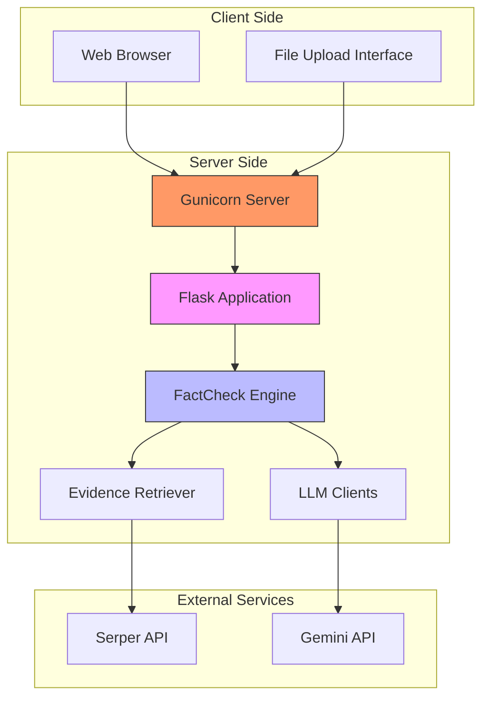
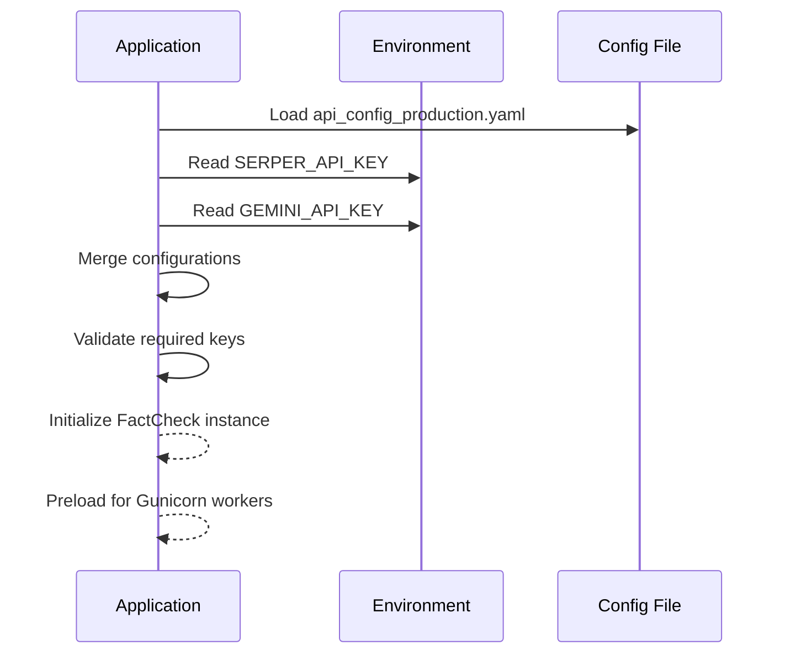
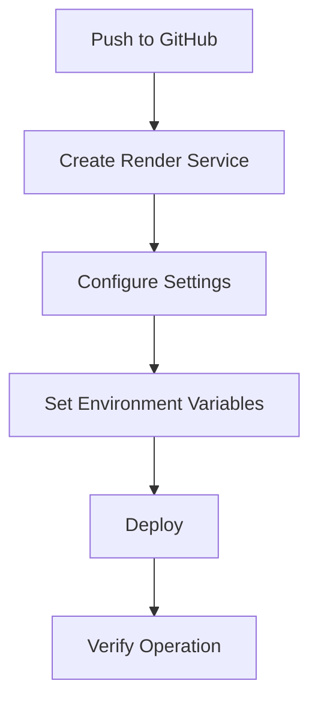
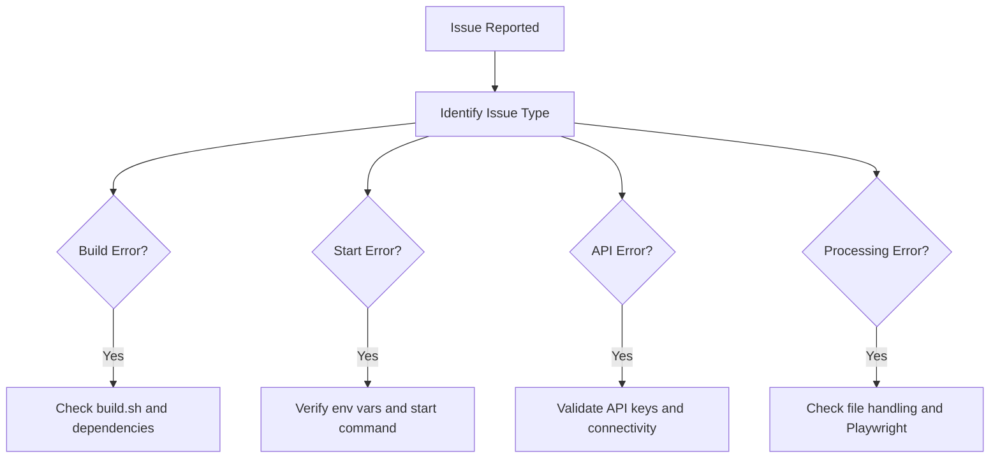

# Deployment & Operations

<cite>
**Referenced Files in This Document**   
- [render_app.py](file://render_app.py) - *Updated in recent commit for Gunicorn configuration*
- [RENDER_DEPLOYMENT.md](file://RENDER_DEPLOYMENT.md)
- [build.sh](file://build.sh)
- [api_config_production.yaml](file://api_config_production.yaml)
- [Procfile](file://Procfile) - *Updated with worker configuration*
- [webapp.py](file://webapp.py) - *Modified for production deployment*
</cite>

## Update Summary
**Changes Made**   
- Updated deployment architecture to reflect Gunicorn usage
- Revised build and start commands to align with production changes
- Added Gunicorn configuration details in deployment and operational sections
- Updated diagrams to reflect new server-side process flow
- Enhanced troubleshooting section with 502 error resolution guidance
- Modified environment variable usage to reflect updated initialization logic

## Table of Contents
1. [Introduction](#introduction)
2. [Project Structure](#project-structure)
3. [Deployment Architecture](#deployment-architecture)
4. [Build Process](#build-process)
5. [Production Configuration Management](#production-configuration-management)
6. [Environment Variable Usage](#environment-variable-usage)
7. [Operational Best Practices](#operational-best-practices)
8. [Deploying on Render](#deploying-on-render)
9. [Troubleshooting Common Deployment Issues](#troubleshooting-common-deployment-issues)
10. [Maintaining Production Stability](#maintaining-production-stability)

## Introduction
This document provides comprehensive guidance for deploying and operating the OpenFactVerification system in production environments. It covers the full deployment lifecycle, including architecture, configuration, environment setup, and operational best practices. The system is designed to verify factual claims in text, images, and videos using advanced language models and evidence retrieval techniques. This guide focuses on deployment via Render, a cloud platform that supports automated builds and scalable web services. Recent updates have improved deployment reliability by implementing Gunicorn as the production WSGI server.

## Project Structure
The OpenFactVerification repository follows a modular structure organized by functionality and component type. The core logic resides in the `factcheck` directory, while web interface components are separated into templates and static assets. Deployment-specific files are located at the root level to support cloud platforms like Render.



**Diagram sources**
- [render_app.py](file://render_app.py#L1-L70)
- [RENDER_DEPLOYMENT.md](file://RENDER_DEPLOYMENT.md#L1-L130)

## Deployment Architecture
The OpenFactVerification system employs a client-server architecture with Flask as the web framework, now served through Gunicorn for production stability. The deployment architecture is optimized for Render's container-based environment, featuring a clear separation between application code, configuration, and runtime dependencies.



**Diagram sources**
- [Procfile](file://Procfile#L1)
- [render_app.py](file://render_app.py#L1-L70)
- [webapp.py](file://webapp.py#L1-L165)

## Build Process
The build process is automated through Render's deployment pipeline using the `build.sh` script. This script ensures all dependencies are installed and required models are downloaded before the application starts.

```mermaid
flowchart TD
Start([Build Initiated]) --> InstallDeps["Install Python Dependencies"]
InstallDeps --> DownloadSpaCy["Download spaCy English Model"]
DownloadSpaCy --> InstallPlaywright["Install Playwright Chromium"]
InstallPlaywright --> Complete["Build Complete"]
Note right of Complete: Build completes successfully<br/>Application ready to start
```

**Section sources**
- [build.sh](file://build.sh#L1-L15)

## Production Configuration Management
Production configuration is managed through a combination of YAML configuration files and environment variables. The `api_config_production.yaml` file serves as a template with placeholders for sensitive credentials, which are injected at runtime via environment variables.

```yaml
# Production API Configuration for OpenFactVerification
SERPER_API_KEY: ""
GEMINI_API_KEY: ""
```

The system prioritizes environment variables over configuration file values, enabling secure credential management without exposing secrets in code. The application now initializes through Gunicorn, which preloads the application and manages multiple worker processes for improved concurrency.



**Section sources**
- [api_config_production.yaml](file://api_config_production.yaml#L1-L12)
- [render_app.py](file://render_app.py#L20-L45)

## Environment Variable Usage
Environment variables are critical for secure and flexible deployment. The system requires specific environment variables to be set in the Render dashboard for successful operation.

**Required Environment Variables:**
- `SERPER_API_KEY`: For web evidence retrieval
- `GEMINI_API_KEY`: For LLM processing and multimodal analysis

**Optional Environment Variables:**
- `GCS_BUCKET_NAME`: Google Cloud Storage bucket name
- `GCS_BASE_URL`: Base URL for GCS assets
- `GOOGLE_APPLICATION_CREDENTIALS`: Service account credentials JSON
- `API_CONFIG_FILE`: Configuration file path (defaults to api_config_production.yaml)

The application validates the presence of required keys during startup and exits with an error message if any are missing, preventing insecure deployments. The `render_app.py` script now serves as the entry point for Gunicorn, ensuring proper initialization before worker processes are spawned.

```python
required_keys = ['SERPER_API_KEY', 'GEMINI_API_KEY']
missing_keys = [key for key in required_keys if not api_config.get(key)]

if missing_keys:
    print(f"❌ Missing required API keys: {missing_keys}")
    exit(1)
```

**Section sources**
- [render_app.py](file://render_app.py#L35-L50)
- [RENDER_DEPLOYMENT.md](file://RENDER_DEPLOYMENT.md#L45-L60)

## Operational Best Practices
To ensure reliable operation in production, follow these best practices:

1. **Configuration Management**: Keep production configuration separate from development settings
2. **Credential Security**: Never commit API keys to version control
3. **Error Monitoring**: Regularly check application logs for errors
4. **Performance Monitoring**: Watch response times and resource usage
5. **Regular Updates**: Keep dependencies updated to benefit from security patches
6. **Gunicorn Optimization**: Monitor worker utilization and adjust --workers parameter based on traffic

The system is designed to run without persistent file storage, enhancing privacy and reducing attack surface. Temporary files are created in memory or temporary directories and cleaned up after processing. With Gunicorn now handling production traffic, ensure adequate memory allocation to support multiple worker processes.

## Deploying on Render
Deploying OpenFactVerification on Render involves several key steps:

### 1. Repository Setup
Push the code to the designated GitHub repository:
```bash
git add .
git commit -m "Ready for Render deployment"
git push origin main
```

### 2. Create Render Service
- Go to [render.com](https://render.com) and sign in with GitHub
- Click "New" → "Web Service"
- Connect the GitHub repository

### 3. Configure Settings
Set the following in the Render dashboard:
- **Environment**: Python 3
- **Build Command**: `./build.sh`
- **Start Command**: `gunicorn --bind 0.0.0.0:$PORT --workers 2 --timeout 120 --worker-connections 1000 --max-requests 1000 --preload render_app:app`
- **Branch**: `main`

### 4. Set Environment Variables
Add the required API keys in the Environment Variables section of the Render dashboard.



**Section sources**
- [RENDER_DEPLOYMENT.md](file://RENDER_DEPLOYMENT.md#L15-L100)
- [Procfile](file://Procfile#L1)

## Troubleshooting Common Deployment Issues
This section addresses common issues encountered during deployment and their solutions.

### Build Fails
**Symptoms**: Deployment fails during the build phase
**Causes and Solutions**:
- Ensure `build.sh` has execute permissions
- Verify internet connectivity during build
- Check for syntax errors in requirements.txt

### App Won't Start
**Symptoms**: Application fails to start after successful build
**Causes and Solutions**:
- Verify all required environment variables are set
- Confirm start command uses Gunicorn with proper parameters
- Check port configuration (uses PORT environment variable)
- Ensure `render_app.py` is properly configured as the application entry point

### 502 Bad Gateway Errors
**Symptoms**: 502 errors after deployment
**Causes and Solutions**:
- Caused by Flask development server timeouts
- Fixed by using Gunicorn with appropriate timeout settings
- Verify Gunicorn timeout is set to 120 seconds in Procfile
- Ensure application responds within timeout window

### API Errors
**Symptoms**: Runtime errors related to API calls
**Causes and Solutions**:
- Confirm SERPER_API_KEY and GEMINI_API_KEY are valid
- Check API usage limits and quotas
- Verify network connectivity to external services

### File Processing Issues
**Symptoms**: Problems with image or video uploads
**Causes and Solutions**:
- Ensure Playwright browsers are properly installed
- Verify temporary directory permissions
- Check file size limits



**Section sources**
- [RENDER_DEPLOYMENT.md](file://RENDER_DEPLOYMENT.md#L95-L120)
- [render_app.py](file://render_app.py#L40-L50)

## Maintaining Production Stability
To maintain production stability, implement the following practices:

1. **Monitoring**: Regularly check application logs in the Render dashboard
2. **Updates**: Periodically update dependencies to address security vulnerabilities
3. **Testing**: Test new features in a staging environment before deployment
4. **Backups**: Maintain backups of configuration files and critical data
5. **Scaling**: Monitor performance and consider upgrading to Render Starter tier for better performance
6. **Gunicorn Tuning**: Adjust worker count and timeout settings based on traffic patterns

The system is designed to be stateless, making it easy to scale and recover from failures. Since no persistent file storage is used, redeployments do not affect existing data.

For optimal performance, consider upgrading from Render's free tier to the Starter plan ($7/month), which provides:
- No sleeping after inactivity
- Faster build times
- Better overall performance
- Improved Gunicorn worker stability

Regularly review the application's resource usage and error logs to proactively address potential issues before they impact users. The Gunicorn configuration with 2 workers, 120-second timeout, and preloading ensures reliable handling of concurrent requests and prevents 502 errors.

**Section sources**
- [RENDER_DEPLOYMENT.md](file://RENDER_DEPLOYMENT.md#L105-L130)
- [render_app.py](file://render_app.py#L60-L70)