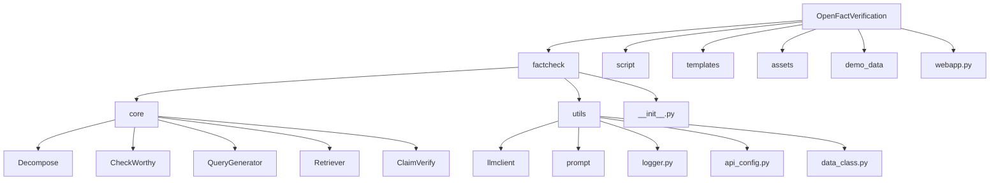
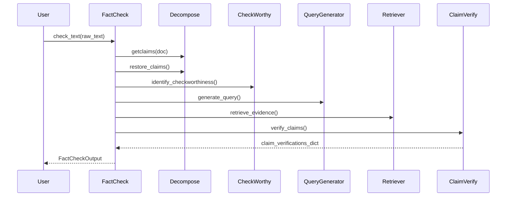
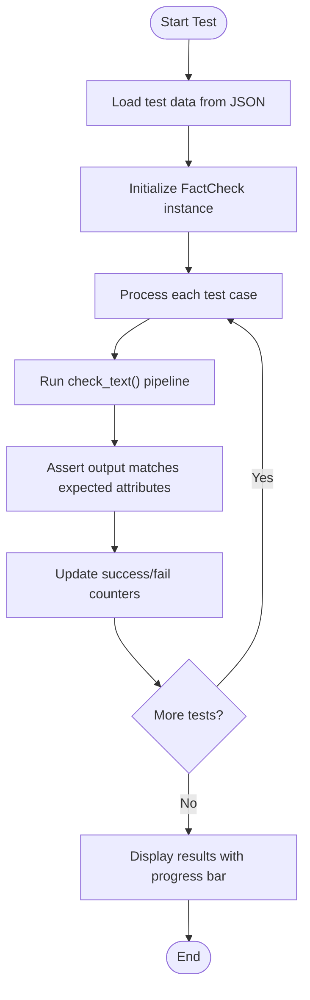
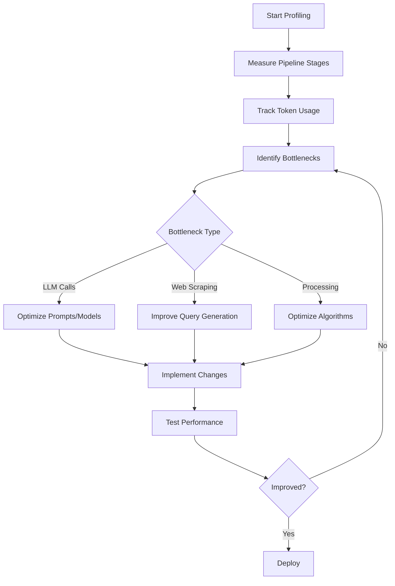

# Development Guide

<cite>
**Referenced Files in This Document**   
- [factcheck/__init__.py](file://factcheck/__init__.py#L1-L239)
- [factcheck/utils/logger.py](file://factcheck/utils/logger.py#L1-L39)
- [script/minimal_test.py](file://script/minimal_test.py#L1-L59)
- [factcheck/utils/llmclient/base.py](file://factcheck/utils/llmclient/base.py#L1-L100)
- [factcheck/core/__init__.py](file://factcheck/core/__init__.py#L1-L6)
- [factcheck/utils/prompt/__init__.py](file://factcheck/utils/prompt/__init__.py)
- [factcheck/core/Retriever/base.py](file://factcheck/core/Retriever/base.py)
- [factcheck/utils/api_config.py](file://factcheck/utils/api_config.py)
- [factcheck/utils/data_class.py](file://factcheck/utils/data_class.py)
- [.pre-commit-config.yaml](file://.pre-commit-config.yaml) - *Added in commit 33*
- [.flake8](file://.flake8) - *Added in commit 33*
- [.github/workflows/python-lint.yml](file://.github/workflows/python-lint.yml) - *Added in commit 33*
- [script/minimal_test.json](file://script/minimal_test.json) - *Added in commit 14*
- [RENDER_DEPLOYMENT.md](file://RENDER_DEPLOYMENT.md) - *Updated in commit 8385c88*
- [.gitignore](file://.gitignore) - *Updated in commit 8385c88*
- [api_config_production.yaml](file://api_config_production.yaml) - *New file for secure deployment*
- [render_app.py](file://render_app.py) - *Added for Render deployment*
- [build.sh](file://build.sh) - *Added for Render deployment*
</cite>

## Update Summary
**Changes Made**  
- Updated **Security Considerations** section to reflect new credential management practices
- Added **Render Deployment Configuration** section to document deployment-specific setup
- Enhanced **Development Environment Setup** with production configuration details
- Updated **Security Considerations** with specific guidance on environment variable usage
- Added references to new deployment-related files and configurations

## Table of Contents
1. [Introduction](#introduction)
2. [Project Structure](#project-structure)
3. [Core Components](#core-components)
4. [Architecture Overview](#architecture-overview)
5. [Development Environment Setup](#development-environment-setup)
6. [Testing and Linting Workflow](#testing-and-linting-workflow)
7. [Running and Writing Unit Tests](#running-and-writing-unit-tests)
8. [Logging System and Debugging](#logging-system-and-debugging)
9. [Code Style and Testing Practices](#code-style-and-testing-practices)
10. [Extending Functionality](#extending-functionality)
11. [Debugging Common Issues](#debugging-common-issues)
12. [Performance Profiling](#performance-profiling)
13. [Security Considerations](#security-considerations)
14. [Contribution Workflow](#contribution-workflow)
15. [Render Deployment Configuration](#render-deployment-configuration)

## Introduction
This Development Guide provides comprehensive instructions for contributing to and extending the OpenFactVerification (Loki) codebase. It covers setting up a development environment, writing and running tests, understanding the logging system, implementing new features, debugging, performance optimization, and security practices. The guide is designed to help developers of all levels contribute effectively to the project.

## Project Structure
The OpenFactVerification repository follows a modular structure organized by functionality. The main components are:

- `factcheck/`: Core package containing all modules for fact-checking.
  - `core/`: Implements the primary pipeline stages (decomposition, checkworthiness, query generation, retrieval, verification).
  - `utils/`: Utility modules including LLM clients, prompts, logging, and data classes.
- `script/`: Contains test scripts like `minimal_test.py`.
- `templates/`: HTML templates for the web interface.
- `assets/`: Static assets such as CSS files.
- `demo_data/`: Sample input data for testing.
- `webapp.py`: Flask-based web application entry point.
- Configuration and dependency files: `pyproject.toml`, `requirements.txt`, `setup.py`.



**Diagram sources**
- [factcheck/__init__.py](file://factcheck/__init__.py#L1-L239)
- Project structure overview

## Core Components
The fact-checking pipeline consists of five main stages implemented as separate classes in the `factcheck.core` module:
- **Decompose**: Splits input text into atomic claims.
- **CheckWorthy**: Identifies which claims are worth verifying.
- **QueryGenerator**: Creates search queries for evidence retrieval.
- **Retriever**: Fetches evidence from external sources (e.g., Google via Serper API).
- **ClaimVerify**: Evaluates claims against retrieved evidence.

These components are orchestrated by the `FactCheck` class in `factcheck/__init__.py`, which serves as the main interface.

**Section sources**
- [factcheck/__init__.py](file://factcheck/__init__.py#L1-L239)
- [factcheck/core/__init__.py](file://factcheck/core/__init__.py#L1-L6)

## Architecture Overview
The system follows a modular, pipeline-based architecture where each component is loosely coupled and can be configured independently. The `FactCheck` class initializes all submodules with appropriate LLM clients and coordinates their execution.



**Diagram sources**
- [factcheck/__init__.py](file://factcheck/__init__.py#L1-L239)
- [factcheck/core/Decompose.py](file://factcheck/core/Decompose.py)
- [factcheck/core/CheckWorthy.py](file://factcheck/core/CheckWorthy.py)
- [factcheck/core/QueryGenerator.py](file://factcheck/core/QueryGenerator.py)
- [factcheck/core/Retriever/base.py](file://factcheck/core/Retriever/base.py)
- [factcheck/core/ClaimVerify.py](file://factcheck/core/ClaimVerify.py)

## Development Environment Setup
To set up a development environment:

1. Clone the repository:
```bash
git clone https://github.com/Libr-AI/OpenFactVerification.git
cd OpenFactVerification
```

2. Install dependencies using either Poetry or pip:
```bash
# Using Poetry
poetry install

# Or using pip
pip install -r requirements.txt
```

3. Install pre-commit hooks for automated code linting and formatting:
```bash
pip install pre-commit
pre-commit install
```

4. Set required environment variables:
```bash
export SERPER_API_KEY=your_serper_api_key
export GEMINI_API_KEY=your_gemini_api_key
```

5. Verify installation by running the minimal test:
```bash
python script/minimal_test.py
```

**Section sources**
- [README.md](file://README.md#L20-L50)
- [requirements.txt](file://requirements.txt)
- [pyproject.toml](file://pyproject.toml)
- [.pre-commit-config.yaml](file://.pre-commit-config.yaml) - *Added in commit 33*
- [.flake8](file://.flake8) - *Added in commit 33*

## Testing and Linting Workflow
The project now includes a pre-commit configuration to ensure code quality and consistency across contributions.

### Pre-commit Configuration
The `.pre-commit-config.yaml` file defines the following hooks:
- **black**: Code formatting to ensure consistent style
- **flake8**: Linting to catch common errors and style violations
- **isort**: Import sorting and organization
- **mypy**: Type checking for Python code

### Linting Workflow
The GitHub Actions workflow `.github/workflows/python-lint.yml` automatically runs linting checks on pull requests to ensure code quality standards are maintained.

To manually run linting checks:
```bash
# Run all pre-commit hooks
pre-commit run --all-files

# Run specific hook
pre-commit run black
```

The `.flake8` configuration file specifies linting rules and exclusions tailored to the project's coding standards.

**Section sources**
- [.pre-commit-config.yaml](file://.pre-commit-config.yaml) - *Added in commit 33*
- [.flake8](file://.flake8) - *Added in commit 33*
- [.github/workflows/python-lint.yml](file://.github/workflows/python-lint.yml) - *Added in commit 33*

## Running and Writing Unit Tests
The project includes a minimal testing framework in `script/minimal_test.py` that validates the end-to-end pipeline.

### Running Tests
Execute the test suite:
```bash
python script/minimal_test.py
```

For Chinese language tests:
```bash
python script/minimal_test.py --lang zh
```

The test loads predefined cases from `minimal_test_en.json`, `minimal_test_zh.json`, and `minimal_test.json`, runs the fact-checking pipeline, and asserts expected outputs.

### Writing Unit Tests
To add new test cases:
1. Edit `minimal_test_en.json`, `minimal_test.json`, or create a new test file.
2. Each test case should include:
   - `response`: Input text to verify
   - `attributes`: Expected output fields to validate

Example test structure:
```json
[
  {
    "response": "The Earth is round.",
    "attributes": {
      "summary.factuality": 1.0
    }
  }
]
```

The `minimal_test.py` script uses `tqdm` for progress visualization and color-coded output (green for success, red for failure).



**Section sources**
- [script/minimal_test.py](file://script/minimal_test.py#L1-L59)
- [script/minimal_test_en.json](file://script/minimal_test_en.json)
- [script/minimal_test_zh.json](file://script/minimal_test_zh.json)
- [script/minimal_test.json](file://script/minimal_test.json) - *Added in commit 14*

## Logging System and Debugging
The logging system is implemented in `factcheck/utils/logger.py` using Python's built-in `logging` module with custom formatting and file rotation.

### Logger Implementation
The `CustomLogger` class:
- Creates both file and console handlers
- Uses timed rotation (`TimedRotatingFileHandler`) for log files
- Formats logs with level, timestamp, filename, line number, and message
- Stores logs in `./log/factcheck_{env}.log` (creates directory if needed)
- Supports environment differentiation via `env` environment variable

Log format:
```
[LEVEL]YYYY-MM-DD HH:MM:SS filename:line_number: message
```

### Adding Structured Logs
To add debugging logs in your code:
```python
from factcheck.utils.logger import CustomLogger
logger = CustomLogger(__name__).getlog()

# Add debug information
logger.info("Processing claim: %s", claim_text)
logger.debug("Query generated: %s", query_list)
```

Logs are automatically generated during pipeline execution, showing:
- Claim extraction results
- Checkworthy claims
- Generated queries
- Retrieved evidence
- Verification results
- Performance timing metrics

**Section sources**
- [factcheck/utils/logger.py](file://factcheck/utils/logger.py#L1-L39)
- [factcheck/__init__.py](file://factcheck/__init__.py#L1-L239)

## Code Style and Testing Practices
Follow these guidelines for code contributions:

### Code Style
- Follow PEP 8 conventions
- Use type hints where appropriate
- Write clear, descriptive variable and function names
- Include docstrings for all classes and methods
- Keep functions focused and within reasonable length
- Adhere to formatting rules enforced by pre-commit hooks (black, isort)

### Testing Practices
- Write tests for new features in `script/minimal_test.py` format
- Ensure test coverage for edge cases
- Validate output structure using `FactCheckOutput.attribute_check()`
- Use descriptive test case descriptions
- Maintain backward compatibility when possible

### Pull Request Submission
- Fork the repository and create a feature branch
- Include clear commit messages
- Reference related issues in PR description
- Ensure all tests and linting checks pass
- Update documentation if necessary
- Expect code review feedback and be responsive

**Section sources**
- [factcheck/__init__.py](file://factcheck/__init__.py#L1-L239)
- [script/minimal_test.py](file://script/minimal_test.py#L1-L59)
- [.pre-commit-config.yaml](file://.pre-commit-config.yaml) - *Added in commit 33*
- General codebase conventions

## Extending Functionality
The system is designed to be extensible for new features.

### Adding a New Retriever
1. Create a new retriever class in `factcheck/core/Retriever/` that inherits from `BaseRetriever`
2. Implement the `retrieve_evidence()` method
3. Register in `retriever_mapper` dictionary in `factcheck/core/Retriever/__init__.py`

### Adding Support for a New LLM Provider
1. Create a new client class in `factcheck/utils/llmclient/` inheriting from `BaseClient`
2. Implement abstract methods (`_call`, `_log_usage`, etc.)
3. Register in `CLIENTS` dictionary in `factcheck/utils/llmclient/__init__.py`
4. Update `model2client` mapping if needed

### Creating Custom Prompt Templates
1. Create a new prompt module in `factcheck/utils/prompt/`
2. Define prompt templates as class attributes or methods
3. Register in `prompt_mapper` dictionary in `factcheck/utils/prompt/__init__.py`
4. Use the prompt name in `FactCheck` initialization

Example usage with custom prompt:
```python
factcheck = FactCheck(prompt="custom_prompt_name")
```

**Section sources**
- [factcheck/utils/llmclient/base.py](file://factcheck/utils/llmclient/base.py#L1-L100)
- [factcheck/core/Retriever/base.py](file://factcheck/core/Retriever/base.py)
- [factcheck/utils/prompt/base.py](file://factcheck/utils/prompt/base.py)
- [factcheck/__init__.py](file://factcheck/__init__.py#L1-L239)

## Debugging Common Issues
Common issues and their solutions:

### API Key Errors
**Symptom**: Authentication failures or "API key not found" errors
**Solution**: 
- Verify environment variables are set: `SERPER_API_KEY`, `GEMINI_API_KEY`
- Or provide API config via YAML file
- Check `api_config.py` for proper loading

### Empty Claim Extraction
**Symptom**: No claims extracted from input text
**Solution**:
- Verify the input text contains factual statements
- Check LLM response parsing in `Decompose.getclaims()`
- Increase `num_seed_retries` parameter
- Review prompt template effectiveness

### Evidence Retrieval Failures
**Symptom**: Claims show "No evidence found"
**Solution**:
- Verify Serper API key and connectivity
- Check query generation quality
- Review claim decomposition for searchability
- Consider implementing fallback retrievers

### Performance Bottlenecks
**Symptom**: Slow pipeline execution
**Solution**:
- Use faster LLM models for non-critical steps
- Enable parallel execution (already used for steps 1-3)
- Cache repeated queries
- Monitor token usage via `PipelineUsage`

**Section sources**
- [factcheck/__init__.py](file://factcheck/__init__.py#L1-L239)
- [factcheck/utils/api_config.py](file://factcheck/utils/api_config.py)
- [factcheck/core/Decompose.py](file://factcheck/core/Decompose.py)
- [factcheck/core/QueryGenerator.py](file://factcheck/core/QueryGenerator.py)

## Performance Profiling
The system includes built-in performance monitoring:

### Timing Metrics
The `FactCheck` class logs execution time for:
- Claim creation (steps 1-3)
- Evidence retrieval (step 4)
- Claim verification (step 5)
- Total pipeline duration

Example log output:
```
== State: Done! 
Total time: 45.23s. (create claims:12.34s ||| retrieve:25.67s ||| verify:7.22s)
```

### Token Usage Tracking
Each LLM client tracks:
- Prompt tokens
- Completion tokens
- Total usage per pipeline

Access usage data:
```python
result = factcheck.check_text(text)
usage = result["usage"]  # Contains token counts per component
```

### Profiling Recommendations
1. Use `time.time()` measurements around critical sections
2. Monitor token usage to optimize costs
3. Profile individual components separately
4. Use Python's `cProfile` for deep performance analysis
5. Consider asynchronous processing for I/O-bound operations



**Diagram sources**
- [factcheck/__init__.py](file://factcheck/__init__.py#L1-L239)
- [factcheck/utils/llmclient/base.py](file://factcheck/utils/llmclient/base.py#L1-L100)
- [factcheck/utils/data_class.py](file://factcheck/utils/data_class.py)

## Security Considerations
### Handling User Input
- Sanitize input text to prevent injection attacks
- Validate input length and format
- Use parameterized prompts to avoid prompt injection
- Implement input size limits

### API Credentials
- Never hardcode API keys in source code
- Use environment variables or secure configuration files
- Set appropriate file permissions for config files
- Rotate API keys regularly
- Use least-privilege API keys when possible
- **Critical Update**: Sensitive credentials are now excluded from version control via `.gitignore` entries for `api_config.yaml` and other credential files
- Production deployments use `api_config_production.yaml` with empty values that are overridden by environment variables

### Data Privacy
- The system processes text input that may contain sensitive information
- Ensure compliance with data protection regulations
- Consider implementing data anonymization
- Provide clear privacy policy for web application users

**Section sources**
- [factcheck/utils/api_config.py](file://factcheck/utils/api_config.py)
- [factcheck/__init__.py](file://factcheck/__init__.py#L1-L239)
- [webapp.py](file://webapp.py)
- [.gitignore](file://.gitignore) - *Updated to exclude sensitive files*

## Contribution Workflow
Follow this process to contribute:

1. **Fork the Repository**: Create your own copy on GitHub
2. **Create Feature Branch**: `git checkout -b feature/your-feature`
3. **Implement Changes**: Follow code style and testing practices
4. **Run Tests and Linting**: Ensure all tests pass including `minimal_test.py` and pre-commit checks
5. **Commit Changes**: Use clear, descriptive commit messages
6. **Push to Branch**: `git push origin feature/your-feature`
7. **Create Pull Request**: Submit for review with detailed description
8. **Address Feedback**: Respond to code review comments
9. **Merge**: After approval, maintainers will merge your PR

Expected code review criteria:
- Code quality and style compliance
- Test coverage and correctness
- Documentation updates
- Backward compatibility
- Performance implications
- Security considerations

**Section sources**
- [README.md](file://README.md#L150-L160)
- [CONTRIBUTING.md](file://docs/CONTRIBUTING.md) (referenced in README)
- [.pre-commit-config.yaml](file://.pre-commit-config.yaml) - *Added in commit 33*
- General repository practices

## Render Deployment Configuration
This section documents the configuration for deploying OpenFactVerification on Render, with enhanced security practices to prevent credential leakage.

### Configuration Files
- **api_config_production.yaml**: Template for production configuration with empty API keys that are populated from environment variables
- **render_app.py**: Entry point for Render deployment that loads configuration and initializes the application
- **build.sh**: Build script that installs dependencies during deployment
- **Procfile**: Specifies the start command for Render

### Security Implementation
The deployment configuration implements multiple security layers:
- API keys are stored as environment variables in Render, not in code
- `.gitignore` explicitly excludes credential files including `api_config.yaml` and JSON credential files
- `api_config_production.yaml` contains empty values for sensitive fields
- The `render_app.py` script validates required API keys before starting the application

### Environment Variables
Required environment variables for deployment:
- `SERPER_API_KEY`: API key for Serper search service
- `GEMINI_API_KEY`: API key for Google Gemini service
- `PORT`: Port number (provided by Render)
- `API_CONFIG_FILE`: Configuration file to load (defaults to `api_config_production.yaml`)

Optional environment variables for GCS:
- `GCS_BUCKET_NAME`: Name of Google Cloud Storage bucket
- `GCS_BASE_URL`: Base URL for GCS access
- `GOOGLE_APPLICATION_CREDENTIALS`: JSON credentials for GCS service account

### Deployment Process
1. Set environment variables in Render dashboard
2. Push code to GitHub
3. Render automatically builds using `build.sh`
4. Application starts with `python render_app.py`
5. System validates API keys and initializes FactCheck instance

**Section sources**
- [RENDER_DEPLOYMENT.md](file://RENDER_DEPLOYMENT.md) - *Updated in commit 8385c88*
- [render_app.py](file://render_app.py) - *Added for deployment*
- [api_config_production.yaml](file://api_config_production.yaml) - *New production config*
- [.gitignore](file://.gitignore) - *Updated to exclude sensitive files*
- [build.sh](file://build.sh) - *Added for deployment*