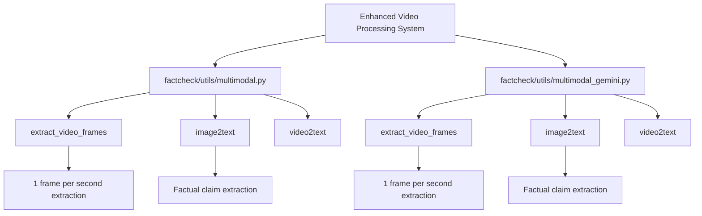
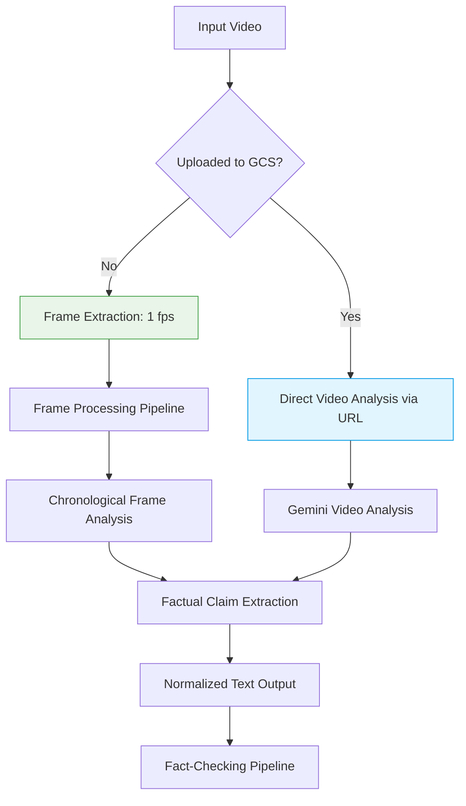
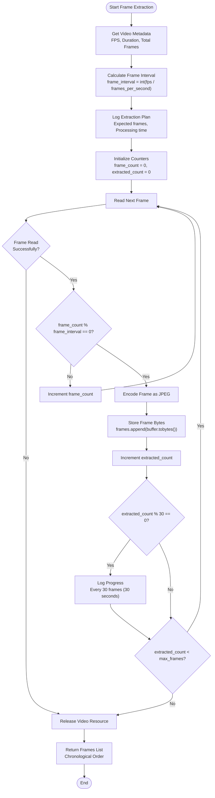
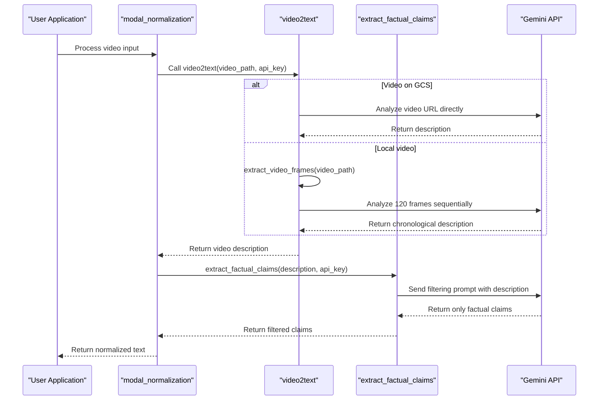
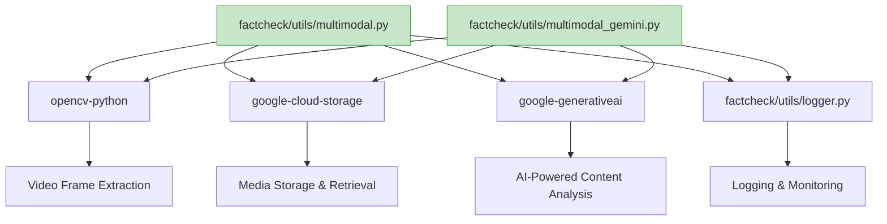

# Enhanced Video Processing

<cite>
**Referenced Files in This Document**   
- [ENHANCED_VIDEO_PROCESSING.md](file://ENHANCED_VIDEO_PROCESSING.md)
- [factcheck/utils/multimodal.py](file://factcheck/utils/multimodal.py)
- [factcheck/utils/multimodal_gemini.py](file://factcheck/utils/multimodal_gemini.py)
- [test_enhanced_video_processing.py](file://test_enhanced_video_processing.py)
- [test_enhanced_frame_extraction.py](file://test_enhanced_frame_extraction.py)
</cite>

## Table of Contents
1. [Introduction](#introduction)
2. [Project Structure](#project-structure)
3. [Core Components](#core-components)
4. [Architecture Overview](#architecture-overview)
5. [Detailed Component Analysis](#detailed-component-analysis)
6. [Dependency Analysis](#dependency-analysis)
7. [Performance Considerations](#performance-considerations)
8. [Troubleshooting Guide](#troubleshooting-guide)
9. [Conclusion](#conclusion)

## Introduction
The Enhanced Video Processing system is a critical component of the OpenFactVerification platform, designed to improve the accuracy and comprehensiveness of video-based fact-checking. The system addresses the limitations of previous frame sampling methods by implementing a more granular and temporally aware approach to video analysis. By extracting one frame per second and maintaining chronological processing, the system ensures comprehensive coverage of video content while preserving temporal context for more accurate fact verification.

## Project Structure
The enhanced video processing functionality is primarily implemented across two key utility modules in the `factcheck/utils` directory. These modules work in parallel to provide consistent video processing capabilities, with special attention to frame extraction, factual content analysis, and integration with the Gemini API for multimodal understanding.

**Diagram sources**
- [factcheck/utils/multimodal.py](file://factcheck/utils/multimodal.py)
- [factcheck/utils/multimodal_gemini.py](file://factcheck/utils/multimodal_gemini.py)

**Section sources**
- [factcheck/utils/multimodal.py](file://factcheck/utils/multimodal.py)
- [factcheck/utils/multimodal_gemini.py](file://factcheck/utils/multimodal_gemini.py)

## Core Components
The core functionality of the enhanced video processing system revolves around three main components: frame extraction, factual content analysis, and multimodal normalization. The system's primary innovation lies in its approach to frame extraction, which has been modified from a fixed count of 10 evenly distributed frames to a time-based sampling of one frame per second. This change dramatically increases coverage, especially for longer videos, while maintaining chronological order to preserve temporal context.

The system also implements sophisticated filtering to extract only verifiable factual information from video content, ignoring visual descriptions, aesthetic opinions, and spatial relationships. This is achieved through a two-layer approach: enhanced prompts that guide the AI model to focus on factual content, and post-processing extraction that filters out non-factual elements.

**Section sources**
- [ENHANCED_VIDEO_PROCESSING.md](file://ENHANCED_VIDEO_PROCESSING.md)
- [factcheck/utils/multimodal.py](file://factcheck/utils/multimodal.py#L329-L393)
- [factcheck/utils/multimodal_gemini.py](file://factcheck/utils/multimodal_gemini.py#L278-L342)

## Architecture Overview
The enhanced video processing architecture follows a pipeline pattern where video content is progressively transformed from raw media to structured factual claims. The system can handle both direct video analysis via URL and local frame-by-frame processing, providing flexibility in deployment scenarios. When videos are uploaded to Google Cloud Storage, the system can analyze them directly; otherwise, it falls back to extracting frames locally.

The architecture emphasizes chronological processing, ensuring that frames are analyzed in the order they appear in the video. This temporal awareness allows the system to track the progression of facts and maintain context across the video timeline. Memory management is implemented through frame limits (300 frames maximum, equivalent to 5 minutes of content), while API optimization is achieved by limiting the number of frames sent to the Gemini API to 120 to prevent timeouts.

**Diagram sources**
- [factcheck/utils/multimodal.py](file://factcheck/utils/multimodal.py)
- [factcheck/utils/multimodal_gemini.py](file://factcheck/utils/multimodal_gemini.py)

## Detailed Component Analysis

### Frame Extraction Analysis
The frame extraction component has been completely redesigned to provide comprehensive video coverage. Instead of the previous approach of extracting only 10 frames evenly distributed throughout the video, the enhanced system extracts one frame per second, significantly increasing the density of sampling.

#### For Complex Logic Components:

**Diagram sources**
- [factcheck/utils/multimodal.py](file://factcheck/utils/multimodal.py#L329-L393)
- [factcheck/utils/multimodal_gemini.py](file://factcheck/utils/multimodal_gemini.py#L278-L342)

**Section sources**
- [factcheck/utils/multimodal.py](file://factcheck/utils/multimodal.py#L329-L393)
- [factcheck/utils/multimodal_gemini.py](file://factcheck/utils/multimodal_gemini.py#L278-L342)

### Factual Content Analysis
The factual content analysis component is responsible for transforming visual information into structured, verifiable claims. This process involves two stages: initial content description by the Gemini model and subsequent filtering to extract only factual claims.

#### For API/Service Components:

**Diagram sources**
- [factcheck/utils/multimodal.py](file://factcheck/utils/multimodal.py)
- [factcheck/utils/multimodal_gemini.py](file://factcheck/utils/multimodal_gemini.py)

**Section sources**
- [factcheck/utils/multimodal.py](file://factcheck/utils/multimodal.py)
- [factcheck/utils/multimodal_gemini.py](file://factcheck/utils/multimodal_gemini.py)

## Dependency Analysis
The enhanced video processing system has several key dependencies that enable its functionality. The primary external dependencies are OpenCV for video frame extraction, Google Cloud Storage for media storage, and the Google Generative AI SDK for vision processing. These dependencies are imported and utilized across both `multimodal.py` and `multimodal_gemini.py` modules.

The system also depends on internal components such as the logger utility for monitoring and the API configuration system for managing credentials and service endpoints. The dependency structure is designed to be modular, allowing for consistent functionality across different implementation files while maintaining separation of concerns.

**Diagram sources**
- [factcheck/utils/multimodal.py](file://factcheck/utils/multimodal.py)
- [factcheck/utils/multimodal_gemini.py](file://factcheck/utils/multimodal_gemini.py)
- [factcheck/utils/logger.py](file://factcheck/utils/logger.py)

**Section sources**
- [factcheck/utils/multimodal.py](file://factcheck/utils/multimodal.py)
- [factcheck/utils/multimodal_gemini.py](file://factcheck/utils/multimodal_gemini.py)

## Performance Considerations
The enhanced video processing system incorporates several performance optimizations to balance comprehensiveness with efficiency. The most significant optimization is the 300-frame maximum limit, which prevents memory issues when processing long videos (equivalent to approximately 5 minutes of content at 1 frame per second). For API calls, an additional limit of 120 frames is applied to prevent timeouts during Gemini API requests.

The system implements progress tracking with logging every 30 frames (approximately every 30 seconds of video content), providing real-time feedback during long processing tasks. Frame extraction is optimized by calculating the precise interval based on the video's actual FPS, ensuring accurate 1-second sampling regardless of the source video's frame rate.

Memory efficiency is achieved by encoding frames as JPEG bytes immediately after extraction and storing only the binary data rather than keeping full OpenCV frame objects in memory. The chronological processing approach also enables efficient streaming of frames to the analysis pipeline without requiring all frames to be stored simultaneously.

## Troubleshooting Guide
When encountering issues with the enhanced video processing system, consider the following common problems and solutions:

**Section sources**
- [test_enhanced_video_processing.py](file://test_enhanced_video_processing.py)
- [test_enhanced_frame_extraction.py](file://test_enhanced_frame_extraction.py)
- [ENHANCED_VIDEO_PROCESSING.md](file://ENHANCED_VIDEO_PROCESSING.md)

### Frame Extraction Issues
If frame extraction is failing or producing unexpected results:
1. Verify that OpenCV is properly installed and can read the video format
2. Check that the video file path is accessible and not corrupted
3. Ensure that the system has sufficient memory for processing, especially for long videos
4. Review the logs for specific error messages from the `extract_video_frames` function

### API Connection Problems
For issues with Gemini API connectivity:
1. Confirm that the Gemini API key is correctly configured
2. Verify Google Cloud Storage credentials if using GCS integration
3. Check network connectivity to the Gemini API endpoints
4. Ensure that the API quota has not been exceeded

### Incomplete Factual Extraction
If factual claims are not being properly extracted:
1. Review the enhanced prompts in `image2text` and `video2text` functions
2. Verify that the two-layer filtering (prompt + claim extraction) is functioning
3. Check that the `extract_factual_claims` function is receiving sufficient context
4. Test with the example scenarios in `test_enhanced_video_processing.py` to validate the expected behavior

## Conclusion
The enhanced video processing system represents a significant improvement over the previous implementation, addressing the critical limitation of sparse frame sampling that could miss important factual content. By extracting one frame per second and maintaining chronological processing, the system provides comprehensive coverage of video content while preserving temporal context for more accurate fact verification.

The dual implementation across `multimodal.py` and `multimodal_gemini.py` ensures consistency in functionality while allowing for potential specialization. The system's design incorporates important safeguards such as memory management limits and progress tracking, making it robust for production use. The focus on extracting only verifiable factual claims, while filtering out visual descriptions and aesthetic opinions, aligns perfectly with the fact-checking mission of the overall platform.

Future enhancements could include adaptive frame rate sampling based on scene changes, integration with audio transcription for additional factual context, and improved handling of text overlays and captions within videos.