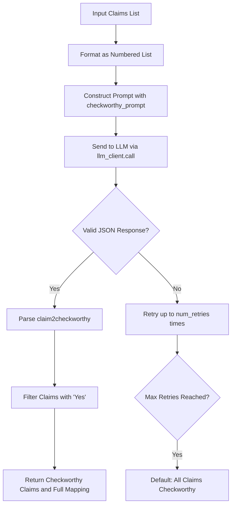
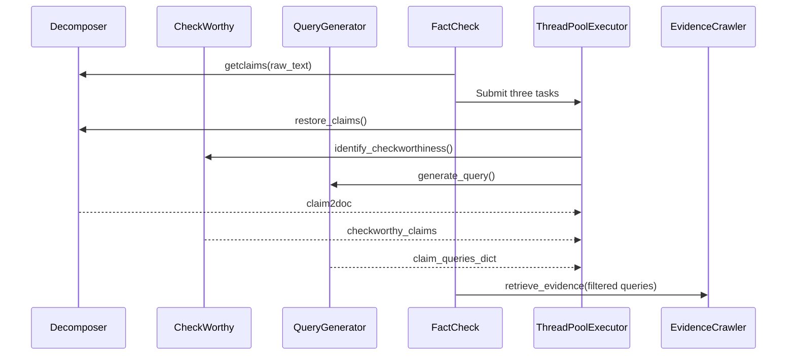

# Checkworthiness Assessment

<cite>
**Referenced Files in This Document**   
- [CheckWorthy.py](file://factcheck/core/CheckWorthy.py)
- [chatgpt_prompt.py](file://factcheck/utils/prompt/chatgpt_prompt.py)
- [factcheck/__init__.py](file://factcheck/__init__.py)
</cite>

## Table of Contents
1. [Introduction](#introduction)
2. [CheckWorthy Module Overview](#checkworthy-module-overview)
3. [Checkworthiness Evaluation Criteria](#checkworthiness-evaluation-criteria)
4. [Implementation and Code Flow](#implementation-and-code-flow)
5. [Configuration and Sensitivity Tuning](#configuration-and-sensitivity-tuning)
6. [Integration with FactCheck Pipeline](#integration-with-factcheck-pipeline)
7. [Failure Modes and Mitigation Strategies](#failure-modes-and-mitigation-strategies)
8. [Performance Implications and Parallelization](#performance-implications-and-parallelization)

## Introduction
The Checkworthiness Assessment module is a critical component of the Loki fact-checking pipeline. It determines whether a decomposed claim is factual, specific, and verifiable before proceeding to evidence retrieval and verification. This filtering step ensures computational efficiency and accuracy by focusing only on claims that can be objectively validated. The module leverages large language models (LLMs) to classify claims based on predefined criteria for checkworthiness.

## CheckWorthy Module Overview
The `CheckWorthy.py` module implements a classifier that evaluates whether a given claim is worth fact-checking. It operates as part of the larger `FactCheck` pipeline and is responsible for filtering out non-verifiable statements such as opinions, vague references, or tautologies.

```python
class Checkworthy:
    def __init__(self, llm_client, prompt):
        self.llm_client = llm_client
        self.prompt = prompt

    def identify_checkworthiness(self, texts: list[str], num_retries: int = 3, prompt: str = None) -> list[str]:
        ...
```

The module uses an LLM client and a structured prompt to evaluate each claim. If the LLM fails to return a valid response after multiple retries, the system defaults to treating all claims as checkworthy to avoid false negatives.

**Section sources**
- [CheckWorthy.py](file://factcheck/core/CheckWorthy.py#L1-L53)

## Checkworthiness Evaluation Criteria
The module applies three primary criteria to determine if a claim is checkworthy:

1. **Opinion vs. Fact**: Statements expressing personal beliefs or subjective views are classified as non-checkworthy. Only objective assertions are considered.
2. **Clarity and Specificity**: Claims must contain unambiguous references. Pronouns like "he" or "she" without clear antecedents are deemed unverifiable.
3. **Presence of Factual Information**: Even incorrect statements are considered checkworthy if they assert verifiable facts (e.g., "Obama is president of the UK" is checkworthy despite being false).

These criteria are encoded in the `checkworthy_prompt` used by the LLM:

```text
Your task is to evaluate each provided statement to determine if it presents information whose factuality can be objectively verified by humans...
```

Example outputs include:
- `"Gary Smith is a distinguished professor of economics.": "Yes (...)"`
- `"He is a professor at MBZUAI.": "No (...)"`

**Section sources**
- [chatgpt_prompt.py](file://factcheck/utils/prompt/chatgpt_prompt.py#L50-L100)

## Implementation and Code Flow
The `identify_checkworthiness` method processes a list of claims by formatting them into a single input string and sending it to the LLM for classification. The response is expected in JSON format, mapping each claim to "Yes" or "No" with a rationale.



**Diagram sources**
- [CheckWorthy.py](file://factcheck/core/CheckWorthy.py#L15-L53)

**Section sources**
- [CheckWorthy.py](file://factcheck/core/CheckWorthy.py#L15-L53)

## Configuration and Sensitivity Tuning
The sensitivity of the checkworthiness filter can be adjusted through several configuration options:

- **`num_retries`**: Controls how many times the LLM is queried before defaulting to full verification. Higher values increase reliability but also latency.
- **`prompt`**: Allows overriding the default prompt for custom evaluation logic.
- **Model selection**: The `checkworthy_model` parameter in `FactCheck.__init__` allows using different LLMs (e.g., GPT-4 vs. GPT-3.5) for more nuanced assessments.

In the main `FactCheck` class:

```python
def __init__(
    self,
    default_model: str = "gpt-4o",
    checkworthy_model: str = None,
    ...
):
    self.checkworthy = Checkworthy(llm_client=self.checkworthy_model, prompt=self.prompt)
```

This enables fine-tuning of the checkworthiness threshold based on use case requirements.

**Section sources**
- [factcheck/__init__.py](file://factcheck/__init__.py#L1-L239)

## Integration with FactCheck Pipeline
The CheckWorthy module is integrated into the main `check_text` pipeline, where it runs in parallel with claim origin restoration and query generation:



Only claims marked as checkworthy proceed to evidence retrieval, optimizing downstream processing.

**Diagram sources**
- [factcheck/__init__.py](file://factcheck/__init__.py#L50-L100)

**Section sources**
- [factcheck/__init__.py](file://factcheck/__init__.py#L50-L100)

## Failure Modes and Mitigation Strategies
### Common Failure Modes
1. **False Negatives**: Valid claims incorrectly classified as non-checkworthy.
2. **Parsing Errors**: LLM returns malformed JSON, causing evaluation failure.
3. **Ambiguous References**: Claims with unclear pronouns may be incorrectly filtered.

### Mitigation Strategies
- **Retry Mechanism**: Up to 3 retries with different seeds improve response reliability.
- **Default Fallback**: When parsing fails, all claims are treated as checkworthy.
- **Logging**: Errors and inputs are logged for debugging and model improvement.
- **Prompt Engineering**: Clear instructions and examples in the prompt reduce ambiguity.

```python
try:
    claim2checkworthy = eval(response)
    ...
except Exception as e:
    logger.error(f"====== Error: {e}, the LLM response is: {response}")
```

**Section sources**
- [CheckWorthy.py](file://factcheck/core/CheckWorthy.py#L30-L50)

## Performance Implications and Parallelization
The checkworthiness assessment runs sequentially per batch of claims, which can become a bottleneck for long texts with many decomposed statements. However, the current implementation mitigates this by:

1. **Parallel Execution**: Running alongside claim restoration and query generation using `ThreadPoolExecutor`.
2. **Batch Processing**: Evaluating multiple claims in a single LLM call reduces API overhead.
3. **Early Filtering**: Reducing the number of claims passed to evidence retrieval saves significant time and cost.

Potential improvements include:
- Implementing asynchronous LLM calls for large claim sets.
- Caching results for repeated claims.
- Using lightweight models for initial filtering before applying more powerful LLMs.

Despite sequential processing within the module, its integration into the parallel pipeline ensures minimal impact on overall throughput.

**Section sources**
- [factcheck/__init__.py](file://factcheck/__init__.py#L70-L90)
- [CheckWorthy.py](file://factcheck/core/CheckWorthy.py#L15-L53)