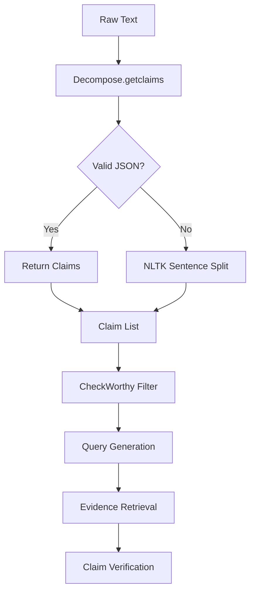

# Claim Decomposition

<cite>
**Referenced Files in This Document**   
- [factcheck/core/Decompose.py](file://factcheck/core/Decompose.py#L1-L138)
- [factcheck/utils/data_class.py](file://factcheck/utils/data_class.py#L1-L132)
- [factcheck/config/sample_prompt.yaml](file://factcheck/config/sample_prompt.yaml#L1-L107)
- [factcheck/__init__.py](file://factcheck/__init__.py#L92-L237)
</cite>

## Table of Contents
1. [Introduction](#introduction)  
2. [Core Functionality of Claim Decomposition](#core-functionality-of-claim-decomposition)  
3. [Internal Logic and Claim Boundary Detection](#internal-logic-and-claim-boundary-detection)  
4. [Prompt Design and LLM Interaction](#prompt-design-and-llm-interaction)  
5. [Handling Negations and Contextual References](#handling-negations-and-contextual-references)  
6. [Integration with FactCheck Orchestrator](#integration-with-factcheck-orchestrator)  
7. [Error Handling and Fallback Strategies](#error-handling-and-fallback-strategies)  
8. [Performance Considerations](#performance-considerations)  
9. [Customization and Prompt Engineering](#customization-and-prompt-engineering)  
10. [Troubleshooting Common Issues](#troubleshooting-common-issues)  
11. [Conclusion](#conclusion)

## Introduction

The Claim Decomposition module, implemented in `Decompose.py`, is a critical component of the OpenFactVerification system. It is responsible for transforming raw input text into a set of atomic, verifiable claims. This process enables downstream modules—such as check-worthiness detection, query generation, and evidence retrieval—to operate on discrete factual units rather than unstructured prose. The decomposition is performed using Large Language Model (LLM) prompting, with fallback mechanisms based on rule-based sentence segmentation.

This document provides a comprehensive analysis of the `Decompose` class, its integration with the broader pipeline, and its role in enabling accurate and scalable fact-checking.

**Section sources**  
- [factcheck/core/Decompose.py](file://factcheck/core/Decompose.py#L1-L138)

## Core Functionality of Claim Decomposition

The `Decompose` class serves as the primary interface for breaking down input documents into individual claims. It leverages an LLM client and a structured prompt to perform semantic decomposition, ensuring that each resulting claim is self-contained and factually independent.

Key responsibilities include:
- **Claim Extraction**: Using LLMs to identify and isolate atomic factual statements.
- **Context Preservation**: Mapping claims back to their original text spans for traceability.
- **Fallback Mechanism**: Reverting to NLTK-based sentence splitting when LLM parsing fails.

The module outputs a list of strings representing individual claims, which are later enriched into `ClaimDetail` objects containing metadata such as origin span and check-worthiness.

```python
class Decompose:
    def __init__(self, llm_client, prompt):
        self.llm_client = llm_client
        self.prompt = prompt
        self.doc2sent = self._nltk_doc2sent
```

**Section sources**  
- [factcheck/core/Decompose.py](file://factcheck/core/Decompose.py#L1-L20)

## Internal Logic and Claim Boundary Detection

The `getclaims()` method is the core function responsible for decomposing a document into claims. It constructs a user input prompt using a predefined template and sends it to the LLM via the `llm_client`.

The LLM is expected to return a JSON object with a `"claims"` key containing a list of strings. The method attempts up to `num_retries` times (default: 3) to obtain a valid response. Each retry uses a deterministic seed (`42 + i`) to ensure reproducibility.

If the LLM fails to return a valid list, the system falls back to `_nltk_doc2sent()`, which uses `nltk.sent_tokenize()` to split the document into sentences. Only sentences with at least three characters are retained.

```python
def getclaims(self, doc: str, num_retries: int = 3, prompt: str = None) -> list[str]:
    user_input = self.prompt.decompose_prompt.format(doc=doc).strip()
    messages = self.llm_client.construct_message_list([user_input])
    claims = None
    for i in range(num_retries):
        response = self.llm_client.call(messages=messages, num_retries=1, seed=42 + i)
        try:
            claims = eval(response)["claims"]
            if isinstance(claims, list) and len(claims) > 0:
                break
        except Exception as e:
            logger.error(f"Parse LLM response error {e}, response is: {response}")
    if isinstance(claims, list):
        return claims
    else:
        logger.info("Fallback to NLTK sentence splitting.")
        claims = self.doc2sent(doc)
    return claims
```

**Section sources**  
- [factcheck/core/Decompose.py](file://factcheck/core/Decompose.py#L33-L68)

## Prompt Design and LLM Interaction

The decomposition behavior is governed by the `decompose_prompt` defined in `sample_prompt.yaml`. This prompt instructs the LLM to:
- Output a JSON with a single key `"claims"` mapping to a list of strings.
- Ensure each claim is concise (<15 words), self-contained, and context-independent.
- Avoid pronouns and vague references (e.g., "he", "the company").
- Generate at least one claim per sentence.

Example:
```yaml
decompose_prompt: |
  Your task is to decompose the text into atomic claims.
  The answer should be a JSON with a single key "claims", with the value of a list of strings...
  
  Text: Mary is a five-year old girl, she likes playing piano and she doesn't like cookies.
  Output:
  {"claims": ["Mary is a five-year old girl.", "Mary likes playing piano.", "Mary doesn't like cookies."]}
```

This structured output format ensures compatibility with downstream parsing logic.

**Section sources**  
- [factcheck/config/sample_prompt.yaml](file://factcheck/config/sample_prompt.yaml#L1-L15)

## Handling Negations and Contextual References

The prompt explicitly discourages the use of ambiguous references, requiring claims to use full names instead of pronouns. This ensures that negations (e.g., "Mary doesn't like cookies") are preserved as standalone, verifiable facts.

The system handles negations by treating them as first-class claims. For example, "She doesn't like cookies" becomes "Mary doesn't like cookies", preserving both the subject and the negative assertion.

No special preprocessing is applied to detect negations; instead, the LLM is expected to preserve logical structure based on the prompt guidelines.

**Section sources**  
- [factcheck/config/sample_prompt.yaml](file://factcheck/config/sample_prompt.yaml#L5-L15)

## Integration with FactCheck Orchestrator

The `Decompose` module integrates with the main `FactCheck` orchestrator in `factcheck/__init__.py`. After decomposition, claims are passed through a multi-stage pipeline:

1. **Decomposition**: `decomposer.getclaims()` → list of claims  
2. **Check-worthiness**: `checkworthy.identify_checkworthiness()` → filtered claims  
3. **Query Generation**: `query_generator.generate_query()` → search queries  
4. **Evidence Retrieval**: `evidence_crawler.retrieve_evidence()` → web evidence  
5. **Verification**: `claimverify.verify_claims()` → factuality score  

The `claim2doc` mapping, generated via `restore_claims()`, links each claim back to its original text span, enabling traceable fact-checking results.



**Diagram sources**  
- [factcheck/core/Decompose.py](file://factcheck/core/Decompose.py#L33-L68)  
- [factcheck/__init__.py](file://factcheck/__init__.py#L92-L121)

## Error Handling and Fallback Strategies

The system implements robust error handling:
- **LLM Response Parsing**: Uses `eval(response)` to parse JSON output, wrapped in try-except blocks.
- **Retry Mechanism**: Up to 3 retries with deterministic seeds for reproducibility.
- **Fallback to Rule-Based Splitting**: If all LLM attempts fail, NLTK sentence tokenizer is used.
- **Logging**: All parsing errors are logged with the raw response and prompt for debugging.

The `restore_claims()` method also includes validation logic to ensure claim-to-text mappings are non-overlapping and contiguous.

```python
def restore_claims(self, doc: str, claims: list, num_retries: int = 3, prompt: str = None) -> dict[str, dict]:
    ...
    try:
        claim2doc = eval(response)
        assert len(claim2doc) == len(claims)
        claim2doc_detail, flag = restore(claim2doc)
        if flag:
            return claim2doc_detail
    except Exception as e:
        logger.error(f"Parse LLM response error {e}, response is: {response}")
    return tmp_restore
```

**Section sources**  
- [factcheck/core/Decompose.py](file://factcheck/core/Decompose.py#L70-L138)

## Performance Considerations

### Token Usage and Latency
- **LLM Calls**: Each `getclaims()` call consumes tokens proportional to input length and response size.
- **Retries**: Multiple retries increase latency and cost; seed variation ensures diversity in responses.
- **Fallback Cost**: NLTK-based splitting is fast and zero-cost but less semantically accurate.

### Post-Processing with spaCy and sentence-transformers
While not directly used in `Decompose.py`, the broader system may use spaCy for named entity recognition and sentence-transformers for semantic similarity checks during claim deduplication or clustering in later stages.

The `ClaimDetail` class includes fields like `start`, `end`, and `origin_text`, which support alignment with spaCy Doc objects for advanced NLP processing.

**Section sources**  
- [factcheck/core/Decompose.py](file://factcheck/core/Decompose.py#L33-L68)  
- [factcheck/utils/data_class.py](file://factcheck/utils/data_class.py#L50-L80)

## Customization and Prompt Engineering

The system supports customization via:
- **External Prompt Files**: Prompts are loaded from YAML (e.g., `sample_prompt.yaml`), allowing easy modification without code changes.
- **Dynamic Prompt Injection**: The `getclaims()` method accepts an optional `prompt` parameter for runtime override.
- **Model Agnosticism**: Works with any LLM client implementing `call()` and `construct_message_list()`.

Users can customize:
- Claim length constraints
- Handling of pronouns and references
- Granularity of decomposition
- Output format (must remain JSON with `"claims"` key)

**Section sources**  
- [factcheck/config/sample_prompt.yaml](file://factcheck/config/sample_prompt.yaml#L1-L107)  
- [factcheck/core/Decompose.py](file://factcheck/core/Decompose.py#L33-L68)

## Troubleshooting Common Issues

### Issue 1: LLM Returns Invalid JSON
**Symptom**: `eval(response)` raises `SyntaxError` or `KeyError`.  
**Cause**: LLM generates malformed JSON or non-JSON output.  
**Solution**: Increase `num_retries`, refine prompt, or validate LLM output format.

### Issue 2: Over-Decomposition
**Symptom**: One sentence generates many trivial claims.  
**Cause**: Prompt too aggressive in splitting.  
**Solution**: Adjust prompt to emphasize conciseness and relevance.

### Issue 3: Missed Claims
**Symptom**: Claims missing from output.  
**Cause**: LLM ignores parts of input.  
**Solution**: Chunk long documents, improve prompt clarity.

### Issue 4: Incorrect Span Mapping
**Symptom**: `restore_claims()` returns overlapping or invalid spans.  
**Cause**: Text preprocessing mismatch.  
**Solution**: Ensure consistent whitespace handling between input and claim generation.

**Section sources**  
- [factcheck/core/Decompose.py](file://factcheck/core/Decompose.py#L70-L138)  
- [factcheck/config/sample_prompt.yaml](file://factcheck/config/sample_prompt.yaml#L1-L15)

## Conclusion

The Claim Decomposition module is a foundational component of the OpenFactVerification system, enabling precise, scalable fact-checking by transforming unstructured text into atomic, verifiable claims. By combining LLM-powered semantic decomposition with robust fallbacks and traceable span mapping, it ensures both accuracy and reliability. Its modular design supports customization through prompt engineering and integrates seamlessly with downstream verification stages, forming a critical link in the automated fact-checking pipeline.