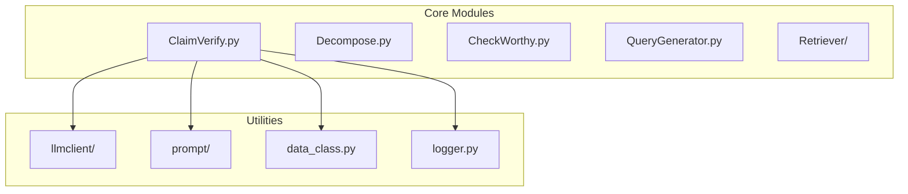
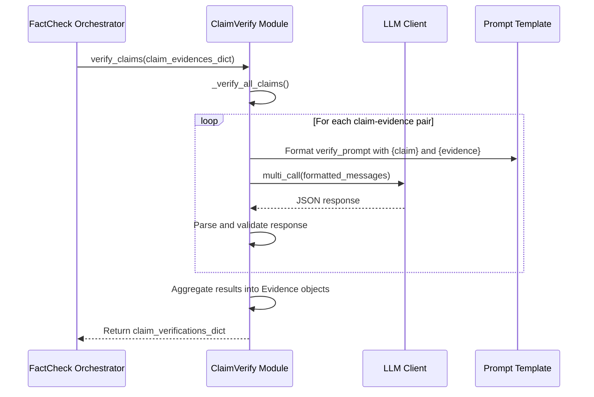
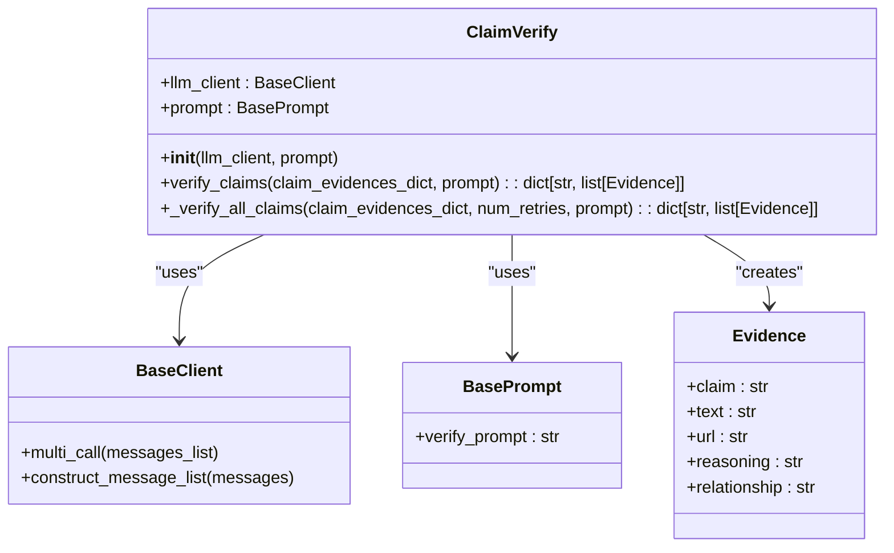
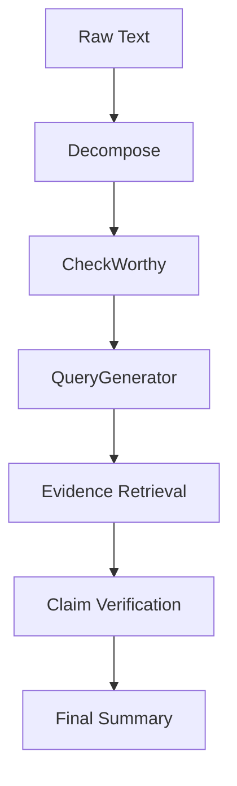

# Claim Verification

<cite>
**Referenced Files in This Document**   
- [ClaimVerify.py](file://factcheck/core/ClaimVerify.py)
- [data_class.py](file://factcheck/utils/data_class.py)
- [chatgpt_prompt.py](file://factcheck/utils/prompt/chatgpt_prompt.py)
- [sample_prompt.yaml](file://factcheck/config/sample_prompt.yaml)
- [__init__.py](file://factcheck/__init__.py)
</cite>

## Table of Contents
1. [Introduction](#introduction)
2. [Project Structure](#project-structure)
3. [Core Components](#core-components)
4. [Architecture Overview](#architecture-overview)
5. [Detailed Component Analysis](#detailed-component-analysis)
6. [Verification Logic and Classification](#verification-logic-and-classification)
7. [Evidence Scoring and Aggregation](#evidence-scoring-and-aggregation)
8. [Integration with FactCheck Orchestrator](#integration-with-factcheck-orchestrator)
9. [Handling Contradictory or Partial Evidence](#handling-contradictory-or-partial-evidence)
10. [Performance Considerations](#performance-considerations)
11. [Model Customization and Accuracy Optimization](#model-customization-and-accuracy-optimization)

## Introduction
The Claim Verification module is a critical component of the Loki fact-checking system, responsible for determining the factual accuracy of claims based on retrieved evidence. This document provides a comprehensive analysis of the `ClaimVerify.py` module, detailing its architecture, logic flow, integration points, and performance characteristics. The module leverages Large Language Models (LLMs) to analyze semantic relationships between claims and evidence, classifying outcomes as supported, refuted, or neutral. It plays a central role in the end-to-end fact-checking pipeline, transforming raw evidence into structured verification results.

## Project Structure
The project follows a modular architecture with clear separation of concerns. The Claim Verification functionality resides within the `factcheck/core/` directory, specifically in the `ClaimVerify.py` file. It interacts with utility modules in `factcheck/utils/` for data structures, prompting, and LLM communication. The overall structure supports extensibility and maintainability, with each component encapsulated in its own module.



**Diagram sources**
- [ClaimVerify.py](file://factcheck/core/ClaimVerify.py)
- [data_class.py](file://factcheck/utils/data_class.py)
- [chatgpt_prompt.py](file://factcheck/utils/prompt/chatgpt_prompt.py)

**Section sources**
- [ClaimVerify.py](file://factcheck/core/ClaimVerify.py)
- [__init__.py](file://factcheck/__init__.py)

## Core Components
The core component for claim verification is the `ClaimVerify` class defined in `ClaimVerify.py`. It depends on two primary external components: an LLM client for inference and a prompt template for structuring the verification task. The class processes a dictionary of claims and their associated evidence snippets, sending each claim-evidence pair to the LLM for analysis. The results are aggregated and structured into a standardized output format using the `Evidence` dataclass.

**Section sources**
- [ClaimVerify.py](file://factcheck/core/ClaimVerify.py#L8-L97)
- [data_class.py](file://factcheck/utils/data_class.py#L48-L64)

## Architecture Overview
The Claim Verification module operates as part of a larger fact-checking pipeline orchestrated by the `FactCheck` class. After claims are decomposed, filtered for checkworthiness, and evidence is retrieved, the verification phase begins. The architecture is designed for parallel processing, where multiple claim-evidence pairs are evaluated independently to improve throughput.



**Diagram sources**
- [ClaimVerify.py](file://factcheck/core/ClaimVerify.py)
- [__init__.py](file://factcheck/__init__.py#L117-L147)

## Detailed Component Analysis

### ClaimVerify Class Analysis
The `ClaimVerify` class is responsible for orchestrating the verification of claims against evidence using an LLM. It takes a dictionary mapping claims to lists of evidence strings and returns structured verification results.

#### Class Diagram


**Diagram sources**
- [ClaimVerify.py](file://factcheck/core/ClaimVerify.py#L8-L97)
- [data_class.py](file://factcheck/utils/data_class.py#L48-L64)

**Section sources**
- [ClaimVerify.py](file://factcheck/core/ClaimVerify.py#L8-L97)

## Verification Logic and Classification
The verification logic is implemented through a structured prompt that instructs the LLM to classify the relationship between a claim and evidence into one of three categories: "SUPPORTS", "REFUTES", or "IRRELEVANT". This classification is based on semantic analysis of the content rather than simple keyword matching.

The prompt template (`verify_prompt`) provides clear examples and formatting requirements to ensure consistent output. The LLM is asked to provide both a reasoning trace and a relationship label in JSON format. This structured output enables reliable parsing and aggregation of results.

For example:
- **Claim**: "MBZUAI is located in Abu Dhabi, United Arab Emirates."
- **Evidence**: "Where is MBZUAI located?\nAnswer: Masdar City - Abu Dhabi - United Arab Emirates"
- **Output**: {"reasoning": "The evidence confirms location...", "relationship": "SUPPORTS"}

The system handles parsing failures by retrying up to three times before assigning a default "IRRELEVANT" label with a system warning.

**Section sources**
- [ClaimVerify.py](file://factcheck/core/ClaimVerify.py#L50-L97)
- [chatgpt_prompt.py](file://factcheck/utils/prompt/chatgpt_prompt.py#L115-L143)
- [sample_prompt.yaml](file://factcheck/config/sample_prompt.yaml#L78-L106)

## Evidence Scoring and Aggregation
The module processes evidence at the snippet level, evaluating each claim against every retrieved evidence item independently. Each evidence snippet receives a relationship score ("SUPPORTS", "REFUTES", or "IRRELEVANT") and a reasoning explanation.

After individual evaluations, results are aggregated at the claim level. The final factuality score for a claim is calculated as the ratio of supporting evidence to total relevant evidence:

```
factuality = count(SUPPORTS) / (count(SUPPORTS) + count(REFUTES))
```

This produces a continuous score between 0 and 1, where:
- 1.0 indicates all relevant evidence supports the claim
- 0.0 indicates all relevant evidence refutes the claim
- Values between 0 and 1 indicate mixed or partial support
- "No evidence found" is returned when no relevant evidence exists

Claims with no checkworthy status receive "Nothing to check." as their factuality status.

**Section sources**
- [ClaimVerify.py](file://factcheck/core/ClaimVerify.py#L70-L97)
- [__init__.py](file://factcheck/__init__.py#L180-L210)

## Integration with FactCheck Orchestrator
The ClaimVerify module integrates seamlessly with the main `FactCheck` orchestrator through a well-defined interface. It is initialized during the `FactCheck` object creation and stored as the `claimverify` attribute.

The integration follows a five-step pipeline:
1. Text decomposition into atomic claims
2. Checkworthiness assessment
3. Query generation for evidence retrieval
4. Evidence crawling from web sources
5. Claim verification against retrieved evidence

The orchestrator passes a dictionary of claims and their associated evidence to the `verify_claims()` method, which returns structured verification results that are then merged into the final output.



**Diagram sources**
- [__init__.py](file://factcheck/__init__.py#L117-L147)
- [ClaimVerify.py](file://factcheck/core/ClaimVerify.py)

**Section sources**
- [__init__.py](file://factcheck/__init__.py#L117-L147)

## Handling Contradictory or Partial Evidence
The system is designed to handle contradictory evidence through its aggregation mechanism. When a claim receives both supporting and refuting evidence, the final factuality score reflects this conflict as a value between 0 and 1 (e.g., 0.67 if 2/3 evidence supports).

For partial matches, the system relies on the LLM's semantic understanding to determine relevance. Evidence that partially supports a claim but lacks complete confirmation is typically classified as "SUPPORTS" with appropriate reasoning, contributing to a high but not perfect factuality score.

The retry mechanism (up to 3 attempts) helps mitigate parsing failures that could otherwise lead to false "IRRELEVANT" classifications. When parsing consistently fails, the system defaults to "IRRELEVANT" with a warning, ensuring robustness at the cost of potentially conservative verification.

**Section sources**
- [ClaimVerify.py](file://factcheck/core/ClaimVerify.py#L60-L97)
- [__init__.py](file://factcheck/__init__.py#L180-L210)

## Performance Considerations
The Claim Verification module has significant performance implications due to its reliance on LLM calls. Key considerations include:

- **Token Usage**: Each claim-evidence pair generates a separate LLM call, leading to linear growth in token consumption with the number of evidence snippets
- **Latency**: The verification step is typically one of the most time-consuming phases, with processing time dependent on LLM response speed
- **Parallelization**: The `multi_call` method allows batch processing of claim-evidence pairs, improving throughput
- **Retry Overhead**: Failed parsing attempts increase both latency and token usage

The system reports token usage through the `PipelineUsage` dataclass, enabling monitoring and optimization of resource consumption.

**Section sources**
- [ClaimVerify.py](file://factcheck/core/ClaimVerify.py#L60-L75)
- [data_class.py](file://factcheck/utils/data_class.py#L30-L36)
- [__init__.py](file://factcheck/__init__.py#L220-L230)

## Model Customization and Accuracy Optimization
The module supports model customization through configuration parameters in the `FactCheck` initialization. Users can specify different LLMs for the verification step via the `claim_verify_model` parameter.

The prompt template is also configurable, allowing users to:
- Modify the `verify_prompt` to change classification criteria
- Adjust examples to better suit domain-specific verification needs
- Fine-tune the output format requirements

Accuracy can be improved by:
- Using more capable LLMs (e.g., GPT-4 instead of GPT-3.5)
- Refining the prompt with additional examples
- Increasing the number of retry attempts for parsing failures
- Implementing post-processing rules to handle edge cases

The modular design allows for easy experimentation with different models and prompts without changing the core verification logic.

**Section sources**
- [__init__.py](file://factcheck/__init__.py#L20-L50)
- [sample_prompt.yaml](file://factcheck/config/sample_prompt.yaml)
- [ClaimVerify.py](file://factcheck/core/ClaimVerify.py)