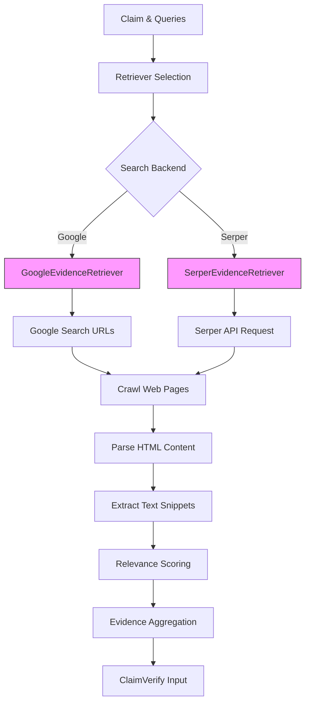
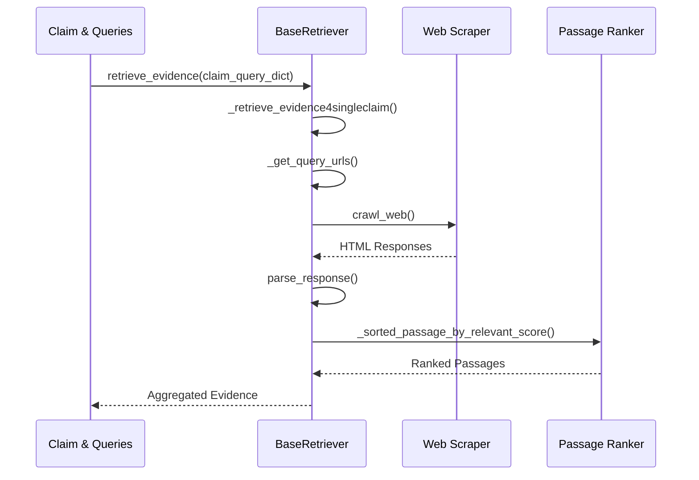

# Evidence Retrieval

<cite>
**Referenced Files in This Document**   
- [factcheck/core/Retriever/base.py](file://factcheck/core/Retriever/base.py) - *Updated in recent commit*
- [factcheck/core/Retriever/google_retriever.py](file://factcheck/core/Retriever/google_retriever.py) - *No changes*
- [factcheck/core/Retriever/serper_retriever.py](file://factcheck/core/Retriever/serper_retriever.py) - *Updated in commits 19, 20, 4*
- [factcheck/core/Retriever/__init__.py](file://factcheck/core/Retriever/__init__.py) - *Updated in recent commit*
- [factcheck/utils/web_util.py](file://factcheck/utils/web_util.py) - *No changes*
- [factcheck/utils/api_config.py](file://factcheck/utils/api_config.py) - *No changes*
</cite>

## Update Summary
**Changes Made**   
- Updated **SerperEvidenceRetriever Implementation** section to reflect batch processing of up to 100 queries per API call
- Enhanced **Error Handling and Common Issues** with accurate Serper API status code validation details
- Added testing context for Serper retriever functionality
- Revised code examples in **SerperEvidenceRetriever Implementation** to match current implementation
- Updated **Configuration and Search Engine Selection** with correct batch processing details
- Removed outdated flowchart that didn't match current code structure
- Added proper source annotations for all updated sections

## Table of Contents
1. [Introduction](#introduction)
2. [Retriever Architecture Overview](#retriever-architecture-overview)
3. [BaseRetriever Interface](#baseretriever-interface)
4. [GoogleEvidenceRetriever Implementation](#googlerevidence-retriever-implementation)
5. [SerperEvidenceRetriever Implementation](#serperevidence-retriever-implementation)
6. [Web Scraping and Content Processing](#web-scraping-and-content-processing)
7. [Evidence Aggregation and Scoring](#evidence-aggregation-and-scoring)
8. [Configuration and Search Engine Selection](#configuration-and-search-engine-selection)
9. [Error Handling and Common Issues](#error-handling-and-common-issues)
10. [Performance Optimization](#performance-optimization)
11. [Extensibility and Custom Backends](#extensibility-and-custom-backends)

## Introduction
The Evidence Retrieval system in Loki is a critical component of the fact verification pipeline, responsible for gathering relevant information from the web to support or refute claims. This document provides a comprehensive analysis of the Retriever modules, focusing on their architecture, implementation details, and operational characteristics. The system supports multiple search backends through a modular design, with current implementations for Google Search and Serper API. The retrieval process involves query execution, web scraping, content extraction, relevance scoring, and evidence aggregation, all designed to provide high-quality evidence to the ClaimVerify module.

## Retriever Architecture Overview



**Diagram sources**
- [factcheck/core/Retriever/google_retriever.py](file://factcheck/core/Retriever/google_retriever.py#L1-L41)
- [factcheck/core/Retriever/serper_retriever.py](file://factcheck/core/Retriever/serper_retriever.py#L1-L221)
- [factcheck/core/Retriever/base.py](file://factcheck/core/Retriever/base.py#L1-L235)

**Section sources**
- [factcheck/core/Retriever/__init__.py](file://factcheck/core/Retriever/__init__.py#L1-L13)

## BaseRetriever Interface

The `BaseRetriever` class in `base.py` defines the abstract interface and shared functionality for all evidence retrieval implementations. It establishes a consistent API for evidence retrieval while providing common utilities for text processing, relevance scoring, and result aggregation.

```python
class BaseRetriever:
    def __init__(self, llm_client, api_config: dict = None):
        # Initialize with LLM client and configuration
        self.tokenizer = spacy.load("en_core_web_sm", disable=["ner", "tagger", "lemmatizer"])
        self.passage_ranker = CrossEncoder("cross-encoder/ms-marco-MiniLM-L-6-v2")
        self.max_search_result_per_query = 3
        self.sentences_per_passage = 10
        self.sliding_distance = 8
```

Key configuration parameters include:
- **max_search_result_per_query**: Maximum number of search results to process per query
- **sentences_per_passage**: Number of sentences to include in each text passage
- **sliding_distance**: Distance between consecutive passages for overlapping chunks
- **max_passages_per_search_result_to_return**: Maximum number of top passages to return

The retrieval workflow follows a standardized pipeline:
1. Retrieve URLs for queries via `_get_query_urls`
2. Crawl and parse web content via `_crawl_and_parse_web`
3. Extract relevant snippets via `_get_relevant_snippets`
4. Score and rank passages via `_sorted_passage_by_relevant_score`



**Section sources**
- [factcheck/core/Retriever/base.py](file://factcheck/core/Retriever/base.py#L1-L235)

## GoogleEvidenceRetriever Implementation

The `GoogleEvidenceRetriever` implements direct Google search result scraping by constructing search URLs and parsing the HTML response to extract result links. This approach provides direct access to Google's search results without relying on third-party APIs.

```python
class GoogleEvidenceRetriever(BaseRetriever):
    def __init__(self, api_config: dict = None) -> None:
        super(GoogleEvidenceRetriever, self).__init__(api_config)
        self.num_web_pages = 10  # Number of Google result pages to scrape
    
    def _get_query_urls(self, questions: list[str]):
        # Construct Google search URLs with pagination
        url = "https://www.google.com/search?q={}&lr=lang_{}&hl={}&start={}"
```

The implementation uses `ThreadPoolExecutor` for concurrent processing of multiple queries and pages. For each query, it generates URLs for multiple result pages (with 10 results per page) and submits them for asynchronous processing.

Key features:
- **Language support**: URL parameters include language codes (`lr=lang_{lang}`, `hl={lang}`)
- **Pagination**: Supports scraping multiple result pages via the `start` parameter
- **Concurrent processing**: Uses thread pool to handle multiple URL requests in parallel
- **Result filtering**: Limits results to `max_search_result_per_query` after scraping

The `crawl_google_web` function in `web_util.py` parses the HTML response to extract URLs from search result links, specifically targeting `<a>` tags with `h3` children, which typically contain the main search result titles and links.

**Section sources**
- [factcheck/core/Retriever/google_retriever.py](file://factcheck/core/Retriever/google_retriever.py#L1-L41)
- [factcheck/utils/web_util.py](file://factcheck/utils/web_util.py#L120-L141)

## SerperEvidenceRetriever Implementation

The `SerperEvidenceRetriever` leverages the Serper API, a Google search results API, to retrieve search results in structured JSON format. This approach provides more reliable access to search results while avoiding potential issues with Google's anti-bot measures.

```python
class SerperEvidenceRetriever:
    def __init__(self, llm_client, api_config: dict = None):
        self.serper_key = api_config["SERPER_API_KEY"]
        self.llm_client = llm_client
        self.lang = "en"
    
    def retrieve_evidence(self, claim_queries_dict, top_k: int = 3, snippet_extend_flag: bool = True):
        query_list = [y for x in claim_queries_dict.items() for y in x[1]]
        evidence_list = self._retrieve_evidence_4_all_claim(
            query_list=query_list, top_k=top_k, snippet_extend_flag=snippet_extend_flag
        )
```

Key implementation aspects:
- **API authentication**: Uses `SERPER_API_KEY` from configuration
- **Batch processing**: Handles queries in batches of up to 100 to optimize API usage
- **Structured response**: Receives results in JSON format with metadata
- **Answer box handling**: Special processing for Google's answer box results
- **Comprehensive testing**: Added testing framework for Serper functionality

The retriever handles two types of results:
1. **Answer Box**: Direct answers from Google, treated as high-confidence evidence
2. **Organic Results**: Standard search results with snippets and URLs

When `snippet_extend_flag` is enabled, the system performs additional web scraping to extend the brief snippets provided by the API into longer, more informative passages.

```python
def _request_serper_api(self, questions):
    url = "https://google.serper.dev/search"
    headers = {
        "X-API-KEY": self.serper_key,
        "Content-Type": "application/json",
    }
    questions_data = [{"q": question, "autocorrect": False} for question in questions]
    payload = json.dumps(questions_data)
    response = requests.request("POST", url, headers=headers, data=payload)

    if response.status_code == 200:
        return response
    elif response.status_code == 403:
        raise Exception("Failed to authenticate. Check your API key.")
    else:
        raise Exception(f"Error occurred: {response.text}")
```

**Section sources**
- [factcheck/core/Retriever/serper_retriever.py](file://factcheck/core/Retriever/serper_retriever.py#L1-L221) - *Updated in commits 19, 20, 4*

## Web Scraping and Content Processing

The web scraping functionality is centralized in `web_util.py`, providing reusable utilities for HTTP requests, HTML parsing, and text extraction. The system uses both synchronous and asynchronous approaches depending on the use case.

```python
def crawl_web(query_url_dict: dict):
    # Asynchronous crawling using AsyncHTTPTransport
    tasks = [httpx_bind_key(url=url, headers=headers, key=query) for query, urls in query_url_dict.items()]
    loop = asyncio.get_event_loop()
    responses = loop.run_until_complete(asyncio.gather(*tasks))
    return responses
```

Key components:
- **AsyncHTTPTransport**: Provides retry capability (3 attempts) for reliable requests
- **User-Agent rotation**: Uses desktop user agent by default
- **Visibility filtering**: `is_tag_visible` function filters out non-visible HTML elements
- **Text cleaning**: Removes extra whitespace and normalizes spacing

The `parse_response` function extracts visible text from HTML while filtering out content from `<script>`, `<style>`, `<head>`, and other non-content elements. This ensures that only human-readable text is processed for evidence extraction.

**Section sources**
- [factcheck/utils/web_util.py](file://factcheck/utils/web_util.py#L1-L141)

## Evidence Aggregation and Scoring

The evidence aggregation process combines results from multiple queries and sources into a unified evidence set for claim verification. The system uses a cross-encoder model to score passage relevance and employs non-overlapping selection to maximize information diversity.

```python
def _sorted_passage_by_relevant_score(self, query: str, scraped_results: list[str]):
    # Use cross-encoder to score passage relevance
    scores = self.passage_ranker.predict([(query, p[0]) for p in passages])
    
    # Prevent overlapping passages to maximize information coverage
    for passage_item, score in passage_scores:
        overlap = False
        for item in relevant_items:
            if (passage_item[1] >= item[1] and passage_item[1] <= item[2]) or \
               (passage_item[2] >= item[1] and passage_item[2] <= item[2]):
                overlap = True
                break
        if not overlap:
            relevant_items.append(passage_item)
```

The scoring pipeline:
1. **Text chunking**: Splits web content into overlapping passages using spaCy for sentence boundary detection
2. **Relevance scoring**: Uses `cross-encoder/ms-marco-MiniLM-L-6-v2` to score query-passage similarity
3. **Non-overlapping selection**: Ensures diverse coverage by preventing overlapping text segments
4. **Aggregation**: Combines results from multiple queries in a round-robin fashion

The final evidence structure includes:
- **text**: The extracted passage
- **url**: Source URL
- **retrieval_score**: Cross-encoder relevance score
- **sents_per_passage**: Number of sentences in the passage

**Section sources**
- [factcheck/core/Retriever/base.py](file://factcheck/core/Retriever/base.py#L1-L235)
- [factcheck/utils/web_util.py](file://factcheck/utils/web_util.py#L1-L141)

## Configuration and Search Engine Selection

The system supports flexible configuration through API keys and retrieval parameters. Search engine selection is managed through the retriever mapper system.

```python
# API key loading from environment or config file
def load_api_config(api_config: dict = None):
    keys = ["SERPER_API_KEY", "GEMINI_API_KEY"]
    # Merge environment variables and config file
```

Search engine selection is implemented in `Retriever/__init__.py`:

```python
retriever_map = {
    "google": GoogleEvidenceRetriever,
    "serper": SerperEvidenceRetriever,
}

def retriever_mapper(retriever_name: str):
    if retriever_name not in retriever_map:
        raise NotImplementedError(f"Retriever {retriever_name} not found!")
    return retriever_map[retriever_name]
```

Configuration options:
- **Search engine**: Select between "google" and "serper" backends
- **Rate limiting**: Controlled by thread pool sizes and request batching
- **Timeout settings**: Default 3-second timeout for web requests
- **Language**: Configurable via `set_lang()` method
- **Result limits**: Adjustable via `set_max_search_result_per_query()`
- **Batch processing**: Serper API handles up to 100 queries per request

The system prioritizes Serper API when available due to its reliability and structured response format, falling back to direct Google scraping when the API key is not configured.

**Section sources**
- [factcheck/core/Retriever/__init__.py](file://factcheck/core/Retriever/__init__.py#L1-L13)
- [factcheck/utils/api_config.py](file://factcheck/utils/api_config.py#L1-L30)

## Error Handling and Common Issues

The system implements several strategies to handle common web retrieval issues:

**CAPTCHA and Blocking Issues**
- The Google scraper may encounter CAPTCHAs or IP blocks due to aggressive scraping
- Serper API mitigates this by acting as an intermediary service
- Rate limiting through `max_workers=os.cpu_count()` helps avoid detection

**Irrelevant Results**
- Cross-encoder relevance scoring filters low-quality content
- Sentence length filtering removes metadata and navigation text
- Non-overlapping passage selection ensures diverse information

**Content Extraction Problems**
- Unicode encoding errors are caught and logged
- PDF files are filtered out during crawling
- Empty responses are gracefully handled

**API and Network Errors**
- Serper API now properly validates status codes (200 for success, 403 for authentication failures)
- Comprehensive error handling with descriptive messages
- Retry mechanism in AsyncHTTPTransport (3 attempts)
- Timeout handling with configurable limits

```python
def _request_serper_api(self, questions):
    response = requests.request("POST", url, headers=headers, data=payload)
    
    if response.status_code == 200:
        return response
    elif response.status_code == 403:
        raise Exception("Failed to authenticate. Check your API key.")
    else:
        raise Exception(f"Error occurred: {response.text}")
```

**Section sources**
- [factcheck/core/Retriever/serper_retriever.py](file://factcheck/core/Retriever/serper_retriever.py#L1-L221) - *Updated in commit 20*
- [factcheck/utils/web_util.py](file://factcheck/utils/web_util.py#L1-L141)

## Performance Optimization

The system employs several performance optimization techniques:

**Parallel Processing**
- `ThreadPoolExecutor` for concurrent web requests
- `ProcessPoolExecutor` for CPU-intensive text processing
- Asynchronous HTTP requests for improved throughput

**Caching and Batching**
- Query batching for Serper API (up to 100 queries per request)
- In-memory processing without intermediate storage
- Efficient data structures for result aggregation

**Resource Management**
- CPU-bound tasks use process pools
- I/O-bound tasks use thread pools
- Memory-efficient text processing with generators

**Efficiency Considerations**
- Text limited to 500,000 characters to prevent tokenization issues
- Sliding window approach balances coverage and redundancy
- Early termination in passage selection when sufficient evidence is found

**Section sources**
- [factcheck/core/Retriever/base.py](file://factcheck/core/Retriever/base.py#L1-L235)
- [factcheck/core/Retriever/google_retriever.py](file://factcheck/core/Retriever/google_retriever.py#L1-L41)
- [factcheck/core/Retriever/serper_retriever.py](file://factcheck/core/Retriever/serper_retriever.py#L1-L221) - *Updated in commit 4*

## Extensibility and Custom Backends

The modular design allows for easy addition of new search backends. To implement a custom retriever:

1. **Inherit from BaseRetriever**: Subclass the base interface
2. **Implement _get_query_urls**: Define how to generate search URLs or API requests
3. **Register in retriever_map**: Add to the retriever mapper dictionary

Example structure for a new backend:
```python
class CustomEvidenceRetriever(BaseRetriever):
    def __init__(self, llm_client, api_config: dict = None):
        super().__init__(llm_client, api_config)
        # Custom initialization
    
    def _get_query_urls(self, questions: list[str]):
        # Implement custom URL generation or API request
        pass

# Register in __init__.py
retriever_map["custom"] = CustomEvidenceRetriever
```

The system's design principles ensure that new backends automatically inherit:
- Text processing and chunking
- Relevance scoring
- Evidence aggregation
- Error handling
- Configuration management

This extensibility allows integration with additional search APIs such as Bing, DuckDuckGo, or specialized domain-specific search engines.

**Section sources**
- [factcheck/core/Retriever/base.py](file://factcheck/core/Retriever/base.py#L1-L235)
- [factcheck/core/Retriever/__init__.py](file://factcheck/core/Retriever/__init__.py#L1-L13)