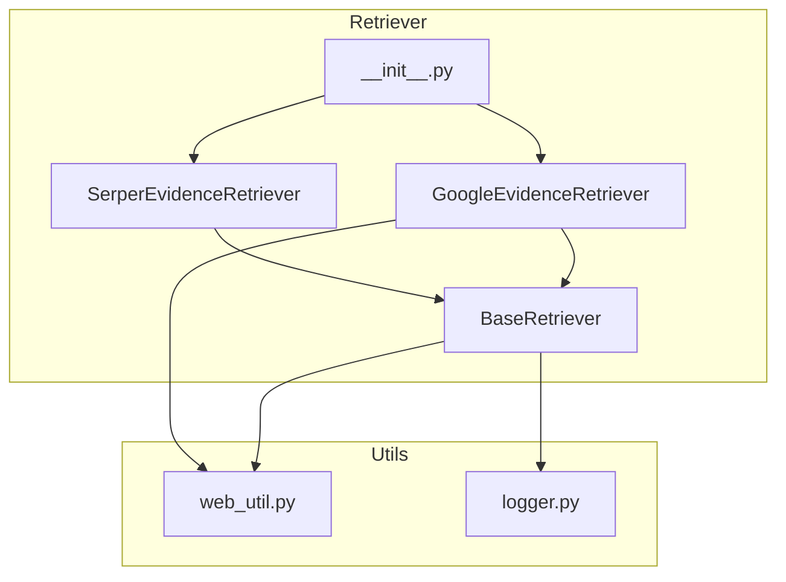
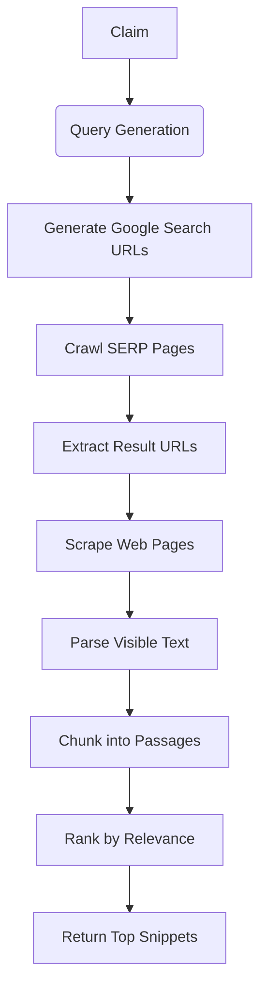
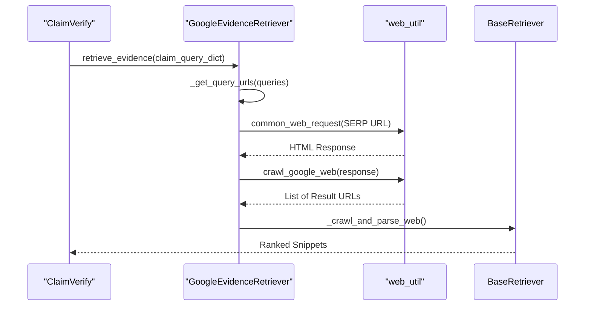
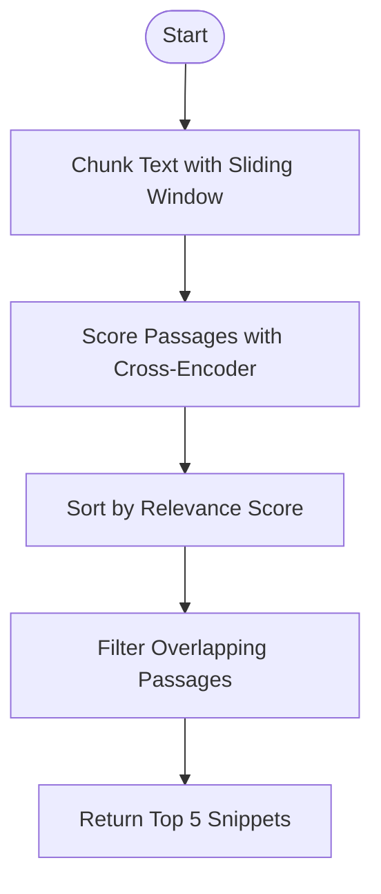
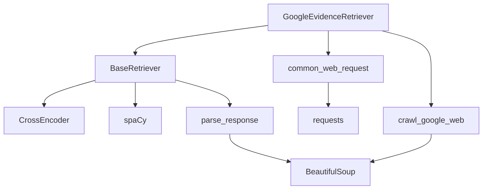

# Google Retriever

<cite>
**Referenced Files in This Document**   
- [google_retriever.py](file://factcheck/core/Retriever/google_retriever.py#L1-L41)
- [base.py](file://factcheck/core/Retriever/base.py#L1-L235)
- [web_util.py](file://factcheck/utils/web_util.py#L1-L141)
- [__init__.py](file://factcheck/core/Retriever/__init__.py#L1-L13)
</cite>

## Table of Contents
1. [Introduction](#introduction)
2. [Project Structure](#project-structure)
3. [Core Components](#core-components)
4. [Architecture Overview](#architecture-overview)
5. [Detailed Component Analysis](#detailed-component-analysis)
6. [Dependency Analysis](#dependency-analysis)
7. [Performance Considerations](#performance-considerations)
8. [Troubleshooting Guide](#troubleshooting-guide)
9. [Conclusion](#conclusion)

## Introduction
The **Google Retriever** is a component of the OpenFactVerification system designed to retrieve evidence from Google search results to support fact-checking claims. Unlike API-based approaches, it uses direct web scraping techniques to bypass rate limits and access dynamic search results. This document details the implementation of `GoogleEvidenceRetriever`, which leverages headless HTTP requests, HTML parsing, and semantic ranking to extract and prioritize relevant information. The system integrates with the broader fact-checking pipeline, enabling robust, scalable evidence collection.

**Section sources**
- [google_retriever.py](file://factcheck/core/Retriever/google_retriever.py#L1-L41)
- [base.py](file://factcheck/core/Retriever/base.py#L1-L235)

## Project Structure
The OpenFactVerification project is organized into modular components under the `factcheck` directory. The **Google Retriever** resides in the `factcheck/core/Retriever/` subdirectory, which contains retrieval strategies for different search backends. Key files include:
- `google_retriever.py`: Implements Google search result scraping.
- `serper_retriever.py`: Uses Serper API for search.
- `base.py`: Defines shared retrieval logic and ranking.
- `__init__.py`: Exposes retriever classes and mapping.

The `utils` directory provides essential utilities such as `web_util.py` for web scraping and `logger.py` for logging. The architecture supports pluggable retrievers via the `retriever_map`, allowing flexible integration of new retrieval backends.



**Diagram sources**
- [google_retriever.py](file://factcheck/core/Retriever/google_retriever.py#L1-L41)
- [base.py](file://factcheck/core/Retriever/base.py#L1-L235)
- [__init__.py](file://factcheck/core/Retriever/__init__.py#L1-L13)
- [web_util.py](file://factcheck/utils/web_util.py#L1-L141)

**Section sources**
- [google_retriever.py](file://factcheck/core/Retriever/google_retriever.py#L1-L41)
- [base.py](file://factcheck/core/Retriever/base.py#L1-L235)

## Core Components
The **Google Retriever** is built around three core components:
1. **GoogleEvidenceRetriever**: Orchestrates Google search and result extraction.
2. **BaseRetriever**: Provides shared functionality for evidence retrieval, including text parsing, passage ranking, and snippet extraction.
3. **web_util.py**: Contains low-level web scraping and HTML parsing utilities.

The `GoogleEvidenceRetriever` inherits from `BaseRetriever`, leveraging its semantic ranking and text processing capabilities while implementing Google-specific search URL generation and result parsing.

**Section sources**
- [google_retriever.py](file://factcheck/core/Retriever/google_retriever.py#L1-L41)
- [base.py](file://factcheck/core/Retriever/base.py#L1-L235)
- [web_util.py](file://factcheck/utils/web_util.py#L1-L141)

## Architecture Overview
The retrieval process follows a multi-stage pipeline:
1. **Query URL Generation**: Transform search queries into Google search URLs with pagination.
2. **Search Result Crawling**: Fetch Google SERP (Search Engine Results Page) HTML.
3. **URL Extraction**: Parse SERP to extract top result URLs.
4. **Web Scraping**: Retrieve full text from result pages.
5. **Snippet Ranking**: Use a cross-encoder model to rank text passages by relevance.
6. **Evidence Aggregation**: Return top-ranked snippets as evidence.



**Diagram sources**
- [google_retriever.py](file://factcheck/core/Retriever/google_retriever.py#L1-L41)
- [base.py](file://factcheck/core/Retriever/base.py#L1-L235)
- [web_util.py](file://factcheck/utils/web_util.py#L1-L141)

## Detailed Component Analysis

### GoogleEvidenceRetriever Analysis
The `GoogleEvidenceRetriever` class extends `BaseRetriever` to implement Google-specific search logic. It generates search URLs with language and pagination parameters and extracts result links from SERP HTML.

#### Key Method: _get_query_urls
This method constructs Google search URLs for a list of queries, paginating across multiple result pages (controlled by `num_web_pages`). It uses the `start` parameter to simulate pagination (e.g., start=10 for page 2).

```python
url = "https://www.google.com/search?q={}&lr=lang_{}&hl={}&start={}".format(query, self.lang, self.lang, page)
```

It then concurrently fetches SERP pages using `ThreadPoolExecutor` and parses result URLs via `crawl_google_web`.



**Diagram sources**
- [google_retriever.py](file://factcheck/core/Retriever/google_retriever.py#L15-L41)
- [web_util.py](file://factcheck/utils/web_util.py#L117-L141)

**Section sources**
- [google_retriever.py](file://factcheck/core/Retriever/google_retriever.py#L1-L41)

### BaseRetriever Analysis
The `BaseRetriever` class provides shared functionality for all retrievers, including:
- Text chunking using spaCy
- Semantic relevance scoring via `sentence-transformers`
- Web scraping and parsing
- Result aggregation

#### Key Method: _get_relevant_snippets
This method uses a cross-encoder model (`cross-encoder/ms-marco-MiniLM-L-6-v2`) to score text passages against the query. It applies a sliding window to chunk text and filters overlapping passages to maximize information diversity.



**Diagram sources**
- [base.py](file://factcheck/core/Retriever/base.py#L150-L200)

**Section sources**
- [base.py](file://factcheck/core/Retriever/base.py#L1-L235)

## Dependency Analysis
The Google Retriever depends on several internal and external components:



**Diagram sources**
- [google_retriever.py](file://factcheck/core/Retriever/google_retriever.py#L1-L41)
- [base.py](file://factcheck/core/Retriever/base.py#L1-L235)
- [web_util.py](file://factcheck/utils/web_util.py#L1-L141)

**Section sources**
- [google_retriever.py](file://factcheck/core/Retriever/google_retriever.py#L1-L41)
- [base.py](file://factcheck/core/Retriever/base.py#L1-L235)
- [web_util.py](file://factcheck/utils/web_util.py#L1-L141)

## Performance Considerations
The Google Retriever balances performance and robustness:
- **Concurrency**: Uses `ThreadPoolExecutor` for SERP fetching and `ProcessPoolExecutor` for CPU-intensive text parsing.
- **Caching**: No built-in caching; repeated queries trigger full retrieval.
- **Rate Limiting**: Relies on natural delays from network I/O; no explicit throttling.
- **Model Inference**: Cross-encoder scoring is GPU-accelerated if available.
- **Memory**: Limits text processing to 500k characters to prevent OOM errors.

Trade-offs vs. API-based retrieval:
- **Pros**: Bypasses API quotas, accesses full SERP layout.
- **Cons**: Higher risk of CAPTCHA/IP blocking, slower due to full HTML parsing.

**Section sources**
- [google_retriever.py](file://factcheck/core/Retriever/google_retriever.py#L1-L41)
- [base.py](file://factcheck/core/Retriever/base.py#L1-L235)
- [web_util.py](file://factcheck/utils/web_util.py#L1-L141)

## Troubleshooting Guide
Common issues and mitigations:
- **CAPTCHA/IP Blocking**: Rotate user agents or use proxy services.
- **Empty Results**: Check network connectivity and Google's response structure.
- **Parsing Errors**: Ensure BeautifulSoup can handle malformed HTML.
- **Model Load Failure**: Verify `sentence-transformers` installation and GPU compatibility.

The system logs key events via `CustomLogger`, aiding in debugging retrieval failures.

**Section sources**
- [google_retriever.py](file://factcheck/core/Retriever/google_retriever.py#L1-L41)
- [base.py](file://factcheck/core/Retriever/base.py#L1-L235)
- [web_util.py](file://factcheck/utils/web_util.py#L1-L141)

## Conclusion
The **Google Retriever** provides a robust, API-independent method for evidence retrieval by scraping Google search results. It combines efficient concurrency, semantic ranking, and careful HTML parsing to deliver high-quality snippets for fact-checking. While vulnerable to anti-bot measures, its flexibility and depth of access make it a valuable component in the OpenFactVerification toolkit.