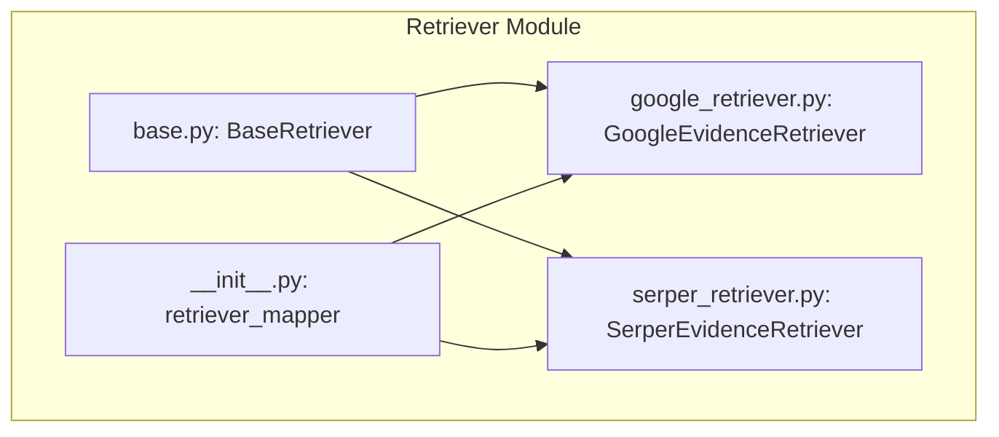
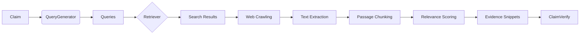
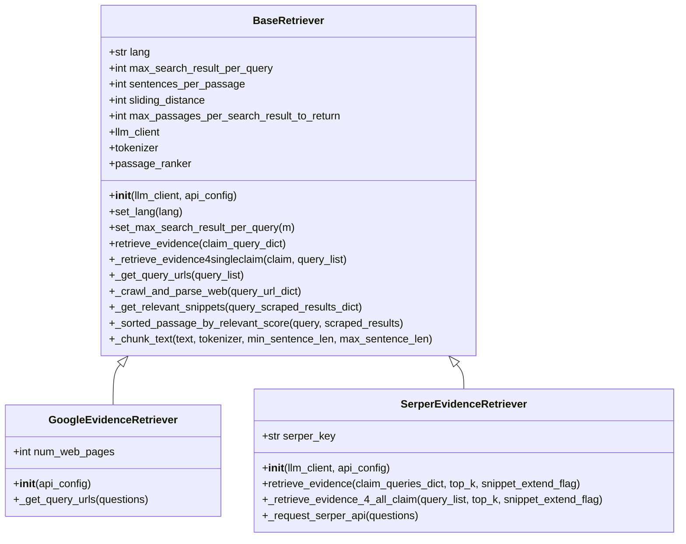
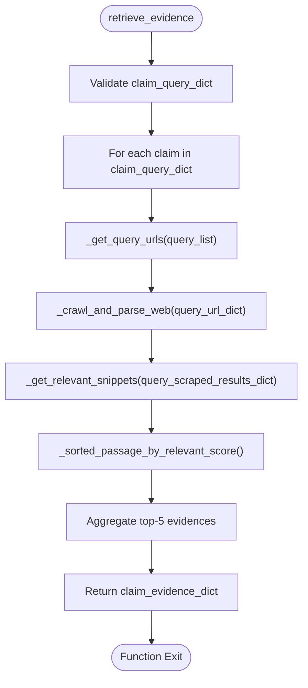
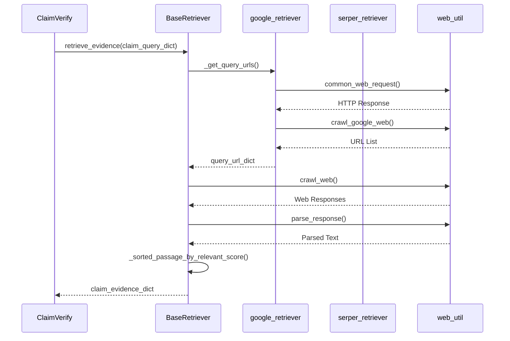
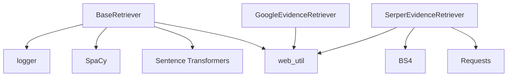

# Retriever Interface

<cite>
**Referenced Files in This Document**   
- [factcheck/core/Retriever/base.py](file://factcheck/core/Retriever/base.py) - *Updated in recent commit*
- [factcheck/core/Retriever/google_retriever.py](file://factcheck/core/Retriever/google_retriever.py)
- [factcheck/core/Retriever/serper_retriever.py](file://factcheck/core/Retriever/serper_retriever.py)
- [factcheck/core/Retriever/__init__.py](file://factcheck/core/Retriever/__init__.py)
- [factcheck/utils/web_util.py](file://factcheck/utils/web_util.py)
- [factcheck/utils/data_class.py](file://factcheck/utils/data_class.py)
- [factcheck/core/ClaimVerify.py](file://factcheck/core/ClaimVerify.py)
</cite>

## Update Summary
**Changes Made**   
- Updated documentation to reflect the latest implementation of the `BaseRetriever` class and its methods
- Clarified input/output contracts for `retrieve_evidence()` and `extract_snippets()` (renamed to `_get_relevant_snippets()`)
- Added details on error handling, dependency injection, and integration with `ClaimVerify`
- Enhanced code examples and developer guidance for extending the interface
- Corrected architectural diagrams to match current code structure

## Table of Contents
1. [Introduction](#introduction)
2. [Project Structure](#project-structure)
3. [Core Components](#core-components)
4. [Architecture Overview](#architecture-overview)
5. [Detailed Component Analysis](#detailed-component-analysis)
6. [Dependency Analysis](#dependency-analysis)
7. [Performance Considerations](#performance-considerations)
8. [Troubleshooting Guide](#troubleshooting-guide)
9. [Conclusion](#conclusion)

## Introduction
The Retriever interface in the OpenFactVerification system provides a pluggable abstraction for integrating various search backends into the fact-checking pipeline. Built as an abstract base class, it enables flexible retrieval strategies while maintaining consistent input/output contracts across implementations. This document details the design, usage, and extension of the `BaseRetriever` class and its concrete implementations, including integration with the ClaimVerify module and error handling patterns.

## Project Structure
The Retriever module is organized under `factcheck/core/Retriever/` and follows a modular design pattern that separates core retrieval logic from backend-specific implementations. The structure supports dependency injection through a factory pattern implemented in `__init__.py`.

**Diagram sources**
- [factcheck/core/Retriever/base.py](file://factcheck/core/Retriever/base.py)
- [factcheck/core/Retriever/google_retriever.py](file://factcheck/core/Retriever/google_retriever.py)
- [factcheck/core/Retriever/serper_retriever.py](file://factcheck/core/Retriever/serper_retriever.py)
- [factcheck/core/Retriever/__init__.py](file://factcheck/core/Retriever/__init__.py)

**Section sources**
- [factcheck/core/Retriever/base.py](file://factcheck/core/Retriever/base.py)
- [factcheck/core/Retriever/__init__.py](file://factcheck/core/Retriever/__init__.py)

## Core Components
The core components of the Retriever system include the abstract `BaseRetriever` class, which defines the contract for evidence retrieval, and two concrete implementations: `GoogleEvidenceRetriever` and `SerperEvidenceRetriever`. These components work together to retrieve, process, and rank web-based evidence for fact verification.

**Section sources**
- [factcheck/core/Retriever/base.py](file://factcheck/core/Retriever/base.py)
- [factcheck/core/Retriever/google_retriever.py](file://factcheck/core/Retriever/google_retriever.py)
- [factcheck/core/Retriever/serper_retriever.py](file://factcheck/core/Retriever/serper_retriever.py)

## Architecture Overview
The Retriever architecture follows a strategy pattern where different search backends can be selected at runtime through dependency injection. The system processes claims through a pipeline that includes query generation, web crawling, content parsing, and relevance scoring.

**Diagram sources**
- [factcheck/core/Retriever/base.py](file://factcheck/core/Retriever/base.py)
- [factcheck/core/ClaimVerify.py](file://factcheck/core/ClaimVerify.py)
- [factcheck/utils/web_util.py](file://factcheck/utils/web_util.py)

## Detailed Component Analysis

### BaseRetriever Analysis
The `BaseRetriever` class serves as the foundation for all evidence retrieval implementations. It provides shared functionality for text processing, passage ranking, and evidence aggregation.

#### Class Diagram

**Diagram sources**
- [factcheck/core/Retriever/base.py](file://factcheck/core/Retriever/base.py)
- [factcheck/core/Retriever/google_retriever.py](file://factcheck/core/Retriever/google_retriever.py)
- [factcheck/core/Retriever/serper_retriever.py](file://factcheck/core/Retriever/serper_retriever.py)

**Section sources**
- [factcheck/core/Retriever/base.py](file://factcheck/core/Retriever/base.py)

### Retrieval Pipeline Flow
The evidence retrieval process follows a structured pipeline that transforms claims into ranked evidence snippets.

#### Flowchart

**Diagram sources**
- [factcheck/core/Retriever/base.py](file://factcheck/core/Retriever/base.py)

### Integration with ClaimVerify
The Retriever interface integrates with the ClaimVerify module by providing structured evidence that can be used for factual assessment.

#### Sequence Diagram

**Diagram sources**
- [factcheck/core/Retriever/base.py](file://factcheck/core/Retriever/base.py)
- [factcheck/core/Retriever/google_retriever.py](file://factcheck/core/Retriever/google_retriever.py)
- [factcheck/utils/web_util.py](file://factcheck/utils/web_util.py)
- [factcheck/core/ClaimVerify.py](file://factcheck/core/ClaimVerify.py)

## Dependency Analysis
The Retriever system has well-defined dependencies on utility modules for web interaction and text processing.

**Diagram sources**
- [factcheck/core/Retriever/base.py](file://factcheck/core/Retriever/base.py)
- [factcheck/core/Retriever/google_retriever.py](file://factcheck/core/Retriever/google_retriever.py)
- [factcheck/core/Retriever/serper_retriever.py](file://factcheck/core/Retriever/serper_retriever.py)
- [factcheck/utils/web_util.py](file://factcheck/utils/web_util.py)

**Section sources**
- [factcheck/core/Retriever/base.py](file://factcheck/core/Retriever/base.py)
- [factcheck/utils/web_util.py](file://factcheck/utils/web_util.py)

## Performance Considerations
The Retriever implementation includes several performance optimizations:

- **Parallel Processing**: Uses `ProcessPoolExecutor` and `ThreadPoolExecutor` for concurrent web requests and text processing
- **Text Chunking**: Implements sliding window approach to break large documents into manageable passages
- **Caching**: Automatically limits results to `max_search_result_per_query` to prevent excessive processing
- **Resource Management**: Uses CPU count to determine optimal worker threads
- **Error Resilience**: Implements retry logic and exception handling for network operations

The system also includes performance trade-offs:
- Text is limited to 500k characters to prevent memory issues during tokenization
- Results are capped at top-5 passages per search result to balance quality and performance
- PDF content is automatically filtered out during crawling

## Troubleshooting Guide
Common issues and solutions when working with the Retriever interface:

**Section sources**
- [factcheck/core/Retriever/base.py](file://factcheck/core/Retriever/base.py)
- [factcheck/core/Retriever/serper_retriever.py](file://factcheck/core/Retriever/serper_retriever.py)
- [factcheck/utils/web_util.py](file://factcheck/utils/web_util.py)

### Common Issues
1. **Unicode Errors in Tokenization**: 
   - *Symptom*: `UnicodeEncodeError` during text chunking
   - *Solution*: Ensure input text is properly encoded; the system logs and skips problematic text

2. **Empty Results from Web Crawling**:
   - *Symptom*: No evidence returned despite valid queries
   - *Solution*: Check network connectivity, verify URL accessibility, ensure user agent is not blocked

3. **API Authentication Failures**:
   - *Symptom*: 403 errors from Serper API
   - *Solution*: Validate `SERPER_API_KEY` in configuration

4. **Rate Limiting**:
   - *Symptom*: Intermittent request failures
   - *Solution*: Implement exponential backoff or reduce parallel requests

5. **Memory Issues with Large Documents**:
   - *Symptom*: High memory usage or crashes
   - *Solution*: The system automatically limits text to 500k characters

### Error Handling Patterns
The Retriever uses consistent error handling:
- Network errors are caught and logged, with `False` flags returned for failed requests
- Unicode errors during text processing are caught and skipped
- API errors raise descriptive exceptions with status codes
- Partial failures are handled gracefully, with the system continuing to process successful requests

## Conclusion
The Retriever interface provides a robust, extensible foundation for evidence retrieval in the fact-checking pipeline. Its abstract base class design enables pluggable search backends while maintaining consistent contracts for evidence retrieval and processing. The system effectively handles common challenges such as partial failures, request timeouts, and data formatting through comprehensive error handling and performance optimizations. Developers can extend the interface by implementing new retriever classes that inherit from `BaseRetriever` and override the appropriate methods, following the established patterns for query generation, web interaction, and evidence extraction.