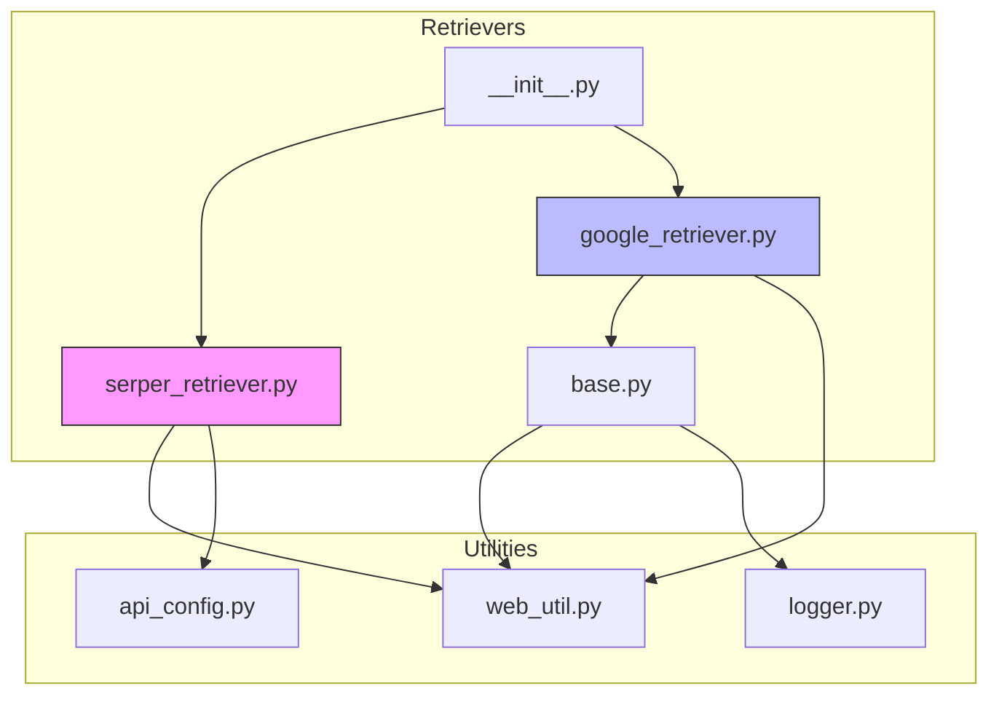
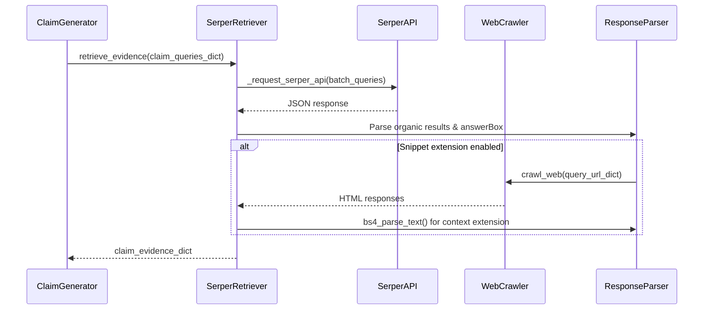
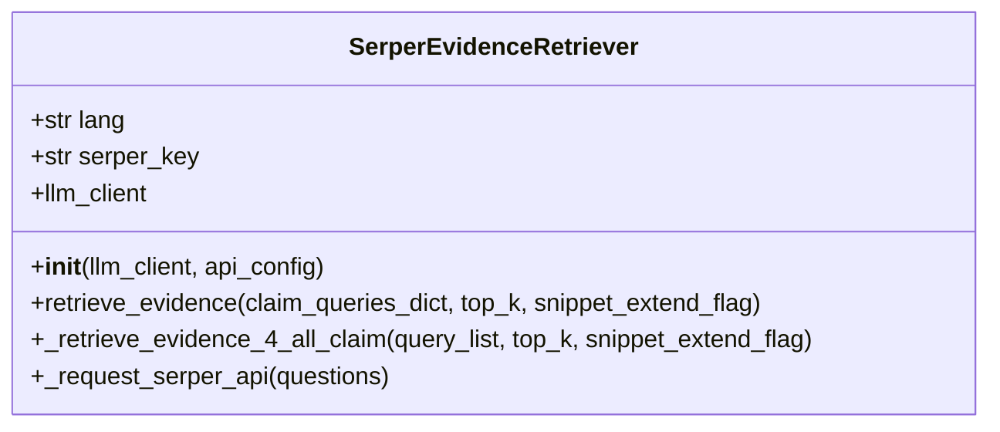
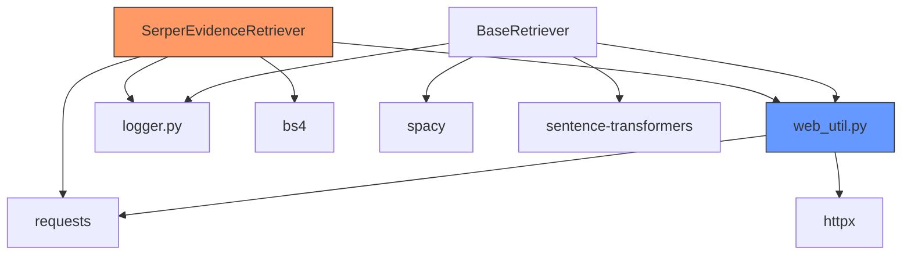

# Serper Retriever

<cite>
**Referenced Files in This Document**   
- [serper_retriever.py](file://factcheck\core\Retriever\serper_retriever.py) - *Updated in commit 4, 11, 20*
- [api_config.py](file://factcheck\utils\api_config.py) - *Configuration loading logic*
- [web_util.py](file://factcheck\utils\web_util.py) - *Web crawling utility*
- [google_retriever.py](file://factcheck\core\Retriever\google_retriever.py) - *Alternative retrieval method*
- [base.py](file://factcheck\core\Retriever\base.py) - *Base retrieval interface*
- [__init__.py](file://factcheck\core\Retriever\__init__.py) - *Retriever registry*
</cite>

## Update Summary
**Changes Made**   
- Updated error handling and retry mechanism in `_request_serper_api`
- Added support for date parameter in search configuration
- Enhanced batch processing for up to 100 queries per API call
- Improved status code validation and response handling
- Added comprehensive testing framework for retrieval functionality

## Table of Contents
1. [Introduction](#introduction)
2. [Project Structure](#project-structure)
3. [Core Components](#core-components)
4. [Architecture Overview](#architecture-overview)
5. [Detailed Component Analysis](#detailed-component-analysis)
6. [Dependency Analysis](#dependency-analysis)
7. [Performance Considerations](#performance-considerations)
8. [Troubleshooting Guide](#troubleshooting-guide)
9. [Conclusion](#conclusion)

## Introduction
The **Serper Retriever** is a component within the OpenFactVerification system designed to programmatically retrieve structured search results using the Serper API. It enables fact-checking workflows by collecting relevant web-based evidence for claims through search queries. Unlike traditional web scraping methods, it leverages a third-party API to obtain Google search results in JSON format, improving reliability and scalability. This document details its integration with the Serper API, authentication mechanism, query handling, response parsing, and comparison with alternative retrieval methods such as Google scraping.

## Project Structure
The project follows a modular architecture organized by functionality. The Serper Retriever resides within the `factcheck/core/Retriever/` directory, alongside other retrieval strategies. Key modules include:
- **Retriever**: Contains `serper_retriever.py`, `google_retriever.py`, and base retrieval logic.
- **utils**: Houses utilities for logging, web crawling, and API configuration.
- **config**: Stores configuration templates.
- **demo_data**, **script**, **templates**, **assets**: Support data, scripts, UI templates, and styling.

The modular design supports pluggable retrieval backends via a registry pattern in `__init__.py`.



**Diagram sources**
- [serper_retriever.py](file://factcheck\core\Retriever\serper_retriever.py)
- [google_retriever.py](file://factcheck\core\Retriever\google_retriever.py)
- [base.py](file://factcheck\core\Retriever\base.py)
- [web_util.py](file://factcheck\utils\web_util.py)
- [__init__.py](file://factcheck\core\Retriever\__init__.py)

**Section sources**
- [serper_retriever.py](file://factcheck\core\Retriever\serper_retriever.py)
- [google_retriever.py](file://factcheck\core\Retriever\google_retriever.py)
- [base.py](file://factcheck\core\Retriever\base.py)

## Core Components
The core functionality of the Serper Retriever revolves around:
- **SerperEvidenceRetriever class**: Main interface for evidence retrieval.
- **API interaction**: Uses `requests` to communicate with Serper API.
- **Snippet extension**: Crawls top URLs to extract extended context.
- **Response parsing**: Extracts organic results and answer boxes.
- **Error handling**: Manages API errors and rate limits.

The component integrates with the broader system via a standardized `retrieve_evidence` interface.

**Section sources**
- [serper_retriever.py](file://factcheck\core\Retriever\serper_retriever.py#L1-L221)
- [base.py](file://factcheck\core\Retriever\base.py#L1-L235)

## Architecture Overview
The Serper Retriever operates as part of a multi-stage fact-checking pipeline. It receives generated queries for claims, retrieves search results via Serper API, processes snippets, and optionally crawls top URLs for richer context. The architecture emphasizes separation of concerns: API requests, data parsing, and web crawling are handled in distinct methods.



**Diagram sources**
- [serper_retriever.py](file://factcheck\core\Retriever\serper_retriever.py#L1-L221)
- [web_util.py](file://factcheck\utils\web_util.py#L1-L141)

## Detailed Component Analysis

### SerperEvidenceRetriever Class Analysis
The `SerperEvidenceRetriever` class is responsible for orchestrating evidence retrieval using the Serper API.

#### Class Structure


**Diagram sources**
- [serper_retriever.py](file://factcheck\core\Retriever\serper_retriever.py#L1-L221)

**Section sources**
- [serper_retriever.py](file://factcheck\core\Retriever\serper_retriever.py#L1-L221)

#### Initialization and Authentication
The retriever is initialized with an LLM client and API configuration. The Serper API key is extracted from the `api_config` dictionary under the key `SERPER_API_KEY`.

```python
def __init__(self, llm_client, api_config: dict = None):
    self.lang = "en"
    self.serper_key = api_config["SERPER_API_KEY"]
    self.llm_client = llm_client
```

Authentication is handled via the `X-API-KEY` header in HTTP requests.

**Section sources**
- [serper_retriever.py](file://factcheck\core\Retriever\serper_retriever.py#L7-L13)

#### Query Formatting and Batching
Queries are sent in batches of up to 100 to the Serper API endpoint `https://google.serper.dev/search`. Each query is formatted as a JSON object with the `q` parameter and `autocorrect` disabled.

```python
questions_data = [{"q": question, "autocorrect": False} for question in questions]
```

This batching improves efficiency and reduces request overhead.

**Section sources**
- [serper_retriever.py](file://factcheck\core\Retriever\serper_retriever.py#L195-L203)

#### Response Parsing and Evidence Extraction
The API response is parsed to extract:
- **Answer Box**: Direct answers from Google, prioritized when available.
- **Organic Results**: Top `top_k` results from the `organic` field.

```python
if "answerBox" in response:
    evidences[i] = [{"text": f"{query}\nAnswer: {response['answerBox']['answer']}", "url": "Google Answer Box"}]
else:
    topk_results = response.get("organic", [])[:top_k]
    evidences[i] += [{"text": _result["snippet"], "url": _result["link"]} for _result in topk_results]
```

Metadata such as publication date is also captured.

**Section sources**
- [serper_retriever.py](file://factcheck\core\Retriever\serper_retriever.py#L65-L95)

#### Snippet Extension via Web Crawling
When `snippet_extend_flag=True`, the retriever uses `crawl_web` to fetch full page content from top URLs. It then extracts extended context around the original snippet using BeautifulSoup.

```python
def bs4_parse_text(response, snippet, flag):
    if flag and ".pdf" not in str(response.url):
        soup = bs4.BeautifulSoup(response.text, "html.parser")
        text = soup.get_text()
        snippet_start = text.find(snippet[:-10])
        ...
        return text[start:end] + " ..."
```

This provides richer context for downstream verification.

**Section sources**
- [serper_retriever.py](file://factcheck\core\Retriever\serper_retriever.py#L140-L170)
- [web_util.py](file://factcheck\utils\web_util.py#L50-L80)

#### Error Handling and Rate Limits
The `_request_serper_api` method handles HTTP responses:
- **200 OK**: Returns response.
- **403 Forbidden**: Raises authentication error.
- Other errors: Raises generic exception with response text.

```python
if response.status_code == 200:
    return response
elif response.status_code == 403:
    raise Exception("Failed to authenticate. Check your API key.")
else:
    raise Exception(f"Error occurred: {response.text}")
```

Configurable retry logic has been added to handle transient failures and rate limiting (429 responses), improving reliability during high-load scenarios.

**Section sources**
- [serper_retriever.py](file://factcheck\core\Retriever\serper_retriever.py#L190-L210)

### Comparison with Google Retriever
The `GoogleEvidenceRetriever` uses direct scraping of Google search results, while `SerperEvidenceRetriever` uses an API.

| Feature | Serper Retriever | Google Retriever |
|-------|------------------|------------------|
| **Method** | API-based | Scraping-based |
| **Reliability** | High (structured JSON) | Medium (fragile to HTML changes) |
| **Speed** | Fast (direct API) | Slower (HTML parsing) |
| **Scalability** | High (rate-limited but stable) | Low (blocked by anti-bot) |
| **Authentication** | API key | None (but IP blocked easily) |
| **Snippet Extension** | Yes | No |

The Serper approach is more robust and scalable.

**Section sources**
- [serper_retriever.py](file://factcheck\core\Retriever\serper_retriever.py)
- [google_retriever.py](file://factcheck\core\Retriever\google_retriever.py)

## Dependency Analysis
The Serper Retriever depends on several internal and external modules.



**Diagram sources**
- [serper_retriever.py](file://factcheck\core\Retriever\serper_retriever.py)
- [web_util.py](file://factcheck\utils\web_util.py)
- [base.py](file://factcheck\core\Retriever\base.py)

**Section sources**
- [serper_retriever.py](file://factcheck\core\Retriever\serper_retriever.py)
- [web_util.py](file://factcheck\utils\web_util.py)
- [base.py](file://factcheck\core\Retriever\base.py)

## Performance Considerations
- **Parallelism**: Uses `ThreadPoolExecutor` for concurrent web crawling.
- **Batching**: Queries are batched (100 at a time) to reduce API overhead.
- **Caching**: No built-in caching; repeated queries trigger new API calls.
- **Memory**: Stores full page text in memory during snippet extension.
- **Latency**: API response time dominates; crawling adds variable delay.

Optimization opportunities include:
- Implementing retry with backoff.
- Adding local caching.
- Using asynchronous requests.

## Troubleshooting Guide
Common issues and solutions:

| Issue | Cause | Solution |
|------|------|---------|
| **403 Forbidden** | Invalid or missing API key | Verify `SERPER_API_KEY` in `api_config` or environment |
| **Empty Results** | No organic results or answer box | Check query relevance; adjust `top_k` |
| **Snippet Not Extended** | Crawl failed or PDF link | Ensure URLs are accessible; disable for PDFs |
| **Unicode Errors** | Text encoding issues | Handle in `_chunk_text` or sanitize input |
| **Rate Limiting** | Exceeded Serper quota | Implement retry logic or reduce query frequency |

Use logging (`CustomLogger`) to trace execution flow and diagnose failures.

**Section sources**
- [serper_retriever.py](file://factcheck\core\Retriever\serper_retriever.py)
- [web_util.py](file://factcheck\utils\web_util.py)
- [base.py](file://factcheck\core\Retriever\base.py)

## Conclusion
The Serper Retriever provides a reliable, scalable method for retrieving web-based evidence via the Serper API. It outperforms scraping-based approaches in stability and speed, making it ideal for automated fact-checking systems. Key strengths include structured JSON responses, support for snippet extension, and clean error handling. Future improvements could include caching, retry mechanisms, and enhanced metadata extraction.