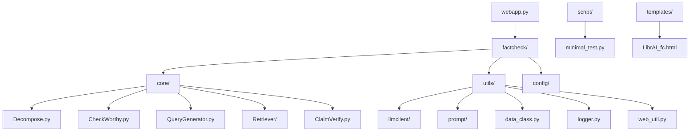
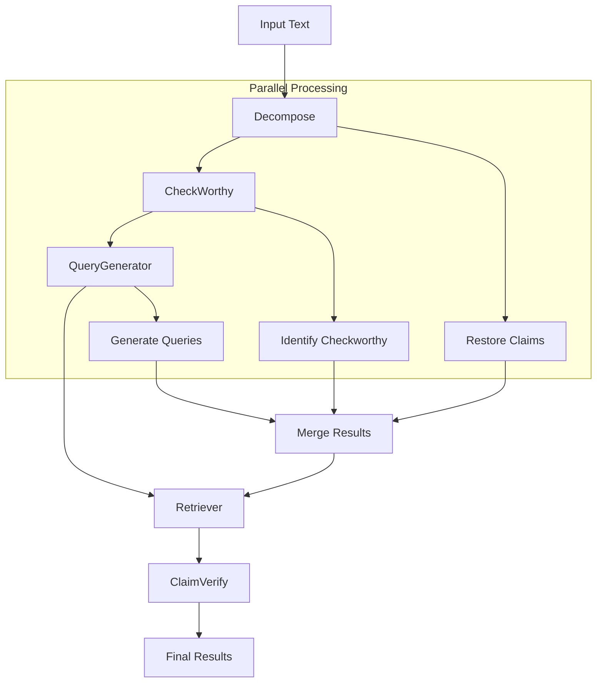
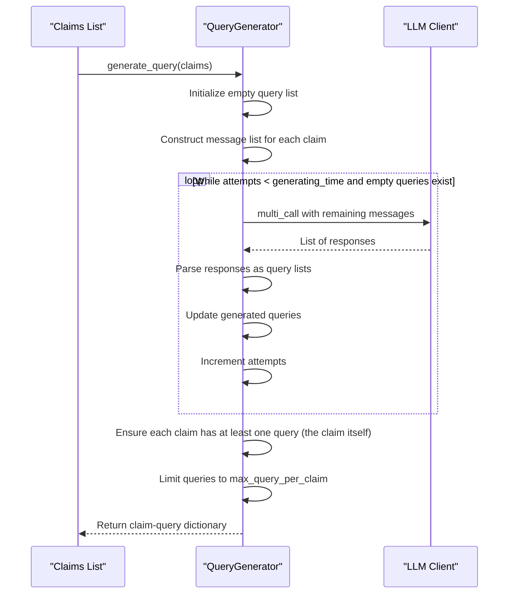
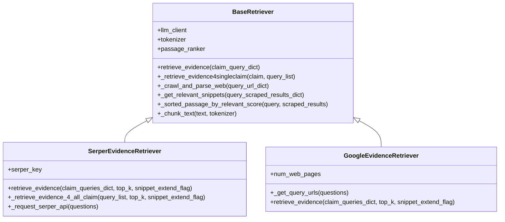
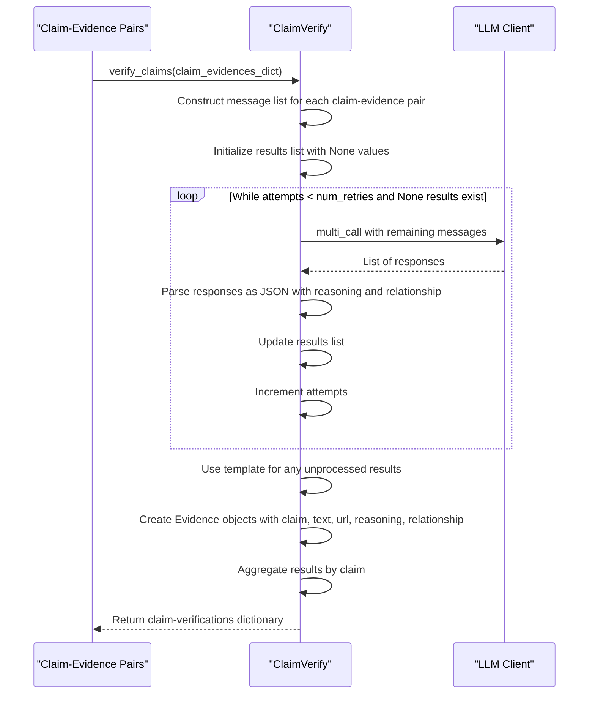
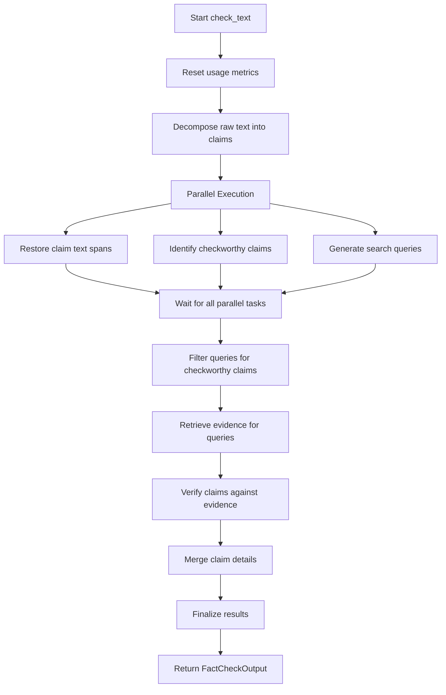
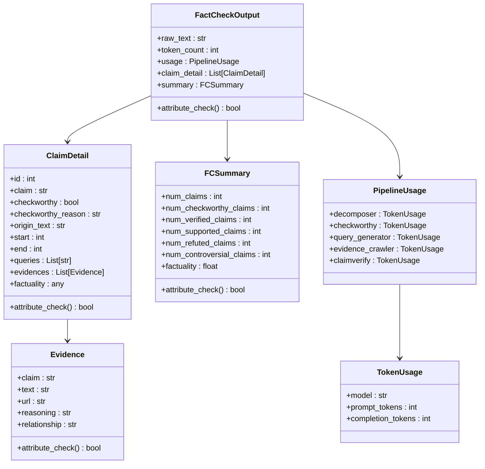
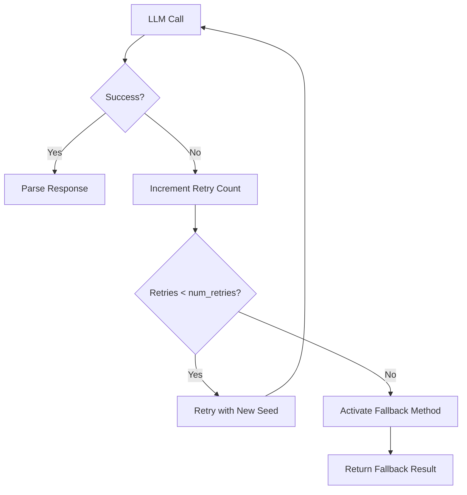

# Fact-Checking Pipeline Architecture

<cite>
**Referenced Files in This Document**   
- [README.md](file://README.md) - *Updated in recent commit*
- [factcheck/__init__.py](file://factcheck\__init__.py) - *Updated in commit 22*
- [factcheck/core/Decompose.py](file://factcheck\core\Decompose.py)
- [factcheck/core/CheckWorthy.py](file://factcheck\core\CheckWorthy.py)
- [factcheck/core/QueryGenerator.py](file://factcheck\core\QueryGenerator.py)
- [factcheck/core/Retriever/base.py](file://factcheck\core\Retriever\base.py) - *Updated in commit 22*
- [factcheck/core/Retriever/serper_retriever.py](file://factcheck\core\Retriever\serper_retriever.py)
- [factcheck/core/Retriever/google_retriever.py](file://factcheck\core\Retriever\google_retriever.py) - *Added in recent commit*
- [factcheck/core/ClaimVerify.py](file://factcheck\core\ClaimVerify.py)
- [factcheck/utils/data_class.py](file://factcheck\utils\data_class.py)
- [factcheck/utils/prompt/chatgpt_prompt_zh.py](file://factcheck\utils\prompt\chatgpt_prompt_zh.py) - *Added in commit 8*
- [factcheck/utils/prompt/__init__.py](file://factcheck\utils\prompt\__init__.py) - *Updated in commit 8*
- [factcheck/config/sample_prompt.yaml](file://factcheck\config\sample_prompt.yaml) - *Enhanced context preservation in commit d2c980a*
- [factcheck/utils/prompt/chatgpt_prompt.py](file://factcheck\utils\prompt\chatgpt_prompt.py) - *Enhanced context preservation in commit d2c980a*
- [factcheck/utils/prompt/claude_prompt.py](file://factcheck\utils\prompt\claude_prompt.py) - *Enhanced context preservation in commit d2c980a*
</cite>

## Update Summary
**Changes Made**   
- Updated documentation to reflect enhanced claim decomposition with context preservation introduced in commit d2c980a
- Added detailed explanation of context preservation rules in Decompose.py component
- Enhanced code examples to demonstrate context-aware claim decomposition
- Updated section sources to include modified prompt files
- Added test case examples showing successful context preservation
- Maintained documentation for modular retriever architecture and Chinese language support

## Table of Contents
1. [Introduction](#introduction)
2. [Project Structure](#project-structure)
3. [Core Components](#core-components)
4. [Architecture Overview](#architecture-overview)
5. [Detailed Component Analysis](#detailed-component-analysis)
6. [Pipeline Execution Flow](#pipeline-execution-flow)
7. [Data Flow and State Management](#data-flow-and-state-management)
8. [Error Handling and Fallback Mechanisms](#error-handling-and-fallback-mechanisms)
9. [Performance Considerations](#performance-considerations)
10. [Extensibility and Customization](#extensibility-and-customization)
11. [Multi-Language Support](#multi-language-support)

## Introduction
The OpenFactVerification system, branded as Loki, implements a comprehensive fact-checking pipeline that automates the verification of textual claims through a multi-stage processing architecture. This document details the sequential processing stages that transform raw input text into verified factual assessments. The pipeline follows a structured pattern that decomposes complex texts into atomic claims, evaluates their verifiability, generates search queries, retrieves relevant evidence from the web, and ultimately determines factual accuracy. Each stage is implemented as a modular component coordinated by the central FactCheck class, which manages state and data flow throughout the verification process. The system leverages large language models (LLMs) at multiple stages, combined with specialized retrieval algorithms and evidence analysis techniques to provide comprehensive fact-checking capabilities. Recent enhancements have improved context preservation during claim decomposition, ensuring geographical, temporal, and entity context is maintained in atomic claims.

## Project Structure
The OpenFactVerification project follows a modular architecture with clearly separated concerns. The core functionality resides in the `factcheck` package, which contains specialized modules for each stage of the fact-checking pipeline. The project organization supports both library usage and web application deployment, with configuration files and templates supporting various deployment scenarios.



**Section sources**
- [factcheck/__init__.py](file://factcheck\__init__.py)
- [factcheck/core/Decompose.py](file://factcheck\core\Decompose.py)

## Core Components
The fact-checking pipeline consists of five primary components that handle specific stages of the verification process: claim decomposition, checkworthiness assessment, query generation, evidence retrieval, and claim verification. These components are orchestrated by the FactCheck class, which manages the overall workflow and state. Each component is designed to be modular and configurable, allowing for different implementations and LLM backends. The system uses data classes to standardize data exchange between components, ensuring type safety and consistent data structure throughout the pipeline.

**Section sources**
- [factcheck/__init__.py](file://factcheck\__init__.py)
- [factcheck/utils/data_class.py](file://factcheck\utils\data_class.py)

## Architecture Overview
The fact-checking pipeline follows a sequential processing pattern with selective parallelization for performance optimization. The architecture is designed to handle complex texts by breaking them down into manageable components and processing them through specialized stages. The central FactCheck class coordinates the entire process, initializing all required components and managing the flow of data between them.



**Section sources**
- [factcheck/__init__.py](file://factcheck\__init__.py)
- [factcheck/core/Decompose.py](file://factcheck\core\Decompose.py)

## Detailed Component Analysis

### Decompose.py: Claim Decomposition with Context Preservation
The Decompose component is responsible for breaking down input text into individual atomic claims that can be independently verified. It uses LLM prompting to identify discrete factual statements within the text, with a fallback to NLTK sentence tokenization if the LLM fails to produce valid output. Recent enhancements have introduced critical context preservation rules to maintain geographical locations, time periods, organizations, proper nouns, and causal relationships in the decomposed claims.

```mermaid
sequenceDiagram
participant User as "User Input"
participant Decomposer as "Decompose"
participant LLM as "LLM Client"
User->>Decomposer : getclaims(doc)
Decomposer->>LLM : Send decomposition prompt
loop Retry up to num_retries
LLM-->>Decomposer : Response with claims
Decomposer->>Decomposer : Parse response as list
alt Valid list returned
Decomposer-->>User : Return claims list
break
else Parse error
Decomposer->>LLM : Retry with new seed
end
end
alt LLM fails
Decomposer->>Decomposer : Fallback to nltk sentence tokenization
Decomposer-->>User : Return sentence splits
end
```

**Section sources**
- [factcheck/core/Decompose.py](file://factcheck\core\Decompose.py)
- [factcheck/config/sample_prompt.yaml](file://factcheck\config\sample_prompt.yaml) - *Enhanced context preservation*
- [factcheck/utils/prompt/chatgpt_prompt.py](file://factcheck\utils\prompt\chatgpt_prompt.py) - *Enhanced context preservation*
- [factcheck/utils/prompt/claude_prompt.py](file://factcheck\utils\prompt\claude_prompt.py) - *Enhanced context preservation*

#### Code Example: Claim Decomposition with Context Preservation
```python
from factcheck.core.Decompose import Decompose
from factcheck.utils.llmclient import GPTClient
from factcheck.utils.prompt import ChatGPTPrompt

llm_client = GPTClient(model="gpt-4o")
prompt = ChatGPTPrompt()
decomposer = Decompose(llm_client=llm_client, prompt=prompt)

# Example with geographical context
text1 = "Protests in Nepal occurred due to social media bans."
claims1 = decomposer.getclaims(doc=text1, num_retries=3)
print(claims1)
# Output: ["Protests occurred in Nepal.", "Protests in Nepal were due to social media bans.", "Social media bans were imposed in Nepal."]

# Example with temporal context
text2 = "Did Elon Musk buy X in 2023?"
claims2 = decomposer.getclaims(doc=text2, num_retries=3)
print(claims2)
# Output: ["Elon Musk bought X.", "Elon Musk bought X in 2023."]

# Example with combined context
text3 = "Apple announced iPhone 15 launch in California during September 2023."
claims3 = decomposer.getclaims(doc=text3, num_retries=3)
print(claims3)
# Output: ["Apple announced iPhone 15 launch.", "Apple announced iPhone 15 launch in California.", "Apple announced iPhone 15 launch in September 2023.", "iPhone 15 launch occurred in California during September 2023."]
```

### CheckWorthy.py: Checkworthiness Assessment
The CheckWorthy component filters claims to identify those that are actually verifiable and worth fact-checking. It uses LLM prompting to classify each claim as "Yes" (checkworthy) or "No" (not checkworthy), returning both the filtered list and the reasoning for each decision.

```mermaid
sequenceDiagram
participant Claims as "Claims List"
participant CheckWorthy as "CheckWorthy"
participant LLM as "LLM Client"
Claims->>CheckWorthy : identify_checkworthiness(texts)
CheckWorthy->>CheckWorthy : Join claims with numbering
CheckWorthy->>LLM : Send checkworthiness prompt
loop Retry up to num_retries
LLM-->>CheckWorthy : Response with claim-reasoning pairs
CheckWorthy->>CheckWorthy : Parse response as dictionary
CheckWorthy->>CheckWorthy : Filter claims starting with "Yes"
alt Valid response
CheckWorthy-->>Claims : Return checkworthy claims and mapping
break
else Parse error
CheckWorthy->>LLM : Retry with new seed
end
end
```

**Section sources**
- [factcheck/core/CheckWorthy.py](file://factcheck\core\CheckWorthy.py)

#### Code Example: Checkworthiness Assessment
```python
from factcheck.core.CheckWorthy import Checkworthy
from factcheck.utils.llmclient import GPTClient
from factcheck.utils.prompt import ChatGPTPrompt

llm_client = GPTClient(model="gpt-4o")
prompt = ChatGPTPrompt()
checker = Checkworthy(llm_client=llm_client, prompt=prompt)

claims = ["The sky is blue.", "I like ice cream.", "Water boils at 100°C at sea level."]
checkworthy_claims, claim2checkworthy = checker.identify_checkworthiness(claims)
print("Checkworthy claims:", checkworthy_claims)
# Output: ["The sky is blue.", "Water boils at 100°C at sea level."]
print("Reasoning:", claim2checkworthy)
```

### QueryGenerator.py: Query Generation
The QueryGenerator component creates effective search queries for each checkworthy claim, enhancing the likelihood of retrieving relevant evidence. It generates multiple queries per claim to capture different search perspectives, with a fallback to using the claim itself as a query if generation fails.



**Section sources**
- [factcheck/core/QueryGenerator.py](file://factcheck\core\QueryGenerator.py)

#### Code Example: Query Generation
```python
from factcheck.core.QueryGenerator import QueryGenerator
from factcheck.utils.llmclient import GPTClient
from factcheck.utils.prompt import ChatGPTPrompt

llm_client = GPTClient(model="gpt-4o")
prompt = ChatGPTPrompt()
query_gen = QueryGenerator(llm_client=llm_client, prompt=prompt, max_query_per_claim=5)

claims = ["Water boils at 100°C at sea level."]
claim_queries = query_gen.generate_query(claims)
print(claim_queries)
# Output: {"Water boils at 100°C at sea level.": ["Water boils at 100°C at sea level.", "What temperature does water boil?", ...]}
```

### Retriever Modules: Evidence Retrieval
The Retriever components fetch and parse web evidence for the generated queries. The system supports multiple retrieval backends through a modular architecture, with the BaseRetriever providing common functionality and specific implementations for different search APIs. The SerperEvidenceRetriever provides integration with the Serper API for Google search results, while the GoogleEvidenceRetriever offers direct Google search capabilities. The retrieval process includes web crawling, content parsing, and relevance scoring to identify the most pertinent evidence snippets.



**Diagram sources**
- [factcheck/core/Retriever/base.py](file://factcheck\core\Retriever\base.py) - *Updated in commit 22*
- [factcheck/core/Retriever/serper_retriever.py](file://factcheck\core\Retriever\serper_retriever.py)
- [factcheck/core/Retriever/google_retriever.py](file://factcheck\core\Retriever\google_retriever.py) - *Added in recent commit*

**Section sources**
- [factcheck/core/Retriever/base.py](file://factcheck\core\Retriever\base.py) - *Updated in commit 22*
- [factcheck/core/Retriever/serper_retriever.py](file://factcheck\core\Retriever\serper_retriever.py)
- [factcheck/core/Retriever/google_retriever.py](file://factcheck\core\Retriever\google_retriever.py) - *Added in recent commit*

#### Code Example: Evidence Retrieval
```python
from factcheck.core.Retriever.serper_retriever import SerperEvidenceRetriever
from factcheck.utils.llmclient import GPTClient

api_config = {"SERPER_API_KEY": "your-serper-key"}
llm_client = GPTClient(model="gpt-4o")
retriever = SerperEvidenceRetriever(llm_client=llm_client, api_config=api_config)

claim_queries = {
    "Water boils at 100°C at sea level.": [
        "Water boils at 100°C at sea level.",
        "What temperature does water boil?"
    ]
}

evidence = retriever.retrieve_evidence(claim_queries, top_k=3)
print(evidence)
# Output: {"Water boils at 100°C at sea level.": [{"text": "Water boils at 100°C at standard atmospheric pressure...", "url": "https://example.com"}]}
```

### ClaimVerify.py: Claim Verification
The ClaimVerify component determines the factual accuracy of claims by analyzing their relationship to retrieved evidence. It uses LLM prompting to assess whether each piece of evidence supports, refutes, or is irrelevant to the claim, providing reasoning for each determination.



**Section sources**
- [factcheck/core/ClaimVerify.py](file://factcheck\core\ClaimVerify.py)

#### Code Example: Claim Verification
```python
from factcheck.core.ClaimVerify import ClaimVerify
from factcheck.utils.llmclient import GPTClient
from factcheck.utils.prompt import ChatGPTPrompt

llm_client = GPTClient(model="gpt-4o")
prompt = ChatGPTPrompt()
verifier = ClaimVerify(llm_client=llm_client, prompt=prompt)

claim_evidences = {
    "Water boils at 100°C at sea level.": [
        {"text": "Water boils at 100°C at standard atmospheric pressure (1 atm).", "url": "https://example.com"}
    ]
}

results = verifier.verify_claims(claim_evidences)
print(results)
# Output: {"Water boils at 100°C at sea level.": [Evidence(claim="Water boils at 100°C at sea level.", text="Water boils...", url="https://example.com", reasoning="The evidence states that water boils at 100°C at standard atmospheric pressure, which matches the claim.", relationship="SUPPORTS")]}
```

## Pipeline Execution Flow
The FactCheck class orchestrates the entire verification pipeline, managing the sequence of operations and state between components. The execution flow combines sequential processing with selective parallelization to optimize performance, particularly in the early stages where claim decomposition, checkworthiness assessment, and query generation can be processed concurrently.



**Section sources**
- [factcheck/__init__.py](file://factcheck\__init__.py) - *Updated in commit 22*

#### Code Example: Complete Pipeline Execution
```python
from factcheck import FactCheck

# Initialize the fact-checker
factcheck = FactCheck(
    default_model="gpt-4o",
    retriever="serper",
    api_config={"SERPER_API_KEY": "your-serper-key"}
)

# Run the complete pipeline
text = "Climate change is real. The Earth's average temperature has risen by about 1.2°C since the late 19th century."
results = factcheck.check_text(text)

# Access results
print(f"Overall factuality: {results['summary']['factuality']}")
for claim in results['claim_detail']:
    print(f"Claim: {claim['claim']}")
    print(f"Checkworthy: {claim['checkworthy']}")
    print(f"Factuality: {claim['factuality']}")
    for evidence in claim['evidences']:
        print(f"  Evidence: {evidence['text']}")
        print(f"  Relationship: {evidence['relationship']}")
```

## Data Flow and State Management
The pipeline maintains state through standardized data structures defined in data_class.py, ensuring consistent data exchange between components. The FactCheckOutput data class serves as the final container for all results, while intermediate stages use specialized data classes to pass information between components.



**Section sources**
- [factcheck/utils/data_class.py](file://factcheck\utils\data_class.py)

## Error Handling and Fallback Mechanisms
The pipeline implements robust error handling and fallback mechanisms to ensure reliability even when individual components fail. Each stage includes retry logic with varying seeds to handle LLM inconsistencies, and provides fallback methods when primary approaches fail.

### Error Handling Strategies
- **Retry with varying seeds**: Each LLM call includes a seed parameter that increments with each retry attempt, helping to overcome occasional LLM inconsistencies
- **Graceful degradation**: When LLM parsing fails, the system falls back to simpler methods (e.g., using NLTK for claim decomposition)
- **Data validation**: The attribute_check methods in data classes validate that all required fields are populated before returning results
- **Exception logging**: Comprehensive logging captures errors and system state for debugging and monitoring



**Section sources**
- [factcheck/core/Decompose.py](file://factcheck\core\Decompose.py)
- [factcheck/core/CheckWorthy.py](file://factcheck\core\CheckWorthy.py)
- [factcheck/core/QueryGenerator.py](file://factcheck\core\QueryGenerator.py)
- [factcheck/core/ClaimVerify.py](file://factcheck\core\ClaimVerify.py)

## Performance Considerations
The pipeline architecture balances thoroughness with performance through selective parallelization and efficient resource management. The evidence retrieval stage represents the primary performance bottleneck due to external API calls and web crawling.

### Sequential vs Parallel Execution
The pipeline uses a hybrid approach:
- **Sequential**: Claim decomposition → Evidence retrieval → Claim verification (due to data dependencies)
- **Parallel**: Claim restoration, checkworthiness assessment, and query generation (independent operations on the same claim set)

### Performance Metrics
The system tracks token usage and processing time for each component, providing insights into resource consumption:

```python
# Access performance metrics from results
results = factcheck.check_text(text)
usage = results['usage']
print(f"Decomposer tokens: {usage['decomposer']['prompt_tokens'] + usage['decomposer']['completion_tokens']}")
print(f"Total processing time: {results['summary']['processing_time']} seconds")
```

### Optimization Opportunities
- **Caching**: Implement result caching for frequently checked claims
- **Batching**: Optimize LLM calls by batching similar operations
- **Asynchronous processing**: Use async/await for I/O-bound operations like web requests
- **Model selection**: Use smaller, faster models for less critical stages

**Section sources**
- [factcheck/__init__.py](file://factcheck\__init__.py) - *Updated in commit 22*
- [factcheck/core/Retriever/base.py](file://factcheck\core\Retriever\base.py) - *Updated in commit 22*

## Extensibility and Customization
The pipeline is designed for extensibility, allowing customization of various components through configuration parameters and modular design.

### Configuration Options
The FactCheck class accepts multiple parameters for customization:
- **Model selection**: Specify different LLMs for each processing stage
- **Retriever selection**: Choose between different evidence retrieval backends
- **Prompt customization**: Use different prompt templates for various languages or styles
- **API configuration**: Configure external service credentials and endpoints

```python
# Example of customized FactCheck initialization
factcheck = FactCheck(
    default_model="gpt-4o",
    client="gpt",  # Specify LLM client
    prompt="claude_prompt",  # Use Claude-specific prompts
    retriever="serper",  # Use Serper API for retrieval
    decompose_model="gpt-3.5-turbo",  # Use smaller model for decomposition
    claim_verify_model="gpt-4o",  # Use larger model for final verification
    api_config={"SERPER_API_KEY": "your-key", "OPENAI_API_KEY": "your-key"},
    num_seed_retries=5  # Increase retry attempts
)
```

### Custom Module Injection
The modular design allows for injecting custom implementations:
- **Custom retrievers**: Extend BaseRetriever for new evidence sources
- **Specialized prompts**: Create custom prompt classes for domain-specific fact-checking
- **Alternative LLM clients**: Implement new LLMClient subclasses for additional providers

**Section sources**
- [factcheck/__init__.py](file://factcheck\__init__.py) - *Updated in commit 22*
- [factcheck/core/Retriever/base.py](file://factcheck\core\Retriever\base.py) - *Updated in commit 22*
- [factcheck/utils/prompt/base.py](file://factcheck\utils\prompt\base.py)

## Multi-Language Support
The system has been enhanced to support multiple languages, with initial implementation for Chinese language processing. This feature enables the fact-checking pipeline to handle input text and generate prompts in different languages, expanding its global applicability.

### Chinese Language Implementation
The Chinese language support is implemented through the ChatGPTPromptZH class, which provides Chinese-specific prompts for all pipeline stages. The prompt_mapper function in the prompt module has been updated to include the "chatgpt_prompt_zh" option, allowing users to select Chinese language processing.

```python
from factcheck.utils.prompt import prompt_mapper

# Initialize Chinese language prompt
zh_prompt = prompt_mapper("chatgpt_prompt_zh")

# Use with FactCheck
factcheck = FactCheck(
    default_model="gpt-4o",
    prompt="chatgpt_prompt_zh",
    api_config={"SERPER_API_KEY": "your-key"}
)
```

The Chinese prompts follow the same structure as their English counterparts but are tailored for Chinese language processing, including appropriate examples and formatting guidelines.

**Section sources**
- [factcheck/utils/prompt/chatgpt_prompt_zh.py](file://factcheck\utils\prompt\chatgpt_prompt_zh.py) - *Added in commit 8*
- [factcheck/utils/prompt/__init__.py](file://factcheck\utils\prompt\__init__.py) - *Updated in commit 8*