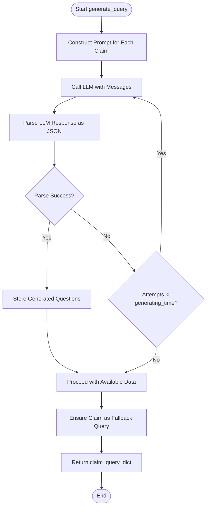
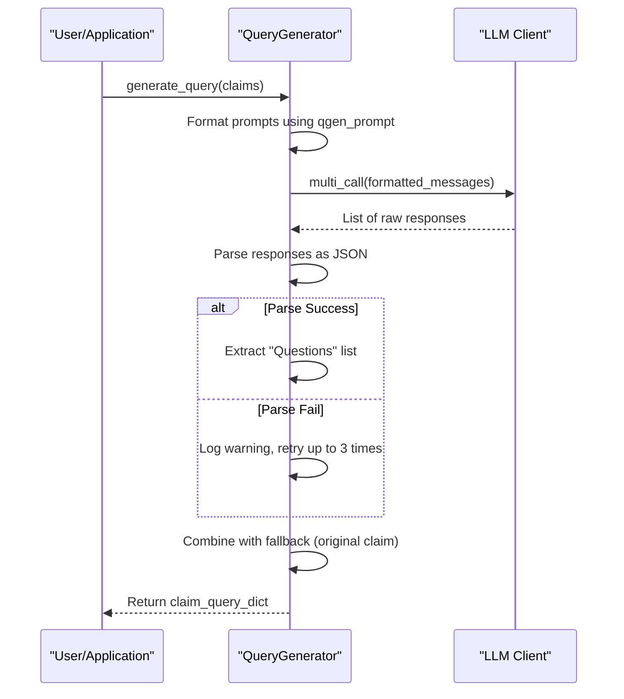

# Query Generation

<cite>
**Referenced Files in This Document**   
- [factcheck/core/QueryGenerator.py](file://factcheck/core/QueryGenerator.py#L1-L60)
- [factcheck/utils/prompt/chatgpt_prompt.py](file://factcheck/utils/prompt/chatgpt_prompt.py#L100-L143)
- [factcheck/core/Retriever/serper_retriever.py](file://factcheck/core/Retriever/serper_retriever.py#L50-L100)
</cite>

## Table of Contents
1. [Introduction](#introduction)
2. [Query Generation Process](#query-generation-process)
3. [Query Specificity and Context Handling](#query-specificity-and-context-handling)
4. [LLM-Based Query Variant Generation](#llm-based-query-variant-generation)
5. [Integration with Retriever Modules](#integration-with-retriever-modules)
6. [Configuration Options](#configuration-options)
7. [Error Handling and Low Recall Scenarios](#error-handling-and-low-recall-scenarios)
8. [Performance Optimization](#performance-optimization)

## Introduction
The Query Generation module is a critical component of the Loki fact-checking pipeline, responsible for transforming checkworthy claims into optimized search queries for evidence retrieval. This document details the implementation, strategies, and integration of the `QueryGenerator.py` module, which leverages Large Language Models (LLMs) to generate effective, context-rich queries that maximize the chances of retrieving relevant and reliable evidence from the web.

**Section sources**
- [factcheck/core/QueryGenerator.py](file://factcheck/core/QueryGenerator.py#L1-L60)

## Query Generation Process
The `QueryGenerator` class orchestrates the transformation of claims into search queries using LLMs. It accepts a list of claims and generates multiple query variants per claim to increase retrieval coverage. The process involves formatting prompts, invoking the LLM, parsing responses, and ensuring fallback mechanisms.

The core method `generate_query()` follows a retry-based approach to handle potential LLM response parsing failures. It attempts up to `generating_time` times (default: 3) to obtain valid JSON responses from the LLM. If parsing fails, it logs the error and retries, ensuring robustness against malformed outputs.



**Diagram sources**
- [factcheck/core/QueryGenerator.py](file://factcheck/core/QueryGenerator.py#L20-L60)

**Section sources**
- [factcheck/core/QueryGenerator.py](file://factcheck/core/QueryGenerator.py#L20-L60)

## Query Specificity and Context Handling
To enhance query specificity and minimize ambiguity, the system uses a structured prompt template defined in `chatgpt_prompt.py`. The `qgen_prompt` is designed to extract key verification questions from a claim by focusing on essential elements such as "who," "what," "where," "when," and "why."

For example, given the claim:  
*"The Stanford Prison Experiment was conducted in the basement of Encina Hall, Stanford’s psychology building."*  
The system generates:  
`{"Questions": ["Where was Stanford Prison Experiment conducted?"]}`

This approach ensures that each generated query targets a specific verifiable fact within the claim, improving precision in evidence retrieval. The prompt design avoids vague or overly broad questions, instead focusing on atomic, fact-based inquiries.

```python
qgen_prompt = """Given a claim, your task is to create minimum number of questions need to be check to verify the correctness of the claim. Output in JSON format with a single key "Questions", the value is a list of questions."""
```

**Section sources**
- [factcheck/utils/prompt/chatgpt_prompt.py](file://factcheck/utils/prompt/chatgpt_prompt.py#L100-L143)

## LLM-Based Query Variant Generation
The `QueryGenerator` leverages LLMs to produce multiple query variants per claim, increasing the likelihood of retrieving diverse and relevant evidence. The number of queries per claim is capped by `max_query_per_claim` (default: 5), ensuring efficiency while maintaining diversity.

The system uses a batched LLM invocation strategy via `multi_call()` to process multiple claims in parallel, reducing latency. Each claim is formatted into a prompt using `qgen_prompt.format(claim=claim)`, and the LLM is expected to return a JSON object with a "Questions" key containing a list of strings.

In cases where the LLM fails to generate valid output after multiple attempts, the system ensures robustness by including the original claim as a fallback query. This guarantees that every claim produces at least one search query, preventing retrieval failure.



**Diagram sources**
- [factcheck/core/QueryGenerator.py](file://factcheck/core/QueryGenerator.py#L20-L60)
- [factcheck/utils/prompt/chatgpt_prompt.py](file://factcheck/utils/prompt/chatgpt_prompt.py#L100-L143)

**Section sources**
- [factcheck/core/QueryGenerator.py](file://factcheck/core/QueryGenerator.py#L20-L60)

## Integration with Retriever Modules
The output of `QueryGenerator` is directly consumed by the `SerperEvidenceRetriever` module, which performs web searches using the generated queries. The `claim_queries_dict` structure — a dictionary mapping claims to lists of queries — is passed to `retrieve_evidence()` for processing.

Each query is sent to the Serper API, which returns organic search results and, when available, answer box content. The retriever processes up to `top_k` results (default: 3) per query and optionally extends snippets by crawling the target URLs for more context.

```python
claim_queries_dict = {
    "Mary is a five-year old girl.": [
        "How old is Mary?",
        "What is Mary's age?"
    ]
}
```

This integration ensures that even if one query fails to retrieve relevant evidence, alternative queries may succeed, improving overall recall.

**Section sources**
- [factcheck/core/Retriever/serper_retriever.py](file://factcheck/core/Retriever/serper_retriever.py#L50-L100)

## Configuration Options
The `QueryGenerator` supports several configuration parameters to control behavior:

- **max_query_per_claim**: Limits the number of generated queries per claim (default: 5). This prevents excessive LLM usage and retrieval overhead.
- **generating_time**: Maximum number of retry attempts for LLM response parsing (default: 3). Balances robustness and performance.
- **prompt**: Optional custom prompt override, allowing domain-specific or language-specific query generation templates.

These options are set during initialization and can be adjusted based on performance requirements or domain constraints.

**Section sources**
- [factcheck/core/QueryGenerator.py](file://factcheck/core/QueryGenerator.py#L10-L15)

## Error Handling and Low Recall Scenarios
The system includes several safeguards for handling low recall or failed query generation:

1. **Retry Mechanism**: Up to three attempts are made to parse LLM responses, reducing the impact of transient parsing errors.
2. **Fallback Queries**: If no queries are generated, the original claim is used as a search term, ensuring no claim is left unsearched.
3. **Logging**: Warnings are logged when response parsing fails, aiding in debugging and monitoring.

In low recall scenarios, users are advised to:
- Verify API key validity and LLM availability
- Adjust `max_query_per_claim` to increase query diversity
- Customize the prompt to better suit the claim domain
- Ensure claims are specific and verifiable (e.g., avoid pronouns without antecedents)

**Section sources**
- [factcheck/core/QueryGenerator.py](file://factcheck/core/QueryGenerator.py#L35-L50)

## Performance Optimization
To reduce LLM invocation costs and improve efficiency:

- **Batch Processing**: Multiple claims are processed in a single `multi_call()` to minimize API round trips.
- **Caching**: Future enhancements could include caching query patterns for similar claims.
- **Prompt Efficiency**: The `qgen_prompt` is designed to elicit concise, relevant questions without unnecessary verbosity.
- **Parallel Retrieval**: The downstream `SerperEvidenceRetriever` uses thread pooling to crawl multiple URLs concurrently.

For high-throughput applications, consider:
- Limiting `max_query_per_claim` to 2–3
- Reducing `generating_time` to 2 if LLM reliability is high
- Using lightweight LLMs for query generation when accuracy permits

**Section sources**
- [factcheck/core/QueryGenerator.py](file://factcheck/core/QueryGenerator.py#L30-L60)
- [factcheck/core/Retriever/serper_retriever.py](file://factcheck/core/Retriever/serper_retriever.py#L100-L150)