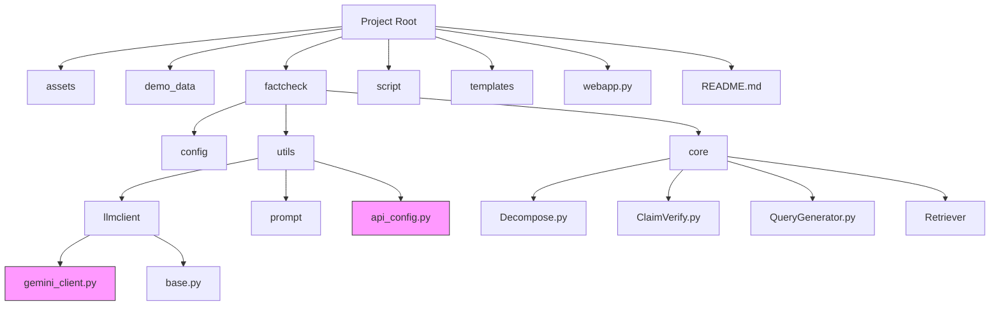
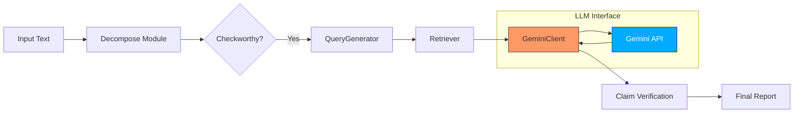
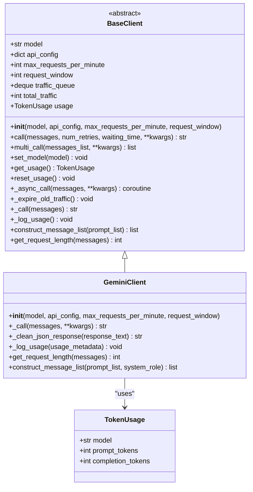
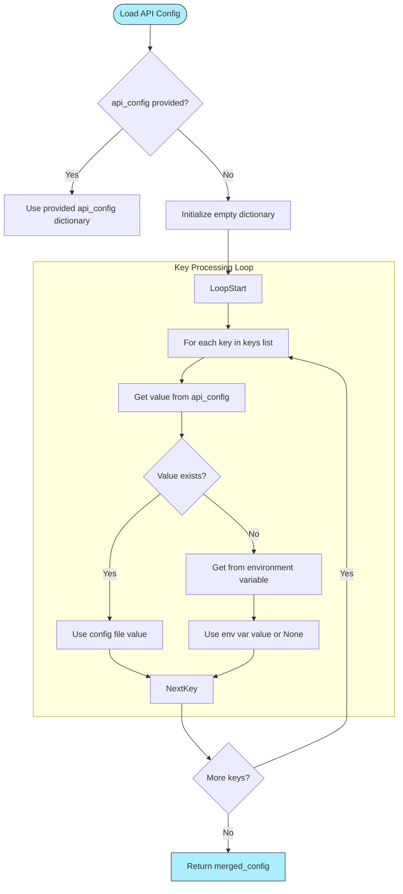
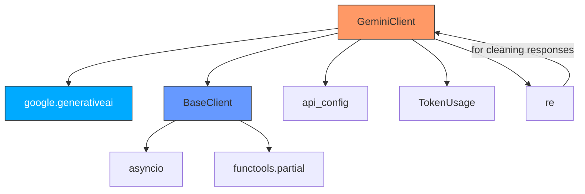

# Gemini Client Configuration

<cite>
**Referenced Files in This Document**   
- [gemini_client.py](file://factcheck/utils/llmclient/gemini_client.py#L1-L105)
- [base.py](file://factcheck/utils/llmclient/base.py#L1-L100)
- [api_config.py](file://factcheck/utils/api_config.py#L1-L31)
- [GEMINI_README.md](file://GEMINI_README.md#L1-L58)
- [chatgpt_prompt.py](file://factcheck/utils/prompt/chatgpt_prompt.py#L1-L144)
- [__init__.py](file://factcheck/core/__init__.py#L1-L6)
</cite>

## Table of Contents
1. [Introduction](#introduction)
2. [Project Structure](#project-structure)
3. [Core Components](#core-components)
4. [Architecture Overview](#architecture-overview)
5. [Detailed Component Analysis](#detailed-component-analysis)
6. [Dependency Analysis](#dependency-analysis)
7. [Performance Considerations](#performance-considerations)
8. [Troubleshooting Guide](#troubleshooting-guide)
9. [Conclusion](#conclusion)

## Introduction
The Gemini Client Configuration documentation provides a comprehensive guide to integrating and utilizing Google's Gemini API within the OpenFactVerification framework. This system is designed for automated fact-checking, leveraging Gemini for tasks such as claim decomposition, verification, and query generation. The configuration supports exclusive use of the Gemini API, replacing other LLM providers like OpenAI or Claude in this deployment mode. This document details the setup, implementation, and integration patterns required to effectively use the Gemini client for multimodal fact verification.

## Project Structure
The project follows a modular structure organized by functionality and component type. The core logic resides in the `factcheck` directory, with specialized modules for retrieval, verification, and language model interaction. Configuration and utility functions are separated into dedicated submodules to promote reusability and maintainability.



**Diagram sources**
- [factcheck/utils/llmclient/gemini_client.py](file://factcheck/utils/llmclient/gemini_client.py#L1-L105)
- [factcheck/utils/api_config.py](file://factcheck/utils/api_config.py#L1-L31)

**Section sources**
- [factcheck/utils/llmclient/gemini_client.py](file://factcheck/utils/llmclient/gemini_client.py#L1-L105)
- [factcheck/utils/api_config.py](file://factcheck/utils/api_config.py#L1-L31)

## Core Components
The core components of the Gemini client configuration include the `GeminiClient` class, API key management via `api_config.py`, and prompt engineering through `chatgpt_prompt.py`. These components work together to enable seamless communication between the fact-checking pipeline and Google's Gemini API. The system is designed to handle rate limiting, response parsing, and error recovery automatically.

**Section sources**
- [gemini_client.py](file://factcheck/utils/llmclient/gemini_client.py#L1-L105)
- [api_config.py](file://factcheck/utils/api_config.py#L1-L31)
- [chatgpt_prompt.py](file://factcheck/utils/prompt/chatgpt_prompt.py#L1-L144)

## Architecture Overview
The architecture centers around a modular pipeline where text input is decomposed into atomic claims, each of which is processed through a verification workflow involving query generation, evidence retrieval, and final assessment using the Gemini model. The LLM client abstraction allows for consistent interaction across different models, with Gemini-specific behavior encapsulated in its client implementation.



**Diagram sources**
- [factcheck/core/Decompose.py](file://factcheck/core/Decompose.py)
- [factcheck/core/ClaimVerify.py](file://factcheck/core/ClaimVerify.py)
- [factcheck/utils/llmclient/gemini_client.py](file://factcheck/utils/llmclient/gemini_client.py#L1-L105)

## Detailed Component Analysis

### Gemini Client Implementation
The `GeminiClient` class extends the `BaseClient` abstract class to provide Gemini-specific functionality. It handles API configuration, rate limiting, and response formatting according to Gemini's requirements.

#### Class Structure and Inheritance


**Diagram sources**
- [factcheck/utils/llmclient/base.py](file://factcheck/utils/llmclient/base.py#L1-L100)
- [factcheck/utils/llmclient/gemini_client.py](file://factcheck/utils/llmclient/gemini_client.py#L1-L105)
- [factcheck/utils/data_class.py](file://factcheck/utils/data_class.py)

#### API Configuration and Key Management
The system loads API keys from both environment variables and configuration files, with file-based configuration taking precedence. This dual-source approach provides flexibility for different deployment scenarios.



**Diagram sources**
- [factcheck/utils/api_config.py](file://factcheck/utils/api_config.py#L1-L31)

### Prompt Engineering and Message Formatting
The system uses structured prompts to guide Gemini's responses in JSON format, ensuring consistency in output parsing. The prompt templates are defined in `chatgpt_prompt.py` and adapted for Gemini's response style.

#### Prompt Template Structure
```python
decompose_prompt = """
Your task is to decompose the text into atomic claims.
The answer should be a JSON with a single key "claims", with the value of a list of strings...

Text: {doc}
Output:
"""
```

The `construct_message_list` method in `GeminiClient` formats prompts by combining system instructions with user input, accommodating Gemini's lack of explicit system role support in message formatting.

**Section sources**
- [factcheck/utils/prompt/chatgpt_prompt.py](file://factcheck/utils/prompt/chatgpt_prompt.py#L1-L144)
- [factcheck/utils/llmclient/gemini_client.py](file://factcheck/utils/llmclient/gemini_client.py#L1-L105)

## Dependency Analysis
The Gemini client depends on several internal and external components to function correctly. These dependencies form a layered architecture that separates concerns while maintaining integration points.



**Diagram sources**
- [factcheck/utils/llmclient/gemini_client.py](file://factcheck/utils/llmclient/gemini_client.py#L1-L105)
- [factcheck/utils/llmclient/base.py](file://factcheck/utils/llmclient/base.py#L1-L100)
- [factcheck/utils/api_config.py](file://factcheck/utils/api_config.py#L1-L31)

**Section sources**
- [factcheck/utils/llmclient/gemini_client.py](file://factcheck/utils/llmclient/gemini_client.py#L1-L105)
- [factcheck/utils/llmclient/base.py](file://factcheck/utils/llmclient/base.py#L1-L100)

## Performance Considerations
The Gemini client is configured with a default rate limit of 15 requests per minute, aligning with Gemini's API constraints. The traffic queue mechanism in `BaseClient` enforces this limit by tracking request timestamps and blocking when thresholds are exceeded. Response cleaning using regular expressions adds minimal overhead but ensures consistent JSON parsing. The low temperature setting (0.1) in generation configuration prioritizes consistency over creativity, which is crucial for fact-checking accuracy.

## Troubleshooting Guide
Common issues and their solutions when configuring the Gemini client:

- **Missing API Key**: Ensure `GEMINI_API_KEY` is set in environment variables or `api_config.yaml`. The system checks both sources.
- **Rate Limit Exceeded**: The client automatically handles rate limiting, but excessive load may cause delays. Monitor usage and consider batching requests.
- **Malformed JSON Responses**: The `_clean_json_response` method removes markdown code blocks that sometimes wrap Gemini's output.
- **Model Not Found**: Verify that the specified model (e.g., `gemini-1.5-pro`) is available in your Gemini API access.
- **Empty Response**: Check network connectivity and API key validity. The system retries failed requests up to 3 times.

**Section sources**
- [factcheck/utils/llmclient/gemini_client.py](file://factcheck/utils/llmclient/gemini_client.py#L1-L105)
- [GEMINI_README.md](file://GEMINI_README.md#L1-L58)

## Conclusion
The Gemini client configuration provides a robust interface for integrating Google's Gemini API into the fact-checking pipeline. By extending the base client architecture, it maintains compatibility with the existing system while adapting to Gemini's specific requirements. The configuration emphasizes reliability, proper error handling, and consistent output formatting, making it suitable for production use in automated fact verification workflows.