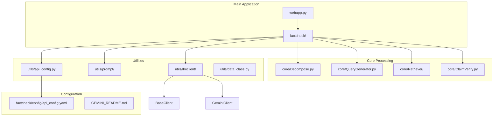
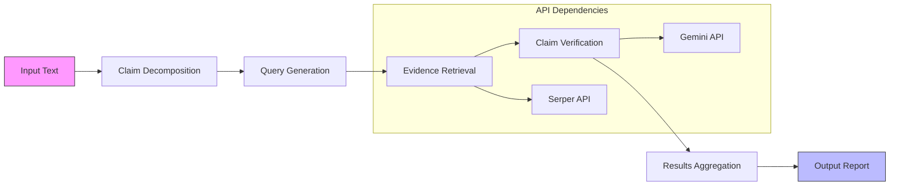
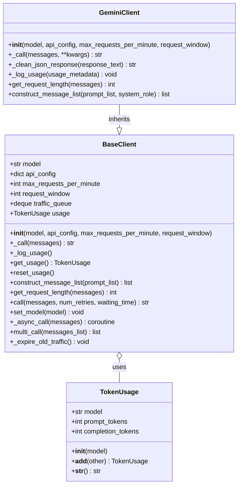
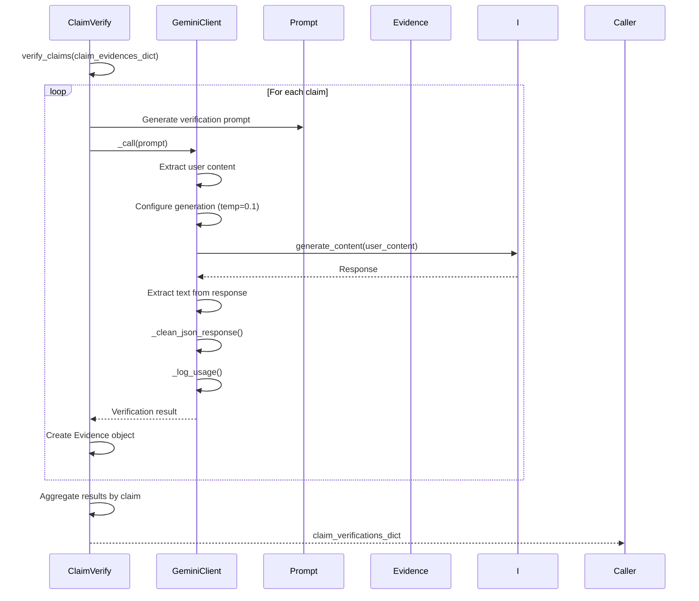
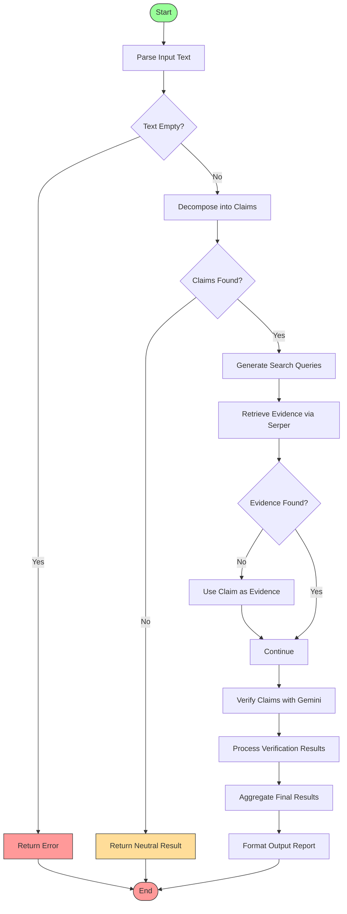
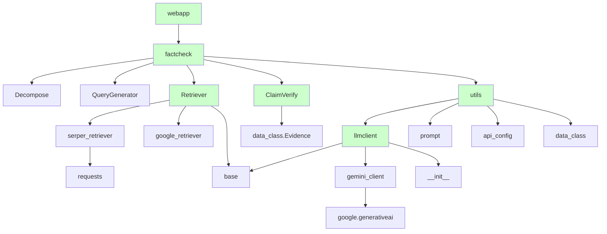

# Gemini Integration

<cite>
**Referenced Files in This Document**   
- [GEMINI_README.md](file://GEMINI_README.md)
- [factcheck/utils/llmclient/gemini_client.py](file://factcheck/utils/llmclient/gemini_client.py)
- [factcheck/utils/llmclient/base.py](file://factcheck/utils/llmclient/base.py)
- [factcheck/utils/llmclient/__init__.py](file://factcheck/utils/llmclient/__init__.py)
- [factcheck/core/ClaimVerify.py](file://factcheck/core/ClaimVerify.py)
- [factcheck/core/Decompose.py](file://factcheck/core/Decompose.py)
- [factcheck/core/QueryGenerator.py](file://factcheck/core/QueryGenerator.py)
- [factcheck/core/Retriever/serper_retriever.py](file://factcheck/core/Retriever/serper_retriever.py)
- [factcheck/utils/api_config.py](file://factcheck/utils/api_config.py)
- [factcheck/utils/prompt/chatgpt_prompt.py](file://factcheck/utils/prompt/chatgpt_prompt.py)
- [webapp.py](file://webapp.py)
- [factcheck/config/api_config.yaml](file://factcheck/config/api_config.yaml)
</cite>

## Table of Contents
1. [Introduction](#introduction)
2. [Project Structure](#project-structure)
3. [Core Components](#core-components)
4. [Architecture Overview](#architecture-overview)
5. [Detailed Component Analysis](#detailed-component-analysis)
6. [Dependency Analysis](#dependency-analysis)
7. [Performance Considerations](#performance-considerations)
8. [Troubleshooting Guide](#troubleshooting-guide)
9. [Conclusion](#conclusion)

## Introduction
The Gemini Integration documentation provides a comprehensive overview of a fact-checking system built around Google's Gemini API. This system is designed to detect fake news by decomposing input text into claims, retrieving relevant evidence via web search, and verifying claims using Gemini's large language models. The integration has been optimized specifically for Gemini, removing support for other LLM providers such as OpenAI and Claude. The system supports both web interface and command-line usage, with configurable models including `gemini-1.5-pro`, `gemini-1.5-flash`, and `gemini-pro`. This document details the architecture, implementation, API interfaces, and practical usage patterns for effective integration and troubleshooting.

## Project Structure
The project follows a modular structure organized by functionality and components. The main application logic resides in the `factcheck` directory, which contains core modules for claim decomposition, evidence retrieval, and verification. The `utils` directory houses shared components including the LLM client abstraction, prompt management, and configuration handling. External API keys are managed through configuration files, and the system provides both a web interface (`webapp.py`) and command-line execution capabilities.



**Diagram sources**
- [factcheck/__init__.py](file://factcheck/__init__.py)
- [webapp.py](file://webapp.py)

**Section sources**
- [factcheck/__init__.py](file://factcheck/__init__.py)
- [webapp.py](file://webapp.py)

## Core Components
The system's core functionality revolves around four main components: claim decomposition, query generation, evidence retrieval, and claim verification. These components work sequentially to analyze input text and produce fact-checking results. The entire pipeline is powered by the GeminiClient, which interfaces with Google's Gemini API for all language model operations. The system uses SERPER_API_KEY for web search functionality and GEMINI_API_KEY for all AI processing tasks. Configuration is centralized through the api_config.yaml file, and the architecture has been streamlined to support only Gemini models, removing legacy support for other LLM providers.

**Section sources**
- [GEMINI_README.md](file://GEMINI_README.md)
- [factcheck/utils/llmclient/gemini_client.py](file://factcheck/utils/llmclient/gemini_client.py)
- [factcheck/core/Decompose.py](file://factcheck/core/Decompose.py)

## Architecture Overview
The system architecture follows a pipeline pattern where input text flows through a series of processing stages. The web interface or command-line input is first processed by the main application controller, which orchestrates the fact-checking workflow. The text is decomposed into individual claims, each claim is used to generate search queries, evidence is retrieved from web search via Serper API, and finally each claim is verified against the collected evidence using Gemini's language model. The architecture is designed with rate limiting in mind, accommodating Gemini's constraint of 15 requests per minute.



**Diagram sources**
- [factcheck/core/Decompose.py](file://factcheck/core/Decompose.py)
- [factcheck/core/QueryGenerator.py](file://factcheck/core/QueryGenerator.py)
- [factcheck/core/Retriever/serper_retriever.py](file://factcheck/core/Retriever/serper_retriever.py)
- [factcheck/core/ClaimVerify.py](file://factcheck/core/ClaimVerify.py)

## Detailed Component Analysis

### Gemini Client Implementation
The GeminiClient class serves as the primary interface to Google's Gemini API, handling all LLM operations within the fact-checking system. It extends the BaseClient abstract class and implements the necessary methods for API communication, rate limiting, and response processing. The client is configured with a low temperature (0.1) to ensure consistent and deterministic outputs suitable for fact-checking tasks.



**Diagram sources**
- [factcheck/utils/llmclient/base.py](file://factcheck/utils/llmclient/base.py#L0-L99)
- [factcheck/utils/llmclient/gemini_client.py](file://factcheck/utils/llmclient/gemini_client.py#L0-L104)

**Section sources**
- [factcheck/utils/llmclient/base.py](file://factcheck/utils/llmclient/base.py#L0-L99)
- [factcheck/utils/llmclient/gemini_client.py](file://factcheck/utils/llmclient/gemini_client.py#L0-L104)

### Claim Verification Process
The ClaimVerify component is responsible for assessing the factual accuracy of claims against retrieved evidence. It takes a dictionary of claims and their corresponding evidence, then uses the Gemini model to analyze the relationship between each claim and evidence piece. The verification process includes reasoning generation and relationship classification (support, refute, or neutral).



**Diagram sources**
- [factcheck/core/ClaimVerify.py](file://factcheck/core/ClaimVerify.py#L0-L96)
- [factcheck/utils/llmclient/gemini_client.py](file://factcheck/utils/llmclient/gemini_client.py#L0-L104)

**Section sources**
- [factcheck/core/ClaimVerify.py](file://factcheck/core/ClaimVerify.py#L0-L96)

### Fact-Checking Pipeline Flow
The complete fact-checking process follows a structured workflow from input to output. This flowchart illustrates the step-by-step execution of the system, showing both the main processing path and error handling mechanisms.



**Diagram sources**
- [factcheck/core/Decompose.py](file://factcheck/core/Decompose.py)
- [factcheck/core/QueryGenerator.py](file://factcheck/core/QueryGenerator.py)
- [factcheck/core/Retriever/serper_retriever.py](file://factcheck/core/Retriever/serper_retriever.py)
- [factcheck/core/ClaimVerify.py](file://factcheck/core/ClaimVerify.py)

## Dependency Analysis
The system has a clear dependency hierarchy with well-defined interfaces between components. The core modules depend on utility classes for LLM interaction, configuration management, and data structures. The architecture has been simplified by removing support for multiple LLM providers, resulting in a focused dependency on Google's Gemini API and the Serper API for web search.



**Diagram sources**
- [factcheck/__init__.py](file://factcheck/__init__.py)
- [factcheck/utils/llmclient/__init__.py](file://factcheck/utils/llmclient/__init__.py)
- [requirements.txt](file://requirements.txt)

**Section sources**
- [factcheck/__init__.py](file://factcheck/__init__.py)
- [requirements.txt](file://requirements.txt)

## Performance Considerations
The system is optimized for Gemini's rate limits of 15 requests per minute, with built-in traffic management in the BaseClient class. The GeminiClient inherits rate limiting functionality that tracks request timestamps in a deque and enforces the maximum request rate. For high-volume usage, the asynchronous execution pattern allows for efficient batching of requests within the rate limit constraints. The low temperature setting (0.1) reduces variability in responses, improving consistency for fact-checking tasks. Token usage is tracked through the TokenUsage class, enabling monitoring of API consumption. For optimal performance, users should consider using the `gemini-1.5-flash` model for faster response times when high reasoning complexity is not required.

**Section sources**
- [factcheck/utils/llmclient/base.py](file://factcheck/utils/llmclient/base.py#L0-L99)
- [factcheck/utils/llmclient/gemini_client.py](file://factcheck/utils/llmclient/gemini_client.py#L0-L104)

## Troubleshooting Guide
Common issues and their solutions:

**API Key Errors**: Ensure both SERPER_API_KEY and GEMINI_API_KEY are set in api_config.yaml. The system will fail if either key is missing or invalid.

**Rate Limit Exceeded**: The system automatically handles rate limiting, but excessive usage may cause delays. Monitor the traffic queue and consider spreading requests over time.

**Empty Response from Gemini**: This may occur due to malformed prompts or API issues. Check the input format and ensure the prompt follows the expected structure.

**No Evidence Retrieved**: Verify that the Serper API key is valid and that the search queries are well-formed. Some claims may not yield relevant search results.

**JSON Parsing Errors**: Gemini responses may include markdown code blocks. The _clean_json_response method handles this, but malformed JSON may still cause parsing issues.

**Model Not Supported**: Only Gemini models are supported. Using other model names will raise a ValueError in the model2client function.

```python
# Example of proper API key configuration
# api_config.yaml
SERPER_API_KEY: "your_serper_api_key_here"
GEMINI_API_KEY: "your_gemini_api_key_here"
```

**Section sources**
- [GEMINI_README.md](file://GEMINI_README.md)
- [factcheck/utils/llmclient/gemini_client.py](file://factcheck/utils/llmclient/gemini_client.py#L0-L104)
- [factcheck/config/api_config.yaml](file://factcheck/config/api_config.yaml)

## Conclusion
The Gemini Integration provides a robust fact-checking system optimized for Google's Gemini API. By focusing exclusively on Gemini models, the system achieves consistent performance and reliable results for claim verification tasks. The architecture follows a clear pipeline pattern with well-defined components for decomposition, evidence retrieval, and verification. The implementation includes proper rate limiting, error handling, and token usage tracking, making it suitable for both development and production use. The system supports multiple interaction methods through both web interface and command-line execution, providing flexibility for different use cases. With proper API key configuration and understanding of the rate limits, users can effectively leverage this tool for fake news detection and factual verification.