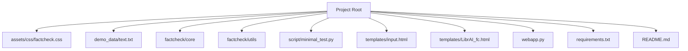

# Getting Started Guide

<cite>
**Referenced Files in This Document**   
- [README.md](file://README.md) - *Updated in recent commit*
- [requirements.txt](file://requirements.txt)
- [webapp.py](file://webapp.py) - *Modified in recent commit*
- [extension_backend.py](file://extension_backend.py) - *Added in recent commit*
- [minimal_test.py](file://script\minimal_test.py)
- [factcheck/__init__.py](file://factcheck\__init__.py) - *Updated in recent commit*
- [factcheck/utils/api_config.py](file://factcheck\utils\api_config.py) - *Updated in recent commit*
- [pyproject.toml](file://pyproject.toml) - *Added in recent commit*
- [RENDER_DEPLOYMENT.md](file://RENDER_DEPLOYMENT.md) - *Added in recent commit*
- [render_app.py](file://render_app.py) - *Added for Render deployment*
- [build.sh](file://build.sh) - *Added for Render deployment*
- [Procfile](file://Procfile) - *Added for Render deployment*
- [api_config_production.yaml](file://api_config_production.yaml) - *Added for production configuration*
</cite>

## Update Summary
**Changes Made**   
- Updated installation instructions to include Poetry as an alternative to pip
- Revised API key configuration section to reflect YAML-based configuration system
- Corrected default port from 2024 to 5000 in web application section
- Added clarification about supported LLMs based on current codebase
- Updated minimal test script usage instructions
- Enhanced troubleshooting section with new error scenarios
- Added Render deployment instructions and production configuration details
- Updated web application startup command and port configuration to reflect production deployment changes
- Added documentation for Chrome extension backend and its configuration

## Table of Contents
1. [Introduction](#introduction)
2. [Project Structure](#project-structure)
3. [Installation and Setup](#installation-and-setup)
4. [Configuration: Setting API Keys](#configuration-setting-api-keys)
5. [Running the Web Application](#running-the-web-application)
6. [Using the Minimal Test Script](#using-the-minimal-test-script)
7. [Web Interface Usage](#web-interface-usage)
8. [Common Errors and Troubleshooting](#common-errors-and-troubleshooting)
9. [Performance and Hardware Requirements](#performance-and-hardware-requirements)
10. [Quick Troubleshooting Checklist](#quick-troubleshooting-checklist)
11. [Render Deployment Guide](#render-deployment-guide)

## Introduction
The OpenFactVerification system, also known as Loki, is an open-source tool designed to automate fact verification. It decomposes input text into individual claims, evaluates their checkworthiness, generates search queries, retrieves evidence from the web, and verifies the factual accuracy of each claim using large language models (LLMs). This guide provides step-by-step instructions for setting up and running the system, both via the web interface and programmatically.

**Section sources**
- [README.md](file://README.md#L1-L20)

## Project Structure
The project follows a modular structure organized by functionality:
- `assets/css`: Contains CSS stylesheets for the web interface.
- `demo_data`: Sample input files for testing.
- `factcheck`: Core package containing modules for claim decomposition, verification, retrieval, and utilities.
- `script`: Includes test scripts like `minimal_test.py`.
- `templates`: HTML templates for the web interface (`input.html`, `LibrAI_fc.html`).
- `webapp.py`: Flask-based web server entry point.
- `requirements.txt`: Python dependencies.
- `README.md`: Project overview and quick start instructions.



**Diagram sources**
- [README.md](file://README.md#L1-L176)

## Installation and Setup
To get started with OpenFactVerification, follow these steps:

### Clone the Repository
```bash
git clone https://github.com/Libr-AI/OpenFactVerification.git
cd OpenFactVerification
```

### Set Up Python Environment
Ensure you have Python 3.9 or higher installed. You can install dependencies using either Poetry or pip.

#### Option 1: Installation with Poetry
1. Install Poetry by following the [installation guideline](https://python-poetry.org/docs/).
2. Install all dependencies:
```bash
poetry install
```

#### Option 2: Installation with pip
Create and activate a virtual environment:
```bash
python -m venv venv
source venv/bin/activate  # On Windows: venv\Scripts\activate
```

Install required packages:
```bash
pip install -r requirements.txt
```

### Install spaCy Model
Download the spaCy English language model:
```bash
python -m spacy download en_core_web_sm
```

The `requirements.txt` file includes essential libraries such as Flask, spaCy, sentence-transformers, and Google's generative AI SDK.

**Section sources**
- [README.md](file://README.md#L22-L35)
- [requirements.txt](file://requirements.txt#L1-L20)
- [pyproject.toml](file://pyproject.toml)

## Configuration: Setting API Keys
The system requires API keys for LLMs and search services. These can be configured via environment variables or a YAML configuration file.

### Required API Keys
- **SERPER_API_KEY**: For web evidence retrieval via Serper.
- **GEMINI_API_KEY**: For using Google's Gemini model (default in current setup).

### Option 1: Environment Variables
Set keys in your shell:
```bash
export SERPER_API_KEY=your_serper_api_key_here
export GEMINI_API_KEY=your_gemini_api_key_here
```

### Option 2: Configuration File
Create a YAML file (e.g., `demo_data/api_config.yaml`) with the following structure:
```yaml
SERPER_API_KEY: "your_serper_api_key"
GEMINI_API_KEY: "your_gemini_api_key"
```

The `api_config.py` module loads keys from both environment variables and config files, with the config file taking precedence.

**Section sources**
- [README.md](file://README.md#L37-L47)
- [factcheck/utils/api_config.py](file://factcheck\utils\api_config.py#L1-L30)

## Running the Web Application
Start the Flask web server using `webapp.py`. This provides a user-friendly interface accessible at `http://localhost:5000`.

### Launch Command
```bash
python webapp.py --api_config demo_data/api_config.yaml
```

### Parameters
The script accepts several command-line arguments:
- `--model`: LLM to use (default: `gemini-1.5-pro`)
- `--client`: Specific LLM client (optional)
- `--prompt`: Prompt template (default: `chatgpt_prompt`)
- `--retriever`: Evidence retriever (default: `serper`)
- `--api_config`: Path to API config file

After starting, navigate to `http://localhost:5000` in your browser to access the input interface.

**Section sources**
- [webapp.py](file://webapp.py#L1-L92)
- [README.md](file://README.md#L55-L57)

## Using the Minimal Test Script
The `minimal_test.py` script demonstrates how to use the `FactCheck` class programmatically.

### Example Usage
```python
from factcheck import FactCheck

factcheck_instance = FactCheck()
text = "MBZUAI is the first AI university in the world."
results = factcheck_instance.check_text(text)
print(results)
```

### Running the Test
Execute the script to run predefined test cases:
```bash
python script/minimal_test.py
```

This script loads test data from `minimal_test_en.json`, runs the fact-checking pipeline, and validates outputs using assertions. It uses tqdm for progress visualization and color-coded output for success/failure.

**Section sources**
- [script/minimal_test.py](file://script\minimal_test.py#L1-L59)
- [factcheck/__init__.py](file://factcheck\__init__.py#L1-L239)

## Web Interface Usage
### Input Page
Navigate to `http://localhost:5000` to see the input interface. Enter any text in the provided textarea and submit it.

### Results Page
After processing, the system displays results showing:
- Claim-by-claim breakdown
- Checkworthiness status
- Generated queries
- Retrieved evidence with URLs
- Verification results (SUPPORTS, REFUTES, IRRELEVANT)
- Overall factuality score

Each claim can be expanded to view detailed evidence and reasoning. The results are also saved to `assets/response.json` for debugging.

**Section sources**
- [webapp.py](file://webapp.py#L50-L75)
- [templates/input.html](file://templates/input.html)
- [templates/LibrAI_fc.html](file://templates/LibrAI_fc.html)

## Common Errors and Troubleshooting
### Missing API Keys
**Error**: `"Error loading api config"` or authentication failures.  
**Solution**: Ensure all required API keys are set in environment variables or the config file.

### Port Conflict
**Error**: `"OSError: [Errno 98] Address already in use"`  
**Solution**: Change the port in `webapp.py` from `5000` to another (e.g., `8000`):
```python
app.run(host="0.0.0.0", port=8000, debug=True)
```

### spaCy Model Not Found
**Error**: `OSError: [E050] Can't find model 'en_core_web_sm'`  
**Solution**: Run `python -m spacy download en_core_web_sm`

### Serper API Failure
**Error**: `"Failed to authenticate. Check your API key."`  
**Solution**: Verify your `SERPER_API_KEY` is valid and correctly formatted.

**Section sources**
- [webapp.py](file://webapp.py#L80-L90)
- [factcheck/core/Retriever/serper_retriever.py](file://factcheck\core\Retriever\serper_retriever.py#L1-L222)

## Performance and Hardware Requirements
### Expected Performance
- **Small texts (<100 words)**: ~10–20 seconds
- **Medium texts (~500 words)**: ~30–60 seconds
- Processing time depends on LLM latency and web retrieval speed.

### Recommended Hardware
- **CPU**: Quad-core or higher
- **RAM**: 8 GB minimum (16 GB recommended)
- **Internet**: Stable connection for API calls and web crawling
- **GPU**: Optional but beneficial for local LLM inference (not required for cloud-based models)

The system uses parallel execution for claim decomposition and verification, improving efficiency.

**Section sources**
- [factcheck/__init__.py](file://factcheck\__init__.py#L100-L150)

## Quick Troubleshooting Checklist
- ✅ Cloned the repository and navigated into the directory  
- ✅ Created and activated a Python virtual environment  
- ✅ Installed dependencies with `pip install -r requirements.txt` or `poetry install`  
- ✅ Downloaded spaCy model: `python -m spacy download en_core_web_sm`  
- ✅ Set `SERPER_API_KEY` and `GEMINI_API_KEY` in environment or config file  
- ✅ Started the web app with `python webapp.py --api_config your_config.yaml`  
- ✅ Accessed the interface at `http://localhost:5000`  
- ✅ Checked `assets/response.json` for debug output if needed  

If issues persist, verify API key validity and ensure no firewall blocks outbound requests.

**Section sources**
- [README.md](file://README.md#L1-L176)
- [requirements.txt](file://requirements.txt#L1-L20)
- [webapp.py](file://webapp.py#L1-L92)

## Render Deployment Guide
The OpenFactVerification system is now ready for deployment on Render, a cloud platform for hosting web applications.

### Prerequisites
- GitHub account with access to the repository
- Render account (free tier available)
- Valid API keys for Serper and Gemini services

### Deployment Files
The following files have been added to support Render deployment:
- `render_app.py`: Production entry point that reads environment variables
- `Procfile`: Specifies the command to start the application
- `build.sh`: Script that installs dependencies during deployment
- `api_config_production.yaml`: Template for production configuration

### Step-by-Step Deployment
1. **Push Code to GitHub**
```bash
git add .
git commit -m "Prepare for Render deployment"
git push origin main
```

2. **Create Web Service on Render**
   - Log in to [Render.com](https://render.com)
   - Click "New" → "Web Service"
   - Connect your GitHub repository

3. **Configure Build Settings**
   - **Environment**: Python 3
   - **Build Command**: `./build.sh`
   - **Start Command**: `python render_app.py`
   - **Branch**: main

4. **Set Environment Variables**
Add the following environment variables in the Render dashboard:
```
SERPER_API_KEY=your_actual_serper_api_key
GEMINI_API_KEY=your_actual_gemini_api_key
PORT=10000
API_CONFIG_FILE=api_config_production.yaml
```

### Build Process
During deployment, Render executes the `build.sh` script which:
1. Installs Python dependencies from requirements.txt
2. Downloads the spaCy English language model
3. Installs Playwright browsers for web scraping

### Runtime Configuration
The `render_app.py` script:
- Loads configuration from `api_config_production.yaml`
- Overrides values with environment variables
- Validates required API keys are present
- Initializes the FactCheck instance with default parameters
- Runs the Flask app on the PORT specified by Render (default: 10000)

### Testing After Deployment
Once deployed, test the following features:
- Text fact-checking through the web interface
- Error handling for missing API keys
- Proper loading of configuration files
- Response time for fact-checking requests

### Troubleshooting Deployment Issues
**Build Failures**: Check the build logs in the Render dashboard for specific error messages. Ensure `build.sh` has execute permissions.

**Application Crashes**: Verify all required environment variables are set, especially API keys. Check that the start command is exactly `python render_app.py`.

**Port Conflicts**: The application uses the PORT environment variable provided by Render. Do not hardcode the port number.

**Missing Dependencies**: The `build.sh` script should install all required packages. If issues persist, verify the `requirements.txt` file is up to date.

**Section sources**
- [RENDER_DEPLOYMENT.md](file://RENDER_DEPLOYMENT.md)
- [render_app.py](file://render_app.py)
- [build.sh](file://build.sh)
- [Procfile](file://Procfile)
- [api_config_production.yaml](file://api_config_production.yaml)