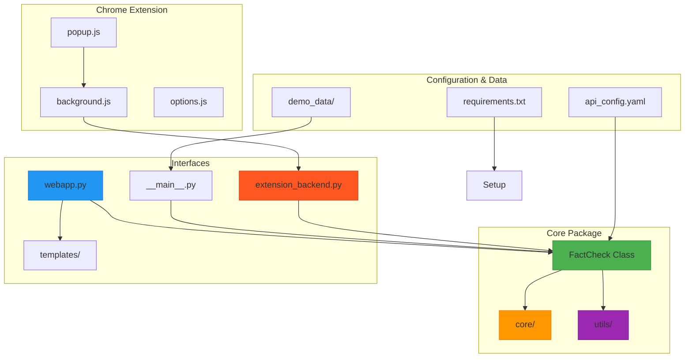
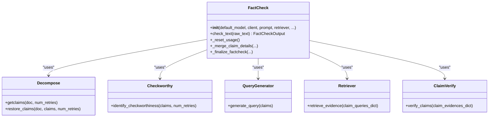
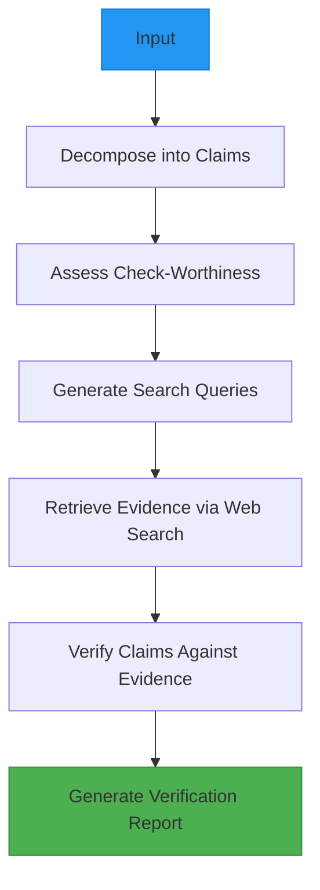
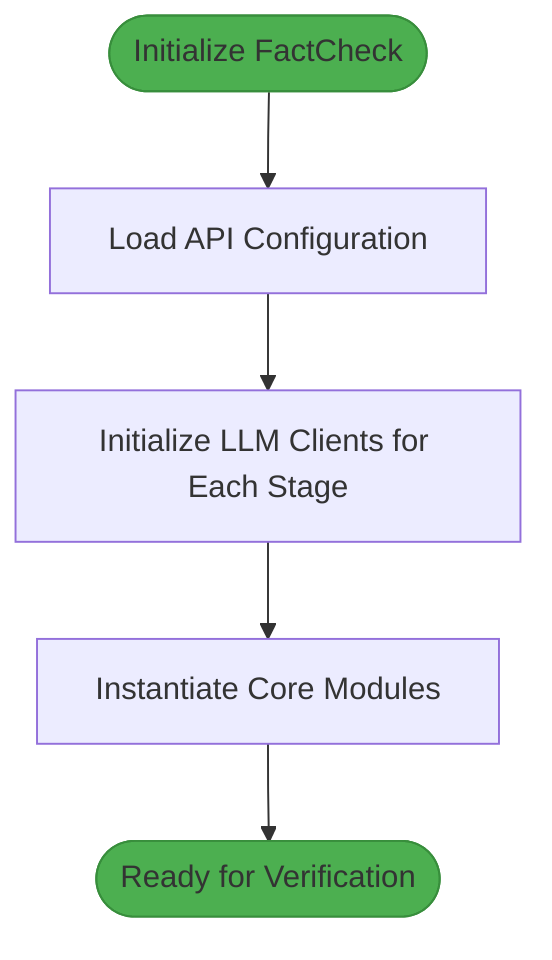
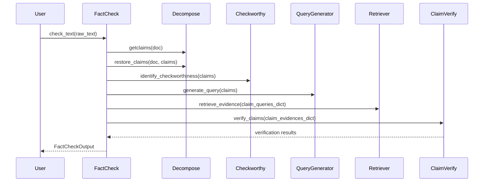
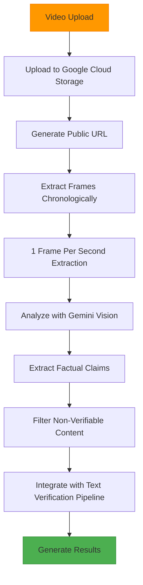
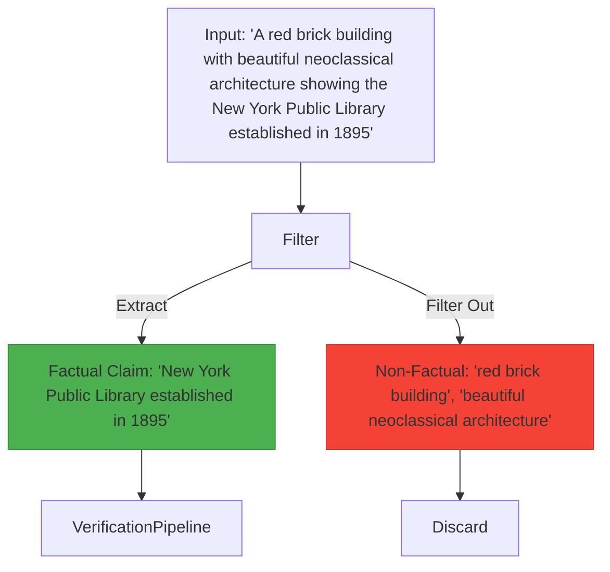
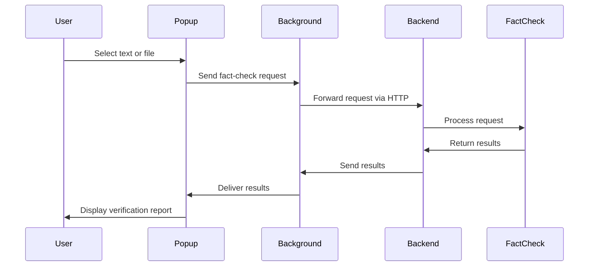
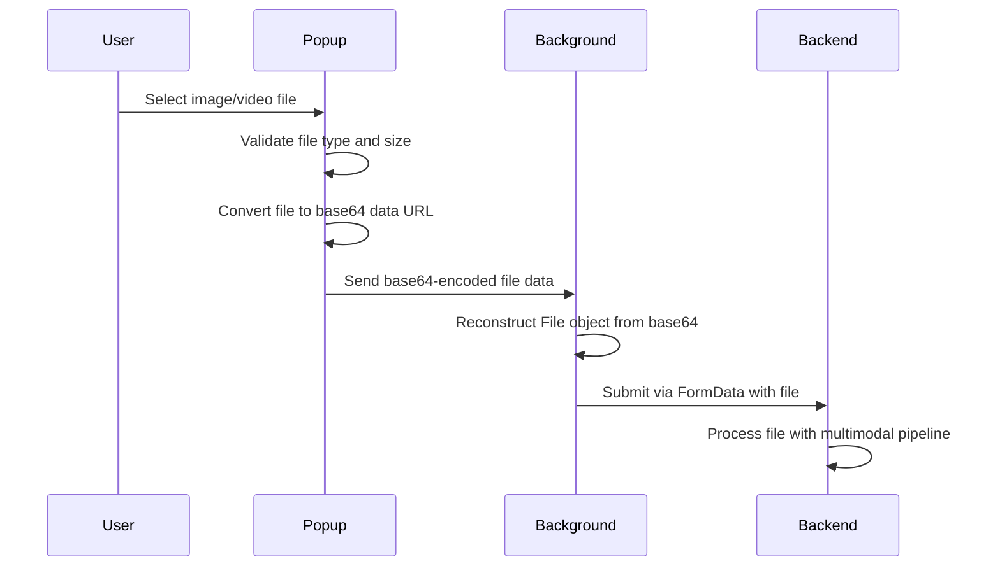
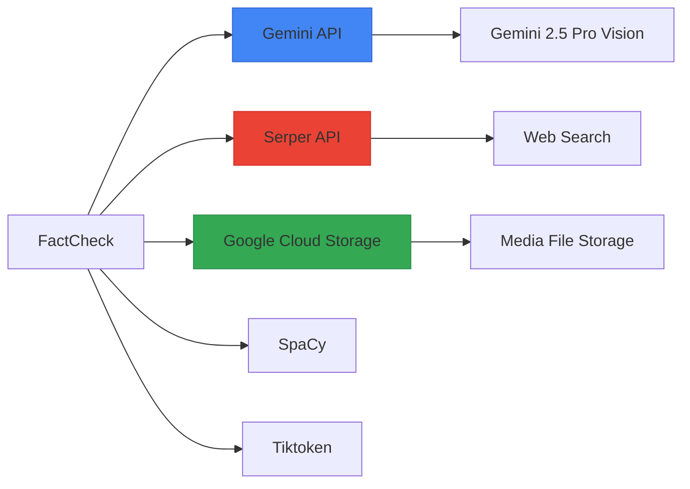

# Multimodal Verification

<cite>
**Referenced Files in This Document**   
- [factcheck/__init__.py](file://factcheck/__init__.py) - *Updated in recent commit*
- [factcheck/core/Decompose.py](file://factcheck/core/Decompose.py)
- [factcheck/core/CheckWorthy.py](file://factcheck/core/CheckWorthy.py)
- [factcheck/core/QueryGenerator.py](file://factcheck/core/QueryGenerator.py)
- [factcheck/core/Retriever/base.py](file://factcheck/core/Retriever/base.py)
- [factcheck/core/Retriever/serper_retriever.py](file://factcheck/core/Retriever/serper_retriever.py)
- [factcheck/core/ClaimVerify.py](file://factcheck/core/ClaimVerify.py)
- [factcheck/utils/llmclient/gemini_client.py](file://factcheck/utils/llmclient/gemini_client.py)
- [factcheck/utils/multimodal.py](file://factcheck/utils/multimodal.py) - *Enhanced video processing with 1 frame per second extraction*
- [factcheck/utils/multimodal_gemini.py](file://factcheck/utils/multimodal_gemini.py) - *Synchronized improvements for video processing*
- [factcheck/utils/api_config.py](file://factcheck/utils/api_config.py)
- [factcheck/utils/data_class.py](file://factcheck/utils/data_class.py)
- [webapp.py](file://webapp.py)
- [MULTIMODAL_README.md](file://MULTIMODAL_README.md)
- [GEMINI_README.md](file://GEMINI_README.md)
- [README.md](file://README.md)
- [ENHANCED_VIDEO_PROCESSING.md](file://ENHANCED_VIDEO_PROCESSING.md) - *Documentation for enhanced video processing*
- [chrome-extension/popup.js](file://chrome-extension/popup.js) - *Updated in recent commit*
- [chrome-extension/background.js](file://chrome-extension/background.js) - *Updated in recent commit*
- [extension_backend.py](file://extension_backend.py) - *Backend server implementation*
</cite>

## Update Summary
**Changes Made**   
- Updated **Chrome Extension Integration** section to reflect UI enhancements and file upload fixes
- Added detailed information about base64 file serialization for reliable data transfer
- Enhanced troubleshooting guidance with improved error messaging
- Added new section on Chrome extension architecture and communication flow
- Updated API interfaces section with file upload process details
- Added section on backend server requirements and startup process

## Table of Contents
1. [Introduction](#introduction)
2. [Project Structure](#project-structure)
3. [Core Components](#core-components)
4. [Architecture Overview](#architecture-overview)
5. [Detailed Component Analysis](#detailed-component-analysis)
6. [Multimodal Processing Pipeline](#multimodal-processing-pipeline)
7. [API Interfaces and Usage](#api-interfaces-and-usage)
8. [Chrome Extension Integration](#chrome-extension-integration)
9. [Dependency Analysis](#dependency-analysis)
10. [Troubleshooting Guide](#troubleshooting-guide)
11. [Conclusion](#conclusion)

## Introduction
Multimodal Verification is an open-source fact-checking tool designed to verify the factual accuracy of information across multiple modalities, including text, images, and videos. The system leverages advanced AI models—primarily Google's Gemini 2.5 Pro Vision—to extract and validate factual claims from diverse input types. Originally built with support for multiple LLMs, the current version has been optimized to use Gemini exclusively, removing prior dependencies on OpenAI and Claude. The tool is particularly useful for journalists, researchers, and fact-checking organizations seeking automated, reliable verification of multimodal content.

The system follows a modular pipeline: claim decomposition, check-worthiness assessment, query generation, evidence retrieval, and claim verification. It supports both programmatic and web-based interfaces, enabling flexible integration into various workflows.

**Section sources**
- [README.md](file://README.md#L1-L166)
- [MULTIMODAL_README.md](file://MULTIMODAL_README.md#L1-L146)
- [GEMINI_README.md](file://GEMINI_README.md#L1-L57)

## Project Structure
The project is organized into a modular structure that separates concerns across configuration, core logic, utilities, and user interfaces. Key directories include:

- **factcheck/**: Core package containing all verification logic
  - **core/**: Implements the main pipeline stages
  - **utils/**: Shared utilities including LLM clients, prompts, and data classes
  - **config/**: Configuration templates
- **templates/**: HTML templates for the web interface
- **assets/css/**: Styling for the frontend
- **demo_data/**: Sample inputs for testing
- **script/**: Test scripts and sample JSON inputs
- **chrome-extension/**: Chrome extension files for browser integration
- Root-level files: Entry points (`webapp.py`, `__main__.py`, `extension_backend.py`), configuration (`pyproject.toml`, `requirements.txt`), and documentation



**Diagram sources**
- [factcheck/__init__.py](file://factcheck/__init__.py#L1-L239)
- [webapp.py](file://webapp.py)
- [extension_backend.py](file://extension_backend.py)
- [chrome-extension/popup.js](file://chrome-extension/popup.js)
- [chrome-extension/background.js](file://chrome-extension/background.js)
- [factcheck/core/](file://factcheck/core/)
- [factcheck/utils/](file://factcheck/utils/)

**Section sources**
- [factcheck/__init__.py](file://factcheck/__init__.py#L1-L239)
- [webapp.py](file://webapp.py)
- [extension_backend.py](file://extension_backend.py)
- [README.md](file://README.md#L1-L166)

## Core Components
The system is built around a central `FactCheck` class that orchestrates a five-stage verification pipeline. Each stage is implemented as a separate module, allowing for independent development and testing.

Key components include:
- **Decompose**: Splits input text into atomic factual claims
- **CheckWorthy**: Filters claims based on verifiability and significance
- **QueryGenerator**: Creates search queries for evidence retrieval
- **Retriever**: Fetches evidence from the web using Serper API
- **ClaimVerify**: Assesses claim validity against retrieved evidence

The pipeline supports parallel execution of non-dependent stages (e.g., claim restoration and check-worthiness assessment) to improve performance.



**Diagram sources**
- [factcheck/__init__.py](file://factcheck/__init__.py#L1-L239)
- [factcheck/core/Decompose.py](file://factcheck/core/Decompose.py)
- [factcheck/core/CheckWorthy.py](file://factcheck/core/CheckWorthy.py)
- [factcheck/core/QueryGenerator.py](file://factcheck/core/QueryGenerator.py)
- [factcheck/core/Retriever/base.py](file://factcheck/core/Retriever/base.py)
- [factcheck/core/ClaimVerify.py](file://factcheck/core/ClaimVerify.py)

**Section sources**
- [factcheck/__init__.py](file://factcheck/__init__.py#L1-L239)

## Architecture Overview
The system follows a modular, pipeline-based architecture where each verification stage is encapsulated in a dedicated component. The flow begins with input processing and ends with a comprehensive verification report.



**Diagram sources**
- [factcheck/__init__.py](file://factcheck/__init__.py#L1-L239)
- [README.md](file://README.md#L1-L166)

## Detailed Component Analysis

### FactCheck Class Analysis
The `FactCheck` class serves as the main interface for the verification system. It initializes all sub-modules with appropriate LLM clients and coordinates the execution of the verification pipeline.

#### Initialization Process


**Diagram sources**
- [factcheck/__init__.py](file://factcheck/__init__.py#L25-L100)

#### Verification Pipeline Flow


**Diagram sources**
- [factcheck/__init__.py](file://factcheck/__init__.py#L101-L239)

**Section sources**
- [factcheck/__init__.py](file://factcheck/__init__.py#L1-L239)

## Multimodal Processing Pipeline
The multimodal extension enables verification of image and video content by leveraging Gemini 2.5 Pro Vision for content analysis. The pipeline has been enhanced to extract only factual claims while filtering out subjective visual descriptions.

### Enhanced Video Processing Workflow


**Diagram sources**
- [factcheck/utils/multimodal.py](file://factcheck/utils/multimodal.py#L339-L396)
- [factcheck/utils/multimodal_gemini.py](file://factcheck/utils/multimodal_gemini.py#L288-L345)
- [ENHANCED_VIDEO_PROCESSING.md](file://ENHANCED_VIDEO_PROCESSING.md)

### Intelligent Claim Extraction
The system applies intelligent filtering to distinguish between verifiable facts and non-factual visual descriptions:



**Diagram sources**
- [factcheck/utils/multimodal.py](file://factcheck/utils/multimodal.py)
- [MULTIMODAL_README.md](file://MULTIMODAL_README.md#L1-L146)

### Enhanced Video Frame Extraction
The video processing system has been significantly enhanced to improve factual coverage and temporal context:

**Key Improvements:**
- **Frame Extraction Rate**: 1 frame per second (configurable via `frames_per_second` parameter)
- **Maximum Frames**: 300 frames (5-minute limit) for memory management
- **Chronological Processing**: Frames processed in exact temporal order
- **Progress Tracking**: Real-time logging every 30 frames (30 seconds)
- **API Optimization**: 120-frame limit for Gemini API to prevent timeouts

**Performance Improvements:**
| Video Duration | OLD Approach | NEW Approach | Improvement |
|---------------|--------------|--------------|-------------|
| 30 seconds | 10 frames (3s gaps) | 30 frames (1s intervals) | **200% more coverage** |
| 3 minutes | 10 frames (18s gaps) | 180 frames (1s intervals) | **1700% more coverage** |
| 10 minutes | 10 frames (60s gaps) | 300 frames (1s intervals) | **2900% more coverage** |

**Real-World Impact:**
- **News Videos**: Captures all ticker updates chronologically
- **Educational Content**: Captures every slide transition and key information
- **Documentaries**: Comprehensive coverage of statistics and facts
- **Sports Highlights**: Captures all score changes and player statistics

**Section sources**
- [factcheck/utils/multimodal.py](file://factcheck/utils/multimodal.py#L339-L396)
- [factcheck/utils/multimodal_gemini.py](file://factcheck/utils/multimodal_gemini.py#L288-L345)
- [ENHANCED_VIDEO_PROCESSING.md](file://ENHANCED_VIDEO_PROCESSING.md)

## API Interfaces and Usage

### Library Usage
The system can be used as a Python library:

```python
from factcheck import FactCheck

factcheck_instance = FactCheck()
results = factcheck_instance.check_text("MBZUAI is the first AI university in the world")
print(results)
```

### Command Line Interface
Supports multiple input modalities:

```bash
# Text input
python -m factcheck --modal string --input "Your claim here" --api_config api_config.yaml

# Image verification
python -m factcheck --modal image --input path/to/image.jpg --api_config api_config.yaml

# Video verification
python -m factcheck --modal video --input path/to/video.mp4 --api_config api_config.yaml
```

### Web Interface
```bash
python webapp.py --api_config api_config.yaml
```
Access via http://localhost:2024 with support for file uploads and real-time processing.

**Section sources**
- [README.md](file://README.md#L1-L166)
- [MULTIMODAL_README.md](file://MULTIMODAL_README.md#L1-L146)
- [GEMINI_README.md](file://GEMINI_README.md#L1-L57)

## Chrome Extension Integration
The Chrome extension provides a user-friendly interface for fact-checking content directly from the browser. The extension communicates with a local backend server to process requests.

### Extension Architecture
The extension consists of three main components:
- **Popup Interface**: User interface for input and results display
- **Background Service Worker**: Manages extension lifecycle and message routing
- **Content Scripts**: Interact with web pages to extract selected text



**Diagram sources**
- [chrome-extension/popup.js](file://chrome-extension/popup.js)
- [chrome-extension/background.js](file://chrome-extension/background.js)
- [extension_backend.py](file://extension_backend.py)

### File Upload Process
The extension has been enhanced to handle file uploads more reliably using base64 encoding:



**Key Enhancements:**
- **Base64 Serialization**: Files are converted to base64 data URLs to ensure reliable transmission between extension components
- **MIME Type Detection**: Enhanced detection of file types to support a wider range of formats
- **File Validation**: Comprehensive validation including size checks (50MB limit) and format verification
- **Error Handling**: Improved error messages for common issues like unsupported formats or corrupted files

**Section sources**
- [chrome-extension/popup.js](file://chrome-extension/popup.js#L200-L400)
- [chrome-extension/background.js](file://chrome-extension/background.js#L150-L250)
- [extension_backend.py](file://extension_backend.py#L200-L300)

### Backend Server Requirements
The Chrome extension requires a local backend server to process requests:

```bash
python extension_backend.py
```

**Server Configuration:**
- Runs on http://localhost:2024 by default
- Requires API keys configured in environment variables or config file
- Handles both text and file-based fact-checking requests
- Provides health check endpoint at `/health`

**Section sources**
- [extension_backend.py](file://extension_backend.py)
- [chrome-extension/background.js](file://chrome-extension/background.js#L10-L50)

## Dependency Analysis
The system relies on several external services and libraries:



**Diagram sources**
- [requirements.txt](file://requirements.txt)
- [factcheck/utils/api_config.py](file://factcheck/utils/api_config.py)
- [factcheck/utils/llmclient/gemini_client.py](file://factcheck/utils/llmclient/gemini_client.py)

**Section sources**
- [requirements.txt](file://requirements.txt)
- [factcheck/utils/api_config.py](file://factcheck/utils/api_config.py)

## Troubleshooting Guide
Common issues and solutions:

- **API Key Errors**: Ensure `SERPER_API_KEY` and `GEMINI_API_KEY` are properly configured in `api_config.yaml` or environment variables
- **File Upload Failures**: Verify Google Cloud Storage credentials and bucket permissions
- **Rate Limit Exceeded**: Gemini has a limit of 15 requests/minute; implement retry logic or reduce request frequency
- **No Evidence Found**: Check internet connectivity and Serper API functionality
- **Installation Issues**: Ensure Python 3.9+ and run `python -m spacy download en_core_web_sm`
- **Video Processing Issues**: For long videos, ensure sufficient memory; the system limits processing to 300 frames (5 minutes) for memory management
- **Frame Extraction Problems**: Verify OpenCV installation and video file compatibility
- **Chrome Extension Connection Errors**: Ensure the backend server is running (`python extension_backend.py`) and accessible at http://localhost:2024
- **File Format Issues**: The system supports common formats including JPEG, PNG, GIF, MP4, AVI, MOV, and WEBM
- **Large File Errors**: Files larger than 50MB may fail to upload; consider compressing large media files

The system logs detailed information at each processing stage, which can be used for debugging pipeline failures.

**Section sources**
- [factcheck/utils/logger.py](file://factcheck/utils/logger.py)
- [factcheck/__init__.py](file://factcheck/__init__.py#L1-L239)
- [MULTIMODAL_README.md](file://MULTIMODAL_README.md#L1-L146)
- [chrome-extension/popup.js](file://chrome-extension/popup.js#L400-L500)
- [extension_backend.py](file://extension_backend.py#L300-L350)

## Conclusion
Multimodal Verification provides a comprehensive, extensible framework for automated fact-checking across text, images, and videos. By leveraging Google's Gemini 2.5 Pro Vision and a modular pipeline architecture, it offers accurate, reliable verification of multimodal content. The system's design emphasizes flexibility, with support for both programmatic and web-based interfaces, making it suitable for integration into various fact-checking workflows. The recent enhancement of video processing—extracting 1 frame per second with chronological processing—has dramatically improved coverage and temporal context, addressing previous limitations of sparse frame sampling. The Chrome extension integration, with its improved file upload handling using base64 serialization and enhanced MIME type detection, provides a seamless user experience for browser-based fact-checking. Future enhancements could include support for additional modalities, improved claim extraction algorithms, and expanded evidence sources.