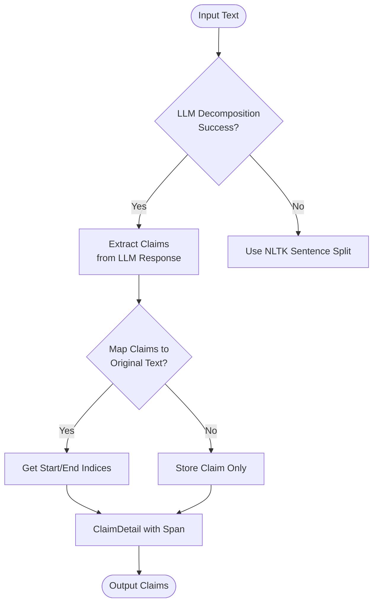
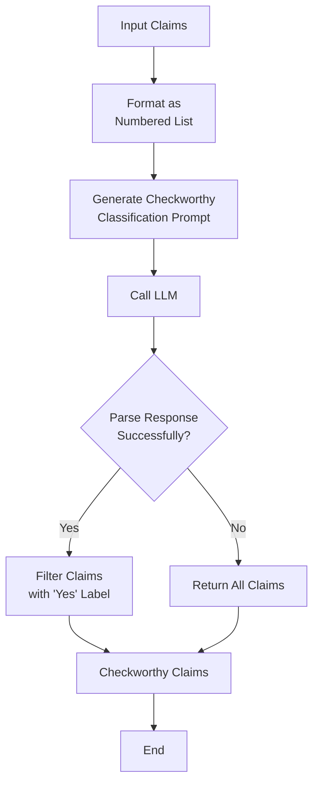
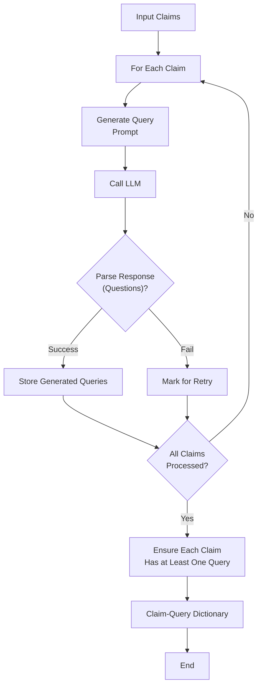
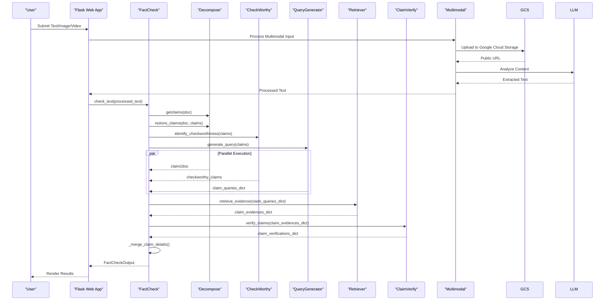

# System Overview

<cite>
**Referenced Files in This Document**   
- [webapp.py](file://webapp.py) - *Updated for multimodal support and UI enhancements*
- [render_app.py](file://render_app.py) - *Production entry point for Render deployment*
- [factcheck/__init__.py](file://factcheck/__init__.py) - *Core orchestrator updated for Gemini*
- [factcheck/utils/multimodal.py](file://factcheck/utils/multimodal.py) - *Added for multimodal processing*
- [factcheck/utils/llmclient/gemini_client.py](file://factcheck/utils/llmclient/gemini_client.py) - *Gemini client implementation*
- [README.md](file://README.md) - *Rebranded to Fake News Detection*
- [GEMINI_README.md](file://GEMINI_README.md) - *Gemini-specific configuration*
- [MULTIMODAL_README.md](file://MULTIMODAL_README.md) - *Multimodal capabilities documentation*
- [build.sh](file://build.sh) - *Build script for Render deployment*
- [api_config_production.yaml](file://api_config_production.yaml) - *Production configuration template*
- [LOGO_METRICS_UPDATE.md](file://LOGO_METRICS_UPDATE.md) - *Logo and metrics styling documentation*
- [assets/fact.jpg](file://assets/fact.jpg) - *Custom fact-checking logo*
- [templates/main_layout.html](file://templates/main_layout.html) - *Updated with styled metrics bar*
- [assets/css/factcheck.css](file://assets/css/factcheck.css) - *CSS for metrics styling and hover effects*
- [extension_backend.py](file://extension_backend.py) - *Backend server for Chrome extension*
</cite>

## Update Summary
**Changes Made**   
- Updated system overview to reflect deployment readiness on Render platform
- Added documentation for production deployment configuration and build process
- Included details about environment variable management and API key security
- Updated architecture context to include Render-specific deployment workflow
- Enhanced integration details with new deployment entry point (`render_app.py`)
- Removed outdated deployment assumptions and clarified local vs. production behavior
- Incorporated UI enhancements including custom logo and styled credibility metrics
- Added documentation for new visual design elements: colored gradient boxes, hover effects, and professional styling
- Updated local development URLs to reflect actual ports used by `webapp.py` and `extension_backend.py`

## Table of Contents
1. [System Overview](#system-overview)
2. [Core Components](#core-components)
3. [Architecture Overview](#architecture-overview)
4. [Detailed Component Analysis](#detailed-component-analysis)
5. [Data Flow and Processing Pipeline](#data-flow-and-processing-pipeline)
6. [Integration and Configuration](#integration-and-configuration)
7. [Usage Scenarios](#usage-scenarios)

## System Overview

OpenFactVerification is an open-source, full-stack automated fact-checking system designed to analyze content for factual accuracy across multiple modalities. The system decomposes input into discrete claims, evaluates their checkworthiness, retrieves supporting or refuting evidence from the web, and verifies each claim using large language models (LLMs). Results are presented through a structured web interface, enabling users to explore claims, evidence, and verification outcomes.

The application follows a modular architecture with a Flask-based web frontend and a Python backend composed of specialized components for each stage of the fact-checking pipeline. It supports multimodal inputs including text, image, and video, with evidence retrieval performed using the Serper API for Google search results. The system is now deployment-ready on the Render platform, with secure handling of API keys through environment variables.

Key features include:
- **Multimodal Input Support**: Accepts text, image, and video inputs for comprehensive fact-checking
- **Claim Decomposition**: Breaks down input content into atomic factual claims
- **Checkworthiness Filtering**: Identifies which claims are meaningful to verify
- **Query Generation**: Creates optimized search queries for evidence retrieval
- **Evidence Crawling**: Fetches real-time web results using search APIs
- **Claim Verification**: Assesses claim validity using LLMs and retrieved evidence
- **Deployment-Ready Architecture**: Configured for seamless deployment on Render with secure API key management
- **Enhanced User Interface**: Features custom logo and styled credibility metrics with color-coded gradient boxes and hover effects

This system is particularly valuable for journalists, researchers studying misinformation, and content moderation teams seeking scalable, transparent fact-checking tools.

**Section sources**
- [README.md](file://README.md)
- [MULTIMODAL_README.md](file://MULTIMODAL_README.md)
- [LOGO_METRICS_UPDATE.md](file://LOGO_METRICS_UPDATE.md)

## Core Components

The system is structured around a set of core Python classes that encapsulate distinct stages of the fact-checking workflow. These components are orchestrated by the `FactCheck` class, which serves as the main interface.

### FactCheck Class
The `FactCheck` class (defined in `factcheck/__init__.py`) initializes all submodules and coordinates the end-to-end pipeline. It accepts configuration parameters such as the default LLM model, prompt template, and retriever type. During initialization, it instantiates LLM clients for each processing step and configures the modular components.

Key attributes:
- **decomposer**: Handles claim extraction from raw text
- **checkworthy**: Filters claims based on verification relevance
- **query_generator**: Produces search queries for evidence gathering
- **evidence_crawler**: Retrieves web evidence via search APIs
- **claimverify**: Performs final verification using LLMs and evidence

The `check_text()` method executes the full pipeline and returns structured results including claim details, evidence, and overall factuality scores. The system supports configurable LLM clients (GPT, Claude, Gemini) and retrievers (Serper, Google), with current deployment configured for Gemini and Serper.

### Data Structures
The system uses dataclasses to represent structured outputs:
- **ClaimDetail**: Contains information about each claim, including origin span, queries, evidence, and verification result
- **FCSummary**: Aggregates statistics such as number of claims, supported/refuted counts, and overall factuality
- **FactCheckOutput**: Top-level container for raw input, token usage, claim details, and summary

These structures ensure consistent data handling and facilitate JSON serialization for web transmission.

**Section sources**   
- [factcheck/__init__.py](file://factcheck/__init__.py)
- [factcheck/utils/data_class.py](file://factcheck/utils/data_class.py)

## Architecture Overview

The system follows a layered architecture separating the web interface from the core fact-checking logic. The Flask application handles HTTP requests and renders results, while the backend modules perform NLP and web interaction tasks. The architecture has been updated to support deployment on Render with secure configuration management.

```mermaid
graph TB
subgraph "Frontend"
UI[User Interface<br/>input.html / LibrAI_fc.html]
Flask[Flask Web Server]
end
subgraph "Backend Core"
FC[FactCheck Orchestrator]
D[Decompose]
CW[CheckWorthy]
QG[QueryGenerator]
R[Retriever]
CV[ClaimVerify]
MM[Multimodal Processor]
end
subgraph "External Services"
LLM[Gemini API<br/>(gemini-1.5-pro, gemini-2.0-flash-exp)]
Search[Serper API<br/>(Google Search)]
GCS[Google Cloud Storage]
end
subgraph "Deployment"
Render[Render Platform]
Env[Environment Variables]
Build[build.sh]
end
UI --> Flask --> FC
FC --> D --> CW --> QG --> R --> CV --> FC
D --> LLM
CW --> LLM
QG --> LLM
R --> Search
CV --> LLM
CV --> Search
UI --> MM --> LLM
MM --> GCS
Flask --> Render
Render --> Build
Render --> Env
Env --> FC
style Frontend fill:#f0f8ff,stroke:#333
style Backend fill:#e6f3ff,stroke:#333
style External fill:#ffe6e6,stroke:#333
style Deployment fill:#e6ffe6,stroke:#333
```

**Diagram sources**
- [webapp.py](file://webapp.py)
- [render_app.py](file://render_app.py)
- [factcheck/__init__.py](file://factcheck/__init__.py)
- [factcheck/utils/multimodal.py](file://factcheck/utils/multimodal.py)
- [build.sh](file://build.sh)

## Detailed Component Analysis

### Decompose Module
Responsible for breaking input text into individual claims. Uses both rule-based (NLTK sentence tokenization) and LLM-driven approaches.



**Diagram sources**
- [factcheck/core/Decompose.py](file://factcheck/core/Decompose.py)

### CheckWorthy Module
Filters claims to identify those worth verifying. Uses LLM to classify each claim as "Yes" (checkworthy) or "No".



**Diagram sources**
- [factcheck/core/CheckWorthy.py](file://factcheck/core/CheckWorthy.py)

### QueryGenerator Module
Generates search queries for evidence retrieval. Ensures each claim has at least one query (the claim itself) and up to `max_query_per_claim` additional queries.



**Diagram sources**
- [factcheck/core/QueryGenerator.py](file://factcheck/core/QueryGenerator.py)

## Data Flow and Processing Pipeline

The fact-checking process follows a sequential pipeline with parallelizable stages:



**Diagram sources**
- [factcheck/__init__.py](file://factcheck/__init__.py)
- [webapp.py](file://webapp.py)
- [factcheck/utils/multimodal.py](file://factcheck/utils/multimodal.py)

## Integration and Configuration

The system supports flexible integration through multiple configuration options:

### LLM Clients
Configurable via `client` parameter or inferred from model name:
- **Gemini Client**: Uses Google Gemini API
- **GPT Client**: Uses OpenAI API
- **Claude Client**: Uses Anthropic API
- Supported models: `gemini-1.5-pro`, `gpt-4o`, `claude-3-opus-20240229`

### Retrievers
- **Serper Retriever**: Uses Serper API for Google search results
- **Google Retriever**: Uses Google Custom Search API

### Prompt Templates
Modular prompt system allows customization:
- `chatgpt_prompt`: Default English template
- `chatgpt_prompt_zh`: Chinese language template
- `claude_prompt`: Claude-specific template
- `customized_prompt`: User-defined templates

API keys are securely managed through environment variables in production, with configuration via `api_config_production.yaml` template. The system requires `SERPER_API_KEY` and `GEMINI_API_KEY`, with optional GCS configuration for multimodal support. The `render_app.py` entry point handles environment variable loading and validation during deployment.

The system provides two main entry points for local development:
- **Web Application**: Run with `python webapp.py` to access the interface at `http://localhost:5000`
- **Chrome Extension Backend**: Run with `python extension_backend.py` to start the API server at `http://localhost:2024`

**Section sources**
- [factcheck/utils/llmclient/gemini_client.py](file://factcheck/utils/llmclient/gemini_client.py)
- [factcheck/utils/prompt](file://factcheck/utils/prompt)
- [factcheck/core/Retriever](file://factcheck/core/Retriever)
- [README.md](file://README.md)
- [render_app.py](file://render_app.py)
- [api_config_production.yaml](file://api_config_production.yaml)
- [build.sh](file://build.sh)
- [extension_backend.py](file://extension_backend.py)

## Usage Scenarios

### Journalistic Verification
Reporters can paste articles or statements to automatically identify and verify factual claims, accelerating investigative workflows. The system now supports image and video verification for social media content.

### Research on Misinformation
Academics can analyze large datasets of claims to study patterns in false information and evaluate detection methods, with enhanced capabilities for multimodal misinformation analysis.

### Content Moderation
Platforms can integrate the system as a tool to flag potentially false content before publication, with improved detection of manipulated media.

### Educational Tools
Students and educators can use the system to teach critical thinking and media literacy, with visual examples from images and videos.

The web interface provides an accessible entry point, while the library interface enables integration into larger systems. Performance depends on LLM API response times and search API availability, with typical processing times under a minute for moderate-length texts. The system is optimized for deployment on Render with automatic dependency installation and secure configuration management.

**Section sources**
- [README.md](file://README.md)
- [webapp.py](file://webapp.py)
- [factcheck/__init__.py](file://factcheck/__init__.py)
- [RENDER_DEPLOYMENT.md](file://RENDER_DEPLOYMENT.md)