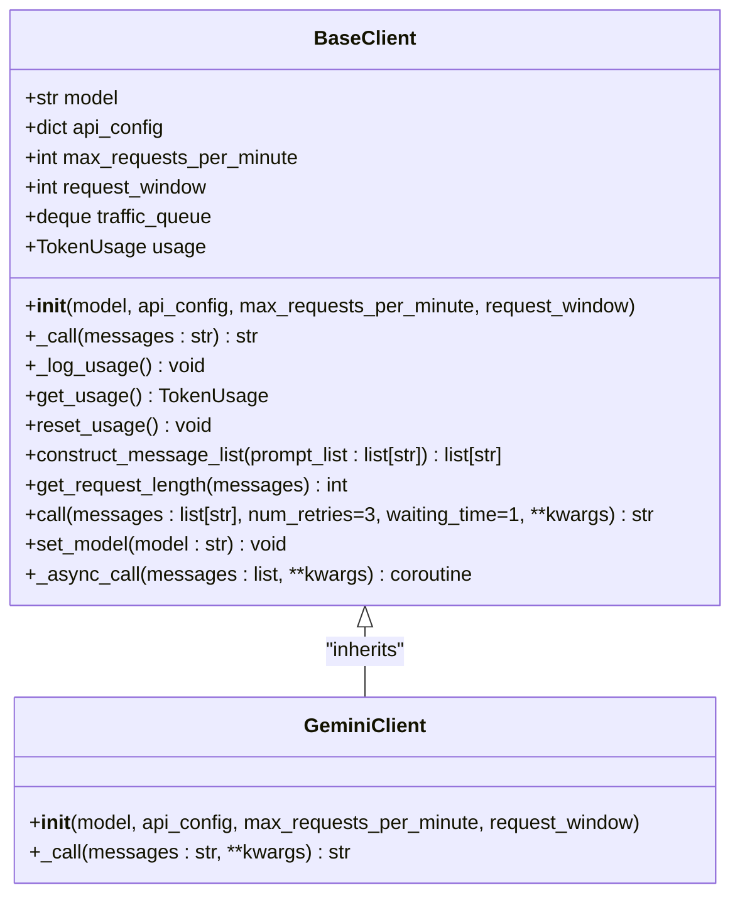
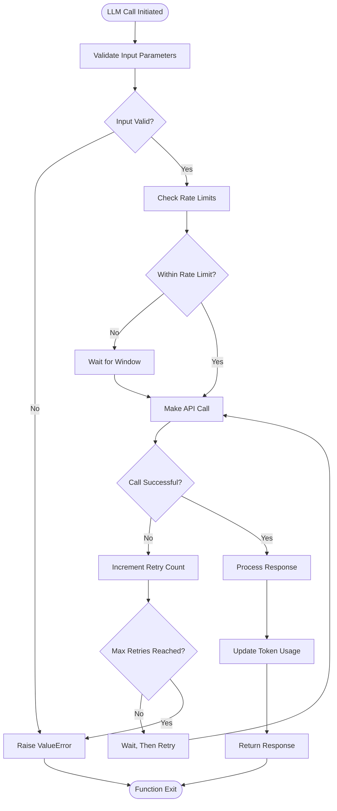

# Technology Stack & Dependencies

<cite>
**Referenced Files in This Document**   
- [requirements.txt](file://requirements.txt) - *Updated with consolidated dependencies*
- [pyproject.toml](file://pyproject.toml) - *Poetry configuration with core dependencies*
- [webapp.py](file://webapp.py)
- [extension_backend.py](file://extension_backend.py) - *Chrome extension backend server*
- [factcheck/utils/llmclient/gemini_client.py](file://factcheck/utils/llmclient/gemini_client.py) - *Primary LLM client implementation*
- [factcheck/utils/llmclient/base.py](file://factcheck/utils/llmclient/base.py) - *Base client interface*
- [factcheck/utils/llmclient/__init__.py](file://factcheck/utils/llmclient/__init__.py) - *Client registration and model mapping*
- [factcheck/utils/logger.py](file://factcheck/utils/logger.py)
- [README.md](file://README.md) - *Updated installation and configuration guide*
</cite>

## Update Summary
- Updated dependency management section to reflect consolidation of requirements
- Added clarification on Chrome extension backend requirements
- Removed references to non-functional OpenAI and Anthropic clients
- Enhanced environment setup instructions with updated file references
- Verified accuracy of LLM integration details for Gemini
- Updated troubleshooting section with current installation requirements

## Table of Contents
1. [Primary Programming Language](#primary-programming-language)
2. [Core Frameworks and Libraries](#core-frameworks-and-libraries)
3. [Natural Language Processing Components](#natural-language-processing-components)
4. [LLM Integration Stack](#llm-integration-stack)
5. [Web Scraping and Evidence Retrieval](#web-scraping-and-evidence-retrieval)
6. [Dependency Management](#dependency-management)
7. [Environment Setup and Virtual Environments](#environment-setup-and-virtual-environments)
8. [Troubleshooting Common Installation Issues](#troubleshooting-common-installation-issues)
9. [Performance Considerations](#performance-considerations)

## Primary Programming Language
The OpenFactVerification project is implemented entirely in **Python**, leveraging its extensive ecosystem for natural language processing, web development, and machine learning. The project requires Python version 3.9 or higher, as specified in the `pyproject.toml` file. Python was selected for its rich library support, readability, and strong community backing in the AI and NLP domains.

**Section sources**
- [pyproject.toml](file://pyproject.toml#L3-L5)

## Core Frameworks and Libraries
The project utilizes several critical frameworks and libraries to implement its functionality:

### Flask for Web Interface
Flask serves as the web framework for the application's user interface. It is used in `webapp.py` to create a lightweight web server that exposes the fact-checking functionality through a browser-based interface. Flask is listed as an optional dependency in `pyproject.toml` under the "api" extras, indicating it's only required when running the web application.

```python
from flask import Flask, request, render_template, jsonify
app = Flask(__name__, static_folder="assets")
```

**Section sources**
- [webapp.py](file://webapp.py#L1-L3)
- [pyproject.toml](file://pyproject.toml#L18-L19)

### concurrent.futures for Parallel Processing
Although not explicitly listed in requirements, Python's built-in `concurrent.futures` module is implied for parallel evidence retrieval. This enables the system to perform multiple web searches simultaneously, significantly improving performance during the evidence gathering phase of fact verification.

## Natural Language Processing Components
The project incorporates several NLP-focused libraries for text processing and analysis:

### spaCy for Text Processing
spaCy (version 3.4.0 or higher) is used for advanced natural language processing tasks such as tokenization, part-of-speech tagging, and named entity recognition. It plays a crucial role in claim decomposition and check-worthiness assessment. After installation, users must download the English language model using `python -m spacy download en_core_web_sm` as noted in the requirements.txt comments.

**Section sources**
- [requirements.txt](file://requirements.txt#L23-L25)

### sentence-transformers for Semantic Analysis
The sentence-transformers library enables the system to generate sentence embeddings for semantic similarity calculations. This is essential for comparing claims with retrieved evidence and determining factual consistency. The library allows the system to understand the meaning of text beyond simple keyword matching.

**Section sources**
- [requirements.txt](file://requirements.txt#L11)

### tiktoken for Token Counting
tiktoken is used for accurate token counting, which is critical for managing LLM API costs and staying within context window limits. This library provides fast BPE (Byte Pair Encoding) tokenization that matches OpenAI's tokenization method, ensuring accurate usage tracking across different LLM providers.

**Section sources**
- [requirements.txt](file://requirements.txt#L13)

## LLM Integration Stack
The project implements a unified LLM integration architecture with exclusive support for Google's Gemini models.

### Architecture Overview
The LLM client system is designed with an abstract base class pattern, allowing for future integration of additional providers. The core components are located in the `factcheck/utils/llmclient/` directory. The `BaseClient` class defines the interface for all LLM clients, including rate limiting, usage tracking, and error handling.



**Diagram sources**
- [factcheck/utils/llmclient/base.py](file://factcheck/utils/llmclient/base.py#L4-L48)
- [factcheck/utils/llmclient/gemini_client.py](file://factcheck/utils/llmclient/gemini_client.py#L4-L15)

### Current LLM Support
The system currently supports only **Google's Gemini** models, with no functional support for OpenAI or Anthropic despite their presence in dependency lists:

- **GeminiClient**: The only implemented LLM client, configured to work with Gemini models like "gemini-1.5-pro"
- **API Configuration**: Uses GEMINI_API_KEY environment variable or configuration file
- **Rate Limiting**: Configured with 15 requests per minute to comply with Gemini's API limits
- **Model Mapping**: The `model2client` function in `__init__.py` explicitly raises an error for non-Gemini models

```python
def model2client(model_name: str):
    """If the client is not specified, use this function to map the model name to the corresponding client."""
    if model_name.startswith("gemini"):
        return GeminiClient
    else:
        raise ValueError(f"Model {model_name} not supported. Only Gemini models are supported.")
```

**Section sources**
- [factcheck/utils/llmclient/__init__.py](file://factcheck/utils/llmclient/__init__.py#L3-L15)
- [factcheck/utils/llmclient/gemini_client.py](file://factcheck/utils/llmclient/gemini_client.py#L4-L20)

## Web Scraping and Evidence Retrieval
The project employs a combination of tools for web scraping and evidence retrieval:

### Playwright for Browser Automation
Playwright is used for advanced web scraping tasks, providing the ability to interact with dynamic websites that require JavaScript execution. The playwright-stealth package helps avoid detection by anti-bot systems, ensuring reliable evidence retrieval from various sources.

**Section sources**
- [requirements.txt](file://requirements.txt#L10)

### BeautifulSoup for HTML Parsing
bs4 (BeautifulSoup) is used for parsing HTML content retrieved during the evidence gathering phase. It works in conjunction with Playwright or direct HTTP requests to extract relevant information from web pages.

**Section sources**
- [requirements.txt](file://requirements.txt#L2)

### Serper and Google Retrievers
The system includes specialized retriever modules (`google_retriever.py` and `serper_retriever.py`) that interface with search APIs to find evidence for claim verification. The SERPER_API_KEY is required when using the Serper retriever.

**Section sources**
- [factcheck/core/Retriever/google_retriever.py](file://factcheck/core/Retriever/google_retriever.py)
- [factcheck/core/Retriever/serper_retriever.py](file://factcheck/core/Retriever/serper_retriever.py)

## Dependency Management
The project uses a dual dependency management approach with both Poetry and pip.

### pyproject.toml Configuration
The `pyproject.toml` file defines the project metadata and dependencies for Poetry-based installations. It specifies Python 3.9+ as the minimum version and lists core dependencies with version constraints:

- **anthropic**: ^0.23.1
- **backoff**: ^2.2.1
- **bs4**: ^0.0.2
- **Flask**: ^3.0.3 (optional)
- **httpx**: ^0.27.0
- **nltk**: ^3.8.1
- **openai**: ^1.16.2
- **opencv-python**: ^4.9.0.80
- **pandas**: ^2.2.1
- **playwright**: ^1.42.0
- **playwright-stealth**: ^1.0.6
- **tiktoken**: ^0.6.0

Flask is marked as an optional dependency under the "api" extras, allowing users to install only the core functionality if they don't need the web interface.

**Section sources**
- [pyproject.toml](file://pyproject.toml#L10-L30)

### requirements.txt Configuration
The `requirements.txt` file provides a comprehensive dependency list for pip-based installations. Following the recent consolidation, it now includes all necessary packages including `google-generativeai`, `sentence-transformers`, and `torch` that are essential for Gemini integration. This single requirements file replaces the previous separate extension_requirements.txt.

**Section sources**
- [requirements.txt](file://requirements.txt#L1-L25)
- [README.md](file://README.md#L10-L15)

## Environment Setup and Virtual Environments
Proper environment setup is crucial for running the OpenFactVerification project successfully.

### Installation Options
The project supports two installation methods:

1. **Poetry Installation**: Recommended for development
   ```bash
   poetry install
   ```

2. **Pip Installation**: Suitable for deployment
   ```bash
   pip install -r requirements.txt
   ```

### Required API Keys
The system requires API keys for external services:
- **SERPER_API_KEY**: Required for evidence retrieval using Serper
- **GEMINI_API_KEY**: Required for LLM functionality

Keys can be set via environment variables or a YAML configuration file.

### Post-Installation Steps
After installing Python packages, users must:
1. Download the spaCy English language model: `python -m spacy download en_core_web_sm`
2. Set required API keys in environment or configuration file
3. Start the web application: `python webapp.py --config api_config.yaml`
4. Run the Chrome extension backend separately: `python extension_backend.py`

**Section sources**
- [README.md](file://README.md#L20-L50)
- [requirements.txt](file://requirements.txt#L23-L25)
- [extension_backend.py](file://extension_backend.py)

## Troubleshooting Common Installation Issues
Several common issues may arise during installation and setup:

### Missing spaCy Model
**Issue**: spaCy fails to load the English language model.
**Solution**: Run `python -m spacy download en_core_web_sm` after package installation.

### Playwright Drivers
**Issue**: Playwright fails to launch browsers due to missing drivers.
**Solution**: Run `playwright install` to download required browser binaries.

### API Key Configuration
**Issue**: LLM or retrieval services fail due to missing API keys.
**Solution**: Ensure SERPER_API_KEY and GEMINI_API_KEY are properly set in environment variables or the API configuration file.

### Version Compatibility
**Issue**: Conflicts between LLM client versions and core system.
**Solution**: Use the exact versions specified in pyproject.toml to ensure compatibility, particularly for openai (^1.16.2) and anthropic (^0.23.1) packages, even though they are not currently utilized.

### Chrome Extension Backend
**Issue**: Chrome extension fails to communicate with backend.
**Solution**: Ensure `extension_backend.py` is running on port 2024 and API keys are properly configured in the extension settings.

**Section sources**
- [README.md](file://README.md#L40-L50)
- [requirements.txt](file://requirements.txt#L23-L25)
- [chrome-extension/options.js](file://chrome-extension/options.js#L119-L130)

## Performance Considerations
The system includes several performance optimization features:

### Rate Limiting and Traffic Management
The BaseClient class implements a traffic queue system to manage API rate limits, preventing the application from exceeding provider quotas. This is particularly important for production deployments.

### Asynchronous Processing
The `_async_call` method in BaseClient enables asynchronous LLM calls, allowing for non-blocking operations and improved throughput when handling multiple verification requests.

### Error Handling and Retries
The `call` method includes built-in retry logic with exponential backoff (via the backoff library), ensuring robustness in the face of transient network issues or API failures.



**Diagram sources**
- [factcheck/utils/llmclient/base.py](file://factcheck/utils/llmclient/base.py#L49-L81)
- [factcheck/utils/llmclient/base.py](file://factcheck/utils/llmclient/base.py#L0-L48)