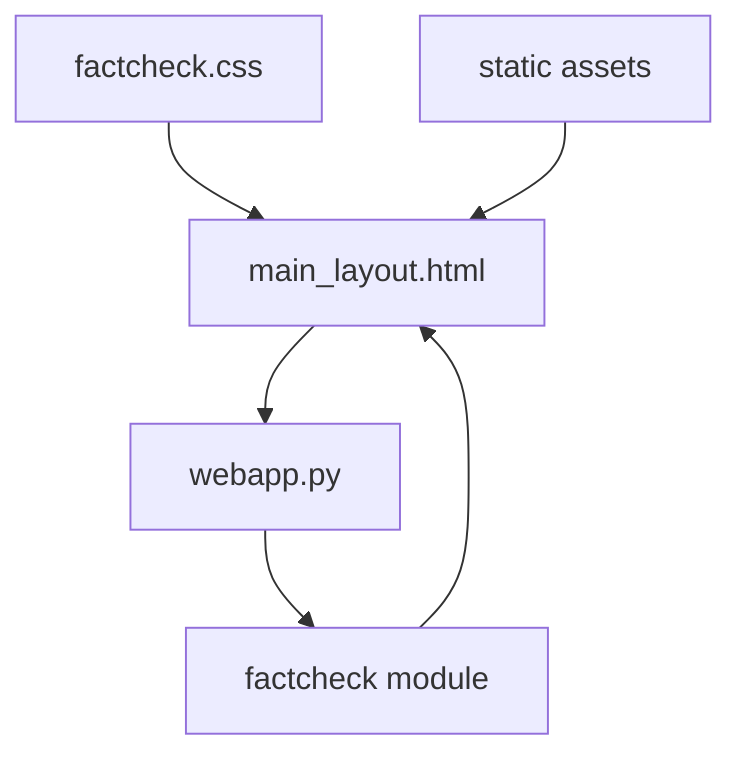
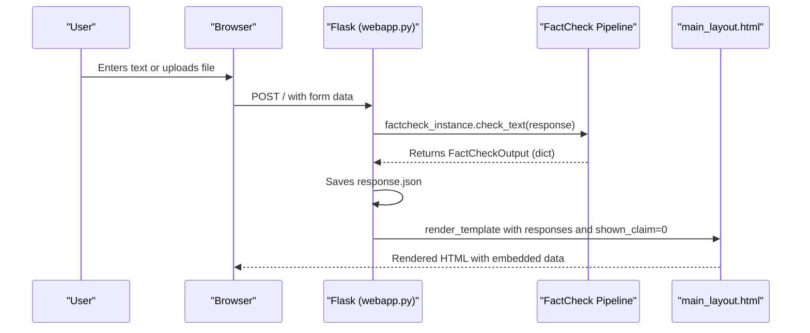
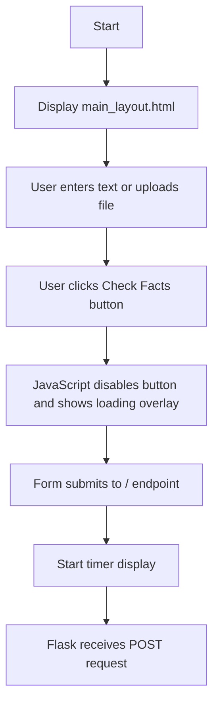
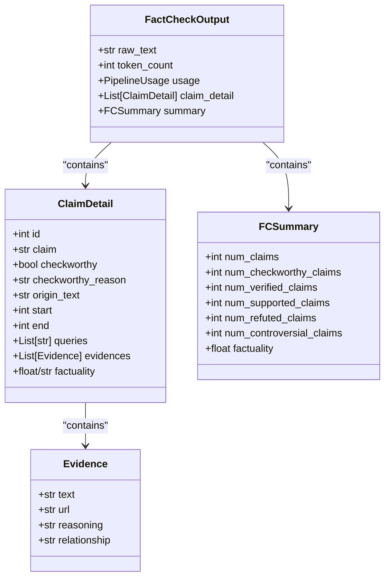
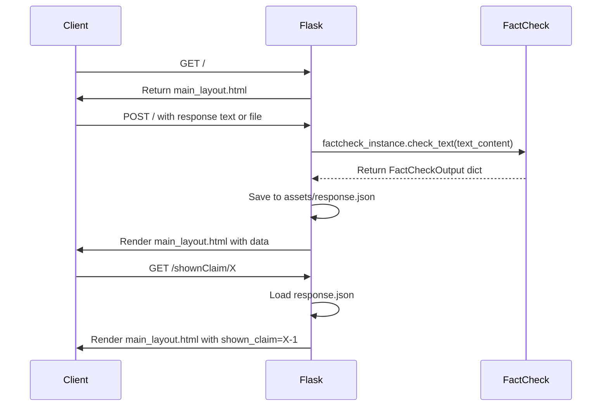
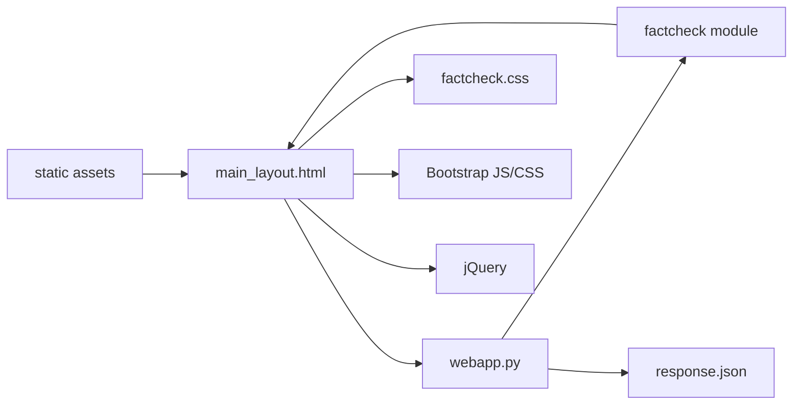

# Web Interface

<cite>
**Referenced Files in This Document**   
- [main_layout.html](file://templates/main_layout.html) - *Updated in commit ff4dd85 for UI improvements and loading animation*
- [webapp.py](file://webapp.py) - *Updated in commit ff4dd85 for percentage formatting and loading state handling*
- [factcheck.css](file://assets/css/factcheck.css) - *Enhanced with loading animation and blur effect styles*
- [UI_CHANGES_SUMMARY.md](file://UI_CHANGES_SUMMARY.md) - *Documentation of sidebar removal and layout changes*
- [UI_FIXES_SUMMARY.md](file://UI_FIXES_SUMMARY.md) - *Documentation of loading animation and percentage fixes*
- [LOGO_METRICS_UPDATE.md](file://LOGO_METRICS_UPDATE.md) - *Documentation of logo and metrics styling updates*
- [popup.html](file://chrome-extension/popup.html) - *Updated in commit e6a1362 for Chrome extension UI enhancement*
- [popup.css](file://chrome-extension/popup.css) - *Updated in commit e6a1362 for modern design and typography*
- [popup.js](file://chrome-extension/popup.js) - *Updated in commit e6a1362 for improved functionality and error handling*
</cite>

## Update Summary
**Changes Made**   
- Updated documentation to reflect removal of past chats sidebar and relocation of New Fact Check button to header
- Added documentation for new loading animation with blur effect during processing
- Updated percentage formatting documentation to reflect exact 2-decimal display in metrics
- Revised visual design description to include gradient backgrounds and hover effects for metrics
- Added details about the content blur effect and loading timer functionality
- Removed references to deprecated templates and sidebar functionality
- Updated architecture diagrams and code examples to reflect current implementation
- Incorporated documentation for Chrome extension UI enhancements including modern design, professional colors, and improved typography
- Added details on extension's tabbed input interface for text and media fact-checking

## Table of Contents
1. [Introduction](#introduction)
2. [Project Structure](#project-structure)
3. [Core Components](#core-components)
4. [Architecture Overview](#architecture-overview)
5. [Detailed Component Analysis](#detailed-component-analysis)
6. [Dependency Analysis](#dependency-analysis)
7. [Performance Considerations](#performance-considerations)
8. [Troubleshooting Guide](#troubleshooting-guide)
9. [Conclusion](#conclusion)

## Introduction
The Web Interface of OpenFactVerification provides a user-friendly platform for fact-checking textual content and multimedia inputs. Users input text or upload images/videos via a unified interface in `main_layout.html`, which is processed by a Flask backend (`webapp.py`) that orchestrates a multi-step verification pipeline. The results are rendered dynamically in the same layout, displaying claim-level analysis with supporting or refuting evidence. This document details the user experience flow, template structure, backend integration, visual design, accessibility, and security considerations, with updates reflecting recent enhancements including a professional loading animation with blur effect, exact percentage formatting, removal of the past chats sidebar, and enhanced metrics styling with gradients and hover effects.

## Project Structure
The project follows a modular structure with clear separation of concerns:
- `templates/`: Contains HTML templates for user interaction
- `assets/css/`: Houses the `factcheck.css` stylesheet
- `webapp.py`: Flask application entry point
- `factcheck/`: Core fact-checking logic and data models
- `static/`: Serves static assets (images, JS, CSS)

**Diagram sources**
- [webapp.py](file://webapp.py#L1-L183)
- [main_layout.html](file://templates/main_layout.html#L1-L700)

**Section sources**
- [webapp.py](file://webapp.py#L1-L183)
- [main_layout.html](file://templates/main_layout.html#L1-L700)

## Core Components
The web interface consists of three primary components:
1. **Unified Interface** (`main_layout.html`): Collects user-submitted text or multimedia for verification
2. **Flask Backend** (`webapp.py`): Processes requests, invokes fact-checking pipeline, and renders results
3. **Results Display** (`main_layout.html`): Displays structured verification results with interactive elements

The backend generates a JSON-serializable `FactCheckOutput` object containing claim details and summary statistics, which is embedded in the rendered HTML for client-side interactivity. The interface now supports both text input and file uploads for multimodal fact-checking.

**Section sources**
- [webapp.py](file://webapp.py#L1-L183)
- [main_layout.html](file://templates/main_layout.html#L1-L700)
- [data_class.py](file://factcheck/utils/data_class.py#L105-L130)

## Architecture Overview
The web interface follows a server-side rendering architecture with Flask as the backend framework. User input flows from the frontend form to the Flask application, which processes it through the fact-checking pipeline and returns a fully rendered results page.

**Diagram sources**
- [webapp.py](file://webapp.py#L30-L55)
- [main_layout.html](file://templates/main_layout.html#L1-L700)

## Detailed Component Analysis

### Input Form Analysis
The unified interface in `main_layout.html` provides a comprehensive interface for users to submit text or multimedia for fact-checking.

**Diagram sources**
- [main_layout.html](file://templates/main_layout.html#L1-L700)
- [webapp.py](file://webapp.py#L30-L35)

**Section sources**
- [main_layout.html](file://templates/main_layout.html#L1-L700)

#### Form Elements
- **Textarea**: ID `text-input`, name `response`, placeholder "Enter the text you want to fact-check here..."
- **File Input**: ID `file-input`, name `file`, accepts image/* and video/*
- **Submit Button**: ID `check-btn`, styled with green background
- **Timer Display**: Div with ID `timer` shows elapsed processing time
- **Form Action**: POST to root endpoint `/`
- **Metrics Bar**: Displays overall credibility, total claims, supported, refuted, and controversial counts

The form includes client-side JavaScript that disables the submit button upon submission, starts a timer, and shows a loading overlay with blur effect. It also handles file selection with preview functionality.

### Results Template Analysis
The `main_layout.html` template displays comprehensive fact-checking results using Bootstrap 5 components and custom styling.

**Diagram sources**
- [data_class.py](file://factcheck/utils/data_class.py#L71-L130)
- [__init__.py](file://factcheck/__init__.py#L200-L237)
- [main_layout.html](file://templates/main_layout.html#L1-L700)

**Section sources**
- [main_layout.html](file://templates/main_layout.html#L1-L700)
- [data_class.py](file://factcheck/utils/data_class.py#L71-L130)

#### Template Structure
The results page is organized into a two-panel layout:
1. **Left Panel (50%)**: Input area with text entry and file upload capabilities
2. **Right Panel (50%)**: Results display with claims overview and detailed evidence
3. **Top Metrics Bar**: Shows overall credibility score and claim statistics
4. **Header**: Contains logo and New Fact Check button (replaces removed sidebar)

### Backend Processing Analysis
The Flask application in `webapp.py` handles both form display and result rendering, serving as the integration point between the UI and fact-checking logic.

**Diagram sources**
- [webapp.py](file://webapp.py#L30-L60)
- [main_layout.html](file://templates/main_layout.html#L1-L700)

**Section sources**
- [webapp.py](file://webapp.py#L1-L183)

#### Route Handlers
- **`/` (GET)**: Renders the unified interface
- **`/` (POST)**: Processes submitted text or file, runs fact-checking pipeline, saves results, and renders results template
- **`/shownClaim/<content_id>`**: Loads saved results and re-renders template with specified claim active

The backend registers custom Jinja2 filters for use in templates:
- `count_occurrences`: Counts occurrences of a value in a list of dictionaries
- `filter_evidences`: Filters evidence items by relationship type
- `format_percentage`: Formats decimal values to exactly 2 decimal places for percentage display

The backend now supports multimodal input processing, handling both text and file uploads (images/videos) through the `modal_normalization` function.

## Dependency Analysis
The web interface components have the following dependencies:

**Diagram sources**
- [webapp.py](file://webapp.py#L1-L183)
- [main_layout.html](file://templates/main_layout.html#L1-L700)

**Section sources**
- [webapp.py](file://webapp.py#L1-L183)

## Performance Considerations
The interface handles long processing times through:
- **Client-side loading overlay**: Displays spinning animation with elapsed time counter
- **Content blur effect**: Applies 2px blur to background content during processing
- **Button disabling**: Prevents duplicate submissions
- **Real-time timer**: Shows seconds elapsed during processing

For large numbers of claims:
- The results panel displays all claims with visual indicators
- Evidence is loaded on-demand through accordion expansion
- Summary statistics provide quick overview without scrolling

Processing time is logged by the backend with breakdown by stage:
- Claim creation
- Evidence retrieval
- Claim verification

## Troubleshooting Guide
Common issues and solutions:

**Section sources**
- [webapp.py](file://webapp.py#L70-L92)
- [__init__.py](file://factcheck/__init__.py#L200-L237)

### Empty Results
- **Cause**: No checkworthy claims detected
- **Solution**: Verify input contains factual statements, not opinions or questions

### Long Processing Times
- **Cause**: Network latency in evidence retrieval
- **Solution**: Check API keys and network connectivity; consider using faster retriever

### Formatting Issues
- **Cause**: Missing static assets
- **Solution**: Ensure `static/` directory is properly configured and accessible

### JSON Attribute Errors
- **Cause**: Incomplete data in FactCheckOutput
- **Solution**: The system validates output attributes and raises `ValueError` if missing fields are detected

### File Upload Issues
- **Cause**: Unsupported file type
- **Solution**: Ensure uploaded files are images (jpg, jpeg, png, gif, bmp, webp) or videos (mp4, avi, mov, wmv, flv, webm, m4v)

## Conclusion
The OpenFactVerification web interface provides a comprehensive, user-friendly platform for fact-checking. It effectively integrates complex backend processing with an intuitive frontend experience. The architecture separates concerns cleanly between input collection, processing, and results display. The use of color coding, interactive elements, and summary statistics makes verification results accessible to non-technical users. Recent enhancements have added multimodal support for image and video inputs, unified the interface into a single template, improved UI/UX with responsive design, and added professional features including a loading animation with blur effect and exact percentage formatting. The removal of the past chats sidebar has created a cleaner, more focused interface. Future enhancements could include AJAX-based updates to eliminate full page reloads and improved loading indicators for better user feedback during processing.